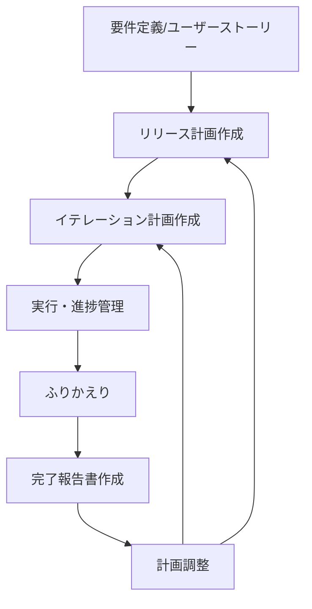

## Plan

アジャイルなリリース計画とイテレーション計画を作成し、プロジェクトの進捗を管理します。

### 使い方

```bash
/plan [オプション]
```

### オプション

- なし : 全体のリリース計画を作成または更新
- `--release` : リリース計画のみを作成（3-6ヶ月のマクロ計画）
- `--iteration <番号>` : 特定のイテレーション計画を作成（2週間の詳細計画）
- `--velocity` : ベロシティ分析と予測を実行
- `--burndown` : バーンダウンチャートを生成
- `--retrospective` : ふりかえり結果を記録し次イテレーション計画に反映
- `--report` : イテレーション完了報告書を作成
- `--status` : 現在の進捗状況をサマリー表示

### 基本例

```bash
# 初回のリリース計画作成
/plan
「要件定義書とユーザーストーリーからリリース計画を作成して」

# イテレーション1の詳細計画作成
/plan --iteration 1
「リリース計画に基づいてイテレーション1の詳細計画を作成して」

# 進捗状況の確認
/plan --status
「現在のリリース進捗とベロシティを分析して」

# ふりかえり結果の反映
/plan --retrospective
「イテレーション1のふりかえり結果を記録して次の計画に反映して」

# イテレーション完了報告書の作成
/plan --report
「最新イテレーションの完了報告書を作成して」
```

### 詳細機能

#### リリース計画の作成

リリース・イテレーション計画ガイドに準拠した包括的なリリース計画を作成します。

**作成される内容**:
- **満足条件**: スコープ・スケジュール・リソースの定義
- **ベロシティ見積もり**: 基準ストーリー分析に基づく初期見積もり
- **優先順位マトリックス**: 4軸評価（金銭価値・コスト・知識習得・リスク軽減）
- **段階的リリース戦略**: MVP → 機能拡張版 → 完成版
- **バッファ戦略**: フィーチャバッファ30%、スケジュールバッファ計算
- **スケジュール概要**: mermaid.jsのガントチャート

成果物は @docs/development/release_plan.md に保存する
@docs/index.md と @mkdocs.yml を更新してドキュメントを最新にする


```bash
# ユーザーストーリーを分析してリリース計画作成
/plan --release
「ユーザーストーリーを分析して6ヶ月のリリース計画を作成して」
```

#### イテレーション計画の作成

コミットメント駆動方式で実行可能な2週間のイテレーション計画を作成します。

**作成される内容**:
- **イテレーションゴール**: 1-2行で表現される明確な目標
- **ストーリー選択**: リリース計画に基づく優先順位付け
- **タスク分解**: 各ストーリーを4-16理想時間のタスクに分解
- **担当者割り当て**: チームメンバーへのタスク配分
- **詳細スケジュール**: mermaid.jsガントチャートによる視覚化
- **コミットメント確認**: チーム全員の合意形成

成果物は @docs/development/iteration_plan-N.md に保存する
@docs/development/release_plan.md の進捗を更新する
@docs/index.md と @mkdocs.yml を更新してドキュメントを最新にする

```bash
# イテレーション3の詳細計画を作成
/plan --iteration 3
「イテレーション3（予約作成機能）の詳細タスク計画を作成して」
```

#### ベロシティ管理

チームの開発速度を継続的に測定・分析・予測します。

**分析内容**:
- **実績ベロシティ**: 完了ストーリーポイントの集計
- **平均ベロシティ**: 過去3-8イテレーションの平均
- **予測精度**: 見積もりと実績の差分分析
- **改善提案**: ベロシティ向上のための提案

```bash
# ベロシティ分析と今後の予測
/plan --velocity
「過去のイテレーション実績からベロシティを分析して今後を予測して」
```

#### 進捗管理

バーンダウンチャートと各種メトリクスで進捗を可視化します。

**生成される情報**:
- **リリースバーンダウン**: 残ストーリーポイントの推移
- **イテレーションバーンダウン**: 残理想時間の日次推移
- **パーキングロットチャート**: テーマ単位の進捗率
- **品質メトリクス**: テストカバレッジ、バグ密度等

```bash
# 現在のリリース進捗を可視化
/plan --burndown
「リリース1.0の進捗をバーンダウンチャートで表示して」
```

#### ふりかえりの実施

ふりかえり結果を記録し次イテレーション計画に反映します。

**作成される内容**:
- **イテレーション情報**: イテレーション番号、期間、実施日、参加者、フォーマット
- **実績サマリー**: 完了状況（計画/実績理想時間、コミット数、テスト結果、ビルド状態）、主要成果物
- **KPT 分析**:
    - **Keep（続けること）**: 技術的成功事項、プロセス的成功事項、チームワーク
    - **Problem（問題点・課題）**: 未完了項目、見積もり精度の課題、プロセス課題
    - **Try（次に試すこと）**: 具体的改善アクション（責任者、期限、内容、期待効果）
- **次イテレーションへの引き継ぎ事項**: 必須対応事項、技術検証タスク、ドキュメント整備タスク
- **メトリクス**: 開発メトリクス、品質メトリクス、プロセスメトリクス
- **学び（Lessons Learned）**: 技術的学び、プロセス的学び
- **次回イテレーションへの期待**: 達成目標の明確化
- **総評**: 成功した点と改善が必要な点のまとめ

成果物は @docs/development/retrospective-N.md に保存する
対象のイテレーション @docs/development/iteration_plan-N.md の進捗を更新する
@docs/development/release_plan.md の進捗を更新する
@docs/index.md と @mkdocs.yml を更新してドキュメントを最新にする

```bash
# ふりかえり結果の反映
/plan --retrospective
「イテレーション1のふりかえり結果を記録して次の計画に反映して」
```

#### イテレーション完了報告書の作成

イテレーション完了時に、実績と成果を記録する公式な完了報告書を作成します。

**テンプレート**: @docs/template/イテレーション完了報告書.md

**作成される内容**:
- **プロジェクト概要**: 日程（開始日・終了日・作業日数）、要員（予定/実績作業日数）
- **指標**:
    - **ナイトリービルド結果**: 作業期間中の日次ビルド結果一覧
    - **リリースバーンダウン**: 計画 vs 実績の残 SP 推移（mermaid xychart-beta）
    - **イテレーションバーンダウン**: 日次の残 SP 推移（mermaid xychart-beta）
    - **ベロシティ**: イテレーション別ベロシティ棒グラフ + 平均線（mermaid xychart-beta）
- **実施内容と評価**:
    - **完了ストーリー一覧**: ストーリー ID、名称、結果、予定/完了 SP
    - **達成率**: SP・ストーリー数の計画 vs 実績
- **成果物詳細**: 各ストーリーの具体的な実装内容（API、UI、モデル等）
- **品質メトリクス**:
    - **テストカバレッジ**: フロントエンド・バックエンドの目標 vs 実績
    - **テスト数**: 種類別テスト数と推移
    - **コード品質**: ESLint/TypeScript エラー数、コミット数、追加/削除行数
- **イテレーションレビュー**: 成功した点、技術的課題と解決策、アクションアイテム
- **リリース状況**: リリース達成条件の充足状態、全体リリース進捗

**データ収集方法**:
- `git log` からコミット履歴・コミット数・分類を収集
- `git diff --stat` から追加/削除行数を収集
- 対象イテレーションの @docs/development/iteration_plan-N.md から計画情報を取得
- 対象イテレーションの @docs/development/retrospective-N.md から KPT 分析結果を取得
- @docs/development/release_plan.md から全体進捗を取得
- テスト実行結果（テスト数・カバレッジ）は最新のコミットログや CI 結果から取得

成果物は @docs/development/iteration_report-N.md に保存する
@docs/development/release_plan.md の進捗を更新する
@mkdocs.yml を更新してドキュメントを最新にする

```bash
# 最新イテレーションの完了報告書を作成
/plan --report
「最新イテレーションの完了報告書を作成して」
```

### 出力例

```
📊 リリース計画サマリー
━━━━━━━━━━━━━━━━━━━━━━━━━━━━━━━━

🎯 リリース1.0 MVP（8週間）
├─ 目標: 基本的な会議室予約機能
├─ ストーリー: 10個（41SP）
├─ ベロシティ: 10-11SP/イテレーション
└─ 進捗: 25%完了（イテレーション1/4完了）

📈 ベロシティ推移
├─ イテレーション1: 10SP（計画通り）
├─ 平均: 10SP
└─ 予測: リリース1.0は予定通り完了見込み

⚠️ リスク状況
├─ 技術リスク: JWT設定の複雑化（対策実施中）
└─ スケジュールリスク: 低（バッファ2週間確保）
```

### Claude との連携

```bash
# 要件定義書からリリース計画を自動生成
cat docs/requirements/requirements.md
cat docs/requirements/user_story.md
/plan
「要件定義書とユーザーストーリーから包括的なリリース計画を作成して」

# 既存計画の更新と調整
cat docs/development/release_plan.md
/plan --iteration 2
「リリース計画とイテレーション1の実績を基にイテレーション2計画を作成して」

# ふりかえり結果の反映
cat retrospective_notes.md
/plan --retrospective
「ふりかえりの改善点を次のイテレーション計画に反映して」

# イテレーション完了報告書の作成
/plan --report
「最新イテレーションの完了報告書を作成して」
```

### 注意事項

- **前提条件**: 要件定義書またはユーザーストーリーが存在すること
- **制限事項**: 初回ベロシティは推測値のため、3イテレーション後に再調整推奨
- **推奨事項**: 各イテレーション終了時に計画を更新し、生きた文書として管理
- 以下の記述ルールに従うこと
  - タスク項目などは一行開けて記述する
  - NG
  ```markdown
    **受入条件**:
    - [ ] ログアウトボタンをクリックするとログアウトできる
    - [ ] ログアウト後、ログイン画面に遷移する
    - [ ] JWT トークンが無効化される
  ```
  - OK
  ```markdown
    **受入条件**:
  
    - [ ] ログアウトボタンをクリックするとログアウトできる
    - [ ] ログアウト後、ログイン画面に遷移する
    - [ ] JWT トークンが無効化される
  ```

### ベストプラクティス

1. **段階的詳細化**: リリース計画は概要レベル、イテレーション計画で詳細化
2. **継続的調整**: 実績に基づいてベロシティと計画を継続的に調整
3. **バッファ確保**: フィーチャバッファ30%、スケジュールバッファを必ず設定
4. **チームコミットメント**: イテレーション計画は必ずチーム全員で合意形成
5. **データドリブン**: 感覚ではなく実績データに基づいて計画調整

### 計画作成の流れ



### 関連コマンド

- `/spec` : 要件定義とユーザーストーリーの作成
- `/task` : 個別タスクの管理と実行
- `/review` : コードレビューと品質確認
- `/test` : テスト計画と実行管理