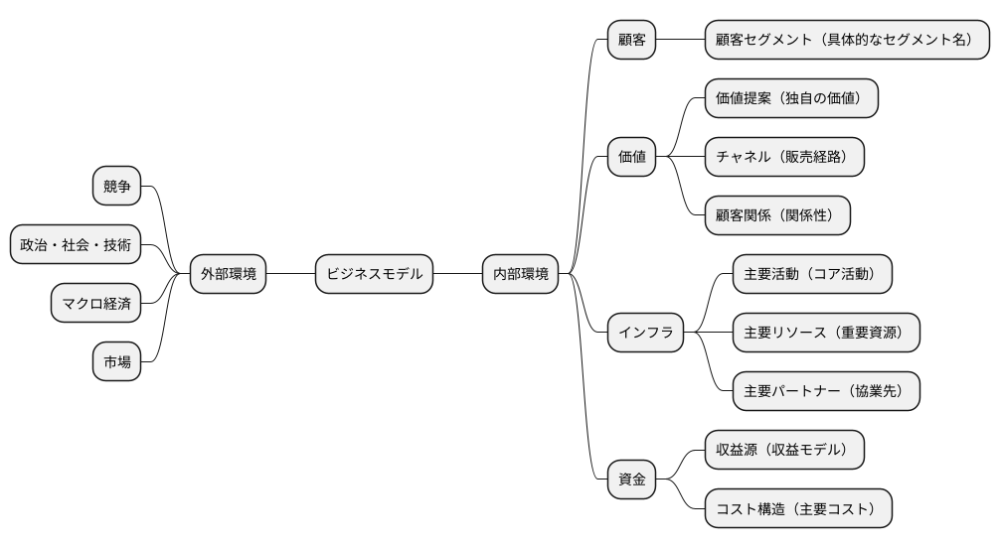

# 企業戦略分析

企業事例（与件文）を出発点として、企業戦略・事業戦略・機能戦略の 3 階層を論理的に導出し、可視化ドキュメントとして整理する。

戦略立案は「なぜその戦略なのか」の根拠が命であり、与件文から SWOT・VRIO・BMC を経由して戦略を導くことで、論理的整合性を担保できる。場当たり的に「差別化戦略がよい」と決めるのではなく、「与件の強み × 機会の組み合わせから差別化の方向性が導かれる」という筋道を示すことが重要。

## 参照ドキュメントと成果物

| 種類 | パス | 備考 |
|------|------|------|
| テンプレート | @docs/template/企業分析.md | 編集禁止。コピーして使用する |
| 入力 | @docs/strategy/business_case.md | `analyzing-business-case` スキルの出力 |
| ガイド | @docs/reference/経営戦略分析ガイド.md | 3 階層戦略の理論的背景・フレームワーク詳細 |
| 参考 | @docs/reference/ロジカルシンキング.md | 論理展開の基本（演繹・帰納） |
| 成果物 | `docs/strategy/business_strategy.md` | テンプレートを基に作成 |
| 後続成果物 | `docs/strategy/BMC.svg` | `generating-bmc` スキルで生成 |

## 3 階層の戦略構造

戦略は階層的に連鎖する。上位の戦略が下位の戦略の前提条件を決定するため、この順序で立案することが重要。

| 階層 | 問い | 主なフレームワーク |
|------|------|------------------|
| **企業戦略** | どの事業領域で戦うか？ | ドメイン定義、Ansoff 成長戦略 |
| **事業戦略** | 各事業でどう競争するか？ | Porter 基本戦略、競争地位別戦略、価値連鎖 |
| **機能戦略** | どう実行するか？ | バリューストリーム、ケイパビリティマップ、組織マップ |

上位階層を飛ばして機能戦略だけを論じても、「なぜその機能が必要か」が答えられない。逆に企業戦略だけでは「絵に描いた餅」になる。3 階層を貫く論理のラインを作ることが、使える戦略ドキュメントの条件である。

## 立案の進め方

### ステップ 1：入力の確認

`docs/strategy/business_case.md` が存在することを確認する。存在しない場合は `analyzing-business-case` スキルを先に実行するか、ユーザーに事例情報をヒアリングする。

与件文から以下を抽出してメモしておく（各ステップで参照する）：

- 企業基本情報（業種・規模・沿革・主力製品・主要取引先）
- 経営環境の変化（外部ショック・競争激化・技術変化）
- 内部リソース（技術・人材・設備・ノウハウ・ブランド）
- 現在の課題（事業承継・組織・人事・生産・財務）
- 相談内容（どの方向で助言を求めているか）

### ステップ 2：環境分析（事実ベースの整理）

戦略を考える前に、事実を整理する。ここで飛ばしやすいが、環境分析なしの戦略は主観の羅列になる。

#### 2-1. 組織図

与件から読み取れる組織構造を `@startwbs` で可視化する。不明な階層は「推定」と注記する。

#### 2-2. ビジネスモデル（BMC）

9 要素のマインドマップとして整理する。与件に明示されていない要素は、業種の一般論から推定してよい（ただし「推定」と明記）。

- 外部環境：競争・政治社会技術・マクロ経済・市場
- 内部環境（顧客）：顧客セグメント
- 内部環境（価値）：価値提案・チャネル・顧客関係
- 内部環境（インフラ）：主要活動・主要リソース・主要パートナー
- 内部環境（資金）：収益源・コスト構造

**`generating-bmc` との連携**：この BMC セクションは `generating-bmc` スキルが読み取る入力となる。見出しは `### ビジネスモデルキャンバス`（推奨）または `### ビジネスモデル`（テンプレート準拠）を使用し、PlantUML の `@startmindmap` ブロックで 9 要素を記述する。`generating-bmc` は両方の見出しを認識する。ルートノード名は `* ビジネスモデル` でも `* A 社ビジネスモデル` でもよい（事例名プレフィックス可）。重要なのは「顧客 / 価値 / インフラ / 資金」の 4 分類 → 9 要素の階層構造を維持することで、これにより `generating-bmc` がマインドマップを解析して SVG 図を生成できる。



#### 2-3. SWOT 分析

SWOT は「強み × 機会」「弱み × 脅威」の交差から戦略の種が出てくるため、単に 4 象限を埋めるだけでなく、クロス SWOT を念頭に置いて整理する。

- 強み（Strength）：与件から抽出できる固有の能力
- 弱み（Weakness）：与件から読み取れる制約
- 機会（Opportunity）：外部環境の追い風
- 脅威（Threat）：外部環境の逆風

#### 2-4. VRIO 分析

SWOT で抽出した強みを、持続的競争優位性の観点で評価する。強みすべてが競争優位の源泉ではない。

- 経済的価値（Value）：顧客にとって価値があるか
- 希少性（Rarity）：競合が持っていないか
- 模倣困難性（Imitability）：簡単に真似されないか
- 組織能力（Organization）：強みを活用する組織体制があるか

### ステップ 3：企業戦略の立案

環境分析を踏まえて、「どの事業領域で戦うか」を定義する。

#### 3-1. ドメイン

- 企業ドメイン：理念・ビジョン・ミッション（与件から読み取れない場合は相談内容から推定）
- 事業ドメイン：誰に（ターゲット顧客）・何を（価値提案）・どのように（提供方法）

#### 3-2. 成長戦略（Ansoff）

既存市場 / 新規市場 × 既存製品 / 新規製品の 4 象限でどこを狙うかを決める。与件の「相談内容」が重要なヒントになる。

- 市場浸透：既存市場 × 既存製品
- 市場開発：新規市場 × 既存製品
- 商品開発：既存市場 × 新規製品
- 多角化：新規市場 × 新規製品（水平・垂直・集中・集成）

#### 3-3. 企業戦略のイシューツリー

ドメインと成長戦略を論点として、論理ツリーで整理する。

### ステップ 4：事業戦略の立案

企業戦略で定めた事業ドメインに対して、「どう競争するか」を決める。

#### 4-1. 基本戦略（Porter）

- コストリーダーシップ：低コスト実現
- 差別化：独自価値の提供
- 集中：特定セグメントへの集中

中小企業は経営資源が限られるため、基本は「差別化」または「集中」が現実的。与件の強み（VRIO で評価済み）が選択の根拠になる。

#### 4-2. 競争戦略（競争地位別）

- リーダー：市場拡大・同質化
- チャレンジャー：差別化
- ニッチャー：集中
- フォロワー：追随

与件の企業の市場シェア・規模から競争地位を判断する。中小企業はニッチャーかフォロワーが多い。

#### 4-3. 価値連鎖（Porter Value Chain）

- 主活動：購買物流・製造・出荷物流・マーケティング販売・サービス
- 支援活動：インフラ・人事労務・技術開発・調達

各活動のうち、強み（競争優位の源泉）となる活動と弱み（改善対象）となる活動を明示する。

#### 4-4. 事業戦略のイシューツリー

基本戦略・競争戦略・価値連鎖を論点として整理する。

### ステップ 5：機能戦略の立案

事業戦略を実行するための具体的な機能レベルの戦略を策定する。

#### 5-1. バリューストリーム

価値の流れを「主活動 → 支援活動 → 個別業務機能」の順で可視化する。テンプレートの `バリューストリーム` セクションをベースに、事例の業種特性に合わせて調整する。

#### 5-2. ケイパビリティマッピング

組織が持つ能力を「コア / 汎用 / サポート」に分類する。コアは競争優位の源泉、汎用はどの企業にも必要、サポートは業務支援機能。

- コア：競争優位に直結する能力（例：独自の製造技術、顧客対応力）
- 汎用：業界標準の業務能力（例：販売管理、在庫管理）
- サポート：間接業務（例：会計、給与計算）

#### 5-3. 組織マップ

ケイパビリティを組織構造にマッピングする。「どの部門がどのケイパビリティを担っているか」を可視化することで、組織の歪み（重複・欠落）が見える。

#### 5-4. 情報マップ

事業遂行に必要な主要情報エンティティと、情報の流れを整理する（後続のデータモデル設計の入力となる）。

#### 5-5. ビジネスシナリオ

事業戦略を実現するためのシナリオを物語形式で記述する。アクター・ゴール・期待する結果を明示する。

#### 5-6. 機能戦略のイシューツリー

機能戦略の論点を組織・ケイパビリティの観点で整理する。

### ステップ 6：業務分析（任意、詳細設計に進む場合）

機能戦略をさらに業務レベルに落とし込む。後続の要件定義・ドメインモデル設計の入力となる。

- **業務領域（サブドメイン）**：コア / 汎用 / サポートに分類
- **ビジネスコンテキスト**：システムと外部アクターの関係
- **ビジネスユースケース**：ユースケース図・シーケンス図・業務フロー図

この段階は任意であり、戦略ドキュメントとしてはステップ 5 までで完結する。後続の開発フェーズに進む場合に着手する。

### ステップ 7：論理整合性チェック

出力前に以下を確認する。3 階層の戦略が縦に貫かれているかが最重要。

- **縦の論理**：環境分析 → 企業戦略 → 事業戦略 → 機能戦略 の論理ラインは成立しているか
- **SWOT × 戦略**：強み・機会が採用した戦略の根拠になっているか
- **VRIO × 競争優位**：VRIO で高評価の強みが基本戦略・競争戦略の軸になっているか
- **与件との整合**：与件に記載された事実と矛盾していないか
- **相談内容への回答**：与件の「外部専門家への相談内容」に対する答えになっているか

矛盾や飛躍があれば、環境分析に立ち戻って再整理する。戦略の結論を変えるのではなく、論拠を足す方向で調整する。

### ステップ 8：成果物の出力

`docs/strategy/business_strategy.md` として出力する。テンプレートの見出し構成を維持し、各セクションに事例固有の内容を記述する。

- PlantUML の図は、テンプレートの構造をベースに事例の内容を反映
- 図の後に「考察」「根拠」を文章で補足（図だけでは戦略の意図が伝わらない）
- 与件の引用は最小限にとどめ、戦略の論拠として使う

### ステップ 9：BMC SVG の生成（後続タスク）

`business_strategy.md` 出力後、BMC を視覚的なキャンバス図として残したい場合は `generating-bmc` スキルを実行する。環境分析セクションの `### ビジネスモデルキャンバス` にある mindmap データが自動的に入力として使われる。

- 出力先：`docs/strategy/BMC.svg`
- 生成タイミング：`business_strategy.md` の初回作成時と BMC セクションを更新したとき
- 生成を推奨する理由：戦略ドキュメントは長文になるため、9 要素の全体像を一枚絵で示せる BMC 図はステークホルダーへの説明時に極めて有効

`generating-bmc` は `business_architecture.md` を既定の入力として想定しているが、本スキルの `business_strategy.md` も同等の mindmap フォーマットで BMC を持つため、入力パスを `docs/strategy/business_strategy.md` に切り替えれば利用できる。

## 戦略を導くコツ

**事実と解釈を分ける**：「従業員数 45 名」は事実、「人員不足である」は解釈。解釈には必ず根拠（他社比較・業務量など）を示す。

**フレームワークに縛られない**：テンプレートのフレームワーク（SWOT・VRIO・Ansoff 等）は道具であり目的ではない。無理に全項目を埋めるより、事例に本当に関係する項目に集中する。

**与件にない情報は「仮定」と明記**：推定が必要な場合、「業界平均から推定すると …」「同業他社の一般的な傾向から …」と明示する。

**イシューツリーは戦略の地図**：各階層のイシューツリーは、その階層で答えるべき論点のリスト。埋まらないイシューがあれば、その戦略は不完全。

## 途中から再開する場合

既存の `docs/strategy/business_strategy.md` がある場合は、まずその内容を確認する。どのセクションまで埋まっているかを確認し、未記入のセクションから再開する。

**Example:**

```
ユーザー: 「環境分析は終わった。企業戦略から進めたい」
回答: 既存の business_strategy.md を読み込み、SWOT・VRIO の内容を確認した上で、
      ステップ 3（企業戦略の立案）からドメイン定義・成長戦略・イシューツリーの順で進める。
```

## 注意事項

- テンプレート（`docs/template/企業分析.md`）は編集禁止。読み取り専用として使用する
- 入力となる `business_case.md` が存在しない場合は、`analyzing-business-case` スキルを先に実行することを推奨
- PlantUML の図は事例固有の内容にカスタマイズする。テンプレートの例をそのままコピーしない
- 論拠のない戦略は書かない。「強みを活かして差別化」では不十分で、どの強みをどう活かすかを具体的に
- タスク項目（リスト）の前には空行を入れる（Markdown Lint 準拠）
- 出力先ディレクトリ `docs/strategy/` が存在しない場合は作成する

## 関連スキル

- `analyzing-business-case` — 前提となる事例（与件文）作成（本スキルの入力を生成）
- `analyzing-business` — ビジネスアーキテクチャ分析（実プロジェクトの事業構造整理）
- `generating-bmc` — 本スキルの BMC セクションから SVG 図を生成（後続の可視化タスク）
- `analyzing-inception-deck` — 後続のプロジェクト方向性整理
- `analyzing-requirements` — 後続の要件定義（機能戦略・業務分析を入力）
- `analyzing-domain-model` — 後続のドメインモデル設計（サブドメインを入力）
- `creating-adr` — 戦略選択の意思決定を記録
