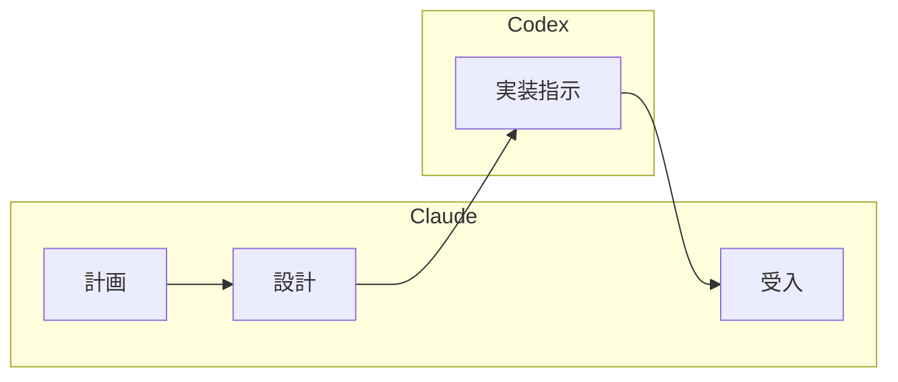

# 開発フェーズオーケストレーション

開発フェーズ全体のワークフローを案内する。TDD サイクルに従い、バックエンド→フロントエンドの順序で品質を担保しながら開発を進める。

## オプション

| オプション | 説明 |
|-----------|------|
| なし | 開発フェーズ全体のワークフローを表示 |
| `--codex` | Claude（計画・設計・受入）と Codex（実装）の分業体制で開発 |

## 開発フェーズの全体像

1. **バックエンド開発** (Skill: `developing-backend`) — インサイドアウトアプローチ推奨
2. **フロントエンド開発** (Skill: `developing-frontend`) — アウトサイドインアプローチ推奨

各開発で Red-Green-Refactor サイクルを厳密に実行する。テストなしでプロダクションコードを書かない。

### レビューポイント

コーディングとテストガイドのイテレーション開発フローに準拠し、以下のタイミングでレビュースキルを発動する。

| タイミング | スキル | 説明 |
|-----------|--------|------|
| TODO 完了時（コードレビュー） | `developing-review` | TDD サイクルで TODO を完了するたびにコード品質・テスト品質・設計整合性をレビュー |
| 受け入れ前（品質チェック） | `operating-qt` | SonarQube によるコード品質分析・Quality Gate 確認を実施し、品質基準を満たしていることを検証 |
| イテレーション完了時（ユーザーレビュー） | `analyzing-review` | 受け入れフェーズでユーザー視点・プロダクト視点からの成果物レビュー |

## TDD サイクル

TDD は「テストを書いてからコードを書く」手順ではなく、「設計を小さなフィードバックループで検証する」手法。10-15 分で 1 サイクルを完了させる。

1. **Red**: 失敗するテストを最初に書く
2. **Green**: テストを通す最小限のコードを実装する
3. **Refactor**: 重複を除去し設計を改善する
4. @docs/reference/コーディングとテストガイド.md のワークフローに従う

## 参照ドキュメント

- @docs/reference/コーディングとテストガイド.md — TDD ワークフロー詳細
- @docs/reference/CodexCLIMCPアプリケーション開発フロー.md — Codex 連携フロー
- @docs/design/architecture.md, @docs/design/architecture_backend.md, @docs/design/architecture_frontend.md
- @docs/design/data-model.md, @docs/design/domain-model.md, @docs/design/tech_stack.md
- @docs/design/ui-design.md, @docs/design/test_strategy.md
- 作業完了後に対象の @docs/development/iteration_plan-N.md の進捗を更新する

## Codex 分業モード（--codex）

Claude と Codex の役割を分離し、計画・設計・受入を Claude が担い、実装を Codex に委譲する。

**前提条件**: Codex MCP サーバーが設定済みであること（@docs/reference/CodexCLIMCPサーバー設定手順.md 参照）

### 役割分担

| フェーズ | 担当 | 責務 |
|---------|------|------|
| 計画 | Claude | 要件分析、タスク分解、優先度決定 |
| 設計 | Claude | API 設計、UI 設計、データモデル設計 |
| 実装 | Codex | コード実装、ユニットテスト作成 |
| 受入 | Claude | 設計レビュー、E2E テスト作成・実行、品質確認 |

### 開発フロー



### 指示サイズ

| 粒度 | 推奨度 | 説明 |
|------|--------|------|
| タスク単位（1-3 ファイル） | 推奨 | 1 つのコンポーネントや機能単位 |
| 機能単位（3-5 ファイル） | 注意 | 進捗確認を頻繁に行う |
| ユーザーストーリー単位 | 非推奨 | タスクに分割して実行する |

### Codex への指示例

```
mcp__codex__codex
  prompt: |
    お知らせ管理機能を実装してください。
    ## 開発ガイド
    docs/reference/コーディングとテストガイド.md に従って実装すること。
    特に TDD サイクル（Red-Green-Refactor）を厳守すること。
    ## タスク
    1. AuthContext に role と canManageAnnouncements を追加
    2. API クライアントに create/update/delete 関数を追加
    ## 完了条件
    - ESLint エラーなし
    - 既存テストがパス
    - TDD サイクルに従って実装
  sandbox: danger-full-access
  approval-policy: never
  cwd: プロジェクトルート
```

### 受入基準

- [ ] すべての受入条件が満たされている
- [ ] E2E テストがすべてパス
- [ ] ESLint エラーがない
- [ ] 既存テストが壊れていない

### Codex が書き込みできない場合

1. Claude が勝手に直接編集を進めてはいけない
2. ユーザーに状況を報告し、確認を待つ
3. ユーザーの許可を得てから代替手段を実行する

## 途中から再開

開発セッションの途中から再開する場合は、まず現在の実装状況を確認する。

**Example:**

```
ユーザー: 「バックエンドの認証機能は実装済み。次の機能に進みたい」
回答: イテレーション計画を確認し、次のユーザーストーリーを特定する。
      既存コードのテスト結果を確認し、Green 状態であることを検証してから
      次のタスクの Red フェーズに進む。
```

## コンテキスト管理

タスクの区切りごとに `/compact` を実施して Context limit reached エラーを回避する。

- ユーザーストーリー 1 件の実装完了時、TDD サイクルを数回繰り返した後、コミット完了後に実施する
- `/compact` 前に現在の作業状態と次のタスクをメモとして出力する

## 注意事項

- プロジェクトのテスト環境が設定済みであること（前提条件）
- TDD の三原則を厳密に守る。テストなしでプロダクションコードを書かない
- コミット前に必ず品質チェックリストを実行する
- TODO 駆動開発でタスクを細かく分割してから実装を開始する
- Rule of Three: 同じコードが 3 回現れたらリファクタリングする

## 関連スキル

- `developing-backend` — バックエンド TDD 開発
- `developing-frontend` — フロントエンド TDD 開発
- `developing-review` — 開発成果物のマルチパースペクティブレビュー（TODO 完了時のコードレビュー）
- `analyzing-review` — 分析成果物のマルチパースペクティブレビュー（イテレーション完了時のユーザーレビュー）
- `operating-qt` — コード品質管理（受け入れ前の SonarQube 品質チェック）
- `developing-release` — リリースワークフロー（品質ゲート・バージョン管理・CHANGELOG）
