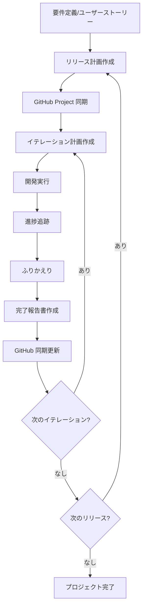

# 計画・進捗管理オーケストレーション

計画・進捗管理フェーズ全体のワークフローを案内する。リリース計画の策定から GitHub Project への同期、進捗追跡まで包括的なプロジェクト管理サイクルを提供する。

## オプション

| オプション | 説明 |
|-----------|------|
| なし | 計画・進捗管理フェーズ全体のワークフローを表示 |
| `--init` | プロジェクト管理の初期セットアップ（リリース計画→GitHub 同期） |
| `--iteration <番号>` | 特定イテレーションのライフサイクル管理（計画→実行→振り返り→報告） |
| `--sync` | 計画ドキュメントと GitHub Project の同期 |
| `--status` | プロジェクト全体の状態サマリーを表示 |

## フェーズの全体像

1. **リリース計画の策定** (Skill: `planning-releases`) — スコープ・スケジュール・リソースの定義、ベロシティ管理
2. **GitHub Project 同期** (Skill: `syncing-github-project`) — Issue 作成、カスタムフィールド設定、Milestone 管理
3. **進捗追跡** (Skill: `tracking-progress`) — 達成度分析、品質メトリクス、ドキュメント更新

## プロジェクト管理ワークフロー



## 初期セットアップフロー（--init）

プロジェクト管理の初期セットアップを段階的に実行する。

1. **リリース計画作成**: `planning-releases --release` でマクロ計画を策定する
2. **GitHub Project 同期**: `syncing-github-project` で GitHub に反映する
3. **イテレーション 1 計画**: `planning-releases --iteration 1` で初回イテレーション計画を作成する
4. **状態確認**: `tracking-progress --brief` で初期状態を確認する

## イテレーションライフサイクル（--iteration）

各イテレーションのライフサイクルを 3 フェーズで管理する。

### 開始時

1. `planning-releases --iteration <N>` でイテレーション計画を作成する
2. `syncing-github-project --sync` で GitHub に反映する
3. `tracking-progress --iteration <N>` で初期状態を確認する

### 実行中

1. `tracking-progress --brief` で進捗を定期確認する
2. `syncing-github-project --status` で GitHub の状態を確認する

### 終了時

1. `tracking-progress --update` で進捗ドキュメントを更新する
2. `planning-releases --retrospective` でふりかえりを実施する
3. `planning-releases --report` で完了報告書を作成する
4. `syncing-github-project --sync` で GitHub に最終同期する

## 途中から再開

プロジェクト管理の途中から再開する場合は、まず現在の状態を確認する。

**Example:**

```
ユーザー: 「イテレーション 2 の開発が終わった。振り返りをしたい」
回答: docs/development/iteration_plan-2.md の完了状況を確認し、
      tracking-progress --update で進捗を更新してから
      planning-releases --retrospective でふりかえりを実施する。
```

## 出力例

```
プロジェクト管理状態
━━━━━━━━━━━━━━━━━━━━━━━━━━━━━━━━

リリース計画
├─ リリース 1.0 MVP: 8 週間（4 イテレーション）
├─ 総ストーリー: 34 件（155SP）
└─ 進捗: 25%（イテレーション 1/4 完了）

GitHub Project
├─ 同期状態: 最新
├─ Open Issues: 26 件
├─ Closed Issues: 8 件
└─ 最終同期: 2026-02-17

現在のイテレーション（IT-2）
├─ 期間: 2026-02-17 〜 2026-02-28
├─ 計画 SP: 12SP
├─ 完了 SP: 4SP
├─ 達成率: 33%
└─ ベロシティ（前回）: 10SP
```

## コンテキスト管理

タスクの区切りごとに `/compact` を実施して Context limit reached エラーを回避する。

- リリース計画・イテレーション計画の作成完了時、GitHub 同期完了時、ふりかえり・報告書作成完了時に実施する
- `/compact` 前に現在の作業状態と次のタスクをメモとして出力する

## 注意事項

- 要件定義書またはユーザーストーリーが存在すること、`gh` CLI がインストールされ認証済みであること（前提条件）
- 初回ベロシティは推測値のため、3 イテレーション後に再調整を推奨する
- `docs/development/release_plan.md` を Single Source of Truth として管理し、GitHub への同期を定期的に実施する
- データドリブンにベロシティ実績に基づいて計画を継続的に調整する

## 関連スキル

- `planning-releases` — リリース・イテレーション計画の作成と管理
- `syncing-github-project` — GitHub Project への同期と一元管理
- `tracking-progress` — 進捗分析・レポート生成
- `orchestrating-analysis` — 分析フェーズのオーケストレーション
- `orchestrating-development` — 開発フェーズのオーケストレーション
