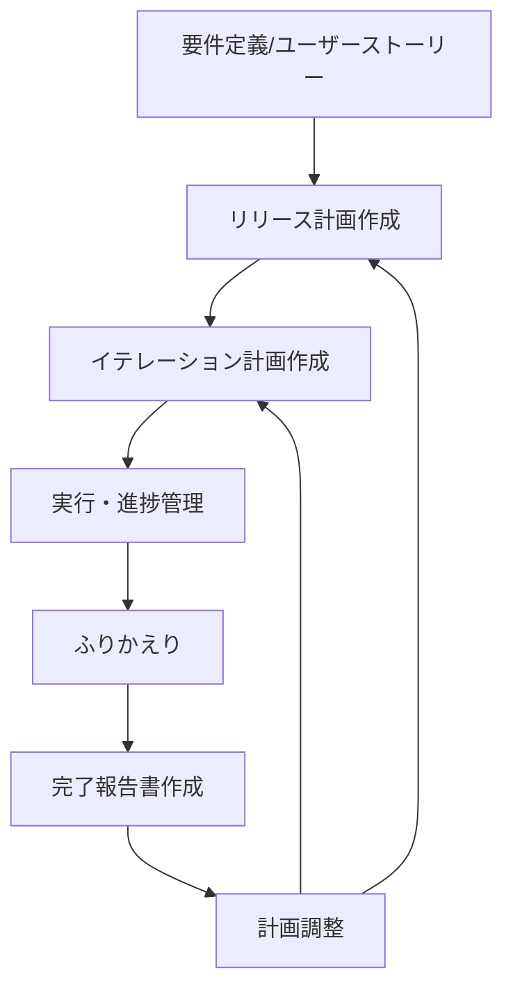

# リリース・イテレーション計画

アジャイルなリリース計画とイテレーション計画を作成し、ベロシティに基づいてプロジェクトの進捗を管理する。

計画の価値は「正確に予測すること」ではなく「実績と計画のズレを早期に検知し調整すること」。ベロシティの安定に 3 イテレーションかかるため、初期は粗く後から精緻化する。

## オプション

| オプション | 説明 |
|-----------|------|
| なし | 全体のリリース計画を作成または更新 |
| `--release` | リリース計画のみを作成（3-6 ヶ月のマクロ計画） |
| `--iteration <番号>` | 特定のイテレーション計画を作成（2 週間の詳細計画） |
| `--velocity` | ベロシティ分析と予測を実行 |
| `--burndown` | バーンダウンチャートを生成 |
| `--retrospective` | ふりかえり結果を記録し次イテレーション計画に反映 |
| `--report` | イテレーション完了報告書を作成 |
| `--status` | 現在の進捗状況をサマリー表示 |

## リリース計画の作成

リリース・イテレーション計画ガイドに準拠した包括的なリリース計画を作成する。

**テンプレート**: @docs/template/リリース計画.md

**作成される内容**:

- 満足条件（スコープ・スケジュール・リソース）
- ベロシティ見積もり（基準ストーリー分析に基づく）
- 優先順位マトリックス（金銭価値・コスト・知識習得・リスク軽減の 4 軸）
- 段階的リリース戦略（MVP→機能拡張版→完成版）
- バッファ戦略（フィーチャバッファ 30%、スケジュールバッファ）
- mermaid.js ガントチャートによるスケジュール概要

成果物は `docs/development/release_plan.md` に保存する。`docs/index.md` と `mkdocs.yml` も更新する。

## イテレーション計画の作成

コミットメント駆動方式で実行可能な 2 週間の詳細計画を作成する。

**テンプレート**: @docs/template/イテレーション計画.md

**作成される内容**:

- イテレーションゴール（1-2 行の明確な目標）
- ストーリー選択（リリース計画に基づく優先順位付け）
- タスク分解（各ストーリーを 4-16 理想時間のタスクに分解）
- mermaid.js ガントチャートによる詳細スケジュール

成果物は `docs/development/iteration_plan-N.md` に保存する。`release_plan.md`、`docs/index.md`、`mkdocs.yml` も更新する。

## ふりかえりの実施

KPT（Keep・Problem・Try）分析を中心に、イテレーションの振り返りを記録する。

- **Keep**: 技術的成功事項、プロセス的成功事項
- **Problem**: 未完了項目、見積もり精度の課題
- **Try**: 具体的改善アクション（責任者・期限・期待効果付き）

成果物は `docs/development/retrospective-N.md` に保存する。`iteration_plan-N.md` と `release_plan.md` の進捗も更新する。

## イテレーション完了報告書の作成

**テンプレート**: @docs/template/イテレーション完了報告書.md

git log、テスト結果、イテレーション計画からデータを収集し、バーンダウンチャート・ベロシティ・品質メトリクスを含む公式な完了報告書を作成する。

成果物は `docs/development/iteration_report-N.md` に保存する。

## 計画作成の流れ



## 途中から再開

既存の計画ドキュメントがある場合は、まず現在の状態を確認する。

**Example:**

```
ユーザー: 「イテレーション 1 が終わった。次の計画を作りたい」
回答: docs/development/iteration_plan-1.md の完了状況を確認する。
      --retrospective でふりかえりを実施し、
      --report で完了報告書を作成してから、
      --iteration 2 で次のイテレーション計画を作成する。
      イテレーション 1 のベロシティ実績を反映する。
```

## 注意事項

- 要件定義書またはユーザーストーリーが存在すること（前提条件）
- 初回ベロシティは推測値のため、3 イテレーション後に再調整を推奨する
- 各イテレーション終了時に計画を更新し、生きた文書として管理する
- タスク項目（リスト）の前には空行を入れる（Markdown Lint 準拠）
- バッファ確保: フィーチャバッファ 30%、スケジュールバッファを必ず設定する
- 感覚ではなく実績データに基づいて計画を調整する

## 関連スキル

- `syncing-github-project` — GitHub Project への同期
- `tracking-progress` — 進捗確認
- `managing-docs` — ドキュメント管理
