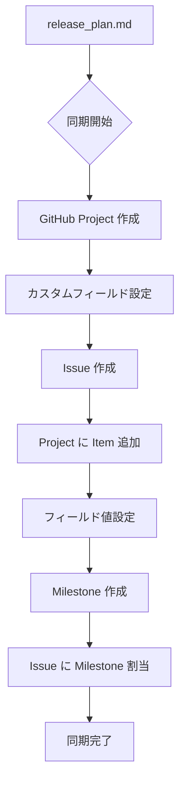
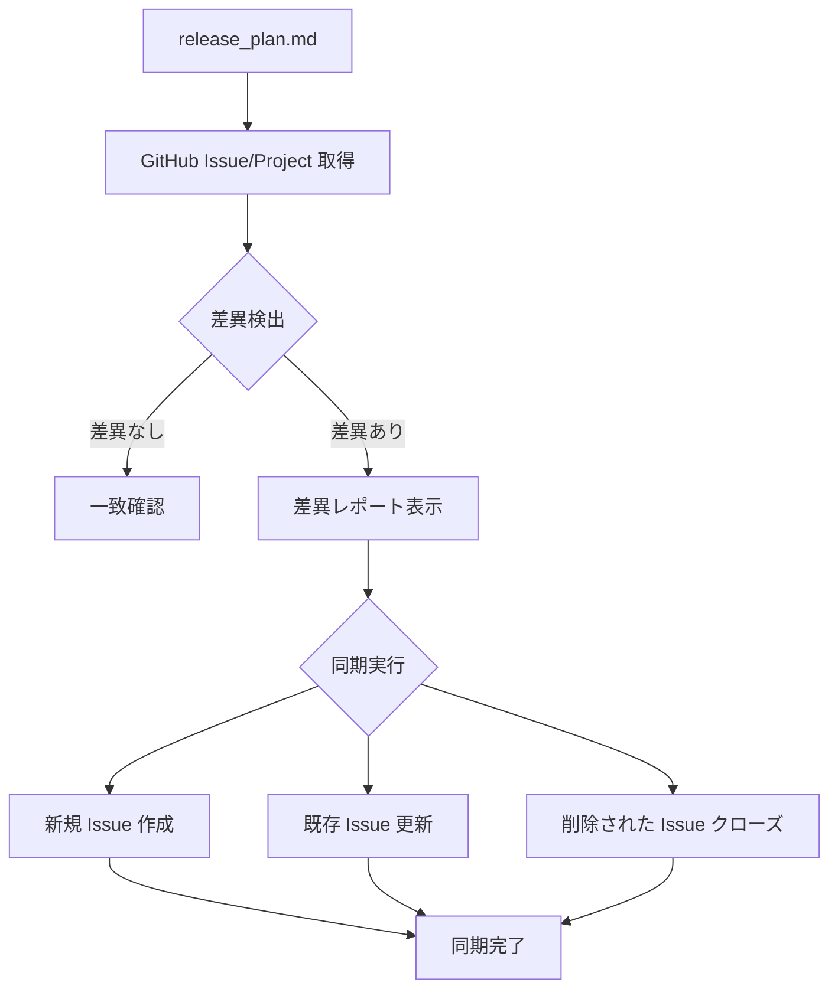

# GitHub Project 同期ガイド

リリース計画を GitHub Project・Issue・Milestone に反映し、プロジェクト管理を GitHub 上で一元化します。

## Instructions

### 1. オプション

- なし : 全体の同期を実行（Project 作成、Issue 作成、フィールド設定、Milestone 作成）
- `--project` : GitHub Project のみを作成
- `--issues` : Issue のみを作成（Project が存在する前提）
- `--fields` : 各 Issue に対して Project フィールド値を個別に設定
- `--milestones` : Milestone のみを作成し Issue に割り当て
- `--sync` : release_plan.md と GitHub の差異を確認し、差異があれば同期を実行
- `--status` : 現在の GitHub Project 状態を表示

### 2. 基本例

```bash
# 初回の完全同期（Project、Issue、Milestone すべて作成）
# 「リリース計画を GitHub Project に反映して」

# 差異確認と同期
# --sync
# 「release_plan.md と GitHub の差異を確認して同期して」

# 現在の状態確認
# --status
# 「GitHub Project の現在の状態を表示して」
```

### 3. GitHub Project の作成

release_plan.md に基づいて GitHub Project を作成し、カスタムフィールドを設定します。

**標準フィールド構成**:

| フィールド | タイプ | 説明 |
|-----------|--------|------|
| **Status** | Single Select | Todo / In Progress / Done（デフォルト） |
| **リリース** | Single Select | release_plan.md のリリースフェーズに対応 |
| **優先度** | Single Select | ストーリーの優先度 |
| **SP** | Number | ストーリーポイント（数値） |
| **イテレーション** | **Iteration** | スプリント期間（開始日・期間付き） |

プロジェクト固有のフィールド（カテゴリ、担当領域など）は release_plan.md の内容に応じて追加します。

**Single Select フィールドの作成**:

```bash
gh project field-create <PROJECT_NUMBER> --owner <OWNER> \
  --name "<フィールド名>" --data-type "SINGLE_SELECT" \
  --single-select-options "<選択肢1>,<選択肢2>,<選択肢3>"
```

**Number フィールドの作成**:

```bash
gh project field-create <PROJECT_NUMBER> --owner <OWNER> \
  --name "SP" --data-type "NUMBER"
```

### 4. Issue の作成

ユーザーストーリーを GitHub Issue として作成し、Project に追加します。

**Issue の構成**:

- **タイトル**: `[ストーリーID] ストーリー名`
- **本文**: ユーザーストーリー、サブタスク、受入条件、見積もり情報
- **Milestone**: リリースフェーズに対応する Milestone に割り当て
- **Project 紐付け**: `gh project item-add` で Project に追加

```bash
# Issue の作成（Milestone 付き）
gh issue create --repo <OWNER>/<REPO> \
  --title "<ストーリーID>: <ストーリー名>" \
  --milestone "<Milestone 名>" \
  --body "..."

# Project への追加
gh project item-add <PROJECT_NUMBER> --owner <OWNER> \
  --url "https://github.com/<OWNER>/<REPO>/issues/<NUMBER>"
```

### 5. フィールド値の設定

各 Issue に対して Project のカスタムフィールド値を個別に設定します。

#### 5.1 フィールド ID・オプション ID の取得

```bash
# フィールド一覧の取得
gh project field-list <PROJECT_NUMBER> --owner <OWNER> --format json

# Project Item ID の取得
gh project item-list <PROJECT_NUMBER> --owner <OWNER> --format json --limit 50 \
  | jq -r '.items[] | "\(.content.number):\(.id)"'
```

#### 5.2 Single Select / Number フィールドの設定

```bash
# Single Select フィールドの設定
gh project item-edit --project-id <PROJECT_ID> --id <ITEM_ID> \
  --field-id <FIELD_ID> --single-select-option-id <OPTION_ID>

# Number フィールドの設定
gh project item-edit --project-id <PROJECT_ID> --id <ITEM_ID> \
  --field-id <FIELD_ID> --number <VALUE>
```

#### 5.3 Iteration フィールドの作成と設定

Iteration フィールドは **Single Select ではなく Iteration 型** で作成します。GraphQL API の `createProjectV2Field` に `iterationConfiguration` を含めることで、フィールド作成と同時にイテレーション期間を設定できます。

**Iteration フィールドの作成（iterationConfiguration 付き）**:

```bash
gh api graphql -f query='
mutation {
  createProjectV2Field(input: {
    projectId: "<PROJECT_ID>"
    dataType: ITERATION
    name: "イテレーション"
    iterationConfiguration: {
      startDate: "<開始日 YYYY-MM-DD>"
      duration: <デフォルト期間（日数）>
      iterations: [
        { title: "<IT名>", startDate: "<開始日>", duration: <日数> },
        ...
      ]
    }
  }) {
    projectV2Field {
      ... on ProjectV2IterationField {
        id
        name
        configuration {
          iterations { id title startDate duration }
        }
      }
    }
  }
}'
```

**GraphQL スキーマ**:

```
CreateProjectV2FieldInput:
  projectId: ID!
  dataType: ProjectV2CustomFieldType!   # ITERATION を指定
  name: String!
  iterationConfiguration: ProjectV2IterationFieldConfigurationInput

ProjectV2IterationFieldConfigurationInput:
  startDate: Date!        # フィールド全体の開始日
  duration: Int!          # デフォルト期間（日数）
  iterations: [ProjectV2Iteration!]!

ProjectV2Iteration:
  title: String!          # イテレーション名（例: "IT1", "Sprint 1"）
  startDate: Date!        # 開始日（YYYY-MM-DD）
  duration: Int!          # 期間（日数、例: 14）
```

**重要**: `iterationConfiguration` を含めることで Web UI での手動設定は不要です。

**Iteration フィールドの ID と各イテレーション ID の取得**:

```bash
gh api graphql -f query='
query {
  node(id: "<PROJECT_ID>") {
    ... on ProjectV2 {
      field(name: "イテレーション") {
        ... on ProjectV2IterationField {
          id
          configuration {
            iterations { id title startDate duration }
          }
        }
      }
    }
  }
}'
```

**各 Issue への Iteration 値の設定**:

```bash
gh api graphql -f query='
mutation {
  updateProjectV2ItemFieldValue(input: {
    projectId: "<PROJECT_ID>"
    itemId: "<ITEM_ID>"
    fieldId: "<ITERATION_FIELD_ID>"
    value: { iterationId: "<ITERATION_ID>" }
  }) {
    projectV2Item { id }
  }
}'
```

### 6. Milestone の作成

リリースフェーズを GitHub Milestone として作成し、Issue に割り当てます。

```bash
# Milestone の作成
gh api repos/<OWNER>/<REPO>/milestones --method POST \
  -f title="<Milestone 名>" \
  -f description="<説明>" \
  -f due_on="<期限 YYYY-MM-DDT00:00:00Z>"

# Issue 作成時に --milestone で指定するか、既存 Issue に割り当て
gh issue edit <NUMBER> --repo <OWNER>/<REPO> --milestone "<Milestone 名>"
```

### 7. 差異確認と同期

release_plan.md と GitHub Issue/Project の整合性を確認し、差異があれば同期を実行します。

**確認項目**:

- ストーリー数の一致
- ストーリーポイントの一致
- リリース/Milestone 割り当ての一致
- 優先度の一致
- イテレーション割り当ての一致
- Status の一致

**同期動作**:

1. release_plan.md と GitHub Issue/Project の差異を検出
2. 差異レポートを表示（追加/変更/削除項目）
3. 差異がある場合は同期を実行:

   - **新規ストーリー**: Issue を作成し Project に追加
   - **変更されたストーリー**: Issue のフィールド値を更新
   - **削除されたストーリー**: Issue をクローズ（削除はしない）
   - **Status 変更**: release_plan.md の Status を GitHub に反映

### 8. フィールド値の一括確認（GraphQL）

設定済みのフィールド値を一覧で確認します。

```bash
gh api graphql -f query='
query {
  node(id: "<PROJECT_ID>") {
    ... on ProjectV2 {
      items(first: 50) {
        nodes {
          content {
            ... on Issue { number title }
          }
          fieldValues(first: 10) {
            nodes {
              ... on ProjectV2ItemFieldSingleSelectValue {
                field { ... on ProjectV2SingleSelectField { name } }
                name
              }
              ... on ProjectV2ItemFieldNumberValue {
                field { ... on ProjectV2Field { name } }
                number
              }
              ... on ProjectV2ItemFieldIterationValue {
                field { ... on ProjectV2IterationField { name } }
                title
                startDate
                duration
              }
            }
          }
        }
      }
    }
  }
}'
```

### 9. 同期フロー

#### 初回同期フロー



#### 差異確認・同期フロー（--sync）



### 10. 注意事項

- **前提条件**:

  - `docs/development/release_plan.md` が存在すること
  - `gh` CLI がインストールされ認証済みであること
  - Project API スコープが有効であること（`gh auth refresh -s project,read:project`）

- **制限事項**:

  - 既存の Project/Issue がある場合は重複作成に注意
  - フィールド値の更新は既存値を上書き
  - Iteration フィールドの期間変更は GraphQL API または Web UI で実施

- **推奨事項**:

  - 初回は `--sync` で差異確認してから同期
  - 大規模な変更前にはバックアップを推奨

### 11. ベストプラクティス

1. **初回同期**: 全体を一括作成
2. **計画更新時**: `--sync` で差異確認と自動同期
3. **定期確認**: `--status` で進捗状況を定期的に確認
4. **一貫性維持**: release_plan.md を Single Source of Truth として管理し、`--sync` で GitHub に反映
5. **Iteration 型の活用**: イテレーションは Single Select ではなく Iteration 型フィールドを使用し、スプリント期間を明示する

### 関連スキル

- `planning-releases` : リリース計画とイテレーション計画の作成
- `tracking-progress` : 進捗状況の確認と更新
- `orchestrating-project` : 計画・進捗管理フェーズ全体のオーケストレーション
- `git-commit` : 変更のコミット
