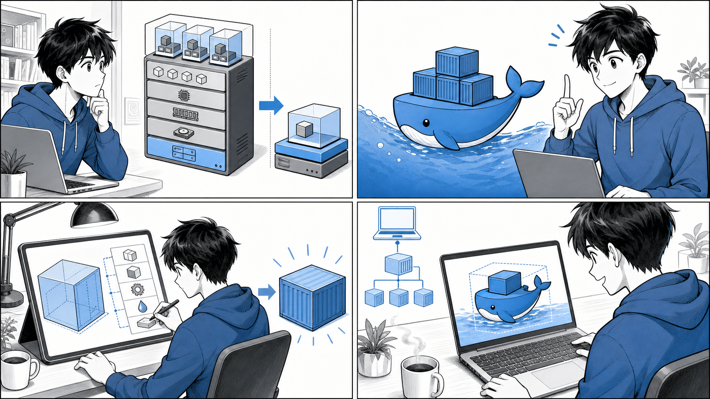
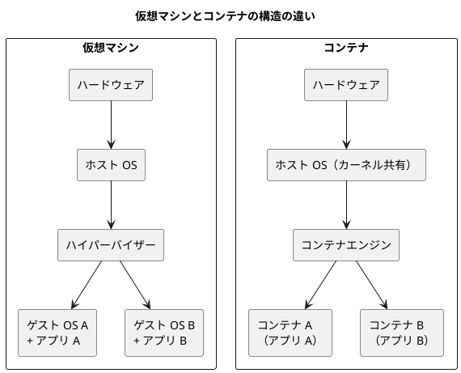
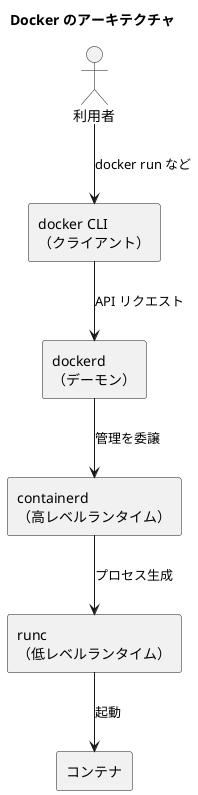

# 第 1 章 コンテナと Docker の基礎



*コンテナはアプリケーションと依存関係を箱にまとめ、Docker イメージから実行環境を再現します。*

## はじめに

現代のアプリケーション開発において、コンテナはもはや欠かせない技術となりました。「自分の環境では動くのに、本番環境では動かない」という、開発者を長年悩ませてきた問題を、コンテナは根本から解決します。

この章では、書籍『Docker/Kubernetes 実践コンテナ開発入門（第 2 版）』の第 1 章に沿って、コンテナとは何か、Docker とは何か、なぜコンテナを使うのか、そしてローカルでコンテナを動かす環境をどう整えるのかを順に学びます。後続の章で扱う実用的なイメージ構築や Kubernetes へつなげるための土台となる、もっとも基礎的な内容です。

解説には、実際に動作するサンプルリポジトリのコードを引用します。引用元はその都度リポジトリ名とファイルパスで明示しますので、手元で同じものを確認しながら読み進めてください。

## 1.1 コンテナとは

コンテナとは、アプリケーションとその実行に必要な依存関係（ライブラリ、ランタイム、設定ファイルなど）を 1 つにまとめ、ホスト OS から隔離された状態で動かす仕組みです。アプリケーションを「箱（コンテナ）」に詰めて持ち運べるようにする、というイメージが名前の由来です。

### コンテナと仮想マシンの違い

コンテナを理解するうえでもっとも重要なのは、仮想マシン（VM）との違いです。両者はどちらも「隔離された実行環境」を提供しますが、その実現方法が大きく異なります。

仮想マシンは、ハイパーバイザーの上にゲスト OS を丸ごと動かします。ゲスト OS のカーネルを各 VM が個別に持つため、隔離は強固ですが、起動が遅く、メモリやディスクの消費も大きくなります。

一方コンテナは、ホスト OS のカーネルを共有しながら、プロセスをネームスペースや cgroups といった Linux カーネルの機能で隔離します。ゲスト OS を持たないぶん軽量で、起動はほぼ一瞬、1 台のホスト上に多数のコンテナを密に配置できます。



両者の違いを整理すると次のようになります。

| 観点 | 仮想マシン | コンテナ |
| :--- | :--- | :--- |
| 隔離の単位 | ゲスト OS ごと | プロセス単位 |
| OS カーネル | ゲストごとに個別 | ホストと共有 |
| 起動時間 | 数十秒〜分 | 数百ミリ秒〜秒 |
| リソース消費 | 大きい | 小さい |
| 隔離の強度 | 強い | VM より弱い |

コンテナは軽量で素早く起動できる反面、ホストのカーネルを共有するという性質上、隔離の強度は仮想マシンに及びません。用途に応じて使い分けることが大切です。

### イメージとコンテナの関係

コンテナを語るうえで欠かせないのが「イメージ」という概念です。

- **イメージ（image）** … アプリケーションと依存関係をまとめた、読み取り専用のテンプレートです。コンテナの設計図にあたります。
- **コンテナ（container）** … イメージを起動して実行状態にしたものです。同じイメージから複数のコンテナを起動できます。

クラスとインスタンスの関係に例えると理解しやすいでしょう。イメージがクラス、コンテナがそのインスタンスにあたります。1 つのイメージから何個でも同じコンテナを生み出せるという点が、コンテナの再現性を支えています。

## 1.2 Docker とは

Docker は、コンテナを「作る・動かす・配布する」ための代表的なプラットフォームです。コンテナという技術自体は Linux カーネルの機能に基づきますが、それを誰でも扱える形に整え、広く普及させたのが Docker です。

### Docker のアーキテクチャ

Docker は単一のプログラムではなく、役割の異なる複数のコンポーネントが連携して動作します。

- **Docker クライアント（docker CLI）** … 利用者が `docker run` などのコマンドを打ち込む窓口です。
- **dockerd（Docker デーモン）** … クライアントからの要求を受け取り、イメージやコンテナ、ネットワークなどを管理する常駐プロセスです。
- **containerd** … コンテナのライフサイクル（生成・開始・停止・削除）を司る高レベルランタイムです。
- **runc** … OCI（Open Container Initiative）仕様に従い、実際にコンテナのプロセスを生成する低レベルランタイムです。

利用者のコマンドは「docker CLI → dockerd → containerd → runc」という流れで処理され、最終的に runc がカーネル機能を使ってコンテナを起動します。



このように責務が分離されているおかげで、たとえば Kubernetes は dockerd を経由せず containerd を直接利用するといった構成も取れます。コンテナエコシステムの広がりは、この層構造に支えられています。

### イメージとレイヤ

Docker イメージは、複数の読み取り専用「レイヤ」が積み重なってできています。Dockerfile に書かれた命令（`FROM`、`RUN`、`COPY` など）の 1 つひとつが、おおむね 1 つのレイヤを生成します。

レイヤ構造には次の利点があります。

- **キャッシュの再利用** … 変更のないレイヤはビルド時に再利用され、ビルドが高速になります。
- **ストレージの節約** … 同じレイヤを複数のイメージで共有でき、ディスク使用量を抑えられます。
- **差分配布** … イメージを取得（pull）する際、すでに持っているレイヤはダウンロードを省略できます。

コンテナを起動すると、これらの読み取り専用レイヤの上に書き込み可能なレイヤが 1 枚追加されます。コンテナ内での変更はこの書き込みレイヤに記録され、元のイメージは変更されません。これがコンテナの再現性を保つ仕組みです。

### Dockerfile を読む

イメージのビルド手順を記述するのが Dockerfile です。最小のサンプルとして、`echo` リポジトリの `apps/echo/Dockerfile` を見てみましょう。

```dockerfile
FROM golang:1.21.6

LABEL org.opencontainers.image.source=https://github.com/gihyodocker/echo

WORKDIR /go/src/github.com/gihyodocker/echo
COPY main.go .
RUN go mod init

CMD ["go", "run", "main.go"]
```

各命令の意味は次のとおりです。

- `FROM golang:1.21.6` … ベースイメージとして Go 1.21.6 の公式イメージを指定します。すべてのイメージは必ず `FROM` から始まります。
- `LABEL ...` … イメージにメタデータ（ここではソースリポジトリの URL）を付与します。
- `WORKDIR ...` … 以降の命令を実行する作業ディレクトリを設定します。
- `COPY main.go .` … ホスト側の `main.go` をイメージ内の作業ディレクトリへコピーします。
- `RUN go mod init` … ビルド時にコマンドを実行します（ここでは Go モジュールの初期化）。
- `CMD ["go", "run", "main.go"]` … コンテナ起動時に実行するデフォルトコマンドを指定します。

この Dockerfile が動かすアプリケーションは、`apps/echo/main.go` に書かれた、HTTP リクエストに対して文字列を返すだけのシンプルな Web サーバです。

```go
func main() {
	http.HandleFunc("/", func(w http.ResponseWriter, r *http.Request) {
		log.Println("Received request")
		fmt.Fprintf(w, "Hello Container!!")
	})

	log.Println("Start server")
	server := &http.Server{Addr: ":8080"}
	// ... 中略（シグナルを受けてグレースフルシャットダウンする処理が続く）
}
```

ポート `8080` で待ち受け、`/` へのアクセスに `Hello Container!!` を返します。なお `apps/echo/README-ja.md` には、このサンプルについて次のような注意書きがあります。

> 通常、Go言語のアプリケーションはビルドしてできた実行ファイルをコンテナイメージに含めます。しかし、ここではコンテナイメージのビルド手順をシンプルに読者に伝えるために、実行ファイルを作らずに実行しています。

つまり `CMD` で `go run` を使うこの書き方は、学習用に手順を単純化したものです。実用的なビルド方法（実行ファイルを作成して軽量イメージに含める方法）は、第 3 章や第 10 章で扱います。

### さまざまなベースイメージ

ベースイメージは目的に応じて選びます。`container-kit` リポジトリには、用途の異なる補助コンテナの Dockerfile がまとまっています。たとえばデバッグ用コンテナ `apps/container-kit/containers/debug/Dockerfile` は次のようになっています。

```dockerfile
FROM ubuntu:23.10

LABEL org.opencontainers.image.source=https://github.com/gihyodocker/container-kit

RUN apt update -y
RUN apt install -y curl wget git zip telnet vim default-mysql-client iputils-ping net-tools dnsutils
```

これは Ubuntu をベースに、ネットワーク調査やデータベース接続確認に使うツール群をインストールしたものです。コンテナ環境の中に入って調査するための「踏み台」として使います。

一方、リバースプロキシ用の `apps/container-kit/containers/simple-nginx-proxy/Dockerfile` は、Nginx の公式イメージをベースにしています。

```dockerfile
FROM nginx:1.25.1

LABEL org.opencontainers.image.source=https://github.com/gihyodocker/container-kit

COPY ./etc/nginx /etc/nginx
RUN rm /etc/nginx/conf.d/default.conf
```

ミドルウェアの公式イメージをベースにして、自前の設定ファイルを `COPY` で重ねるという、実務でよく使うパターンです。このように、何を動かしたいかによってベースイメージは大きく変わります。

## 1.3 コンテナを利用する意義

なぜコンテナを使うのでしょうか。技術的な目新しさではなく、実際の開発・運用で得られる価値の観点から整理します。

### 環境の再現性

コンテナの最大の価値は、環境の再現性です。アプリケーションと依存関係をイメージにまとめておけば、開発者のマシン、テスト環境、本番環境のどこで動かしても同じように動作します。「自分の環境では動く」という属人的な状態から脱却できます。

### ポータビリティ（可搬性）

イメージはレジストリ（Docker Hub など）を介して配布できます。ビルドしたイメージをどこへでも持ち運び、同じものを起動できます。OS のバージョンや個々のマシンの設定差に振り回されることが減ります。

### 軽量さと起動の速さ

仮想マシンと違い、コンテナはホストのカーネルを共有するため軽量で、起動も高速です。これにより、必要なときに素早くコンテナを立ち上げ、不要になれば破棄するという使い捨ての運用がしやすくなります。

### スケーラビリティとオーケストレーションへの道

同じイメージから複数のコンテナを起動できる性質は、負荷に応じてコンテナ数を増減させる水平スケールと相性が抜群です。多数のコンテナを束ねて管理する仕組みがコンテナオーケストレーションであり、その代表が Kubernetes です。本書の後半（第 5 章以降）で扱う Kubernetes は、まさにこのコンテナの性質を最大限に活かすための基盤です。

### 用途を選ばない汎用性

コンテナは Web サーバのような常駐型アプリケーションだけのものではありません。一定時間で完了して終了する「ジョブ」もコンテナで表現できます。`apps/container-kit/containers/time-limit-job/Dockerfile` はその一例です。

```dockerfile
FROM ubuntu:23.10

LABEL org.opencontainers.image.source=https://github.com/gihyodocker/container-kit

ENV EXECUTION_SECONDS 5

COPY task.sh /usr/local/bin/

CMD ["sh", "-c", "task.sh"]
```

`ENV` で環境変数（実行秒数）を設定し、`task.sh` を実行するコンテナです。常駐サーバから使い捨てのバッチ処理まで、同じ仕組みで扱える汎用性もコンテナの大きな意義です。

## 1.4 ローカルコンテナ実行環境の構築

コンテナを学ぶには、まず手元の PC で Docker を動かせるようにする必要があります。

### ローカル環境構築の選択肢

ローカルでコンテナ実行環境を整える代表的な方法には、次のものがあります。

- **Docker Desktop** … Windows / macOS 向けの公式デスクトップアプリです。GUI と CLI が一式そろい、もっとも手軽に始められます。なお、一定規模以上の組織での商用利用にはライセンスが必要な点に注意してください。
- **Rancher Desktop** … オープンソースのデスクトップアプリです。コンテナエンジンとして dockerd（moby）または containerd を選択でき、Kubernetes をローカルで簡単に有効化できます。
- **Linux ネイティブ** … Linux 上では Docker Engine を直接インストールして利用できます。

いずれを選んでも、`docker` コマンドでコンテナを操作するという基本的な使い勝手は共通です。本シリーズでは、WSL2 や Rancher Desktop などを使ったローカル環境構築の詳しい手順を付録 A で扱います。この章では、環境が整ったあとに行う基本的な動作確認の流れだけを示します。

### 動作確認の基本コマンド

環境構築が済んだら、まず Docker が正しく動いているかを確認します。

```bash
# Docker のバージョンを確認する
docker version

# Docker が動作しているか、簡単なイメージを実行して確認する
docker run hello-world
```

`docker run hello-world` を実行すると、Docker がイメージをローカルに探し、なければレジストリから取得（pull）したうえでコンテナを起動します。動作確認用のメッセージが表示されれば成功です（出力の具体的な内容は環境や Docker のバージョンによって異なります）。

### echo サンプルでイメージのビルドと実行を体験する

先ほど見た `echo` サンプルを使って、イメージのビルドからコンテナ実行までの一連の流れを確認しましょう。`apps/echo/Dockerfile` のあるディレクトリで、次のコマンドを順に実行します。

```bash
# Dockerfile からイメージをビルドする（-t でイメージ名を付ける）
docker build -t example/echo:latest .

# ビルドしたイメージの一覧を確認する
docker images

# イメージからコンテナを起動する（ホストの 8080 番をコンテナの 8080 番へ接続）
docker run -p 8080:8080 example/echo:latest
```

`docker build` の最後の `.`（ドット）は、ビルドコンテキスト（Dockerfile や `COPY` 対象が置かれた場所）として現在のディレクトリを指定するものです。`docker run` の `-p 8080:8080` は、ホスト側のポートとコンテナ側のポートを結びつけるオプションです。

コンテナが起動したら、別のターミナルから動作を確認します。

```bash
# 起動中のコンテナへリクエストを送る
curl http://localhost:8080/
```

`apps/echo/main.go` の実装どおり、`Hello Container!!` という応答が返ってきます。アプリケーションのソースを直接インストールせず、コンテナを起動するだけで動かせたことが、コンテナの再現性とポータビリティを体感できる瞬間です。

### よく使う基本コマンド

最後に、この先の章でも繰り返し使う基本コマンドをまとめておきます。

| コマンド | 役割 |
| :--- | :--- |
| `docker build -t 名前 .` | Dockerfile からイメージをビルドする |
| `docker images` | ローカルのイメージ一覧を表示する |
| `docker run イメージ` | イメージからコンテナを起動する |
| `docker ps` | 起動中のコンテナ一覧を表示する |
| `docker ps -a` | 停止中も含む全コンテナを表示する |
| `docker stop コンテナ` | コンテナを停止する |
| `docker rm コンテナ` | コンテナを削除する |
| `docker rmi イメージ` | イメージを削除する |

これらのコマンドの詳しい使い方や、`docker run` の各種オプション、Docker Compose による複数コンテナの扱いについては、次章で本格的に学びます。

## まとめ

この章では、コンテナと Docker のもっとも基礎的な部分を学びました。要点を整理します。

| トピック | キーポイント |
| :--- | :--- |
| コンテナとは | アプリと依存関係をまとめて隔離実行する仕組み。VM と違いホストのカーネルを共有し軽量 |
| イメージとコンテナ | イメージは設計図、コンテナはその実行インスタンス |
| Docker のアーキテクチャ | docker CLI → dockerd → containerd → runc の層構造 |
| イメージとレイヤ | 命令ごとにレイヤが積み重なり、キャッシュ・共有・差分配布を実現 |
| 利用の意義 | 再現性、ポータビリティ、軽量さ、スケーラビリティ、用途の汎用性 |
| ローカル環境構築 | Docker Desktop / Rancher Desktop などを利用。詳細手順は付録 A |

コンテナは「変更を楽に安全に行い、どこでも同じように動かす」という、よいソフトウェアづくりを支える土台です。次章では、`echo` サンプルを題材に、アプリケーションの実行・イメージ作成・コンテナ操作・Docker Compose による複数コンテナの管理を、実際にコマンドを動かしながら掘り下げていきます。

---

- 次章: [第 2 章 コンテナのデプロイ](02-container-deployment.md)
- 目次: [記事トップ](index.md)

### 参考

- 『Docker/Kubernetes 実践コンテナ開発入門（第 2 版）』 — 山田明憲
- サンプルコード: `apps/echo/`、`apps/container-kit/containers/`（`tmp/` 配下）
