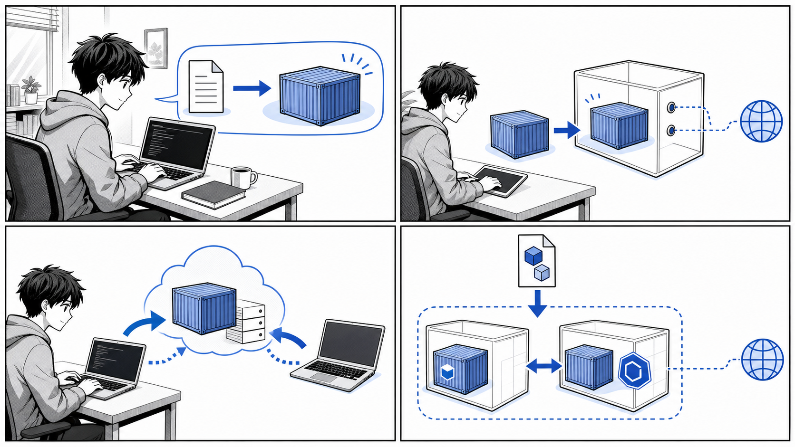
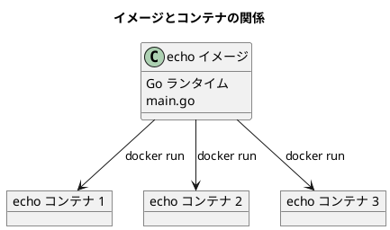
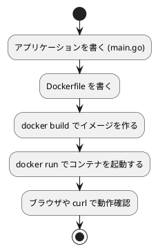
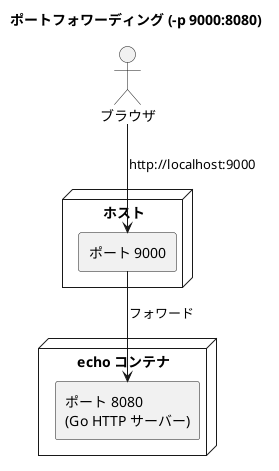
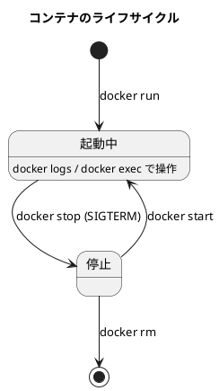
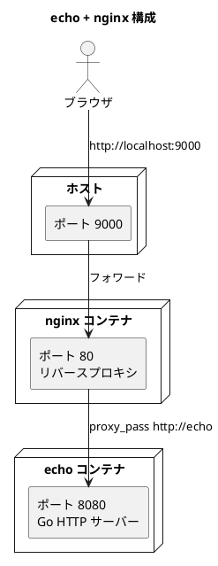

# 第 2 章 コンテナのデプロイ



*アプリケーションをイメージ化し、コンテナとして起動し、レジストリや Compose へ展開していきます。*

## はじめに

前章では Docker とコンテナの基本概念について学びました。コンテナとは何か、Docker がなぜ普及したのか、イメージとコンテナの関係といった「考え方」を中心に整理しました。

この章では、その考え方を実際に手を動かして確かめていきます。題材として使うのは、HTTP リクエストを受け取ると `Hello Container!!` という文字列を返すだけの小さな Go 製アプリケーション「echo」です。これは書籍『Docker/Kubernetes 実践コンテナ開発入門（第 2 版）』のサンプルコード（[gihyodocker/echo](https://github.com/gihyodocker/echo)）で、本章ではこのリポジトリの実コードをそのまま引用しながら進めます。

この章で扱うのは次の流れです。

1. コンテナでアプリケーションを実行するとはどういうことか（2.1）
2. 簡単なアプリケーションとコンテナイメージを作る（2.2）
3. イメージの操作（2.3）
4. コンテナの操作（2.4）
5. 運用管理向けコマンド（2.5）
6. Docker Compose による複数コンテナの起動（2.6）

「アプリケーションを書く」→「イメージにする」→「コンテナとして動かす」→「複数コンテナを組み合わせる」という、コンテナ開発の一連のサイクルを一度通して体験することがこの章のゴールです。

なお、echo は学習用のため、Go の実行ファイルを事前にビルドせず、コンテナ内で `go run` する構成になっています。`apps/echo/README-ja.md` にも次のように明記されています。

> 通常、Go言語のアプリケーションはビルドしてできた実行ファイルをコンテナイメージに含めます。しかし、ここではコンテナイメージのビルド手順をシンプルに読者に伝えるために、実行ファイルを作らずに実行しています。

実用的なビルド方法ではない点に注意しつつ、まずは「動かすこと」に集中しましょう。

---

## 2.1 コンテナでアプリケーションを実行する

### なぜコンテナで実行するのか

ある Web アプリケーションを動かすには、通常はランタイム（ここでは Go）、ライブラリ、設定ファイル、そしてアプリケーション本体が必要です。これらを開発者のマシンに手作業でそろえると、「自分の環境では動くのに、ほかの人の環境では動かない」という問題が起こりがちです。

コンテナは、アプリケーションとその実行に必要なものを 1 つのイメージにまとめ、どこでも同じように動かすための仕組みです。イメージさえあれば、ホストに Go がインストールされていなくても echo を実行できます。

### イメージとコンテナの関係

ここで前章の用語を改めて整理します。

| 用語 | 意味 |
| :--- | :--- |
| イメージ（image） | アプリケーションと実行環境をまとめた静的なテンプレート |
| コンテナ（container） | イメージを実行して生まれた、動作中の実体 |

クラスとインスタンスの関係に似ています。1 つのイメージから複数のコンテナを起動できます。echo の場合、「echo イメージ」を 1 つ作っておけば、そこから何個でも echo コンテナを立ち上げられます。



### この章で行うこと

コンテナでアプリケーションを実行するまでの基本的な流れは次の 3 ステップです。



次の節から、このステップを実際にたどっていきます。

---

## 2.2 簡単なアプリケーションとコンテナイメージを作る

### アプリケーション本体（main.go）

題材となる echo アプリケーションの本体は、`apps/echo/main.go` に書かれた Go のプログラムです。`/` に来たリクエストすべてに対して `Hello Container!!` を返す、ごく単純な HTTP サーバーです。

```go
package main

import (
	"context"
	"fmt"
	"log"
	"net/http"
	"os"
	"os/signal"
	"syscall"
	"time"
)

func main() {
	http.HandleFunc("/", func(w http.ResponseWriter, r *http.Request) {
		log.Println("Received request")
		fmt.Fprintf(w, "Hello Container!!")
	})

	log.Println("Start server")
	server := &http.Server{Addr: ":8080"}

	go func() {
		if err := server.ListenAndServe(); err != http.ErrServerClosed {
			log.Fatalf("ListenAndServe(): %s", err)
		}
	}()

	quit := make(chan os.Signal, 1)
	signal.Notify(quit, syscall.SIGINT, syscall.SIGTERM)
	<-quit
	log.Println("Shutting down server...")

	ctx, cancel := context.WithTimeout(context.Background(), 5*time.Second)
	defer cancel()
	if err := server.Shutdown(ctx); err != nil {
		log.Fatalf("Shutdown(): %s", err)
	}

	log.Println("Server terminated")
}
```

このコードのポイントを整理します。

- `http.HandleFunc("/", ...)` で、`/` 以下すべてのパスに対するハンドラを登録します。リクエストを受け取るたびに `Received request` をログ出力し、レスポンスとして `Hello Container!!` を書き込みます。
- `server := &http.Server{Addr: ":8080"}` でポート `8080` を待ち受けます。このポート番号は後でコンテナの公開設定と対応させるため重要です。
- サーバーは `go func()` の中で起動し、メインの処理は `SIGINT`（Ctrl+C）や `SIGTERM` のシグナルを待ちます。シグナルを受け取ると `server.Shutdown(ctx)` を呼び、処理中のリクエストを最大 5 秒待ってから終了します。これを「グレースフルシャットダウン」と呼びます。

このシグナル処理は、コンテナにとって重要な意味を持ちます。Docker は `docker stop` を実行すると、コンテナのメインプロセスに `SIGTERM` を送ります。echo はこれを受けて安全に終了できるよう作られているのです。コンテナの停止挙動については 2.4 で改めて触れます。

### Dockerfile を書く

アプリケーションをイメージにまとめる手順を記述するのが Dockerfile です。echo の Dockerfile（`apps/echo/Dockerfile`）は次のとおりです。

```dockerfile
FROM golang:1.21.6

LABEL org.opencontainers.image.source=https://github.com/gihyodocker/echo

WORKDIR /go/src/github.com/gihyodocker/echo
COPY main.go .
RUN go mod init

CMD ["go", "run", "main.go"]
```

各命令の意味を順に見ていきます。

#### FROM — ベースイメージの指定

```dockerfile
FROM golang:1.21.6
```

`FROM` は、これから作るイメージの土台となる「ベースイメージ」を指定します。ここでは Go 1.21.6 がインストール済みの公式イメージ `golang:1.21.6` を使っています。`golang:1.21.6` の `1.21.6` の部分はタグで、バージョンを表します。タグについては 2.3 で詳しく扱います。

ベースイメージのおかげで、ホストに Go をインストールしていなくても、このイメージの中では Go が使えます。

#### LABEL — メタデータの付与

```dockerfile
LABEL org.opencontainers.image.source=https://github.com/gihyodocker/echo
```

`LABEL` はイメージに任意のメタデータ（キーと値）を付けます。ここでは OCI（Open Container Initiative）の標準ラベルを使い、このイメージのソースコードがどこにあるかを示しています。ビルド結果には影響しませんが、イメージの出自を記録する目的で付けられています。

#### WORKDIR — 作業ディレクトリの指定

```dockerfile
WORKDIR /go/src/github.com/gihyodocker/echo
```

`WORKDIR` は、これ以降の命令（`COPY` や `RUN`、`CMD`）が実行される作業ディレクトリを指定します。指定したディレクトリが存在しなければ自動的に作成されます。`cd` を毎回書く代わりにカレントディレクトリを固定するイメージです。

#### COPY — ファイルのコピー

```dockerfile
COPY main.go .
```

`COPY` は、ホスト側のファイルをイメージの中にコピーします。ここではビルドコンテキスト（Dockerfile のあるディレクトリ）にある `main.go` を、作業ディレクトリ（`.`、つまり `WORKDIR` で指定した場所）へコピーしています。

なお、`apps/echo/.dockerignore` によって、`.git/` や `*.md`、`.idea/` などはビルドコンテキストから除外されます。不要なファイルを送らないことでビルドが速くなり、イメージに余計なものが含まれるのを防げます。

```text
.git/
.github/
*.md
*.iml
.idea/
bin/
```

#### RUN — ビルド時のコマンド実行

```dockerfile
RUN go mod init
```

`RUN` は、イメージをビルドする「最中」にコマンドを実行し、その結果をイメージに焼き込みます。ここでは Go モジュールを初期化しています。`RUN` で行った変更はイメージの一部として保存されます。

#### CMD — コンテナ起動時のコマンド

```dockerfile
CMD ["go", "run", "main.go"]
```

`CMD` は、イメージから「コンテナを起動したとき」に実行されるコマンドを指定します。`RUN` がビルド時なのに対し、`CMD` は実行時という違いに注意してください。ここでは `go run main.go` で echo サーバーを起動します。

`CMD` は配列形式（`["go", "run", "main.go"]`）で書くことが推奨されます。この形式（exec 形式）ではシェルを介さずに直接プロセスが起動するため、2.1 で説明した `SIGTERM` がアプリケーションへ正しく届きます。

### docker build でイメージを作る

Dockerfile が用意できたら、`docker build` でイメージをビルドします。`apps/echo/` ディレクトリで次のコマンドを実行します。

```bash
docker build -t echo:latest .
```

- `-t echo:latest` は、作るイメージに `echo` という名前と `latest` というタグを付けるオプションです。
- 末尾の `.` は、ビルドコンテキスト（Dockerfile と関連ファイルがあるディレクトリ）を指定しています。

ビルドが進むと、Dockerfile の命令が 1 行ずつ実行されていく様子が表示されます。出力は環境によって異なりますが、おおむね次のような流れになります（例）。

```bash
# 例
[+] Building 12.3s (9/9) FINISHED
 => [internal] load build definition from Dockerfile
 => [1/3] FROM docker.io/library/golang:1.21.6
 => [2/3] WORKDIR /go/src/github.com/gihyodocker/echo
 => [3/3] COPY main.go .
 => exporting to image
 => => naming to docker.io/library/echo:latest
```

### docker run -p でコンテナを起動する

ビルドしたイメージからコンテナを起動します。

```bash
docker run -p 9000:8080 echo:latest
```

ここで重要なのが `-p 9000:8080` です。`-p ホスト側ポート:コンテナ側ポート` の形式で、ホストのポートとコンテナのポートを結びつけます。

- `8080` は echo がコンテナ内で待ち受けているポート（`main.go` の `Addr: ":8080"` に対応）。
- `9000` はホスト側で公開するポート。

コンテナの中だけでポートを開いても、外からはアクセスできません。`-p` でポートを「公開（パブリッシュ）」することで、初めてホストから到達できるようになります。



起動すると、`main.go` の `log.Println` による出力がターミナルに表示されます（例）。

```bash
# 例
2026/06/15 12:00:00 Start server
```

### 動作確認

別のターミナルから `curl` でアクセスしてみます。

```bash
curl http://localhost:9000
```

次のように応答が返れば成功です。

```bash
# 例
Hello Container!!
```

ブラウザで `http://localhost:9000` を開いても同じく `Hello Container!!` が表示されます。アクセスするたびに、コンテナを起動したターミナルには `Received request` が出力されます。

ここまでで、「アプリケーションを書く」→「イメージにする」→「コンテナとして動かす」という一連の流れを一度通すことができました。次の節からは、ここで使ったイメージとコンテナをより細かく操作するコマンドを見ていきます。

---

## 2.3 イメージの操作

イメージは、コンテナを動かすための元になる成果物です。ここでは、イメージを「一覧する・取得する・名前を付ける・公開する・削除する」ための基本コマンドを整理します。

### イメージ操作コマンド一覧

| コマンド | 役割 |
| :--- | :--- |
| `docker image ls`（`docker images`） | ローカルにあるイメージの一覧を表示する |
| `docker image pull`（`docker pull`） | レジストリからイメージを取得する |
| `docker image push`（`docker push`） | レジストリへイメージを送る（公開する） |
| `docker image tag`（`docker tag`） | イメージに別名（タグ）を付ける |
| `docker image rm`（`docker rmi`） | イメージを削除する |
| `docker image build`（`docker build`） | Dockerfile からイメージをビルドする |

多くのコマンドは `docker image <サブコマンド>` という新しい形式と、`docker images` のような従来の短い形式の両方が使えます。

### images — イメージ一覧

ローカルにあるイメージを一覧します。

```bash
docker image ls
```

2.2 でビルドした echo イメージや、ベースイメージの golang などが表示されます（例）。

```bash
# 例
REPOSITORY   TAG       IMAGE ID       CREATED         SIZE
echo         latest    a1b2c3d4e5f6   2 minutes ago   850MB
golang       1.21.6    f6e5d4c3b2a1   3 weeks ago     830MB
```

`IMAGE ID` はイメージを一意に識別する ID です。同じイメージに複数の名前（タグ）が付いている場合、ID は同じになります。

### pull — イメージの取得

レジストリ（イメージの保管庫）からイメージをダウンロードします。

```bash
docker image pull ghcr.io/gihyodocker/echo:v0.1.0
```

これは GitHub Container Registry（`ghcr.io`）から、echo の公開イメージ `v0.1.0` を取得する例です。このイメージは 2.6 の Docker Compose でも利用します。

`docker run` を実行したとき、ローカルにイメージがなければ Docker は自動的に `pull` を行います。つまり明示的に `pull` しなくても動きますが、事前に取得しておきたい場合に使います。

### tag — イメージに別名を付ける

イメージに別の名前やタグを付けます。元のイメージはそのまま残り、新しい名前が追加されます。

```bash
docker image tag echo:latest ghcr.io/gihyodocker/echo:v0.1.0
```

レジストリへ push する際は、`ホスト名/ユーザー名/イメージ名:タグ` という形式の名前が必要です。`tag` は、ローカルでビルドしたイメージにレジストリ向けの名前を付けるために使います。

タグはバージョン管理に使われます。`latest` は「最新」を表す慣習的なタグですが、特定のバージョンを指す `v0.1.0` のようなタグを併用すると、どのバージョンを動かしているかが明確になります。

### push — イメージの公開

タグを付けたイメージをレジストリへアップロードします。

```bash
docker image push ghcr.io/gihyodocker/echo:v0.1.0
```

push したイメージは、別のマシンや本番環境から `pull` して利用できます。これにより、「自分のマシンでビルドしたイメージを、そのまま別の環境で動かす」ことが可能になります。push にはレジストリへのログイン（`docker login`）が必要です。

### rmi — イメージの削除

不要になったイメージを削除します。

```bash
docker image rm echo:latest
```

そのイメージから起動中のコンテナが残っている場合は削除できません。先にコンテナを停止・削除する必要があります（コンテナの削除は 2.4 を参照）。

---

## 2.4 コンテナの操作

イメージが「設計図」だとすれば、コンテナは「実際に動いている実体」です。ここでは、コンテナを起動・確認・停止・削除し、状態を調べるためのコマンドを整理します。

### コンテナ操作コマンド一覧

| コマンド | 役割 |
| :--- | :--- |
| `docker container run`（`docker run`） | イメージからコンテナを起動する |
| `docker container ls`（`docker ps`） | 起動中のコンテナ一覧を表示する |
| `docker container stop`（`docker stop`） | 動作中のコンテナを停止する |
| `docker container rm`（`docker rm`） | 停止したコンテナを削除する |
| `docker container logs`（`docker logs`） | コンテナのログを表示する |
| `docker container exec`（`docker exec`） | 動作中のコンテナ内でコマンドを実行する |

### run — コンテナの起動

2.2 で使ったコマンドです。ここではよく使うオプションを補足します。

```bash
docker run -d -p 9000:8080 --name echo-app echo:latest
```

- `-d`（detach）: コンテナをバックグラウンドで起動します。ターミナルが占有されなくなります。
- `--name echo-app`: コンテナに名前を付けます。指定しないと Docker が自動で名前を割り当てます。名前を付けておくと、後続のコマンドで指定しやすくなります。

### ps — コンテナ一覧

起動中のコンテナを一覧します。

```bash
docker container ls
```

```bash
# 例
CONTAINER ID   IMAGE         COMMAND               STATUS         PORTS                    NAMES
b1c2d3e4f5a6   echo:latest   "go run main.go"      Up 30 seconds  0.0.0.0:9000->8080/tcp   echo-app
```

停止中のものも含めてすべて表示したい場合は `-a` を付けます。

```bash
docker container ls -a
```

### logs — ログの確認

コンテナが標準出力・標準エラーに出したログを表示します。echo の場合、`main.go` の `log.Println` による出力が確認できます。

```bash
docker container logs echo-app
```

```bash
# 例
2026/06/15 12:00:00 Start server
2026/06/15 12:00:10 Received request
```

ログをリアルタイムに追い続けたい場合は `-f`（follow）を付けます。

```bash
docker container logs -f echo-app
```

### exec — コンテナ内でコマンドを実行

動作中のコンテナの中でコマンドを実行します。コンテナ内部を調べたいときに便利です。

```bash
docker container exec -it echo-app sh
```

- `-i`（interactive）と `-t`（tty）を組み合わせた `-it` で、対話的なシェルを起動できます。
- 末尾の `sh` は、コンテナ内で実行するコマンドです。シェルを起動して、コンテナの中をのぞいてみることができます。

シェルから抜けるには `exit` を入力します。

### stop — コンテナの停止

動作中のコンテナを停止します。

```bash
docker container stop echo-app
```

`stop` を実行すると、Docker はコンテナのメインプロセスに `SIGTERM` を送ります。2.1 で見たとおり、echo はこのシグナルを受けてグレースフルシャットダウンを行い、`Shutting down server...` を経て安全に終了します。一定時間（既定では 10 秒）以内に終了しない場合は `SIGKILL` で強制終了されます。

### rm — コンテナの削除

停止したコンテナを削除します。

```bash
docker container rm echo-app
```

コンテナは停止しただけでは残り続け、`docker container ls -a` に表示されます。完全に片付けるには `rm` で削除します。動作中のコンテナを削除しようとするとエラーになるため、先に `stop` するか、`-f` で強制削除します。

### コンテナのライフサイクル

ここまでのコマンドを、コンテナの一生（ライフサイクル）として整理すると次のようになります。



---

## 2.5 運用管理向けコマンド

コンテナやイメージを使い続けると、停止済みのコンテナや使われていないイメージが少しずつ溜まっていきます。ここでは、ディスク使用量の確認や不要リソースの掃除、リソースの詳細確認といった「運用管理」のためのコマンドを整理します。

### 運用管理向けコマンド一覧

| コマンド | 役割 |
| :--- | :--- |
| `docker system df` | Docker が使用しているディスク容量を表示する |
| `docker system prune` | 使われていないコンテナ・ネットワーク・イメージをまとめて削除する |
| `docker image prune` | 使われていないイメージを削除する |
| `docker container prune` | 停止中のコンテナをまとめて削除する |
| `docker container inspect` | コンテナの詳細情報を表示する |
| `docker image inspect` | イメージの詳細情報を表示する |
| `docker stats` | 動作中コンテナの CPU・メモリ使用状況を表示する |

### system df — ディスク使用量の確認

Docker がイメージ・コンテナ・ボリュームでどれだけディスクを使っているかを表示します。

```bash
docker system df
```

```bash
# 例
TYPE            TOTAL     ACTIVE    SIZE      RECLAIMABLE
Images          5         1         2.1GB     1.8GB (85%)
Containers      3         1         12MB      8MB (66%)
Local Volumes   2         0         0B        0B
```

`RECLAIMABLE`（回収可能）の列を見ると、掃除によってどれだけ容量を取り戻せるかの目安が分かります。

### prune — 不要リソースの掃除

`prune` は「使われていない」リソースをまとめて削除するコマンド群です。

停止中のコンテナだけを削除する場合:

```bash
docker container prune
```

どのコンテナからも参照されていないイメージを削除する場合:

```bash
docker image prune
```

不要なコンテナ・ネットワーク・イメージ（ダングリングイメージ）をまとめて削除する場合:

```bash
docker system prune
```

`prune` は削除の前に確認を求めます。意図しないものまで消さないよう、実行前に何が消えるのかを意識しましょう。

### inspect — 詳細情報の確認

コンテナやイメージの詳細な設定情報を JSON 形式で表示します。

```bash
docker container inspect echo-app
```

ネットワーク設定、マウント情報、環境変数、ポートの対応関係など、`ps` では見えない細かい情報を確認できます。トラブルシューティングの際に役立ちます。イメージに対しては `docker image inspect` を使います。

### stats — リソース使用状況の確認

動作中コンテナの CPU・メモリ・ネットワークの使用状況をリアルタイムに表示します。

```bash
docker stats
```

```bash
# 例
CONTAINER ID   NAME       CPU %     MEM USAGE / LIMIT     MEM %
b1c2d3e4f5a6   echo-app   0.01%     12.3MiB / 1.94GiB     0.62%
```

どのコンテナがリソースを多く消費しているかを把握するのに使います。

---

## 2.6 Docker Compose

ここまでは echo コンテナ 1 つだけを扱ってきました。しかし実際のシステムは、Web サーバー・アプリケーション・データベースなど、複数のコンテナを組み合わせて構成することがほとんどです。

複数のコンテナを `docker run` で 1 つずつ起動・連携させるのは煩雑です。そこで使うのが **Docker Compose** です。Compose では、複数のコンテナ構成を 1 つの YAML ファイル（`compose.yaml`）に宣言的に記述し、`docker compose up` の一発で全体を起動できます。

### echo + nginx 構成

echo リポジトリには、echo の前段に nginx をリバースプロキシとして置く構成が用意されています。構成図は次のとおりです。



ブラウザからのリクエストは、まずホストの 9000 番ポートを通って nginx に届き、nginx がそれを echo へ中継（プロキシ）します。

### compose.yaml の内容

構成を定義しているのが `apps/echo/compose.yaml` です。

```yaml
version: "3.9"

services:
  echo:
    image: ghcr.io/gihyodocker/echo:v0.1.0

  nginx:
    build: ./nginx 
    depends_on:
      - echo 
    ports:
      - "9000:80"
```

各項目を見ていきます。

- `version: "3.9"`: Compose ファイルのフォーマットバージョンです。
- `services`: 起動するコンテナ（サービス）の定義です。ここでは `echo` と `nginx` の 2 つを定義しています。
- `echo` サービス:
  - `image: ghcr.io/gihyodocker/echo:v0.1.0` — 2.3 で `pull` したのと同じ、レジストリ上の公開イメージを使います。ここではビルドせず、できあがったイメージをそのまま利用します。
- `nginx` サービス:
  - `build: ./nginx` — `image` ではなく `build` を指定しているため、`nginx/` ディレクトリの Dockerfile からイメージをビルドします。
  - `depends_on: [echo]` — `echo` サービスに依存することを表し、起動順序の制御に使われます。echo が先に起動されます。
  - `ports: ["9000:80"]` — ホストの 9000 番ポートを nginx の 80 番ポートに結びつけます。`docker run -p` と同じ役割です。

### nginx の構成

nginx 側のイメージは `apps/echo/nginx/Dockerfile` でビルドされます。

```dockerfile
FROM nginx:1.25.1

COPY ./etc/nginx/conf.d/* /etc/nginx/conf.d/
```

公式 nginx イメージをベースに、設定ファイルを `/etc/nginx/conf.d/` へコピーするだけのシンプルな構成です。コピーされる設定ファイルは 2 つあります。

まず `apps/echo/nginx/etc/nginx/conf.d/upstream.conf` で、プロキシ先（echo）を定義します。

```text
upstream echo {
   server echo:8080 max_fails=3 fail_timeout=10s;
}
```

ここで指定している `echo:8080` の `echo` は、`compose.yaml` の `echo` サービス名です。Compose で起動したコンテナ同士は、サービス名で名前解決して通信できます。`max_fails` と `fail_timeout` は、接続失敗時の挙動（3 回失敗したら 10 秒間そのサーバーを切り離す）を指定しています。

次に `apps/echo/nginx/etc/nginx/conf.d/echo.conf` で、リクエストを `upstream echo` へ転送する設定を記述します。

```text
server {
    listen 80; 
    server_name echo.gihyo.local;

    location / {
        proxy_pass http://echo;
        proxy_set_header Host $host;
        proxy_set_header X-Forwarded-For $remote_addr;
        access_log  /dev/stdout main;
        error_log   /dev/stderr;
    }
}
```

- `listen 80` — nginx は 80 番ポートで待ち受けます（`compose.yaml` の `9000:80` と対応）。
- `proxy_pass http://echo` — `/` への全リクエストを `upstream echo`（= echo サービスの 8080 番）へ転送します。
- `access_log /dev/stdout` / `error_log /dev/stderr` — ログを標準出力・標準エラーへ出すことで、`docker compose logs` から確認できるようにしています。

### docker compose up で起動する

`apps/echo/` ディレクトリで次のコマンドを実行すると、echo と nginx の両方が起動します。

```bash
docker compose up
```

バックグラウンドで起動したい場合は `-d` を付けます。

```bash
docker compose up -d
```

起動後、ブラウザまたは `curl` で `http://localhost:9000` にアクセスすると、nginx を経由して echo の応答が返ります。

```bash
curl http://localhost:9000
```

```bash
# 例
Hello Container!!
```

`docker run` のときは echo に直接アクセスしていましたが、今回は nginx を経由している点が異なります。それでも利用者から見た応答は同じ `Hello Container!!` です。複数コンテナの連携が、1 つの `compose.yaml` と 1 コマンドで実現できることが分かります。

### Compose のよく使うコマンド

| コマンド | 役割 |
| :--- | :--- |
| `docker compose up` | `compose.yaml` の構成を起動する（`-d` でバックグラウンド） |
| `docker compose ps` | Compose で起動中のサービス一覧を表示する |
| `docker compose logs` | 各サービスのログをまとめて表示する（`-f` で追従） |
| `docker compose down` | 起動した構成を停止し、コンテナ・ネットワークを削除する |
| `docker compose build` | `build` 指定のサービスのイメージをビルドする |

構成をまとめて片付けるには `down` を使います。

```bash
docker compose down
```

これで、Compose が作成したコンテナとネットワークがまとめて削除されます。

---

## まとめ

この章では、echo アプリケーションを題材に、コンテナのデプロイに必要な一連の流れを手を動かしながら確認しました。

1. **コンテナでアプリケーションを実行する**: イメージとコンテナの関係を整理し、「書く→イメージにする→動かす」という基本サイクルを把握しました。
2. **アプリケーションとイメージを作る**: `main.go` の echo サーバーと `Dockerfile` の各命令（`FROM` / `WORKDIR` / `COPY` / `RUN` / `CMD`）を理解し、`docker build` → `docker run -p` → 動作確認まで通しました。
3. **イメージの操作**: `images` / `pull` / `push` / `tag` / `rmi` でイメージを管理する方法を学びました。
4. **コンテナの操作**: `run` / `ps` / `stop` / `rm` / `logs` / `exec` でコンテナを操作し、ライフサイクルを把握しました。
5. **運用管理向けコマンド**: `system df` / `prune` / `inspect` / `stats` でリソースを確認・整理する方法を学びました。
6. **Docker Compose**: `compose.yaml` で echo + nginx の複数コンテナ構成を宣言し、`docker compose up` の 1 コマンドで連携を起動しました。

この章で学んだ操作を整理すると次のとおりです。

| 対象 | 主なコマンド |
| :--- | :--- |
| イメージ | `build` / `images` / `pull` / `push` / `tag` / `rmi` |
| コンテナ | `run` / `ps` / `stop` / `rm` / `logs` / `exec` |
| 運用管理 | `system df` / `prune` / `inspect` / `stats` |
| 複数コンテナ | `compose up` / `compose ps` / `compose logs` / `compose down` |

単一コンテナの起動から複数コンテナの連携まで、コンテナ開発の基礎を一通り体験できました。次章では、より実践的なコンテナのビルドとデプロイに踏み込んでいきます。

---

- 前の章: [第 1 章 コンテナと Docker の基礎](01-container-and-docker-basics.md)
- 次の章: [第 3 章 実用的なコンテナの構築とデプロイ](03-practical-container-build-deploy.md)
