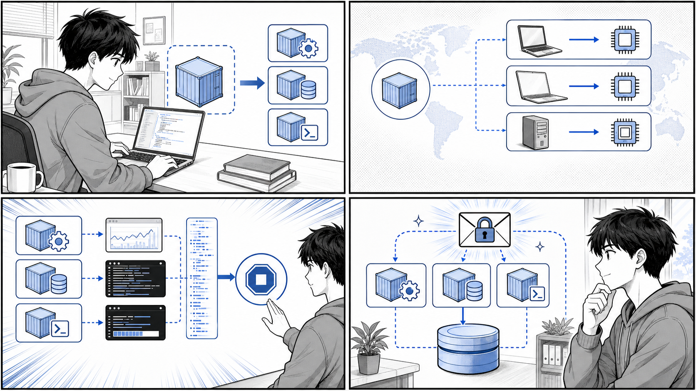

# 第 3 章 実用的なコンテナの構築とデプロイ



*1 コンテナ 1 関心事、ポータビリティ、設定、秘匿情報、永続化を組み合わせて実運用に近づけます。*

## はじめに

前章では Docker の基本的な操作と、1 つのコンテナを動かすところまでを学びました。この章では、実際の開発・運用に耐える「実用的な」コンテナの作り方を学んでいきます。

単にアプリケーションが動くコンテナを作るだけであれば、それほど難しくありません。しかし、複数の環境で安定して動き、安全に変更でき、本番運用に耐えるコンテナを作るには、いくつかの設計原則を理解しておく必要があります。本章では、以下の 5 つの観点から実用的なコンテナの作り方を解説します。

1. アプリケーションとコンテナの粒度（どこでコンテナを分けるか）
2. コンテナのポータビリティ（どこでも動くイメージの作り方）
3. コンテナフレンドリなアプリケーション（コンテナと相性のよいアプリの作法）
4. クレデンシャル（秘匿情報）の扱い方
5. 永続化データの扱い方

解説にあたっては、書籍『Docker/Kubernetes 実践コンテナ開発入門（第 2 版）』のサンプルリポジトリに相当する、本リポジトリ内の実コードを引用します。具体的には `apps/echo`（シンプルな Go の HTTP サーバー）と `apps/taskapp`（複数コンテナで構成されるタスク管理アプリケーション）の 2 つを題材とします。実在するファイルのみを引用し、内容を捏造しないことを心がけています。

なお、本章で示すコマンド実行例の出力は、環境によって異なる場合があるため「例」として扱ってください。

---

## 3.1 アプリケーションとコンテナの粒度

### 1 コンテナ 1 関心事の原則

コンテナを設計するうえで最初に考えるべきは「1 つのコンテナにどこまでの責務を持たせるか」という粒度の問題です。Docker コンテナの世界では、古くから次の原則が重視されてきました。

> 1 つのコンテナには 1 つの関心事（プロセス）だけを持たせる。

これは「1 コンテナ 1 プロセス」あるいは「1 コンテナ 1 関心事」と呼ばれる原則です。1 つのコンテナの中で Web サーバーとデータベースを同時に動かしたり、アプリケーション本体とログ収集デーモンを詰め込んだりすると、次のような問題が生じます。

- 一方のプロセスだけを再起動・スケールしたいのにできない
- どのプロセスが落ちたのかが分かりにくく、障害の切り分けが困難になる
- イメージが肥大化し、ビルドもデプロイも遅くなる
- 変更の影響範囲が広がり、安全に変更しづらくなる

逆に、関心事ごとにコンテナを分割しておくと、それぞれを独立して再起動・スケール・差し替えできるようになります。これはまさに「変更を楽に安全にできる」ソフトウェアの条件に直結します。

### taskapp の分割例

本リポジトリの `apps/taskapp/compose.yaml` は、この原則を実際のアプリケーションに適用した好例です。タスク管理アプリケーション「taskapp」は、1 つの大きなコンテナではなく、関心事ごとに複数のサービス（コンテナ）へ分割されています。

`apps/taskapp/compose.yaml` で定義されているサービスを整理すると、次のようになります。

| サービス | 関心事（役割） |
| :--- | :--- |
| `mysql` | データの永続化（データベース） |
| `migrator` | データベーススキーマのマイグレーション |
| `api` | API サーバー（業務ロジック） |
| `nginx-api` | API の前段リバースプロキシ |
| `web` | Web フロントエンドサーバー |
| `nginx-web` | Web の前段リバースプロキシ・静的配信 |

たとえば `api` サービスと `web` サービスは、それぞれ独立した Dockerfile からビルドされます（`apps/taskapp/compose.yaml`）。

```yaml
  api:
    build:
      context: .
      dockerfile: ./containers/api/Dockerfile
    depends_on:
      - mysql
    healthcheck:
      test: "curl -f http://localhost:8180/healthz || exit 1"
      interval: 10s
      timeout: 10s
      retries: 3
      start_period: 30s
    command:
      - "server"
      - "--config-file=/run/secrets/api_config"
    secrets:
      - api_config
```

ここで注目したいのは、アプリケーション本体（`api`）と、その前段に立つリバースプロキシ（`nginx-api`）が別々のコンテナに分かれている点です。アプリケーションとプロキシは関心事が異なるため、別コンテナとして扱います。こうしておくことで、たとえば nginx の設定だけを変更してプロキシのみを再起動する、といったことが可能になります。

### マイグレーションを別コンテナにする意味

特に示唆に富むのが `migrator` サービスの存在です。データベースのスキーママイグレーションは「アプリケーションの起動」とは別の関心事です。これをアプリケーション本体に組み込んでしまうと、アプリのスケールアウト時に複数のインスタンスが同時にマイグレーションを実行してしまう、といった問題が起こりえます。

`apps/taskapp/compose.yaml` では、マイグレーションを専用のコンテナとして切り出し、`mysql` への依存（`depends_on`）を明示したうえで、起動時に一度だけマイグレーションを実行する構成になっています。

```yaml
  migrator:
    build:
      context: ./containers/migrator
    depends_on:
      - mysql
    environment:
      DB_HOST: mysql
      DB_NAME: taskapp
      DB_PORT: "3306"
      DB_USERNAME: taskapp_user
    command: >
        sh -c '
            bash /migrator/migrate.sh $$DB_HOST $$DB_PORT $$DB_NAME $$DB_USERNAME /run/secrets/mysql_user_password up
        '
    secrets:
      - mysql_user_password
```

このように、関心事ごとにコンテナを分けることで、システム全体の構造が「何がどの責務を担っているか」一目で分かるようになります。粒度の設計は、後続の運用・拡張のしやすさを大きく左右する重要な意思決定です。

---

## 3.2 コンテナのポータビリティ

### どこでも動くことの価値

コンテナの大きな利点の 1 つは「ポータビリティ（可搬性）」です。開発者のローカルマシンで作ったイメージが、CI 環境でも、ステージング環境でも、本番のサーバーでも同じように動く。これがコンテナの約束です。

しかし、この約束には落とし穴があります。代表的なものが「CPU アーキテクチャの違い」です。近年は Apple Silicon（arm64）を搭載した開発機が増える一方で、本番のクラウドサーバーは amd64（x86_64）であることが多く、「ローカルでビルドしたイメージが本番で動かない」という事態が起こりえます。これを解決するのが、マルチプラットフォーム対応のビルドです。

### apps/echo/Dockerfile.slim によるクロスプラットフォームビルド

本リポジトリの `apps/echo/Dockerfile.slim` は、Go で書かれたシンプルな HTTP サーバー（後述の `apps/echo/main.go`）を、複数の CPU アーキテクチャに対応する形でビルドする例です。全文は次のとおりです。

```dockerfile
FROM --platform=$TARGETPLATFORM golang:1.21.6 AS build
ARG TARGETARCH

WORKDIR /go/src/github.com/gihyodocker/echo
COPY . .

RUN GOARCH=${TARGETARCH} CGO_ENABLED=0 go build -o bin/echo main.go

FROM gcr.io/distroless/base-debian11:latest
LABEL org.opencontainers.image.source=https://github.com/gihyodocker/echo

COPY --from=build /go/src/github.com/gihyodocker/echo/bin/echo /usr/local/bin/

CMD ["echo"]
```

このわずか 14 行の Dockerfile には、ポータビリティを実現するための重要なテクニックが詰まっています。順に見ていきましょう。

#### `--platform=$TARGETPLATFORM` と `ARG TARGETARCH`

`$TARGETPLATFORM` と `TARGETARCH` は、Docker の BuildKit（`docker buildx`）がビルド時に自動で提供する変数です。`docker buildx build --platform linux/amd64,linux/arm64 ...` のようにビルド対象のプラットフォームを指定すると、各プラットフォームごとに以下の値が自動で埋め込まれます。

- `TARGETPLATFORM`：`linux/amd64`、`linux/arm64` など、対象プラットフォーム全体
- `TARGETARCH`：`amd64`、`arm64` など、対象の CPU アーキテクチャ

`apps/echo/Dockerfile.slim` の 1 行目で `FROM --platform=$TARGETPLATFORM golang:1.21.6` と指定することで、ビルドの基盤となるベースイメージそのものを対象プラットフォームに合わせて取得します。

#### `GOARCH=${TARGETARCH}` によるクロスコンパイル

Go はクロスコンパイルに優れた言語です。`GOARCH` 環境変数に対象アーキテクチャを指定するだけで、そのアーキテクチャ向けのバイナリを生成できます。`apps/echo/Dockerfile.slim` では、Docker から渡された `TARGETARCH` をそのまま `GOARCH` に渡しています。

```dockerfile
RUN GOARCH=${TARGETARCH} CGO_ENABLED=0 go build -o bin/echo main.go
```

これにより、たとえば arm64 のマシン上でビルドを実行しても amd64 向けのバイナリを生成できる、といった柔軟な対応が可能になります。

#### `CGO_ENABLED=0` の意味

`CGO_ENABLED=0` は、cgo（Go から C ライブラリを呼び出す仕組み）を無効化する指定です。これには 2 つの大きな意味があります。

1. **静的リンクバイナリの生成**：cgo を無効化すると、C ライブラリへの動的リンクがなくなり、外部の共有ライブラリに依存しない自己完結したバイナリができます。
2. **distroless イメージとの相性**：`apps/echo/Dockerfile.slim` の後半では、実行用イメージとして `gcr.io/distroless/base-debian11` という非常に小さなイメージを使っています。distroless イメージにはシェルや余分なライブラリが含まれていないため、静的リンクされたバイナリでなければ動きません。`CGO_ENABLED=0` はこの軽量・安全なイメージを成立させるための前提条件なのです。

このように、ビルド用イメージ（`golang:1.21.6`）と実行用イメージ（`distroless`）を分ける「マルチステージビルド」と、クロスプラットフォーム対応を組み合わせることで、「小さく」「どこでも動く」イメージが実現されています。

なお `apps/taskapp/containers/web/Dockerfile.slim` でも、ビルドステージで `FROM --platform=$BUILDPLATFORM` と `ARG TARGETARCH`、`GOARCH=${TARGETARCH}` を使い、実行ステージに distroless の nonroot イメージを採用するという、同様の設計が採られています。

---

## 3.3 コンテナフレンドリなアプリケーション

コンテナは、アプリケーション側が「コンテナの作法」に従って作られていて初めて、その真価を発揮します。ここでは、コンテナと相性のよいアプリケーションが備えるべき 3 つの性質を、`apps/echo/main.go` を題材に解説します。

### グレースフルシャットダウン（SIGINT / SIGTERM への対応）

コンテナはその性質上、頻繁に起動・停止されます。スケールイン、デプロイによる入れ替え、ノードの再配置など、コンテナが停止される場面は数多くあります。コンテナを停止する際、Docker や Kubernetes はまずプロセスに `SIGTERM` シグナルを送り、一定時間（猶予期間）待ってから、まだ終了しなければ `SIGKILL` で強制終了します。

ここで重要なのは、`SIGTERM` を受け取ったときに「処理中のリクエストを最後まで完了させてから、安全に終了する」ことです。これを「グレースフルシャットダウン」と呼びます。これを怠ると、リクエストの途中でプロセスが殺され、ユーザーにエラーが返ってしまいます。

`apps/echo/main.go` は、このグレースフルシャットダウンを実装したシンプルな例です。

```go
package main

import (
	"context"
	"fmt"
	"log"
	"net/http"
	"os"
	"os/signal"
	"syscall"
	"time"
)

func main() {
	http.HandleFunc("/", func(w http.ResponseWriter, r *http.Request) {
		log.Println("Received request")
		fmt.Fprintf(w, "Hello Container!!")
	})

	log.Println("Start server")
	server := &http.Server{Addr: ":8080"}

	go func() {
		if err := server.ListenAndServe(); err != http.ErrServerClosed {
			log.Fatalf("ListenAndServe(): %s", err)
		}
	}()

	quit := make(chan os.Signal, 1)
	signal.Notify(quit, syscall.SIGINT, syscall.SIGTERM)
	<-quit
	log.Println("Shutting down server...")

	ctx, cancel := context.WithTimeout(context.Background(), 5*time.Second)
	defer cancel()
	if err := server.Shutdown(ctx); err != nil {
		log.Fatalf("Shutdown(): %s", err)
	}

	log.Println("Server terminated")
}
```

このコードのポイントを順に見ていきます。

1. HTTP サーバーを `go func()` で別ゴルーチンとして起動し、メインゴルーチンはシグナルの待ち受けに専念します。
2. `signal.Notify(quit, syscall.SIGINT, syscall.SIGTERM)` で、`SIGINT`（Ctrl+C など）と `SIGTERM`（コンテナ停止時に送られる）を捕捉するチャネルを用意します。
3. `<-quit` でシグナルが届くまでブロックして待ちます。シグナルを受け取ると、ログに「Shutting down server...」を出力します。
4. `context.WithTimeout` で 5 秒のタイムアウトを設定し、`server.Shutdown(ctx)` を呼び出します。`Shutdown` は新規リクエストの受付を止めつつ、処理中のリクエストが完了するのを（最大 5 秒）待ってからサーバーを停止します。

このように、`SIGTERM` を捕捉して `Shutdown` を呼ぶという数行のコードが、コンテナの安全な入れ替えを支えています。コンテナフレンドリなアプリケーションの第一歩は、シグナルに正しく応答することです。

### 環境変数による設定（The Twelve-Factor App）

コンテナフレンドリなアプリケーションのもう 1 つの重要な性質が「設定の外部化」です。クラウドネイティブなアプリケーション設計の指針として広く知られる「The Twelve-Factor App」では、その第 3 の原則「設定（Config）」として、次のように述べられています。

> 設定は環境変数に格納すべきである。

データベースの接続先、ポート番号、外部サービスの URL といった「環境ごとに変わる値」をソースコードやイメージの中に埋め込んでしまうと、環境が変わるたびにイメージを作り直さなければなりません。これでは「同じイメージをどこでも動かす」というポータビリティの利点が失われてしまいます。

そこで、環境ごとに変わる値は、イメージの外側、すなわち環境変数や設定ファイルとして注入します。`apps/taskapp/compose.yaml` の `migrator` サービスは、まさにこの考え方を体現しています。

```yaml
    environment:
      DB_HOST: mysql
      DB_NAME: taskapp
      DB_PORT: "3306"
      DB_USERNAME: taskapp_user
```

接続先ホストやデータベース名、ポートといった値は、イメージに焼き込まずに環境変数で外から与えています。同じ migrator イメージを、環境変数を変えるだけで別のデータベースに向けることができるわけです。

### 標準出力へのログ出力

3 つ目の性質は「ログを標準出力（および標準エラー出力）へ出す」ことです。The Twelve-Factor App の第 11 原則「ログ（Logs）」でも、アプリケーションはログをファイルに書き込むのではなく、ログを「イベントストリーム」として標準出力へ垂れ流すべきだとされています。

その理由は、コンテナ環境ではログの収集・集約は基盤（Docker や Kubernetes、ログ収集エージェント）の責務だからです。アプリケーションが自前でログファイルを管理してしまうと、ローテーションや収集が煩雑になり、コンテナの使い捨て（揮発性）という性質とも噛み合いません。

`apps/echo/main.go` を見ると、`log.Println("Received request")` や `log.Println("Start server")` のように、すべてのログを Go 標準の `log` パッケージ経由で出力しています。`log` パッケージはデフォルトで標準エラー出力へ書き出すため、特別な設定なしに「ログは標準出力（標準エラー出力）へ」という作法を満たしています。こうしておけば、`docker logs <コンテナ名>` のようなコマンドでログを確認でき、ログ収集基盤にもそのまま乗せられます。

---

## 3.4 クレデンシャル（秘匿情報）の扱い方

### なぜ秘匿情報の扱いが難しいのか

データベースのパスワード、API キー、TLS の秘密鍵などのクレデンシャル（秘匿情報）の扱いは、コンテナ運用における重要かつ難しいテーマです。安易な扱い方をすると、次のようなリスクが生じます。

- パスワードを Dockerfile に直接書く → イメージのレイヤーに残り、イメージを入手した者なら誰でも読める
- パスワードを Git にコミットする → リポジトリの履歴に永久に残る
- 環境変数に平文で入れる → `docker inspect` やプロセス一覧から漏洩しうる

そこで、秘匿情報は「コードやイメージから分離し、実行時に安全に注入する」ことが求められます。

### apps/taskapp/compose.yaml の secrets

`apps/taskapp/compose.yaml` では、Docker Compose の `secrets` 機能を使って秘匿情報を注入しています。まず、ファイルの末尾で「どのファイルを secret とするか」を定義します。

```yaml
secrets:
  mysql_root_password:
    file: ./secrets/mysql_root_password
  mysql_user_password:
    file: ./secrets/mysql_user_password
  api_config:
    file: ./api-config.yaml
```

この定義では、`./secrets/mysql_root_password` といったローカルのファイルを、それぞれ名前付きの secret として登録しています。これらの実体ファイルは Git 管理から除外しておく（`.gitignore` に入れる）ことで、リポジトリへの混入を防ぎます。

次に、各サービスはこの secret を `secrets:` で参照して受け取ります。`mysql` サービスの例を見てみましょう。

```yaml
  mysql:
    build:
      context: ./containers/mysql
    environment:
      MYSQL_ROOT_PASSWORD_FILE: /run/secrets/mysql_root_password
      MYSQL_DATABASE: taskapp
      MYSQL_USER: taskapp_user
      MYSQL_PASSWORD_FILE: /run/secrets/mysql_user_password
    secrets:
      - mysql_root_password
      - mysql_user_password
```

`secrets:` に列挙された secret は、コンテナ内の `/run/secrets/<secret 名>` というパスにファイルとしてマウントされます。重要なのは、このファイルが**メモリ上のファイルシステム（tmpfs）にマウントされ、イメージのレイヤーには一切含まれない**点です。これにより、イメージを共有しても秘匿情報は漏れません。

### `*_FILE` パターン

ここで注目したいのが、`MYSQL_ROOT_PASSWORD` ではなく `MYSQL_ROOT_PASSWORD_FILE` という環境変数を使っている点です。これは「`*_FILE` パターン」と呼ばれる慣習です。

通常、MySQL の公式イメージは `MYSQL_ROOT_PASSWORD` 環境変数でパスワードそのものを受け取ります。しかしこれだと、パスワードが平文で環境変数に乗ってしまいます。そこで多くの公式イメージは、末尾に `_FILE` を付けた環境変数（例：`MYSQL_ROOT_PASSWORD_FILE`）を用意しており、その値として「パスワードが書かれたファイルのパス」を渡すと、イメージ側がそのファイルを読んでパスワードとして使ってくれます。

`apps/taskapp/compose.yaml` では、`MYSQL_ROOT_PASSWORD_FILE: /run/secrets/mysql_root_password` のように、secret がマウントされるパスを `*_FILE` 変数で指し示すことで、Docker の secret 機構と MySQL イメージの機能をきれいに連携させています。

このパターンはアプリケーション側でも活用されています。`apps/taskapp/containers/migrator/migrate.sh` を見ると、第 5 引数として渡されたものがファイルとして存在すればその中身をパスワードとして読み、そうでなければ引数そのものをパスワードとして扱う、という柔軟な処理になっています。

```bash
if [ -e "$5" ]; then
  db_password=`cat $5`
else
  db_password=$5
fi
```

これにより、`compose.yaml` 側から `/run/secrets/mysql_user_password` というパスを渡すだけで、安全にパスワードを受け取れます。

### 注入方法の使い分け

秘匿情報の注入方法には、いくつかの選択肢があります。それぞれの特徴と注意点を整理します。

| 方法 | 内容 | 注意点 |
| :--- | :--- | :--- |
| Dockerfile に直書き | `ENV PASSWORD=...` などで埋め込む | イメージレイヤーに残り漏洩する。**避けるべき** |
| 環境変数（平文） | `environment:` で直接値を渡す | `docker inspect` 等から見える。手軽だが秘匿性は低い |
| `.env` ファイル | Compose が読み込む環境変数ファイル | Git 管理外にする必要あり。中身は平文 |
| Docker secret（`*_FILE`） | ファイルとして `/run/secrets` にマウント | イメージに残らず tmpfs 上で扱える。最も推奨される |

ポイントは、秘匿性の高い情報ほど「イメージにもコードにも残さず、実行時にファイルとして注入する」方向に倒すことです。`apps/taskapp` は、まさにこの方針に沿って `secrets` と `*_FILE` パターンを組み合わせている好例といえます。

---

## 3.5 永続化データの扱い方

### コンテナは揮発する

コンテナはその設計思想として「使い捨て（ephemeral）」であることが前提です。コンテナを削除すると、その中に書き込まれたデータは消えてしまいます。これはアプリケーション本体にとっては望ましい性質（いつでもクリーンな状態で起動できる）ですが、データベースのように「消えては困るデータ」を扱う場合には問題になります。

そこで Docker は、コンテナのライフサイクルとは独立してデータを保持する仕組みを提供しています。代表的なものが「ボリューム」「バインドマウント」「tmpfs マウント」の 3 種類です。

### 3 種類のデータ保持方法

それぞれの違いを整理すると、次のようになります。

| 種類 | 保存場所 | 主な用途 | 永続性 |
| :--- | :--- | :--- | :--- |
| ボリューム（volume） | Docker が管理する領域 | DB データなど永続化が必要なデータ | 永続化される |
| バインドマウント（bind mount） | ホストの任意のパス | 開発時のソースコード共有、設定ファイル注入 | ホスト側に依存 |
| tmpfs マウント | ホストのメモリ上 | 一時データ、秘匿情報の一時保持 | コンテナ停止で消える |

- **ボリューム**は Docker 自身が管理する保存領域で、ホストのどこに実体があるかを意識せずに使えます。永続化が必要なデータには、このボリュームを使うのが基本です。
- **バインドマウント**は、ホストマシン上の特定のディレクトリやファイルをコンテナにマウントする方式です。開発時にローカルのソースコードをコンテナへ反映させたり、設定ファイルを差し込んだりするのに便利です。一方で、ホストのディレクトリ構造に依存するため、ポータビリティは下がります。
- **tmpfs マウント**は、データをホストのメモリ上に置く方式で、ディスクに書き込まれません。コンテナの停止とともに消えるため、3.4 で見た secret のような「ディスクに残したくない一時データ」に向いています。

### apps/taskapp/compose.yaml の volumes

`apps/taskapp/compose.yaml` では、ボリュームを使ってデータを永続化しています。まずファイル末尾で、名前付きボリュームを宣言します。

```yaml
volumes:
  mysql_data:
  assets_data:
```

`mysql_data` と `assets_data` という 2 つのボリュームを定義しています。それぞれの使われ方を見ていきましょう。

#### mysql_data — データベースの永続化

`mysql` サービスは、データベースの実データが格納される `/var/lib/mysql` にボリュームをマウントしています。

```yaml
  mysql:
    build:
      context: ./containers/mysql
    # ...（中略）...
    volumes:
      - mysql_data:/var/lib/mysql
    ports:
      - "3306:3306"
```

これにより、`mysql` コンテナを削除・再作成しても、`mysql_data` ボリュームにデータが残り続けます。データベースのデータは、まさに「消えては困るデータ」の典型であり、ボリュームによる永続化の代表的なユースケースです。

#### assets_data — コンテナ間でのデータ共有

もう 1 つの `assets_data` ボリュームは、興味深い使われ方をしています。これは `web` サービスと `nginx-web` サービスの両方からマウントされています。

```yaml
  web:
    # ...（中略）...
    volumes:
      - assets_data:/go/src/github.com/gihyodocker/taskapp/assets

  nginx-web:
    # ...（中略）...
    environment:
      # ...（中略）...
      ASSETS_DIR: /var/www/assets
      # ...
    volumes:
      - assets_data:/var/www/assets
```

`web` コンテナがアプリケーションの静的アセット（CSS や JavaScript などの資産）を `assets` ディレクトリに用意し、それを同じ `assets_data` ボリュームを通じて `nginx-web` コンテナの `/var/www/assets` から参照しています。つまり、`nginx-web` はこの共有ボリューム経由で静的ファイルを直接配信できるわけです。

このように、ボリュームは単なる永続化だけでなく「複数コンテナ間でのデータ共有」という役割も担えます。アプリケーションが生成した成果物を、配信専用のコンテナに渡す、といった連携が、ボリュームを介してきれいに実現されています。

### どれを選ぶか

データ保持方法の選択は、データの性質に応じて次のように考えます。

- 永続化したいデータ（DB、アップロードファイルなど）→ **ボリューム**
- 開発時にホストのコードを即座に反映したい → **バインドマウント**
- ディスクに残したくない一時データ・秘匿情報 → **tmpfs マウント**

`apps/taskapp` は、永続化が必要な DB データと、コンテナ間で共有したいアセットの両方にボリュームを採用しており、実運用に即した堅実な選択がなされています。

---

## まとめ

この章では、実用的なコンテナを構築・デプロイするための 5 つの観点を学びました。

1. **アプリケーションとコンテナの粒度**：1 コンテナ 1 関心事の原則に従い、`apps/taskapp` のように api / web / mysql / migrator / nginx といった関心事ごとにコンテナを分割することで、変更を楽に安全にできる構造になります。

2. **コンテナのポータビリティ**：`apps/echo/Dockerfile.slim` のように `--platform=$TARGETPLATFORM`、`ARG TARGETARCH`、`GOARCH=${TARGETARCH}`、`CGO_ENABLED=0` を活用し、distroless との組み合わせで「小さく」「どこでも動く」イメージを作れます。

3. **コンテナフレンドリなアプリケーション**：`apps/echo/main.go` のように `SIGINT` / `SIGTERM` を捕捉してグレースフルシャットダウンを行い、設定は環境変数で外部化し（The Twelve-Factor App）、ログは標準出力へ出すことで、コンテナと相性のよいアプリになります。

4. **クレデンシャルの扱い方**：`apps/taskapp/compose.yaml` の `secrets` と `*_FILE` パターンを用いて、秘匿情報をイメージやコードから分離し、`/run/secrets` へファイルとして安全に注入します。

5. **永続化データの扱い方**：`apps/taskapp/compose.yaml` の `volumes`（`mysql_data`、`assets_data`）のように、ボリューム / バインドマウント / tmpfs を使い分けて、データの永続化とコンテナ間共有を実現します。

これらの原則は、いずれも「変更を楽に安全にできて役に立つソフトウェア」というよいソフトウェアの条件に直結しています。単に動くコンテナではなく、変化に強く、運用に耐えるコンテナを設計する視点を、ぜひ身につけてください。

次の章では、ここで学んだ実用的なコンテナを、複数まとめて管理・連携させるための仕組みである Docker Compose について、さらに踏み込んで学んでいきます。

---

- 前の章：[第 2 章 コンテナのデプロイ](02-container-deployment.md)
- 次の章：[第 4 章 複数コンテナ構成でのアプリケーション構築](04-multi-container-application.md)
