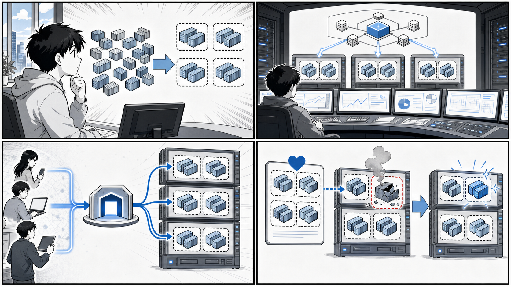
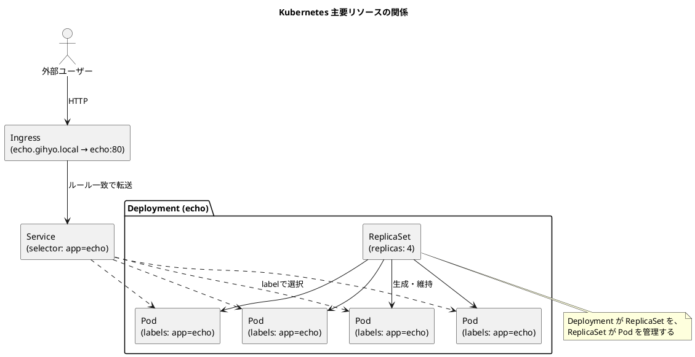

# 第 5 章 Kubernetes 入門



*Pod、Node、Service、制御プレーン、宣言的な望ましい状態が Kubernetes の基本になります。*

## はじめに

前章まででは、Docker による単一ホスト上のコンテナ実行と、Docker Compose や Swarm による複数コンテナの管理を学びました。しかし実運用のシステムでは、複数のサーバー（ホスト）にまたがってコンテナを配置し、障害が起きても自動で復旧させ、トラフィックの増減に応じてコンテナ数を増減させる、といった「オーケストレーション」が求められます。

この章では、コンテナオーケストレーションのデファクトスタンダードである **Kubernetes** を学びます。Kubernetes は Google が社内で培ったコンテナ運用のノウハウをもとに開発され、現在は CNCF（Cloud Native Computing Foundation）が中立的に運営する OSS です。「k8s（ケーエイツ）」と省略表記されることもあります。

本章のゴールは、Kubernetes を構成する基本的なリソース（Pod、ReplicaSet、Deployment、Service、Ingress）の役割と関係を理解し、実際に YAML マニフェストを書いて `kubectl` で適用できるようになることです。説明には、書籍『Docker/Kubernetes 実践コンテナ開発入門（第 2 版）』のサンプルリポジトリ `gihyo-docker-kuberbetes`（ディレクトリ `ch05/`）と、応用例として `echo` アプリの Kustomize 定義（`apps/echo/k8s/kustomize/`）を引用します。

学ぶ順序は次のとおりです。

1. Kubernetes とは何か、なぜ必要か（5.1）
2. ローカル環境で Kubernetes を動かす準備（5.2）
3. Kubernetes の基本概念とクラスタ構成（5.3〜5.5）
4. アプリケーションを動かすリソース（5.6 Pod 〜 5.8 Deployment）
5. ネットワークを担うリソース（5.9 Service、5.10 Ingress）

それぞれのリソースは独立した部品ではなく、上位のリソースが下位のリソースを生成・管理するという階層構造になっています。この「関係」を意識しながら読み進めてください。

---

## 5.1 Kubernetes とは

Kubernetes は、コンテナ化されたアプリケーションのデプロイ、スケーリング、運用を自動化するためのオーケストレーションシステムです。「オーケストレーション」とは、指揮者（オーケストレーター）が多数の奏者（コンテナ）をまとめて 1 つの楽曲（システム）を演奏させるイメージから来ています。

Docker 単体や Docker Compose では、基本的に 1 台のホスト上でコンテナを動かします。しかし、本番システムでは次のような要求が生じます。

- 複数のホスト（サーバー）にコンテナを分散して配置したい
- あるコンテナが落ちても、自動的に再起動・再配置してほしい
- 負荷に応じてコンテナの数を増やしたり減らしたりしたい（スケーリング）
- 新しいバージョンを無停止でリリースしたい（ローリングアップデート）
- コンテナ群への通信を、安定したエンドポイントに集約したい（サービスディスカバリ・ロードバランシング）

Kubernetes は、これらをまとめて引き受けてくれます。最大の特徴は **宣言的（declarative）** な運用モデルです。利用者は「最終的にこうあってほしい」という望ましい状態（desired state）を YAML マニフェストで宣言します。すると Kubernetes は現在の状態を絶えず監視し、宣言された状態に一致するよう自動的に調整し続けます。この「あるべき状態へ収束させ続ける」仕組みを **リコンサイル（reconciliation）ループ** と呼びます。

たとえば「echo というアプリを 3 つ動かす」と宣言しておけば、そのうち 1 つが障害で停止しても、Kubernetes が不足を検知して新しいコンテナを起動し、常に 3 つの状態を保とうとします。命令的（imperative）に「コンテナを起動せよ」「再起動せよ」と都度指示するのではなく、ゴールだけを示す点が宣言的モデルの本質です。

---

## 5.2 ローカル環境で Kubernetes を実行する

Kubernetes を学ぶには、手元で動かせる環境があると便利です。本番のような複数ノードのクラスタを用意しなくても、ローカル PC 上に単一ノードの Kubernetes クラスタを構築できるツールがいくつかあります。

代表的な選択肢は次のとおりです。

- **Docker Desktop**：設定画面で「Enable Kubernetes」にチェックを入れるだけで、ローカルに単一ノードの Kubernetes クラスタが起動します。Docker をすでに使っている場合に最も手軽です。
- **Rancher Desktop**：オープンソースのデスクトップアプリで、Kubernetes（k3s ベース）とコンテナランタイムを同梱しています。ライセンス上の制約を避けたい場合の選択肢になります。
- **kind（Kubernetes IN Docker）**：Docker コンテナ自体を Kubernetes のノードとして使う軽量ツールです。CI 環境や、複数ノード構成を手軽に試したいときに向いています。

これらのインストール手順や OS ごとの細かな設定は環境差が大きいため、本書では **付録 A** に詳細を委ねます。ここでは「いずれかのローカル Kubernetes が起動済みで、`kubectl` がそのクラスタに接続できる状態」になっていることを前提に進めます。

### kubectl の基本操作

`kubectl`（キューブコントロール、または「キューブシーティーエル」）は、Kubernetes クラスタを操作するためのコマンドラインツールです。本章で繰り返し使う基本操作を先に押さえておきましょう。

まず、接続先のクラスタが正しいか確認します。

```bash
# 現在の接続先（コンテキスト）を確認する
kubectl config current-context

# クラスタを構成するノードの一覧を表示する
kubectl get nodes
```

リソースの作成・取得・確認・削除は、次の 5 つを覚えておけば本章の操作はほぼ網羅できます。

```bash
# マニフェスト（YAML）を適用してリソースを作成・更新する
kubectl apply -f simple-pod.yaml

# リソースの一覧を取得する（pod / replicaset / deployment / service / ingress など）
kubectl get pod

# リソースの詳細（イベントや状態の遷移を含む）を確認する
kubectl describe pod simple-echo

# コンテナのログを表示する（複数コンテナの Pod では -c でコンテナ名を指定）
kubectl logs simple-echo -c echo

# マニフェストで作成したリソースを削除する
kubectl delete -f simple-pod.yaml
```

`apply` は宣言的な操作で、同じマニフェストを何度適用しても結果が一定になる（冪等）点が重要です。マニフェストを書き換えて再度 `apply` すれば、差分だけが反映されます。トラブル時はまず `kubectl describe`（リソースに紐づくイベントが見られる）と `kubectl logs`（アプリのログが見られる）を確認するのが定石です。

---

## 5.3 Kubernetes の概念

Kubernetes には多くのリソース（オブジェクト）が登場しますが、本章で扱う中核は次の 5 つです。これらは互いに関係し合っています。

| リソース | 役割 |
| :--- | :--- |
| Pod | コンテナの最小デプロイ単位。1 つ以上のコンテナをまとめる |
| ReplicaSet | 指定した数の Pod を維持する（レプリカ管理） |
| Deployment | ReplicaSet を管理し、ローリングアップデートやロールバックを担う |
| Service | Pod 群への安定したアクセス先（仮想 IP・名前）を提供する |
| Ingress | クラスタ外部からの HTTP(S) アクセスを Service に振り分ける |

これらの関係を図にすると次のようになります。上位のリソースが下位のリソースを生成・管理し、ラベルセレクタによって紐づけられています。本章を通じて何度も立ち戻る、最も重要な図です。



この章ではこの図を下から上へ（Pod → ReplicaSet → Deployment → Service → Ingress の順に）組み立てていきます。

---

## 5.4 Kubernetes クラスタと Node

Kubernetes の実行環境全体を **クラスタ（Cluster）** と呼びます。クラスタは、大きく分けて 2 種類のマシン（Node）から構成されます。

- **コントロールプレーン（Control Plane）**：クラスタ全体を管理する頭脳です。API サーバー（`kube-apiserver`、`kubectl` の接続先）、状態を保存するデータストア（`etcd`）、リソースを監視し調整するコントローラ（`kube-controller-manager`）、Pod をどの Node に配置するか決めるスケジューラ（`kube-scheduler`）などで構成されます。
- **ワーカー Node（Node）**：実際にコンテナ（Pod）が動くマシンです。各 Node では、コントロールプレーンと通信してコンテナを起動・監視する `kubelet` と、ネットワークを担う `kube-proxy` が動作しています。

利用者は `kubectl` を通じてコントロールプレーンの API サーバーに「望ましい状態」を伝えます。すると、コントローラとスケジューラが協調して、適切な Node 上に Pod を配置します。どの Node に配置されるかは Kubernetes が自動的に判断するため、利用者が個々のサーバーを意識する必要はありません。

ローカル環境（Docker Desktop など）では、コントロールプレーンとワーカー Node が同じ 1 台に同居した単一ノード構成になります。`kubectl get nodes` を実行すると、その 1 つの Node が表示されます。

```bash
# Node の一覧を確認する（ローカル環境では 1 つ表示される例）
kubectl get nodes
```

---

## 5.5 Namespace

**Namespace（名前空間）** は、1 つのクラスタの中を論理的に分割する仕組みです。同じクラスタを複数のチームや用途（開発・検証など）で共有する場合に、リソースをグループ分けして名前の衝突を避けたり、アクセス権限やリソース制限を分けたりできます。

クラスタには最初からいくつかの Namespace が用意されています。

```bash
# Namespace の一覧を表示する
kubectl get namespace
```

代表的なものは次のとおりです。

- `default`：明示的に Namespace を指定しなかったときに使われる既定の名前空間。本章のサンプルもここに作成されます。
- `kube-system`：Kubernetes 自身のコンポーネント（ダッシュボードや DNS など）が動く名前空間。
- `kube-public`：すべてのユーザーが読み取れる名前空間。

`kubectl` のコマンドに `--namespace`（短縮形 `-n`）を付けると、対象の Namespace を切り替えられます。たとえば、`ch05/install-dashboard.sh` では Kubernetes Dashboard を導入したうえで、`kube-system` Namespace の Pod を確認しています（出典：`gihyo-docker-kuberbetes/ch05/install-dashboard.sh`）。

```bash
# kube-system 名前空間の Pod を、ラベルで絞り込んで確認する
kubectl get pod --namespace=kube-system -l k8s-app=kubernetes-dashboard
```

本章のサンプルでは Namespace を明示しないため、すべて `default` に作成されます。`kubectl get pod` のように `-n` を省略した場合は `default` が対象になる、と覚えておけば十分です。

---

## 5.6 Pod

**Pod（ポッド）** は、Kubernetes でアプリケーションを動かす最小のデプロイ単位です。1 つの Pod は 1 つ以上のコンテナをまとめたもので、同じ Pod 内のコンテナは同じネットワーク（同じ IP アドレス）とストレージを共有します。そのため、Pod 内のコンテナどうしは `localhost` で通信できます。

「なぜコンテナではなく Pod が単位なのか」というと、密接に連携する複数のコンテナ（たとえば、リバースプロキシとアプリ本体）を 1 セットとして扱いたいケースがあるからです。本章のサンプルは、まさにその構成です。

次のマニフェストは、`nginx`（リバースプロキシ）と `echo`（アプリ本体）の 2 つのコンテナを 1 つの Pod にまとめたものです（出典：`gihyo-docker-kuberbetes/ch05/simple-pod.yaml`）。

```yaml
apiVersion: v1
kind: Pod
metadata:
  name: simple-echo
spec:
  containers:
  - name: nginx
    image: gihyodocker/nginx:latest
    env:
    - name: BACKEND_HOST
      value: localhost:8080
    ports:
    - containerPort: 80
  - name: echo
    image: gihyodocker/echo:latest
    ports:
    - containerPort: 8080
```

マニフェストの構造を読み解きましょう。

- `apiVersion` / `kind`：このリソースの種別を表します。Pod は `v1`（コア API グループ）の `Pod` です。
- `metadata.name`：リソースの名前です。ここでは `simple-echo`。
- `spec.containers`：この Pod が持つコンテナの定義リストです。
- `nginx` コンテナは環境変数 `BACKEND_HOST` に `localhost:8080` を指定しています。同じ Pod 内の `echo` コンテナがポート 8080 で待ち受けているため、`localhost` 経由でアクセスできるわけです。これが「Pod 内のコンテナはネットワークを共有する」ことの具体例です。

このマニフェストを適用し、状態を確認してみます。

```bash
# Pod を作成する
kubectl apply -f simple-pod.yaml

# Pod の状態を確認する（READY 列が 2/2 になれば 2 コンテナとも起動済み）
kubectl get pod

# 詳細やイベントを確認する
kubectl describe pod simple-echo
```

`kubectl get pod` の出力例（値は環境により異なります）は次のようなイメージです。

```text
NAME          READY   STATUS    RESTARTS   AGE
simple-echo   2/2     Running   0          30s
```

ただし、Pod を単体で作成する運用は実務ではほとんど行いません。Pod は障害で停止しても自動では復旧しないからです。Pod の数を維持し、自動復旧させるために登場するのが、次の ReplicaSet です。

---

## 5.7 ReplicaSet

**ReplicaSet（レプリカセット）** は、指定した数の同一 Pod（レプリカ）が常に動いている状態を維持するリソースです。Pod が落ちれば新しい Pod を起動し、多すぎれば余分な Pod を停止して、宣言した数（`replicas`）に収束させ続けます。

次のマニフェストは、5.6 の Pod と同じ 2 コンテナ構成を、3 つのレプリカとして維持する ReplicaSet です（出典：`gihyo-docker-kuberbetes/ch05/simple-replicaset.yaml`）。

```yaml
apiVersion: apps/v1
kind: ReplicaSet
metadata:
  name: echo
  labels:
    app: echo
spec:
  replicas: 3
  selector:
    matchLabels:
      app: echo
  template:
    metadata:
      labels:
        app: echo
    spec:
      containers:
      - name: nginx
        image: gihyodocker/nginx:latest
        env:
        - name: BACKEND_HOST
          value: localhost:8080
        ports:
        - containerPort: 80
      - name: echo
        image: gihyodocker/echo:latest
        ports:
        - containerPort: 8080
```

Pod のマニフェストとの差分が、ReplicaSet を理解する鍵です。

- `kind` が `Pod` から `ReplicaSet` に変わり、`apiVersion` も `apps/v1` になっています。
- `spec.replicas: 3`：維持したい Pod の数を宣言します。
- `spec.template`：生成する Pod の「ひな型」です。よく見ると、5.6 の Pod の `spec.containers` がそのままここに入れ子になっています。ReplicaSet はこのテンプレートをもとに Pod を量産します。
- `spec.selector.matchLabels` と `spec.template.metadata.labels`：ここが最重要です。ReplicaSet は「`app: echo` というラベルを持つ Pod」を自分の管理対象として認識します（`selector`）。一方、生成する Pod には同じ `app: echo` というラベルを付けます（`template` の `labels`）。この **ラベルとセレクタが一致** することで、ReplicaSet は自分が作った Pod を管理できるのです。

```bash
# ReplicaSet を作成する
kubectl apply -f simple-replicaset.yaml

# ReplicaSet と、それが生成した Pod を確認する
kubectl get replicaset
kubectl get pod
```

ここで、3 つの Pod のうち 1 つを手動で削除してみると、ReplicaSet がすぐに不足を検知して新しい Pod を起動し、再び 3 つに戻すことが確認できます。これが宣言的モデルとリコンサイルループの威力です。

```bash
# Pod を 1 つ削除しても、ReplicaSet が自動で補充して 3 つに戻す
kubectl delete pod <削除したい Pod 名>
kubectl get pod
```

### ラベルによる管理対象の使い分け

ラベルは単なる名札ではなく、リソースを束ねる「セレクタの条件」として機能します。`ch05/simple-replicaset-with-label.yaml` は、`app: echo` に加えて `release` ラベル（`spring` / `summer`）を使い、同じアプリの中でリリース系統を分けて管理する例です（出典：`gihyo-docker-kuberbetes/ch05/simple-replicaset-with-label.yaml`）。

```yaml
apiVersion: apps/v1
kind: ReplicaSet
metadata:
  name: echo-spring
  labels:
    app: echo
    release: spring
spec:
  replicas: 1
  selector:
    matchLabels:
      app: echo
      release: spring
  template:
    metadata:
      labels:
        app: echo
        release: spring
    spec:
      containers:
      - name: nginx
        image: gihyodocker/nginx:latest
        env:
        - name: BACKEND_HOST
          value: localhost:8080
        ports:
        - containerPort: 80
      - name: echo
        image: gihyodocker/echo:latest
        ports:
        - containerPort: 8080
```

このファイルには `echo-spring`（replicas: 1）と `echo-summer`（replicas: 2）の 2 つの ReplicaSet が `---` で区切って定義されています。`echo-spring` のセレクタは `app: echo` かつ `release: spring` の両方を満たす Pod だけを管理対象にするため、`echo-summer` の Pod とは混ざりません。ラベルの組み合わせで管理対象を精密に絞り込める、という点を押さえておきましょう。

ただし、ReplicaSet を直接運用することも実務では稀です。アプリのバージョンアップ（イメージの差し替え）を安全に行うには、さらに上位の Deployment を使います。

---

## 5.8 Deployment

**Deployment（デプロイメント）** は、ReplicaSet を管理する上位リソースです。Deployment を使うと、アプリケーションの **ローリングアップデート**（無停止での段階的なバージョン更新）と **ロールバック**（問題があったときに前のバージョンへ戻す操作）が可能になります。実務でアプリを動かす際は、この Deployment が事実上の標準です。

次のマニフェストは、5.7 の ReplicaSet とほぼ同じ内容を Deployment として定義し、レプリカ数を 4 にしたものです（出典：`gihyo-docker-kuberbetes/ch05/simple-deployment.yaml`）。

```yaml
apiVersion: apps/v1
kind: Deployment
metadata:
  name: echo
  labels:
    app: echo
spec:
  replicas: 4
  selector:
    matchLabels:
      app: echo
  template:
    metadata:
      labels:
        app: echo
    spec:
      containers:
      - name: nginx
        image: gihyodocker/nginx:latest
        env:
        - name: BACKEND_HOST
          value: localhost:8080
        ports:
        - containerPort: 80
      - name: echo
        image: gihyodocker/echo:latest
        ports:
        - containerPort: 8080
```

ReplicaSet のマニフェストとの差分は、ほぼ `kind` が `Deployment` になっただけです。`spec.replicas`・`spec.selector`・`spec.template` の構造はそのまま引き継がれています。これは偶然ではなく、**Deployment が内部で ReplicaSet を生成し、その ReplicaSet が Pod を生成する** という三段の管理構造になっているためです。

```bash
# Deployment を作成する
kubectl apply -f simple-deployment.yaml

# Deployment → ReplicaSet → Pod が連鎖的に生成されることを確認する
kubectl get deployment
kubectl get replicaset
kubectl get pod
```

Deployment の真価は、テンプレート（とくにコンテナイメージのタグ）を書き換えて再度 `kubectl apply` したときに発揮されます。Deployment は新しいテンプレートに対応する **新しい ReplicaSet** を作り、新 ReplicaSet の Pod を少しずつ増やしながら旧 ReplicaSet の Pod を減らしていきます。これにより、サービスを止めずにバージョンを入れ替えられます。問題が起きた場合は、`kubectl rollout undo` で前の ReplicaSet に戻せます。

```bash
# ロールアウト（更新）の進行状況を確認する
kubectl rollout status deployment echo

# 直前のバージョンに戻す（ロールバック）
kubectl rollout undo deployment echo
```

「Pod を直接作らず、ReplicaSet も直接作らず、Deployment を宣言する」――これが Kubernetes でアプリを動かす際の基本姿勢です。

---

## 5.9 Service

ここまでで、Deployment によって複数の Pod を安定して動かせるようになりました。しかし、Pod には別の課題があります。Pod は障害復旧やスケーリングのたびに作り直され、その都度 IP アドレスが変わります。クライアントが個々の Pod の IP を直接指定していては、通信先が安定しません。

この問題を解決するのが **Service（サービス）** です。Service は、ラベルセレクタで選んだ Pod 群に対して、**安定した仮想 IP（ClusterIP）と DNS 名** を提供します。クライアントは Service の名前にアクセスするだけでよく、Service が背後の Pod 群へ自動的にロードバランシングしてくれます。Pod が入れ替わっても、Service のアドレスは変わりません。

次のマニフェストは、`app: echo` ラベルを持つ Pod 群への入口となる Service です（出典：`gihyo-docker-kuberbetes/ch05/simple-service.yaml`）。

```yaml
apiVersion: v1
kind: Service
metadata:
  name: echo
spec:
  selector:
    app: echo
  ports:
    - name: http
      port: 80
```

ポイントは `spec.selector` です。`app: echo` というラベルを持つ Pod（=5.8 の Deployment が生成した Pod）を、この Service の振り分け先（エンドポイント）として自動的に登録します。Deployment と Service は親子関係にあるのではなく、**同じラベルを介して間接的に結びついている** 点に注意してください。ReplicaSet がラベルで Pod を「管理」したのに対し、Service はラベルで Pod を「宛先として選択」しているわけです。

```bash
# Service を作成する
kubectl apply -f simple-service.yaml

# Service と、選択された Pod（エンドポイント）を確認する
kubectl get service
kubectl describe service echo
```

クラスタ内の別の Pod からは、`echo`（同一 Namespace なら名前だけ）という DNS 名で、この Service 経由で echo アプリにアクセスできます。

なお、Service にはいくつかタイプがあります。上記のように `type` を省略した場合は `ClusterIP` となり、クラスタ内部からのみアクセスできます。クラスタ外部に公開したい場合は `NodePort` や `LoadBalancer` といったタイプもありますが、HTTP のルーティングをより柔軟に扱う仕組みが次の Ingress です。

---

## 5.10 Ingress

`ClusterIP` の Service はクラスタ内部からしかアクセスできません。クラスタの外から、たとえばブラウザで HTTP アクセスさせたい場合に使うのが **Ingress（イングレス）** です。Ingress は、ホスト名やパスに応じて外部からのリクエストを適切な Service へ振り分ける、L7（HTTP/HTTPS）レベルのルーティングルールを定義します。

### 5.10.1 Ingress コントローラーと IngressClass

ここで重要なのは、**Ingress リソースを作っただけでは何も起きない** という点です。Ingress はあくまで「こういうルールでルーティングしてほしい」という宣言であり、そのルールを実際に解釈してリクエストを捌くのは **Ingress コントローラー** という別のコンポーネントです。代表的な実装が **ingress-nginx**（NGINX ベースの Ingress コントローラー）です。

`ch05/ingress-nginx.sh` は、この ingress-nginx をクラスタに導入するスクリプトです（出典：`gihyo-docker-kuberbetes/ch05/ingress-nginx.sh`）。

```bash
kubectl apply -f https://raw.githubusercontent.com/kubernetes/ingress-nginx/nginx-0.16.2/deploy/mandatory.yaml
kubectl apply -f https://raw.githubusercontent.com/kubernetes/ingress-nginx/nginx-0.16.2/deploy/provider/cloud-generic.yaml
```

このように、外部で公開されているマニフェストを `kubectl apply` することで、ingress-nginx コントローラー本体（Deployment や Service など一式）がクラスタにインストールされます。なお、ここで参照しているバージョン（`nginx-0.16.2`）は書籍刊行時点のものです。現在のローカル環境では、より新しいバージョンの ingress-nginx を導入してください。Docker Desktop など環境によっては、導入手順が異なる場合があります。

複数の Ingress コントローラーを併用できるよう、現在の Kubernetes では **IngressClass** という仕組みでコントローラーを指定します。後述の応用例（`apps/echo/k8s/kustomize/ingress.yaml`）では、`spec.ingressClassName: nginx` と書くことで「この Ingress は nginx コントローラーに処理させる」と明示しています。

### 5.10.2 Ingress を通じたアクセス

Ingress コントローラーを導入したら、ルーティングルールを定義する Ingress リソースを作成します。次のマニフェストは、ホスト名 `ch05.gihyo.local` への HTTP アクセスを、5.9 で作成した `echo` Service（ポート 80）へ転送する定義です（出典：`gihyo-docker-kuberbetes/ch05/simple-ingress.yaml`）。

```yaml
apiVersion: extensions/v1beta1
kind: Ingress
metadata:
  name: echo
spec:
  rules:
  - host: ch05.gihyo.local
    http:
      paths:
      - path: /
        backend:
          serviceName: echo
          servicePort: 80
```

`spec.rules` の中で「ホスト `ch05.gihyo.local` に来た、パス `/` のリクエストを、`echo` という Service のポート 80 へ送る」と宣言しています。これにより、外部 → Ingress → Service → Pod という経路でリクエストが届きます。

```bash
# Ingress を作成する
kubectl apply -f simple-ingress.yaml

# Ingress の状態を確認する
kubectl get ingress
```

動作確認は、`ch05.gihyo.local` という名前が解決できるようにしたうえで HTTP アクセスします。ローカルでは `hosts` ファイルにホスト名を登録するか、`curl` の `--resolve` / `-H "Host: ..."` を使う方法が一般的です。

```bash
# Host ヘッダーを指定して Ingress 経由でアクセスする（例）
curl http://localhost -H "Host: ch05.gihyo.local"
```

### 新しい API バージョンと Kustomize での記述

上記の `simple-ingress.yaml` は `apiVersion: extensions/v1beta1` を使っており、これは書籍刊行当時の古い API です。現在の Kubernetes ではこの API は削除されており、Ingress は `networking.k8s.io/v1` で記述します。フィールド構造も少し変わっているため、新しい書き方を `echo` アプリの応用例で確認しておきましょう（出典：`apps/echo/k8s/kustomize/ingress.yaml`）。

```yaml
apiVersion: networking.k8s.io/v1
kind: Ingress
metadata:
  name: echo
  labels:
    app.kubernetes.io/name: echo
spec:
  ingressClassName: nginx
  rules:
  - host: echo.gihyo.local
    http:
      paths:
      - pathType: Prefix
        path: /
        backend:
          service:
            name: echo
            port:
              number: 80
```

旧 API との違いは次のとおりです。

- `spec.ingressClassName: nginx` で、5.10.1 で触れた IngressClass を明示しています。
- `paths` の各エントリに `pathType: Prefix`（パスの前方一致）が必須になりました。
- `backend` の指定が `serviceName` / `servicePort` から、`service.name` / `service.port.number` という入れ子の構造に変わりました。

この `echo` の応用例では、Deployment・Service・Ingress を `kustomization.yaml` でまとめて管理しています（出典：`apps/echo/k8s/kustomize/`）。`kubectl apply -k` で Kustomize ディレクトリを指定すると、3 つのマニフェストを一括適用できます。

```bash
# Kustomize ディレクトリを一括適用する
kubectl apply -k apps/echo/k8s/kustomize/
```

この応用例では、ラベルに `app.kubernetes.io/name: echo` という Kubernetes 推奨の命名規約（well-known labels）を採用し、`kustomization.yaml` の `labels` 設定で全リソースへ一括付与しています。本章で学んだ「ラベルとセレクタによる紐づけ」の考え方は、API バージョンが新しくなっても変わらない普遍的な原則です。

---

## まとめ

本章では、Kubernetes の基本概念と中核となる 5 つのリソースを、サンプルマニフェストを通じて学びました。要点を整理します。

- **Kubernetes** は、宣言的な「望ましい状態」を維持し続けるコンテナオーケストレーションシステムである。利用者は YAML マニフェストでゴールを宣言し、Kubernetes がリコンサイルループで現実をそれに収束させる。
- **クラスタ** はコントロールプレーンとワーカー Node から成り、**Namespace** でクラスタ内を論理分割できる。ローカル学習には Docker Desktop / Rancher Desktop / kind が使える（詳細は付録 A）。
- **Pod** はコンテナの最小デプロイ単位で、Pod 内のコンテナはネットワークを共有し `localhost` で通信できる。
- **ReplicaSet** はラベルセレクタで Pod を管理し、指定数のレプリカを維持する。
- **Deployment** は ReplicaSet を管理し、ローリングアップデートとロールバックを実現する。実務ではこれを使うのが基本である。
- **Service** はラベルで選んだ Pod 群に安定したアドレスを与え、ロードバランシングする。
- **Ingress** は外部 HTTP アクセスを Service に振り分ける。実際にルーティングを行うのは **Ingress コントローラー（ingress-nginx）** で、**IngressClass** でどのコントローラーに処理させるかを指定する。

これらをつなぐ一本の糸が **ラベルとセレクタ** です。`Deployment → ReplicaSet → Pod` は管理関係で、`Service → Pod`・`Ingress → Service` は選択・転送関係でしたが、いずれもラベルの一致によって成立していました。`kubectl apply` でマニフェストを宣言し、`kubectl get` / `describe` / `logs` で状態を観察する――この往復が Kubernetes 運用の基本動作です。

次章では、本章で学んだリソースを組み合わせて、実際のアプリケーションを Kubernetes 上に構築・デプロイする実践へ進みます。

---

- 前の章：[第 4 章 複数コンテナ構成でのアプリケーション構築](04-multi-container-application.md)
- 次の章：[第 6 章 Kubernetes のデプロイ・クラスタ構築](06-kubernetes-deploy-cluster.md)
