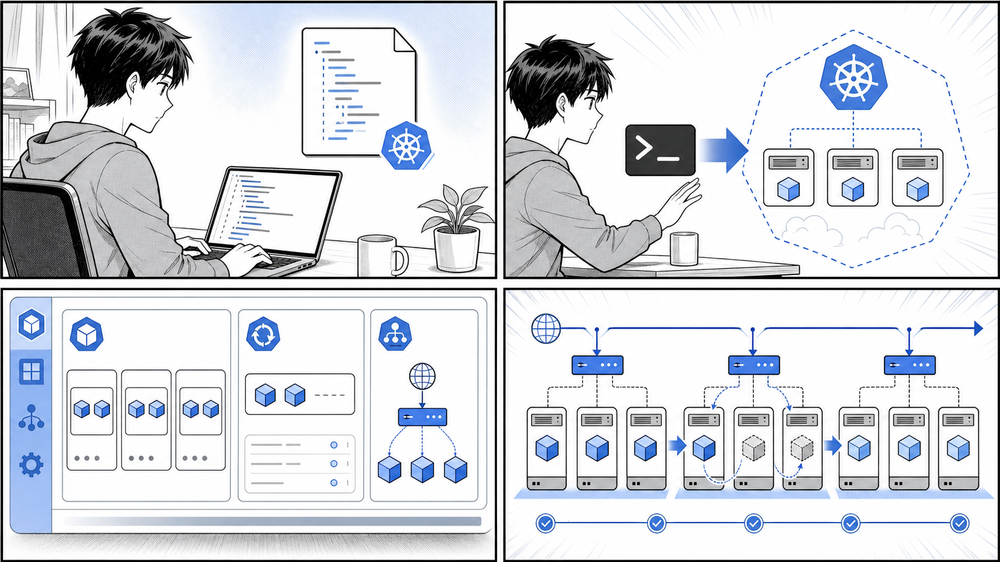
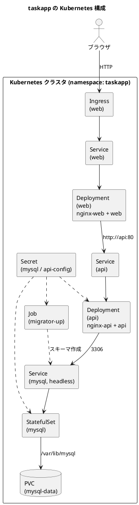
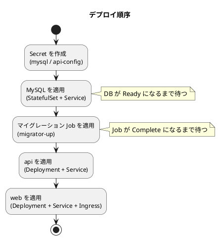

# 第 6 章 Kubernetes のデプロイ・クラスタ構築



*マニフェストを適用し、Deployment と Service を観察しながら、ローリング更新で安全に変更します。*

## はじめに

前章では Kubernetes の基本的なリソース（Pod、ReplicaSet、Deployment、Service など）と、それらをマニフェストで宣言的に管理する考え方を学びました。この章では、これまでに学んだ知識を総動員して、複数のコンポーネントからなる実用的なアプリケーションを Kubernetes 上にデプロイします。

題材として使うのは、第 4 章で Docker Compose を用いて構築した「タスク管理アプリケーション（taskapp）」です。Compose ではローカルマシン上の単一ホストでコンテナ群を動かしていましたが、本章ではそれを Kubernetes クラスタ上のリソースとして再構成します。データベースの永続化、データベースマイグレーションの実行、複数の Web/API コンポーネントの連携、そしてブラウザからのアクセス公開まで、実運用に近い構成を一通り体験します。

本章で扱うマニフェストは、サンプルリポジトリ `taskapp`（`gihyodocker/taskapp` 相当）の `k8s/plain/local/` ディレクトリに収録されているものを引用します。コードを読み解きながら、Compose の世界が Kubernetes の世界へどのように写し取られるのかを確認していきましょう。

### この章で学ぶこと

- Compose の各サービスが Kubernetes のどのリソースに対応するか（6.1）
- マニフェストを `kubectl apply` で順序立ててデプロイする方法（6.2）
- MySQL の永続化、マイグレーション Job の完了待ち、Secret/ConfigMap の扱い（6.2）
- Ingress と ingress-nginx を使ってアプリケーションをブラウザに公開する流れ（6.3）

---

## 6.1 タスクアプリの構成

### Compose 構成のおさらい

第 4 章で構築した taskapp は、以下のコンポーネントから構成されていました。

- **mysql** — タスクデータを保存するデータベース
- **migrator** — データベースのスキーマを構築するマイグレーションツール
- **api** — タスクの CRUD を提供するバックエンド API（前段に nginx をリバースプロキシとして配置）
- **web** — ユーザーが操作する Web フロントエンド（こちらも前段に nginx を配置し、api を呼び出す）

Compose ではこれらを `docker-compose.yml` の `services` として並べ、`depends_on` で起動順を制御していました。Kubernetes では「サービス」という言葉が別の意味（Service リソース）を持つため、混乱しないよう注意が必要です。Compose の 1 サービスは、Kubernetes では「ワークロードリソース（Deployment や StatefulSet、Job）」と、それにアクセスするための「Service リソース」の組み合わせとして表現されます。

### Compose から Kubernetes リソースへの対応

それぞれのコンポーネントは、その性質に応じて最適な Kubernetes リソースに対応づけられます。

| Compose のサービス | 性質 | Kubernetes のリソース |
| :--- | :--- | :--- |
| mysql | 状態を持つ（データを永続化する） | StatefulSet ＋ Service（ヘッドレス） |
| migrator | 一度だけ実行して完了する | Job |
| api | 状態を持たない（複製可能） | Deployment ＋ Service |
| web | 状態を持たない（複製可能） | Deployment ＋ Service |
| 外部公開 | クラスタ外からのアクセス受け口 | Ingress |

ポイントは次の 3 点です。

1. **状態の有無でワークロードを使い分ける** — MySQL のようにデータを保持し続けるコンポーネントは StatefulSet を、api/web のようにいつでも作り直せるコンポーネントは Deployment を使います。
2. **一度きりの処理は Job にする** — マイグレーションは「実行して成功したら終わり」という処理なので、常駐させる Deployment ではなく、完了を前提とした Job が適切です。
3. **外部公開は Ingress に集約する** — クラスタ内部の通信は Service で完結しますが、ブラウザからアクセスするには HTTP のエントリポイントとなる Ingress が必要です。

### 構成図

taskapp を Kubernetes 上に展開したときの全体像を以下に示します。



ブラウザからのリクエストは Ingress を入口として web に届き、web は内部の `api` Service を経由して api を呼び出し、api は `mysql` Service を経由して MySQL にアクセスします。migrator は最初に一度だけ MySQL のスキーマを構築する役割を担います。Secret は MySQL のパスワードや api の設定ファイルといった機密情報を各コンポーネントへ安全に渡すために使われます。

なお、本章で引用するマニフェストはすべて `taskapp` リポジトリの `k8s/plain/local/` 配下にあります。「plain」は、Kustomize などのツールを使わずに素の YAML として書かれていることを示しています。同じ構成を Kustomize で整理した版が `k8s/kustomize/base/` にあり、こちらは本章の補足として適宜参照します。

---

## 6.2 タスクアプリを Kubernetes にデプロイする

ここからは実際にマニフェストを読みながら、各リソースをクラスタへ適用していきます。出典は `apps/taskapp/k8s/plain/local/` 配下のファイルです。

### デプロイの順序

コンポーネントには依存関係があるため、適用する順序が重要です。Compose では `depends_on` が起動順を面倒見てくれましたが、Kubernetes の `kubectl apply` は基本的に「宣言した状態に近づける」だけで、リソース間の起動順は保証しません。そこで、依存される側から順に適用し、必要に応じて完了を待つ運用を行います。



つまり「DB → マイグレーション Job → api → web」の順です。それぞれを見ていきましょう。

### MySQL のデプロイと永続化

MySQL は `mysql.yaml`（`apps/taskapp/k8s/plain/local/mysql.yaml`）に定義されています。データを失わないよう、StatefulSet と PersistentVolumeClaim（PVC）を組み合わせている点が最大の特徴です。

```yaml
apiVersion: apps/v1
kind: StatefulSet
metadata:
  name: mysql
  labels:
    app: mysql
spec:
  selector:
    matchLabels:
      app: mysql
  serviceName: "mysql"
  replicas: 1
  template:
    metadata:
      labels:
        app: mysql
    spec:
      terminationGracePeriodSeconds: 10
      containers:
        - name: mysql
          image: ghcr.io/gihyodocker/taskapp-mysql:v0.1.0
          env:
            - name: MYSQL_ROOT_PASSWORD_FILE
              value: /var/run/secrets/mysql/root_password
            - name: MYSQL_DATABASE
              value: taskapp
            - name: MYSQL_USER
              value: taskapp_user
            - name: MYSQL_PASSWORD_FILE
              value: /var/run/secrets/mysql/user_password
          ports:
            - containerPort: 3306
              name: mysql
          volumeMounts:
            - name: mysql-data
              mountPath: /var/lib/mysql
            - name: mysql-secret
              mountPath: "/var/run/secrets/mysql"
              readOnly: true
      volumes:
        - name: mysql-secret
          secret:
            secretName: mysql
  volumeClaimTemplates:
  - metadata:
      name: mysql-data
    spec:
      accessModes: [ "ReadWriteOnce" ]
      resources:
        requests:
          storage: 1Gi
```

注目すべき点を整理します。

- **StatefulSet による永続化** — `volumeClaimTemplates` で `mysql-data` という PVC を定義し、`/var/lib/mysql`（MySQL のデータディレクトリ）にマウントしています。StatefulSet は Pod ごとに固有の PVC を払い出すため、Pod が再起動・再スケジュールされても同じボリュームが再アタッチされ、データが保持されます。これが Deployment ではなく StatefulSet を使う理由です。
- **パスワードはファイル経由で渡す** — `MYSQL_ROOT_PASSWORD_FILE` や `MYSQL_PASSWORD_FILE` は、パスワードそのものではなくパスワードが書かれたファイルのパスを指しています。実体は `mysql` という名前の Secret をボリュームとして `/var/run/secrets/mysql` にマウントすることで供給されます。パスワードを環境変数に直書きせず Secret に分離するのは、機密情報を扱う際の基本です。
- **`serviceName: "mysql"`** — StatefulSet は安定したネットワーク ID を提供するためにヘッドレス Service と連携します。これが後述する Service の `clusterIP: None` に対応します。

続いて MySQL 用の Service です（同じ `mysql.yaml` 内）。

```yaml
apiVersion: v1
kind: Service
metadata:
  name: mysql
  labels:
    app: mysql
spec:
  ports:
    - protocol: TCP
      port: 3306
      targetPort: 3306
  selector:
    app: mysql
  clusterIP: None
```

`clusterIP: None` を指定したヘッドレス Service です。通常の Service は仮想 IP を 1 つ割り当ててロードバランスしますが、ヘッドレス Service は DNS が直接 Pod を解決します。StatefulSet と組み合わせる定番の構成で、他のコンポーネントは `mysql` というホスト名（同一 namespace 内なら `mysql:3306`）で MySQL に接続できます。

> 補足：Secret の作成について
> 本章のマニフェストは `secretName: mysql` の Secret が存在することを前提にしています。`k8s/plain/local/` には `mysql-secret.yaml` を読み込む `Tiltfile` が同梱されており、Tilt を使う場合はこの Secret が自動で適用されます。`kubectl` で手動デプロイする場合は、先に `root_password` と `user_password` をキーに持つ Secret を作成しておく必要があります。

MySQL を適用したら、Pod が起動して受け付け可能になるまで待ちます。状態の確認は次のコマンドで行います（出力は環境によって異なるため、ここでは確認の方法だけ示します）。

```bash
# MySQL の StatefulSet と Pod の状態を確認する
kubectl get statefulset mysql -n taskapp
kubectl get pod -l app=mysql -n taskapp

# Pod が Ready になるまで待つ（例）
kubectl wait --for=condition=Ready pod -l app=mysql -n taskapp --timeout=120s

# 払い出された PVC を確認する
kubectl get pvc -n taskapp
```

`kubectl get pod` の出力で対象 Pod の `STATUS` が `Running` かつ `READY` が `1/1` になっていれば、次のステップに進めます。

### マイグレーション Job の実行と完了待ち

データベースが起動したら、スキーマを構築するマイグレーションを実行します。`migrator.yaml`（`apps/taskapp/k8s/plain/local/migrator.yaml`）は、これを Job として定義しています。

```yaml
apiVersion: batch/v1
kind: Job
metadata:
  name: migrator-up
  labels:
    app: migrator
spec:
  template:
    metadata:
      labels:
        app: migrator
    spec:
      containers:
        - name: migrator
          image: ghcr.io/gihyodocker/taskapp-migrator:v0.1.0
          env:
            - name: DB_HOST
              value: mysql
            - name: DB_NAME
              value: taskapp
            - name: DB_PORT
              value: "3306"
            - name: DB_USERNAME
              value: taskapp_user
          command:
            - "bash"
            - "/migrator/migrate.sh"
          args:
            - "$(DB_HOST)"
            - "$(DB_PORT)"
            - "$(DB_NAME)"
            - "$(DB_USERNAME)"
            - "/var/run/secrets/mysql/user_password"
            - "up"
          volumeMounts:
            - name: mysql-secret
              mountPath: "/var/run/secrets/mysql"
              readOnly: true
      volumes:
        - name: mysql-secret
          secret:
            secretName: mysql
      restartPolicy: Never
```

Job ならではのポイントは以下です。

- **`kind: Job`／`restartPolicy: Never`** — Job は「処理を完了させること」が目的のワークロードです。`restartPolicy` を `Never` にすることで、コンテナが終了しても再起動せず、成功したら Job 全体が完了（Complete）扱いになります。
- **接続先は `DB_HOST: mysql`** — 先ほど作成した `mysql` Service の名前をそのまま接続先として指定しています。これにより、IP アドレスを意識せず DNS 名で MySQL にアクセスできます。
- **Secret を再利用** — マイグレーションも MySQL に接続するため、`mysql` Secret をマウントしてユーザーパスワードのファイル（`/var/run/secrets/mysql/user_password`）を `migrate.sh` の引数として渡しています。
- **`args` の最後が `up`** — マイグレーションを「適用方向（up）」で実行することを指定しています。

Job を適用したら、完了するまで待ちます。

```bash
# マイグレーション Job を適用する
kubectl apply -f migrator.yaml -n taskapp

# Job が完了するまで待つ
kubectl wait --for=condition=complete job/migrator-up -n taskapp --timeout=120s

# Job と Pod の状態、ログを確認する
kubectl get job migrator-up -n taskapp
kubectl logs job/migrator-up -n taskapp
```

`kubectl get job` で `COMPLETIONS` が `1/1` になっていればマイグレーションは成功です。失敗している場合は `kubectl logs` で原因を確認します。よくある失敗は、MySQL がまだ接続を受け付ける前に Job が走ってしまうケースです。その場合は MySQL の Ready を確認してから Job を再適用してください。

> 補足：Kustomize 版との違い
> `k8s/kustomize/base/migrator/job.yaml` では、Job がマウントする Secret 名が `mysql` ではなく `migrator` という別名になっています（`secretName: migrator`）。plain 版は MySQL と同じ `mysql` Secret を共有し、Kustomize 版はコンポーネントごとに Secret を分けるという設計の違いです。どちらでも動作しますが、責務を分離したい場合は後者の考え方が参考になります。

### api のデプロイ

スキーマが用意できたら、バックエンド API をデプロイします。`api.yaml`（`apps/taskapp/k8s/plain/local/api.yaml`）の Deployment 部分は次のとおりです。

```yaml
apiVersion: apps/v1
kind: Deployment
metadata:
  name: api
  labels:
    app: api
spec:
  replicas: 1
  selector:
    matchLabels:
      app: api
  template:
    metadata:
      labels:
        app: api
    spec:
      containers:
        - name: nginx-api
          image: ghcr.io/gihyodocker/taskapp-nginx-api:v0.1.0
          env:
            - name: NGINX_PORT
              value: "80"
            - name: SERVER_NAME
              value: "nginx-api"
            - name: BACKEND_HOST
              value: "localhost:8180"
            - name: BACKEND_MAX_FAILS
              value: "3"
            - name: BACKEND_FAIL_TIMEOUT
              value: "10s"
        - name: api
          image: ghcr.io/gihyodocker/taskapp-api:v0.1.0
          ports:
            - containerPort: 8180
          args:
            - "server"
            - "--config-file=/run/secrets/api/api-config.yaml"
          volumeMounts:
            - name: api-config
              mountPath: "/var/run/secrets/api"
              readOnly: true
      volumes:
        - name: api-config
          secret:
            secretName: api-config
            items:
              - key: api-config.yaml
                path: api-config.yaml
```

ここでのポイントです。

- **1 つの Pod に 2 つのコンテナ** — `nginx-api` と `api` という 2 つのコンテナが同じ Pod に同居しています。これはサイドカーパターンの一種で、nginx をリバースプロキシとして前段に置き、その背後で API 本体（`8180` ポート）を動かす構成です。同一 Pod 内のコンテナは `localhost` で通信できるため、nginx は `BACKEND_HOST: localhost:8180` で API に転送します。
- **設定ファイルは Secret から渡す** — API の設定ファイル `api-config.yaml` を `api-config` という Secret として `/var/run/secrets/api` にマウントし、`--config-file` で参照しています。設定値の中に DB 接続情報などの機密が含まれるため、ConfigMap ではなく Secret を使っています。設定ファイルの内容が機密でなければ ConfigMap でも同様の渡し方が可能です。

Service 部分は次のとおりで、`api` という名前で 80 番ポートを公開します。

```yaml
apiVersion: v1
kind: Service
metadata:
  name: api
  labels:
    app: api
spec:
  ports:
    - protocol: TCP
      port: 80
      targetPort: 80
  selector:
    app: api
```

この Service があることで、web からは `http://api:80` という名前で API にアクセスできるようになります。

### web のデプロイ

最後にフロントエンドの web をデプロイします。`web.yaml`（`apps/taskapp/k8s/plain/local/web.yaml`）の Deployment 部分は次のとおりです。

```yaml
apiVersion: apps/v1
kind: Deployment
metadata:
  name: web
  labels:
    app: web
spec:
  replicas: 1
  selector:
    matchLabels:
      app: web
  template:
    metadata:
      labels:
        app: web
    spec:
      initContainers:
        - name: init
          image: ghcr.io/gihyodocker/taskapp-web:v0.1.0
          command:
            - "sh"
            - "-c"
            - "cp -r /go/src/github.com/gihyodocker/taskapp/assets/* /var/www/assets"
          volumeMounts:
            - name: assets-volume
              mountPath: "/var/www/assets"
      containers:
        - name: nginx-web
          image: ghcr.io/gihyodocker/taskapp-nginx-web:v0.1.0
          env:
            - name: NGINX_PORT
              value: "80"
            - name: SERVER_NAME
              value: "localhost"
            - name: ASSETS_DIR
              value: "/var/www/assets"
            - name: BACKEND_HOST
              value: "localhost:8280"
            - name: BACKEND_MAX_FAILS
              value: "3"
            - name: BACKEND_FAIL_TIMEOUT
              value: "10s"
          volumeMounts:
            - name: assets-volume
              mountPath: "/var/www/assets"
              readOnly: true
        - name: web
          image: ghcr.io/gihyodocker/taskapp-web:v0.1.0
          ports:
            - containerPort: 8280
          args:
            - "server"
            - "--api-address=http://api:80"
      volumes:
        - name: assets-volume
          emptyDir: {}
```

web の特徴は次の点です。

- **initContainers で静的ファイルを準備** — `init` という initContainer が、web イメージに含まれる静的アセット（CSS や JS など）を `assets-volume`（`emptyDir`）へコピーします。initContainer は本体コンテナより先に必ず実行され、完了してから `nginx-web` と `web` が起動します。これにより、nginx が静的ファイルを配信できる状態を整えてから本体が立ち上がります。
- **nginx + web のサイドカー構成** — api と同様、`nginx-web`（前段プロキシ）と `web`（本体、`8280` ポート）が 1 つの Pod に同居します。
- **api への接続** — web 本体は `--api-address=http://api:80` を引数に取り、先ほど作成した `api` Service を呼び出します。Kubernetes の DNS により、サービス名 `api` がそのまま接続先ホスト名になります。

Service 部分は web を 80 番ポートで公開します。

```yaml
apiVersion: v1
kind: Service
metadata:
  name: web
  labels:
    app: web
spec:
  ports:
    - protocol: TCP
      port: 80
      targetPort: 80
  selector:
    app: web
```

ここまでで「DB → マイグレーション → api → web」の順にすべてのワークロードが揃いました。各コンポーネントの状態をまとめて確認しておきましょう。

```bash
# すべてのリソースの状態を一覧で確認する
kubectl get all -n taskapp

# 個別に Pod の状態を確認する
kubectl get pod -n taskapp

# web Pod のログを確認する（コンテナを指定）
kubectl logs deploy/web -c web -n taskapp
```

すべての Deployment の `READY` が揃い、Job が `Complete` になっていれば、デプロイは完了です。あとはこれを外部に公開するだけです。

> 補足：namespace について
> 本章のコマンド例では `-n taskapp` を付けています。`k8s/plain/local/Tiltfile` を見ると、`default_namespace = 'taskapp'` として `taskapp` namespace に各マニフェストを注入していることがわかります。`kubectl` で手動適用する場合も、あらかじめ `kubectl create namespace taskapp` で namespace を作成し、各コマンドで `-n taskapp` を指定すると整理しやすくなります。

---

## 6.3 Kubernetes のアプリケーションをインターネットに公開する

ここまでで作成した Service は、いずれもクラスタ内部での通信に使うものでした。ブラウザから taskapp にアクセスするには、クラスタ外からの HTTP リクエストを受け取る入口が必要です。その役割を担うのが Ingress です。

### Ingress と ingress-nginx

Ingress は「どのホスト名・パスへのリクエストを、どの Service に振り分けるか」というルーティングルールを宣言するリソースです。ただし Ingress リソースそのものは設定の宣言にすぎず、実際にルーティングを行うのは「Ingress コントローラ」と呼ばれるソフトウェアです。代表的な実装が **ingress-nginx** で、nginx をベースにしたコントローラです。

つまり、Ingress を機能させるには次の 2 つが必要です。

1. クラスタに ingress-nginx（Ingress コントローラ）がインストールされていること
2. ルーティングルールを記述した Ingress リソースが適用されていること

ローカル環境（Docker Desktop、kind、minikube など）では、ingress-nginx を別途インストールしておく必要があります。インストール手順はディストリビューションによって異なるため、利用している環境の公式手順に従ってください。

### web の Ingress

taskapp の Ingress は `web.yaml`（`apps/taskapp/k8s/plain/local/web.yaml`）の末尾に定義されています。

```yaml
apiVersion: networking.k8s.io/v1
kind: Ingress
metadata:
  name: web
  labels:
    app: web
spec:
  ingressClassName: nginx
  rules:
    - host: localhost
      http:
        paths:
          - pathType: Prefix
            path: /
            backend:
              service:
                name: web
                port:
                  number: 80
```

設定の意味は次のとおりです。

- **`ingressClassName: nginx`** — このルーティングを ingress-nginx に処理させることを指定します。クラスタに複数の Ingress コントローラがある場合に、どれを使うかを選ぶための指定です。
- **`host: localhost`** — `localhost` というホスト名宛のリクエストを対象にします。ローカル環境でブラウザから `http://localhost/` を開いたときにこの Ingress が反応します。
- **`path: /` ／ `pathType: Prefix`** — ルート（`/`）以下すべてのパスを対象にします。
- **`backend.service.name: web`** — マッチしたリクエストを `web` Service の 80 番ポートへ転送します。

これにより、ブラウザ → Ingress（ingress-nginx）→ web Service → web Pod（nginx-web）→ web 本体 → api Service → api → MySQL という一連の経路が完成します。

### 公開とアクセス確認

Ingress は web.yaml に含まれているため、web をデプロイした時点で Ingress も適用済みです。状態を確認してブラウザからアクセスしてみましょう。

```bash
# Ingress の状態を確認する
kubectl get ingress -n taskapp

# ingress-nginx コントローラの Pod を確認する（namespace は環境による）
kubectl get pod -n ingress-nginx
```

`kubectl get ingress` の出力で `ADDRESS` が割り当てられていれば、ブラウザから `http://localhost/` にアクセスすることで taskapp の画面が表示されます。ホスト名が `localhost` 以外に設定されている環境では、`/etc/hosts`（Windows では `hosts` ファイル）に該当ホスト名を追記して名前解決させる必要があります。

うまく表示されない場合は、次の順で切り分けます。

1. `kubectl get pod -n taskapp` で web/api/mysql の Pod がすべて Running か
2. `kubectl get ingress -n taskapp` で Ingress に ADDRESS が付いているか
3. ingress-nginx コントローラが起動しているか
4. `kubectl logs` で web・api・nginx 各コンテナのログにエラーが出ていないか

### より小さな公開例：echo-bootstrap

taskapp は複数コンポーネントからなる構成のため少し複雑です。「単一アプリを Ingress で公開する最小構成」を確認したい場合は、`echo-bootstrap` リポジトリが参考になります。これは echo アプリケーション 1 つを namespace・Deployment・Service・Ingress の 4 ファイルでデプロイする、シンプルなテンプレートです。

`apps/cd/echo-bootstrap/ingress.yaml` は次のようになっています。

```yaml
apiVersion: networking.k8s.io/v1
kind: Ingress
metadata:
  name: echo
  labels:
    app.kubernetes.io/name: echo
spec:
  ingressClassName: nginx
  rules:
  - host: echo.gihyo.local
    http:
      paths:
      - pathType: Prefix
        path: /
        backend:
          service:
            name: echo
            port:
              number: 80
```

taskapp の Ingress と構造はまったく同じで、`host` が `echo.gihyo.local`、転送先 Service が `echo` になっているだけです。`apps/cd/echo-bootstrap/kustomization.yaml` では namespace・deployment・service・ingress の 4 つのマニフェストをまとめて管理しており、`kubectl apply -k .`（Kustomize による一括適用）でデプロイできる構成になっています。「Ingress とは結局、ホスト名と Service を結びつけるだけのシンプルなルーティング定義である」ということが、この最小例からよく分かります。

---

## まとめ

本章では、第 4 章で Compose を用いて構築した taskapp を Kubernetes クラスタ上に再構成し、デプロイから外部公開までを一通り体験しました。

- **6.1** では、Compose の各サービスを Kubernetes のリソースに対応づけました。状態を持つ mysql は StatefulSet ＋ ヘッドレス Service、一度きりの migrator は Job、状態を持たない api/web は Deployment ＋ Service、外部公開は Ingress という対応関係を整理しました。
- **6.2** では、`k8s/plain/local/` のマニフェストを読みながら「DB → マイグレーション Job → api → web」の順にデプロイしました。MySQL の永続化（StatefulSet と `volumeClaimTemplates` による PVC）、Job の完了待ち（`kubectl wait --for=condition=complete`）、Secret によるパスワードや設定ファイルの受け渡し、サイドカー（nginx + 本体）や initContainer といった実践的なパターンを確認しました。
- **6.3** では、web の Ingress と ingress-nginx を使って、ブラウザからのリクエストを Service へルーティングする仕組みを学びました。最小構成の例として echo-bootstrap も紹介し、Ingress の本質が「ホスト名と Service の結びつけ」であることを確認しました。

宣言的なマニフェストを順序立てて適用していくことで、複数コンポーネントからなるアプリケーションでも再現性高くデプロイできるのが Kubernetes の強みです。一度マニフェストを整備すれば、同じ手順でいつでも環境を作り直せます。これはまさに「変更を楽に安全にできる」状態を支える基盤と言えるでしょう。

次章では、ここで手書きしてきたマニフェストをより効率的に管理する方法や、Kubernetes 上でのアプリケーション運用に踏み込んでいきます。

---

- 前の章：[第 5 章 Kubernetes 入門](./05-kubernetes-introduction.md)
- 次の章：[第 7 章 Kubernetes の発展的な利用](./07-kubernetes-advanced.md)
