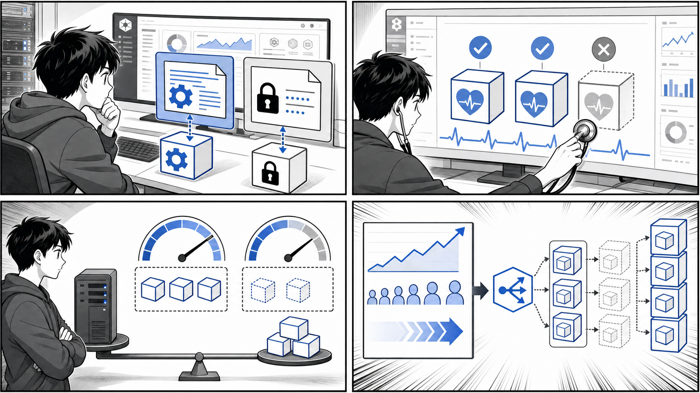

# 第 7 章 Kubernetes の発展的な利用



*設定、Secret、Probe、リソース制御、オートスケールを組み合わせて運用しやすいクラスタにします。*

## はじめに

前章では Kubernetes の基本的なリソース（Pod、ReplicaSet、Deployment、Service、Ingress）を使ってアプリケーションをデプロイする方法を学びました。基本的なデプロイができるようになると、次に直面するのは「本番運用」で求められる、より発展的な要求です。

たとえば、稼働中のサービスを止めずに新しいバージョンへ更新したい、夜間に定期的なバッチ処理を実行したい、クラスタを操作できる権限を利用者ごとに細かく制御したい、といった要求です。これらは、コンテナをただ起動するだけでは解決できません。

この章では、こうした本番運用に欠かせない 3 つのトピックを扱います。

1. Pod のデプロイ戦略（ローリングアップデート、Recreate、ブルーグリーン、カナリア）
2. Kubernetes での定期的なバッチジョブの実行（Job と CronJob）
3. ユーザ管理と Role-Based Access Control（RBAC）

解説では、書籍のサンプルリポジトリ `gihyo-docker-kuberbetes` の `ch07` 配下にある実際のマニフェスト、サンプルアプリケーション `taskapp` の Kubernetes マニフェスト、そしてバッチジョブ用コンテナ `container-kit` のソースを題材として引用します。実コードからの引用なのか、一般論や正しい記述例として示すものなのかは、文中で明確に区別します。

### 目次

1. [Pod のデプロイ戦略](#71-pod-のデプロイ戦略)
2. [Kubernetes での定期的なバッチジョブの実行](#72-kubernetes-での定期的なバッチジョブの実行)
3. [ユーザ管理と Role-Based Access Control(RBAC)](#73-ユーザ管理と-role-based-access-controlrbac)

---

## 7.1 Pod のデプロイ戦略

アプリケーションのバージョンを更新するとき、いかにユーザへの影響を抑えながら新しい Pod へ入れ替えるかが重要になります。Kubernetes の Deployment は、この「入れ替え方」を **デプロイ戦略（strategy）** として宣言的に指定できます。

代表的な戦略は次の 2 つです。

- **RollingUpdate（ローリングアップデート）**: 既存の Pod を少しずつ新しい Pod に置き換える。デフォルトの戦略。
- **Recreate**: 既存の Pod をすべて停止してから、新しい Pod を起動する。

これに加えて、Deployment の機能を組み合わせて実現する **ブルーグリーンデプロイ** や **カナリアリリース** といった戦略があります。順に見ていきましょう。

### 7.1.1 ローリングアップデート（RollingUpdate）

ローリングアップデートは、稼働中の Pod を一度にすべて止めるのではなく、新旧の Pod を少しずつ入れ替えていく戦略です。更新中も常に一定数の Pod が稼働し続けるため、サービスを停止せずにバージョンアップできます。

入れ替えのペースは、次の 2 つのパラメータで制御します。

- **maxSurge**: 更新中に、希望する replica 数を超えて一時的に作成できる Pod の最大数。
- **maxUnavailable**: 更新中に、利用不可になってもよい Pod の最大数。

これらは整数でも割合（例: `25%`）でも指定できます。`maxSurge` を大きくすると更新が速くなる代わりに一時的にリソースを多く消費し、`maxUnavailable` を `0` にすると常に稼働数を維持できる代わりに更新が遅くなる、というトレードオフがあります。

書籍リポジトリの `gihyo-docker-kuberbetes/ch07/ch07_4_1/echo-version-strategy.yaml` には、戦略を明示的に指定した Deployment の実例があります。

```yaml
apiVersion: apps/v1
kind: Deployment
metadata:
  name: echo-version-strategy
  labels:
    app: echo-version
spec:
  replicas: 4
  strategy:
    type: RollingUpdate
    rollingUpdate:
      maxUnavailable: 3
      maxSurge: 4
  selector:
    matchLabels:
      app: echo-version
  template:
    metadata:
      labels:
        app: echo-version
    spec:
      containers:
      - name: echo-version
        image: gihyodocker/echo-version:0.1.0
        ports:
        - containerPort: 8080
```

この例（`ch07_4_1/echo-version-strategy.yaml` からの引用）では `replicas: 4` に対して `maxUnavailable: 3`、`maxSurge: 4` という、かなり積極的な設定になっています。最大で 4 つの新 Pod を追加で立ち上げつつ、最大 3 つの旧 Pod が同時に利用不可になることを許すため、一気に入れ替えが進みます。学習目的で更新の挙動を観察しやすくした設定であり、本番では更新速度と可用性のバランスを見て値を調整します。

なお、`strategy` を省略した場合、Deployment はデフォルトで `RollingUpdate`、かつ `maxSurge: 25%`、`maxUnavailable: 25%` として動作します。`taskapp` の `api/deployment.yaml` や `web/deployment.yaml`（`apps/taskapp/k8s/kustomize/base` 配下）では `strategy` を明示していないため、これらはデフォルトのローリングアップデートで更新されます。

### 7.1.2 ヘルスチェックと安全な入れ替え

ローリングアップデートを安全に行うには、「新しい Pod が本当にリクエストを受けられる状態になったか」を Kubernetes が判断できる必要があります。これを担うのが **Readiness Probe** と **Liveness Probe** です。

- **readinessProbe**: Pod がリクエストを受け付けられる状態かを確認する。失敗している間、その Pod は Service の振り分け対象から外される。
- **livenessProbe**: コンテナが正常に動作し続けているかを確認する。失敗するとコンテナが再起動される。

ローリングアップデートでは、`readinessProbe` が成功して初めて新しい Pod が「準備完了」とみなされ、トラフィックが流れ始めます。これにより、起動途中の Pod へリクエストが届いてエラーになる事態を防げます。

書籍リポジトリの `gihyo-docker-kuberbetes/ch07/ch07_4_2/echo-version-hc.yaml` には、両方の Probe を設定した実例があります。

```yaml
apiVersion: apps/v1
kind: Deployment
metadata:
  name: echo-version-hc
  labels:
    app: echo-version
spec:
  replicas: 1
  selector:
    matchLabels:
      app: echo-version
  template:
    metadata:
      labels:
        app: echo-version
    spec:
      containers:
      - name: echo-version
        image: gihyodocker/echo-version:0.1.0
        imagePullPolicy: Always
        livenessProbe:
          exec:
            command:
            - cat
            - /live.txt
          initialDelaySeconds: 3
          periodSeconds: 5
        readinessProbe:
          httpGet:
            path: /hc
            port: 8080
          timeoutSeconds: 3
          initialDelaySeconds: 15
        ports:
        - containerPort: 8080
```

この例（`ch07_4_2/echo-version-hc.yaml` からの引用）では、`livenessProbe` はコンテナ内の `/live.txt` を `cat` できるかどうかで死活を判定し、`readinessProbe` は `/hc` へ HTTP リクエストを送って準備完了を判定しています。`initialDelaySeconds` は最初のチェックまでの待ち時間、`periodSeconds` はチェックの間隔、`timeoutSeconds` は応答を待つ上限です。アプリケーションの起動時間に合わせてこれらの値を調整することが、安定したローリングアップデートの鍵になります。

### 7.1.3 Recreate

`Recreate` 戦略は、既存の Pod をすべて停止してから新しい Pod を起動します。新旧の Pod が同時に存在しないため、更新中はサービスが一時的に停止します。

一見すると不便ですが、次のような場合に有効です。

- 新旧のバージョンが同時に動くとデータ整合性が壊れる（同じデータベースへ異なるスキーマで書き込むなど）
- 共有リソースを排他的に使う必要がある

`Recreate` を使う場合は、次のように `strategy.type` を指定します（これは正しい記述の **例** であり、特定のファイルからの引用ではありません）。

```yaml
spec:
  strategy:
    type: Recreate
```

ダウンタイムを許容できるかどうかが、`RollingUpdate` と `Recreate` を選ぶ基準になります。

### 7.1.4 ブルーグリーンデプロイ

**ブルーグリーンデプロイ** は、現行バージョン（Blue）と新バージョン（Green）の 2 つの環境を並行して用意し、Service の向き先を一気に切り替えることで瞬時にリリースする戦略です。問題が起きてもすぐに Blue へ戻せるため、ロールバックが容易です。

Kubernetes では、Pod のラベルと Service の `selector` を使ってこれを実現します。書籍リポジトリの `gihyo-docker-kuberbetes/ch07/ch07_4_3/echo-version-blue.yaml` は、`color: blue` というラベルを付けた Blue 側の Deployment です。

```yaml
apiVersion: apps/v1
kind: Deployment
metadata:
  name: echo-version-blue
  labels:
    app: echo-version
    color: blue
spec:
  replicas: 1
  selector:
    matchLabels:
      app: echo-version
      color: blue
  template:
    metadata:
      labels:
        app: echo-version
        color: blue
    spec:
      containers:
      - name: echo-version
        image: gihyodocker/echo-version:0.1.0
        ports:
        - containerPort: 8080
```

そして、同じディレクトリの `ch07_4_3/echo-version-bluegreen-service.yaml` が、`selector` で `color: blue` を指している Service です。

```yaml
apiVersion: v1
kind: Service
metadata:
  name: echo-version
  labels:
    app: echo-version
spec:
  ports:
  - port: 80
    targetPort: 8080
  selector:
    app: echo-version
    color: blue
```

新バージョンは `color: green` のラベルを付けた Green 側 Deployment として別途デプロイしておきます。リリースの瞬間には、この Service の `selector` を `color: blue` から `color: green` に書き換えるだけで、トラフィックの向き先が一斉に切り替わります。問題があれば `color: blue` に戻すだけでロールバックできます。

ブルーグリーンデプロイは切り替えが瞬時でロールバックも速い反面、Blue と Green の両方を同時に動かすためリソースを 2 倍消費する点に注意が必要です。

### 7.1.5 カナリアリリース

**カナリアリリース** は、新バージョンをまず少数の Pod だけ投入し、一部のトラフィックを流して問題がないことを確認してから、徐々に新バージョンの割合を増やしていく戦略です。名前は、炭鉱でガスの危険を察知するために連れて行った「カナリア」に由来します。

Kubernetes で素朴に実現するなら、同じラベル（`selector` にマッチするラベル）を持つ「旧バージョンの Deployment」と「新バージョンの Deployment」を用意し、それぞれの `replicas` 数の比率で振り分けの割合を調整します。たとえば旧 9 個・新 1 個にすれば、おおよそ 10% のトラフィックが新バージョンへ流れます。問題がなければ新を増やし旧を減らしていきます。

これは正しい考え方の **例** であり、より精密なトラフィック制御が必要な場合は、Istio などのサービスメッシュや、Argo Rollouts のような専用ツールを併用するのが一般的です。

### 7.1.6 ロールアウトの確認とロールバック

Deployment の更新状況は `kubectl rollout` で確認・操作できます。これは特定のファイルではなく、Kubernetes の標準コマンドの使い方の **例** です。

```bash
# ローリングアップデートの進行状況を監視する
kubectl rollout status deployment/echo-version-strategy

# 更新履歴を確認する
kubectl rollout history deployment/echo-version-strategy

# 直前のバージョンに戻す（ロールバック）
kubectl rollout undo deployment/echo-version-strategy

# 特定のリビジョンに戻す
kubectl rollout undo deployment/echo-version-strategy --to-revision=2
```

`kubectl rollout status` は更新が完了するまで進捗を表示し続けるため、CI/CD パイプラインでデプロイの成否を待ち受けるのに使えます。更新に問題があったときは `kubectl rollout undo` で素早く前のバージョンへ戻せるため、ローリングアップデートでも安全なリリースが可能になります。

---

## 7.2 Kubernetes での定期的なバッチジョブの実行

これまで扱ってきた Deployment は、Web サーバのように「起動し続ける」処理のためのものでした。しかし運用では、データベースのマイグレーション、レポート生成、データのバックアップなど、**一度実行したら終わる処理** や **定期的に実行する処理** も必要です。

Kubernetes はこのために 2 つのリソースを用意しています。

- **Job**: 1 回（または指定回数）実行され、完了したら終了するバッチ処理。
- **CronJob**: cron 形式のスケジュールに従って、定期的に Job を生成するリソース。

### 7.2.1 題材となるジョブ用コンテナ

バッチジョブの題材として、`container-kit` リポジトリの `containers/time-limit-job` を見てみます。これは「指定した秒数だけ動いて終了する」シンプルなジョブ用コンテナです。

まず実行スクリプト `apps/container-kit/containers/time-limit-job/task.sh` は次のようになっています。

```bash
#!/usr/bin/env bash

if [ -z $EXECUTION_SECONDS ]; then
  echo '"EXECUTION_SECONDS" is not specified.' 1>&2
  exit 1
fi

END_TIME=$((SECONDS+EXECUTION_SECONDS))

while [ $SECONDS -lt $END_TIME ]; do
    echo "Running task..."
    sleep 1
done

echo "Finished this task."
```

このスクリプト（`time-limit-job/task.sh` からの引用）は、環境変数 `EXECUTION_SECONDS` で指定された秒数のあいだ "Running task..." を出力し続け、時間が来たら "Finished this task." を出力して終了します。環境変数が未指定なら `exit 1` でエラー終了します。「一定時間で必ず終わる処理」という、まさに Job 向きの振る舞いです。

これをコンテナ化する `apps/container-kit/containers/time-limit-job/Dockerfile` は次のとおりです。

```dockerfile
FROM ubuntu:23.10

LABEL org.opencontainers.image.source=https://github.com/gihyodocker/container-kit

ENV EXECUTION_SECONDS 5

COPY task.sh /usr/local/bin/

CMD ["sh", "-c", "task.sh"]
```

`Dockerfile`（`time-limit-job/Dockerfile` からの引用）では、デフォルトで `EXECUTION_SECONDS` を `5` に設定し、`task.sh` をコピーして実行しています。このコンテナを Job や CronJob で動かせば、5 秒間動いて終了するバッチが実行できます。

### 7.2.2 Job

Job は、Pod を起動してバッチ処理を実行し、処理が正常終了（コンテナの終了コードが 0）したら完了とみなすリソースです。

`taskapp` には、データベースのマイグレーションを実行する Job の実例があります。`apps/taskapp/k8s/kustomize/base/migrator/job.yaml` です。

```yaml
apiVersion: batch/v1
kind: Job
metadata:
  name: migrator-up
spec:
  template:
    spec:
      containers:
        - name: migrator
          image: ghcr.io/gihyodocker/taskapp-migrator:v0.1.0
          env:
            - name: DB_HOST
              value: mysql
            - name: DB_NAME
              value: taskapp
            - name: DB_PORT
              value: "3306"
            - name: DB_USERNAME
              value: taskapp_user
          command:
            - "bash"
            - "/migrator/migrate.sh"
          args:
            - "$(DB_HOST)"
            - "$(DB_PORT)"
            - "$(DB_NAME)"
            - "$(DB_USERNAME)"
            - "/var/run/secrets/mysql/user_password"
            - "up"
          volumeMounts:
            - name: migrator-secret
              mountPath: "/var/run/secrets/mysql"
              readOnly: true
      volumes:
        - name: migrator-secret
          secret:
            secretName: migrator
      restartPolicy: Never
```

この実例（`apps/taskapp/k8s/kustomize/base/migrator/job.yaml` からの引用）のポイントは次のとおりです。

- `kind: Job`、`apiVersion: batch/v1` で Job を宣言しています。
- `spec.template.spec` に、実行したいコンテナを Pod テンプレートとして記述します。ここでは `migrate.sh` に `up`（マイグレーション適用）を渡して実行しています。
- データベースのパスワードは `Secret`（`migrator`）をボリュームとしてマウントし、ファイル経由で渡しています。設定値をマニフェストに直書きしない、よい実践です。
- `restartPolicy: Never` を指定しています。Job では `restartPolicy` に `Never` か `OnFailure` のどちらかを指定する必要があります（`Always` は指定できません）。`Never` は失敗しても再起動せず、`OnFailure` は失敗時に同じ Pod 内でコンテナを再起動します。

書籍リポジトリにも、より単純な Job の例があります。`gihyo-docker-kuberbetes/ch07/ch07_1_1/simple-job.yaml` は、並列実行を指定した Job の実例です。

```yaml
apiVersion: batch/v1
kind: Job
metadata:
  name: pingpong
  labels:
    app: pingpong
spec:
  parallelism: 3
  template:
    metadata:
      labels:
        app: pingpong
    spec:
      containers:
      - name: pingpong
        image: gihyodocker/alpine:bash
        command: ["/bin/sh"]
        args:
          - "-c"
          - |
            echo [`date`] ping!
            sleep 10
            echo [`date`] pong!
      restartPolicy: Never
```

この例（`ch07_1_1/simple-job.yaml` からの引用）では `parallelism: 3` を指定しており、3 つの Pod を同時に並列実行します。大量のデータを分割して処理するようなバッチで役立つ設定です。

### 7.2.3 CronJob

CronJob は、cron 形式のスケジュールに従って Job を定期的に生成するリソースです。「毎日深夜 2 時にバックアップを取る」「1 時間ごとに集計処理を走らせる」といった用途に使います。

書籍リポジトリの `gihyo-docker-kuberbetes/ch07/ch07_1_2/simple-cronjob.yaml` に、CronJob の実例があります。

```yaml
apiVersion: batch/v1beta1
kind: CronJob
metadata:
  name: pingpong
spec:
  schedule: "*/1 * * * *"
  jobTemplate:
    spec:
      template:
        metadata:
          labels:
            app: pingpong
        spec:
          containers:
          - name: pingpong
            image: gihyodocker/alpine:bash
            command: ["/bin/sh"]
            args:
              - "-c"
              - |
                echo [`date`] ping!
                sleep 10
                echo [`date`] pong!
          restartPolicy: OnFailure
```

この例（`ch07_1_2/simple-cronjob.yaml` からの引用）では、`schedule: "*/1 * * * *"` で「1 分ごと」に実行するよう指定しています。`jobTemplate` の中に、生成される Job の内容（さらにその中の Pod テンプレート）を記述する入れ子構造になっている点に注目してください。

> 補足: このサンプルの `apiVersion: batch/v1beta1` は古いバージョンの記法です。現在の Kubernetes では CronJob は `batch/v1` が正式版（GA）であり、新規に作成する場合は `apiVersion: batch/v1` を使います。

cron 形式の `schedule` は 5 つのフィールドで構成されます。これは cron の一般的な仕様の **例** です。

```bash
# ┌───────────── 分        (0 - 59)
# │ ┌─────────── 時        (0 - 23)
# │ │ ┌───────── 日        (1 - 31)
# │ │ │ ┌─────── 月        (1 - 12)
# │ │ │ │ ┌───── 曜日      (0 - 6、0 が日曜)
# │ │ │ │ │
# * * * * *

"*/1 * * * *"   # 1 分ごと
"0 * * * *"     # 毎時 0 分
"0 2 * * *"     # 毎日 深夜 2 時
"0 0 * * 0"     # 毎週日曜の 0 時
"*/15 9-18 * * 1-5"  # 平日 9〜18 時の 15 分ごと
```

CronJob を運用する際は、次のようなフィールドも併せて検討するとよいでしょう（正しい設定の **例**）。

- `concurrencyPolicy`: 前回の Job がまだ動いているときに次の起動をどう扱うか（`Allow` / `Forbid` / `Replace`）。
- `startingDeadlineSeconds`: 起動が遅れた場合に、何秒までなら遅れて起動してよいか。
- `successfulJobsHistoryLimit` / `failedJobsHistoryLimit`: 完了・失敗した Job をいくつまで履歴として残すか。

前述の `time-limit-job` コンテナ（`container-kit`）を CronJob の `jobTemplate` のコンテナイメージとして指定し、`EXECUTION_SECONDS` を環境変数で渡せば、「定期的に決まった時間だけ動くバッチ」を簡単に構築できます。

---

## 7.3 ユーザ管理と Role-Based Access Control(RBAC)

クラスタを複数人やシステムで共有するようになると、「誰が」「どのリソースに」「何をできるか」を制御する仕組みが必要になります。Kubernetes はこれを **RBAC（Role-Based Access Control、ロールベースアクセス制御）** で実現します。

RBAC の考え方はシンプルです。「権限の集合（Role）」を定義し、それを「主体（ユーザやサービスアカウント）」に「割り当てる（Binding）」ことで、最小権限の原則に沿ったアクセス制御を行います。

### 7.3.1 RBAC の構成要素

RBAC は次の要素で構成されます。

| 要素 | 役割 | スコープ |
| :--- | :--- | :--- |
| Role | 権限（どのリソースに何ができるか）の集合を定義する | 特定の Namespace 内 |
| ClusterRole | Role と同じく権限の集合を定義する | クラスタ全体 |
| RoleBinding | Role を主体に割り当てる | 特定の Namespace 内 |
| ClusterRoleBinding | ClusterRole を主体に割り当てる | クラスタ全体 |
| ServiceAccount | Pod（アプリケーション）に与える ID（主体） | 特定の Namespace 内 |

主体（subject）には、人間の **ユーザ**、グループ、そして Pod が API を操作するための **ServiceAccount** の 3 種類があります。Kubernetes 自体は人間のユーザを内部で管理しません（証明書や外部の認証基盤で表現します）が、ServiceAccount はクラスタ内のリソースとして管理されます。

### 7.3.2 ServiceAccount

ServiceAccount は、Pod 内で動くアプリケーションが Kubernetes API を呼び出すときに使う ID です。書籍リポジトリの `gihyo-docker-kuberbetes/ch07/ch07_2_2/sa.yaml` に実例があります。

```yaml
apiVersion: v1
kind: ServiceAccount
metadata:
  name: gihyo-pod-reader
  namespace: kube-system
```

この実例（`ch07_2_2/sa.yaml` からの引用）は、`kube-system` Namespace に `gihyo-pod-reader` という ServiceAccount を作成します。この時点ではまだ何の権限も持っていません。権限を与えるには、Role / ClusterRole を作り、Binding で結び付ける必要があります。

### 7.3.3 ClusterRole と権限の定義

権限は Role または ClusterRole で定義します。書籍のサンプルでは、Pod を読み取る権限を持つ `pod-reader` という ClusterRole を主体に割り当てています。その ClusterRole の中身は、次のような内容です（クラスタ全体で Pod を読めるようにする正しい記述の **例**。`ch07_2_2` の Binding が参照している `pod-reader` を表したもの）。

```yaml
apiVersion: rbac.authorization.k8s.io/v1
kind: ClusterRole
metadata:
  name: pod-reader
rules:
  - apiGroups: [""]
    resources: ["pods"]
    verbs: ["get", "list", "watch"]
```

`rules` の各項目が「どのリソースに何ができるか」を表します。

- `apiGroups`: 対象とする API グループ。`""`（空文字）はコアグループ（Pod、Service など）を指します。
- `resources`: 対象とするリソースの種類（`pods`、`deployments` など）。
- `verbs`: 許可する操作。`get`（個別取得）、`list`（一覧取得）、`watch`（変更監視）、`create`、`update`、`delete` などがあります。

ここでは `get`、`list`、`watch` だけを許可しており、Pod の参照はできても削除や変更はできません。**最小権限の原則** に沿った設計です。

### 7.3.4 ClusterRoleBinding による権限の割り当て

定義した ClusterRole を主体に割り当てるのが ClusterRoleBinding です。書籍リポジトリの `gihyo-docker-kuberbetes/ch07/ch07_2_2/sa_clusterrole_binding.yaml` に実例があります。

```yaml
kind: ClusterRoleBinding
apiVersion: rbac.authorization.k8s.io/v1
metadata:
  name: pod-reader-binding
subjects:
- kind: ServiceAccount
  name: gihyo-pod-reader
  namespace: kube-system
roleRef:
  kind: ClusterRole
  name: pod-reader
  apiGroup: rbac.authorization.k8s.io
```

この実例（`ch07_2_2/sa_clusterrole_binding.yaml` からの引用）は、次の 2 つを結び付けています。

- `subjects`: 権限を与える相手。ここでは先ほどの ServiceAccount `gihyo-pod-reader`。
- `roleRef`: 与える権限。ここでは ClusterRole `pod-reader`。

この Binding により、`gihyo-pod-reader` という ServiceAccount は、クラスタ全体で Pod を `get` / `list` / `watch` できるようになります。

### 7.3.5 Pod から ServiceAccount を使う

権限を与えた ServiceAccount は、Pod の `spec.serviceAccountName` に指定して使います。書籍リポジトリの `gihyo-docker-kuberbetes/ch07/ch07_2_2/gihyo-pod-reader-pod.yaml` がその実例です。

```yaml
apiVersion: v1
kind: Pod
metadata:
  name: gihyo-pod-reader
  namespace: kube-system
  labels:
    app: gihyo-pod-reader
spec:
  serviceAccountName: gihyo-pod-reader
  containers:
  - name: kubectl
    image: lachlanevenson/k8s-kubectl:v1.10.4
    command:
    - sh
    - -c
    - |
      while true
      do
        echo "check pod..."
        kubectl get pod --all-namespaces
        sleep 30
      done
```

この実例（`ch07_2_2/gihyo-pod-reader-pod.yaml` からの引用）は、`serviceAccountName: gihyo-pod-reader` を指定した Pod の中で `kubectl get pod --all-namespaces` を 30 秒ごとに実行し続けます。`pod-reader` の権限により Pod の一覧取得は成功します。

一方、同じディレクトリの `ch07_2_2/gihyo-deployment-reader-pod.yaml` は、同じ ServiceAccount で `kubectl get deployment` を実行しようとします。しかし `pod-reader` には Deployment を読む権限が含まれていないため、この操作は **権限不足で失敗** します。これは、RBAC が「許可した操作だけを通す」ことを確認するための対比的なサンプルになっています。

### 7.3.6 Role と ClusterRole の使い分け

- **特定の Namespace 内だけで権限を与えたい** → Role + RoleBinding を使う。
- **クラスタ全体、または複数 Namespace にまたがる権限を与えたい** → ClusterRole + ClusterRoleBinding を使う。

Namespace に閉じた権限を与える場合の Role と RoleBinding の正しい記述は次のとおりです（特定ファイルからの引用ではない **例**）。

```yaml
apiVersion: rbac.authorization.k8s.io/v1
kind: Role
metadata:
  namespace: development
  name: configmap-reader
rules:
  - apiGroups: [""]
    resources: ["configmaps"]
    verbs: ["get", "list"]
---
apiVersion: rbac.authorization.k8s.io/v1
kind: RoleBinding
metadata:
  name: configmap-reader-binding
  namespace: development
subjects:
  - kind: ServiceAccount
    name: my-app
    namespace: development
roleRef:
  kind: Role
  name: configmap-reader
  apiGroup: rbac.authorization.k8s.io
```

この例では、`development` Namespace の中だけで ConfigMap を読める権限を、同 Namespace の ServiceAccount `my-app` に与えています。

RBAC を設計するときの基本方針は、**必要最小限の権限だけを与える** ことです。最初から広い権限（たとえば `cluster-admin`）を割り当てると、設定ミスや侵害の影響範囲が一気に広がります。「何が必要か」から逆算して、Role の `verbs` と `resources` を絞り込むことが、安全なクラスタ運用の基本です。

---

## まとめ

この章では、Kubernetes を本番で運用するために欠かせない 3 つの発展的なトピックを学びました。

- **Pod のデプロイ戦略**: Deployment の `strategy` で `RollingUpdate`（`maxSurge` / `maxUnavailable` で入れ替えペースを制御）と `Recreate` を選べること、`readinessProbe` / `livenessProbe` が安全な入れ替えの鍵になること、ラベルと Service の `selector` でブルーグリーンデプロイやカナリアリリースが実現できること、そして `kubectl rollout status` / `undo` で更新の監視とロールバックができることを確認しました。
- **定期的なバッチジョブ**: 一度実行して終わる **Job**（`restartPolicy: Never` / `OnFailure`、`parallelism` による並列実行）と、cron 形式の `schedule` で Job を定期生成する **CronJob** を、`time-limit-job` コンテナや `taskapp` のマイグレーション Job を題材に学びました。
- **RBAC**: Role / ClusterRole で権限を定義し、RoleBinding / ClusterRoleBinding で ServiceAccount やユーザに割り当てる仕組みを、書籍サンプルの `pod-reader` を題材に確認しました。最小権限の原則が安全なクラスタ運用の基本です。

これらの戦略・機能は、いずれも「変更を楽に安全にできて役に立つソフトウェア」を Kubernetes 上で実現するための土台です。サービスを止めずに更新でき、定型作業を自動化でき、権限を適切に制御できることが、運用の安心につながります。

次章では、これらの知識を踏まえて、Kubernetes をさらに実践的に活用する方法へと進みます。

---

- 前の章: [第 6 章 Kubernetes のデプロイ・クラスタ構築](06-kubernetes-deploy-cluster.md)
- 次の章: [第 8 章 Kubernetes アプリケーションのパッケージング](08-kubernetes-packaging.md)
