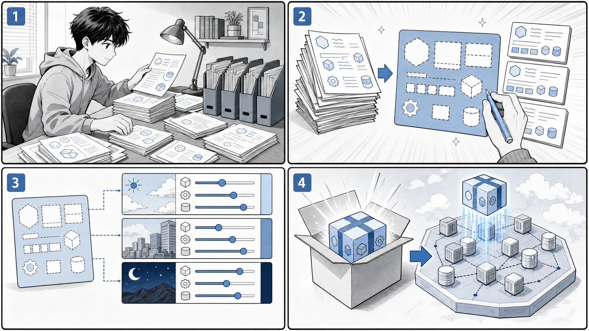

# 第 8 章 Kubernetes アプリケーションのパッケージング



*マニフェストを整理し、テンプレートと環境別の値で再利用できるリリース単位にまとめます。*

## はじめに

前章までで、Pod、Deployment、Service、Ingress、StatefulSet、Job といった Kubernetes のリソースを、素の YAML マニフェストとして記述しデプロイしてきました。小さなアプリケーションであれば、これらのマニフェストを `kubectl apply -f` で適用するだけで十分に運用できます。

しかし、アプリケーションが成長し、開発・ステージング・本番といった複数の環境で運用するようになると、素の YAML だけでは次のような問題に直面します。

- **マニフェストの重複**：環境ごとにマニフェスト一式をコピーすると、ほとんど同じ内容のファイルが何セットも生まれます。共通部分を修正するたびに、すべてのコピーに同じ変更を反映しなければなりません。
- **差分管理の難しさ**：環境間で本当に違うのは「レプリカ数」「イメージタグ」「ホスト名」「Service の種別」といったごく一部です。にもかかわらず、ファイル全体を複製してしまうと、どこが意図的な差分でどこが修正漏れなのかが見分けにくくなります。
- **再利用性の低さ**：同じ構成のアプリケーションを別のプロジェクトで使い回したいとき、素の YAML には「外から値を差し替える」仕組みがないため、結局コピーして書き換える作業を繰り返すことになります。

これらの問題を解決するのが、Kubernetes アプリケーションの **パッケージング** という考え方です。本章では、代表的な 2 つのツールを扱います。

- **Kustomize**：素の YAML を「base（共通の土台）」と「overlay（環境ごとの差分）」に分け、テンプレート言語を使わずに YAML をオーバーレイ（重ね合わせ）で合成します。`kubectl` に同梱されているため、追加インストールなしで使えます。
- **Helm**：マニフェストを Go テンプレートで記述し、`values.yaml` で値を差し替えながら 1 つの「チャート」としてパッケージ化します。バージョン管理されたアプリケーションの配布・インストールに強みがあります。

それでは、まず Kustomize から見ていきましょう。

---

## 8.1 Kustomize

Kustomize は、素の YAML マニフェストを **テンプレート化せずに** カスタマイズするためのツールです。Go テンプレートのような特別な構文を覚える必要はなく、有効な Kubernetes マニフェストをそのまま材料として扱います。中心となるのは `kustomization.yaml` というファイルで、ここに「どのマニフェストを集めるか」「どんな変換を加えるか」を宣言します。

### base 構造 — 共通の土台をまとめる

本書のサンプルアプリケーション taskapp では、`k8s/kustomize/base` ディレクトリにアプリケーション全体の土台となるマニフェストを配置しています（出典: `apps/taskapp/k8s/kustomize/base`）。

ルートの `kustomization.yaml` は、コンポーネントごとのサブディレクトリを `resources` として束ねます。

```yaml
# apps/taskapp/k8s/kustomize/base/kustomization.yaml
apiVersion: kustomize.config.k8s.io/v1beta1
kind: Kustomization

namespace: taskapp

resources:
  - ./mysql
  - ./migrator
  - ./api
  - ./web

commonLabels:
  app.kubernetes.io/name: taskapp
```

ここで使われているフィールドの意味は次のとおりです。

- **`namespace`**：このセットに含まれるすべてのリソースを、指定した名前空間（ここでは `taskapp`）に配置します。マニフェスト 1 枚ごとに `metadata.namespace` を書く必要がありません。
- **`resources`**：合成の対象とするマニフェスト、または別の `kustomization.yaml` を持つディレクトリを列挙します。この例では `mysql`・`migrator`・`api`・`web` という 4 つのコンポーネントを参照しています。
- **`commonLabels`**：列挙したすべてのリソースに共通のラベル（`app.kubernetes.io/name: taskapp`）を付与します。selector やラベルの付け忘れを防げます。

### コンポーネントごとの kustomization

`resources` で参照される各コンポーネントも、それぞれ `kustomization.yaml` を持ちます。たとえば API コンポーネントは次のようになっています。

```yaml
# apps/taskapp/k8s/kustomize/base/api/kustomization.yaml
apiVersion: kustomize.config.k8s.io/v1beta1
kind: Kustomization

secretGenerator:
  - name: api-config
    files:
      - api-config.yaml=./api-config.yaml
    type: Opaque

resources:
- deployment.yaml
- service.yaml

commonLabels:
  app.kubernetes.io/component: api
```

ここでは Deployment と Service という素の YAML を `resources` で束ねつつ、`app.kubernetes.io/component: api` というコンポーネント固有のラベルを追加しています。ルートとコンポーネントの両方で `commonLabels` を使うことで、`app.kubernetes.io/name`（アプリケーション全体）と `app.kubernetes.io/component`（構成要素）が階層的に付与される仕組みです。

さらに注目したいのが **`secretGenerator`** です。これは Secret マニフェストを手書きするのではなく、ファイルの中身から Secret を自動生成する機能です。`files` に指定したファイル（`api-config.yaml`）を読み込み、`api-config` という名前の `Opaque` 型 Secret を作り出します。

データベース系のコンポーネントでも同じ仕組みが使われています。

```yaml
# apps/taskapp/k8s/kustomize/base/mysql/kustomization.yaml
apiVersion: kustomize.config.k8s.io/v1beta1
kind: Kustomization

secretGenerator:
- name: mysql
  files:
    - root_password=./secrets/mysql_root_password
    - user_password=./secrets/mysql_user_password
  type: Opaque

resources:
- service.yaml
- statefulset.yaml

commonLabels:
  app.kubernetes.io/component: mysql
```

`root_password=./secrets/mysql_root_password` のように `キー=ファイルパス` の形で書くと、Secret 内のキー名とファイルを対応づけられます。パスワードのような秘匿情報を YAML に直書きせず、別ファイルとして管理できるのが利点です。

なお `secretGenerator` で生成される Secret には、内容のハッシュ値が名前のサフィックスとして付与されます。中身が変わると Secret 名も変わるため、Secret を参照する Deployment が自動的に再起動され、設定変更が確実に反映されます。

migrator コンポーネントは、データベースのマイグレーションを実行する Job をまとめています。

```yaml
# apps/taskapp/k8s/kustomize/base/migrator/kustomization.yaml
apiVersion: kustomize.config.k8s.io/v1beta1
kind: Kustomization

secretGenerator:
- name: migrator
  files:
    - root_password=./secrets/mysql_root_password
    - user_password=./secrets/mysql_user_password
  type: Opaque

resources:
- job.yaml

commonLabels:
  app.kubernetes.io/component: migrator
```

このように Kustomize では、アプリケーションを「コンポーネント単位の小さな `kustomization.yaml`」に分解し、それらをルートの `kustomization.yaml` が束ねる、という入れ子の構造を作れます。各コンポーネントは独立して理解・修正でき、全体は 1 コマンドで合成できます。

### kubectl kustomize で合成結果を確認する

`kustomization.yaml` がどんなマニフェストに展開されるかは、`kubectl kustomize` で確認できます。このコマンドはクラスタには何も適用せず、合成結果を標準出力に表示するだけなので安全です。

```bash
# base 全体を合成して結果を表示する（クラスタには適用しない）
kubectl kustomize apps/taskapp/k8s/kustomize/base
```

出力には、`namespace: taskapp` が各リソースに設定され、`commonLabels` が反映され、`secretGenerator` から生成された Secret が含まれた、完成形のマニフェストが並びます。適用前にこのコマンドで差分を目視確認することを習慣にすると、意図しない変更を防げます。

### kubectl apply -k でデプロイする

合成結果に問題がなければ、`-k` オプションでそのままクラスタへ適用します。`-k` は「kustomize ディレクトリを対象にする」という意味で、`-f`（単一ファイル）と対になるオプションです。

```bash
# kustomization.yaml を解釈してクラスタに適用する
kubectl apply -k apps/taskapp/k8s/kustomize/base
```

内部的には `kubectl kustomize` で合成した結果を `kubectl apply` に渡すのと同じ動作になります。削除したい場合は `kubectl delete -k` を使います。

### overlay — 環境ごとの差分を重ねる

「はじめに」で述べた重複の問題は、Kustomize の **base / overlay** という考え方で解決します。共通部分を `base` に置き、環境固有の差分だけを `overlay` 側の `kustomization.yaml` に記述します。overlay は `resources`（または `bases`）で base を参照し、その上に変換を重ねます。

GitOps のブートストラップ用に用意された echo-bootstrap は、overlay 的に base を参照して上書きする良い例です（出典: `apps/cd/echo-bootstrap/kustomization.yaml`）。

```yaml
# echo-bootstrap/kustomization.yaml
apiVersion: kustomize.config.k8s.io/v1beta1
kind: Kustomization
namespace: gitops-echo
resources:
- namespace.yaml
- deployment.yaml
- ingress.yaml
- service.yaml
commonLabels:
  app.kubernetes.io/name: echo
```

ここでは `namespace: gitops-echo` を指定することで、同じ deployment.yaml・service.yaml を別の名前空間向けに展開できます。base のマニフェストを一切書き換えずに、overlay の `kustomization.yaml` だけで配置先を切り替えられる点が、複製とは決定的に異なります。

### namePrefix と images — 名前とイメージを変換する

overlay でよく使われる変換に、`namePrefix` と `images` があります。argocd のサンプルにある kustomize-guestbook は、`namePrefix` の最小例です（出典: `apps/cd/argocd-example-apps/kustomize-guestbook`）。

```yaml
# argocd-example-apps/kustomize-guestbook/kustomization.yaml
namePrefix: kustomize-

resources:
- guestbook-ui-deployment.yaml
- guestbook-ui-svc.yaml
apiVersion: kustomize.config.k8s.io/v1beta1
kind: Kustomization
```

`namePrefix: kustomize-` を指定すると、参照したすべてのリソース名の先頭に `kustomize-` が付きます。対象の Deployment は次のように `guestbook-ui` という名前を持っていますが、

```yaml
# argocd-example-apps/kustomize-guestbook/guestbook-ui-deployment.yaml
apiVersion: apps/v1
kind: Deployment
metadata:
  name: guestbook-ui
spec:
  replicas: 1
  revisionHistoryLimit: 3
  selector:
    matchLabels:
      app: guestbook-ui
  template:
    metadata:
      labels:
        app: guestbook-ui
    spec:
      containers:
      - image: gcr.io/heptio-images/ks-guestbook-demo:0.1
        name: guestbook-ui
        ports:
        - containerPort: 80
```

`namePrefix` を適用すると、`guestbook-ui` は `kustomize-guestbook-ui` という名前で生成されます。selector のラベルとの整合性も Kustomize が自動で面倒を見てくれるため、同じ base を複数 overlay で並行デプロイしても名前が衝突しません。

実運用の overlay では、これに加えてコンテナイメージのタグを差し替える `images` フィールドがよく使われます。`images` を使うと、マニフェスト本体の `image:` 行を書き換えずに、overlay 側でタグやリポジトリを上書きできます（例）。

```yaml
# overlay 側の kustomization.yaml でイメージタグを差し替える例
images:
  - name: gcr.io/heptio-images/ks-guestbook-demo
    newTag: "0.2"
```

このように `namespace`・`namePrefix`・`commonLabels`・`images` といった変換を overlay に集約することで、「base は触らず、環境差分だけを宣言する」という運用が成立します。これが Kustomize による重複・差分管理問題の解決策です。

---

## 8.2 Helm

Helm は、Kubernetes アプリケーションを **チャート（Chart）** という単位でパッケージ化するためのツールです。Kustomize がテンプレートを使わずに YAML を重ね合わせるのに対し、Helm は **Go テンプレート** でマニフェストを記述し、`values.yaml` で与えた値を埋め込んで最終的なマニフェストを生成します。バージョン管理されたアプリケーションを配布・インストール・アップグレードする用途に適しています。

ここでは argocd のサンプルにある helm-guestbook を題材に、チャートの構造を見ていきます（出典: `apps/cd/argocd-example-apps/helm-guestbook`）。チャートは次のようなファイル構成です。

```bash
helm-guestbook/
├── Chart.yaml              # チャートのメタデータ
├── values.yaml             # デフォルトの値
├── values-production.yaml  # 本番環境向けに差し替える値
└── templates/              # Go テンプレート化したマニフェスト群
    ├── deployment.yaml
    ├── service.yaml
    ├── _helpers.tpl
    └── NOTES.txt
```

### Chart.yaml — チャートのメタデータ

`Chart.yaml` には、チャートの名前やバージョンといったメタデータを記述します。

```yaml
# argocd-example-apps/helm-guestbook/Chart.yaml
apiVersion: v2
name: helm-guestbook
description: A Helm chart for Kubernetes
type: application
version: 0.1.0
appVersion: "1.0"
```

各フィールドの意味は次のとおりです。

- **`apiVersion: v2`**：Helm 3 系のチャート形式であることを示します。
- **`name`**：チャートの名前です。
- **`type: application`**：デプロイ可能なアプリケーションチャートであることを示します（再利用ライブラリの場合は `library`）。
- **`version`**：チャート自体のバージョンです。テンプレートや構成を変更するたびにインクリメントします。セマンティックバージョニングに従います。
- **`appVersion`**：パッケージされているアプリケーション本体のバージョンです。チャートのバージョンとは独立して管理されます。

なお、チャートは `helm package` コマンドで `名前-バージョン.tgz` という単一のアーカイブにまとめられます。本書のサンプルにある `gihyo-docker-kuberbetes/ch07/echo-0.1.0.tgz` は、まさにこの形式でパッケージ化された echo チャートです（出典: `gihyo-docker-kuberbetes/ch07`）。`.tgz` 1 つでチャートを配布・共有できるのが Helm の特徴です。

### values.yaml — デフォルトの値

`values.yaml` には、テンプレートに埋め込むデフォルト値を定義します。

```yaml
# argocd-example-apps/helm-guestbook/values.yaml
replicaCount: 1

image:
  repository: gcr.io/heptio-images/ks-guestbook-demo
  tag: 0.1
  pullPolicy: IfNotPresent

containerPort: 80

service:
  type: ClusterIP
  port: 80

ingress:
  enabled: false
  path: /
  hosts:
    - chart-example.local
  tls: []

resources: {}
nodeSelector: {}
tolerations: []
affinity: {}
```

レプリカ数・イメージ・Service の種別・Ingress の有効化など、環境によって変わりうる値がここに集約されています。テンプレート本体には値を直書きせず、すべてこの `values.yaml` を経由して与えるのが Helm の基本方針です。

### templates/ — Go テンプレートで値を展開する

`templates/` 配下のマニフェストは Go テンプレートで書かれており、`{{ .Values.xxx }}` の形で `values.yaml` の値を参照します。Deployment を見てみましょう。

```yaml
# argocd-example-apps/helm-guestbook/templates/deployment.yaml
apiVersion: apps/v1
kind: Deployment
metadata:
  name: {{ template "helm-guestbook.fullname" . }}
  labels:
    app: {{ template "helm-guestbook.name" . }}
    chart: {{ template "helm-guestbook.chart" . }}
    release: {{ .Release.Name }}
    heritage: {{ .Release.Service }}
spec:
  replicas: {{ .Values.replicaCount }}
  revisionHistoryLimit: 3
  selector:
    matchLabels:
      app: {{ template "helm-guestbook.name" . }}
      release: {{ .Release.Name }}
  template:
    metadata:
      labels:
        app: {{ template "helm-guestbook.name" . }}
        release: {{ .Release.Name }}
    spec:
      containers:
        - name: {{ .Chart.Name }}
          image: "{{ .Values.image.repository }}:{{ .Values.image.tag }}"
          imagePullPolicy: {{ .Values.image.pullPolicy }}
          ports:
            - name: http
              containerPort: {{ .Values.containerPort }}
              protocol: TCP
          livenessProbe:
            httpGet:
              path: /
              port: http
          readinessProbe:
            httpGet:
              path: /
              port: http
          resources:
{{ toYaml .Values.resources | indent 12 }}
```

注目すべき記法を整理します。

- **`{{ .Values.replicaCount }}`**：`values.yaml` の `replicaCount` を埋め込みます。`replicas` の値がテンプレートではなく値ファイル側で決まります。
- **`"{{ .Values.image.repository }}:{{ .Values.image.tag }}"`**：リポジトリとタグを連結して `image` 文字列を組み立てます。
- **`{{ .Release.Name }}` / `{{ .Release.Service }}`**：`helm install` 時に決まる「リリース名」などの組み込みオブジェクトを参照します。
- **`{{ template "helm-guestbook.fullname" . }}`**：`_helpers.tpl` で定義した名前付きテンプレートを呼び出します。
- **`{{ toYaml .Values.resources | indent 12 }}`**：`resources` のような構造化された値を YAML に変換し、12 スペースのインデントを付けて差し込みます。

Service も同様に値で組み立てられます。`type` が `values.yaml` から渡される点に注目してください。

```yaml
# argocd-example-apps/helm-guestbook/templates/service.yaml
apiVersion: v1
kind: Service
metadata:
  name: {{ template "helm-guestbook.fullname" . }}
  labels:
    app: {{ template "helm-guestbook.name" . }}
    chart: {{ template "helm-guestbook.chart" . }}
    release: {{ .Release.Name }}
    heritage: {{ .Release.Service }}
spec:
  type: {{ .Values.service.type }}
  ports:
    - port: {{ .Values.service.port }}
      targetPort: http
      protocol: TCP
      name: http
  selector:
    app: {{ template "helm-guestbook.name" . }}
    release: {{ .Release.Name }}
```

### _helpers.tpl と NOTES.txt

`_helpers.tpl` は、複数のテンプレートから再利用する「名前付きテンプレート」を定義する場所です。たとえばリソース名を組み立てる `helm-guestbook.fullname` は次のように定義されています。

```yaml
# argocd-example-apps/helm-guestbook/templates/_helpers.tpl（抜粋）
{{- define "helm-guestbook.fullname" -}}
{{- if .Values.fullnameOverride -}}
{{- .Values.fullnameOverride | trunc 63 | trimSuffix "-" -}}
{{- else -}}
{{- $name := default .Chart.Name .Values.nameOverride -}}
{{- if contains $name .Release.Name -}}
{{- .Release.Name | trunc 63 | trimSuffix "-" -}}
{{- else -}}
{{- printf "%s-%s" .Release.Name $name | trunc 63 | trimSuffix "-" -}}
{{- end -}}
{{- end -}}
{{- end -}}
```

リリース名とチャート名を組み合わせ、DNS 名の上限である 63 文字に切り詰める処理が共通化されています。これにより、各テンプレートは `{{ template "helm-guestbook.fullname" . }}` と書くだけで一貫した命名規則を共有できます。

`NOTES.txt` は、インストール完了後にユーザーへ表示される案内文です。これもテンプレートなので、Service の種別に応じてアクセス方法を出し分けられます（出典: `helm-guestbook/templates/NOTES.txt`）。`ClusterIP` の場合は `kubectl port-forward` の手順を、`LoadBalancer` の場合は外部 IP の確認方法を案内する、といった条件分岐が組み込まれています。

### values-production.yaml — 環境ごとに値を差し替える

Helm では、デフォルトの `values.yaml` に対して、環境固有の値だけを別ファイルで上書きできます。helm-guestbook の本番向け値ファイルは、驚くほど短い内容です。

```yaml
# argocd-example-apps/helm-guestbook/values-production.yaml
service:
  type: LoadBalancer
```

デフォルトでは `service.type` は `ClusterIP` ですが、本番ではこのファイルを重ねることで `LoadBalancer` に変わります。差分はこの 2 行だけで、それ以外の値はすべて `values.yaml` のものが使われます。「環境ごとに変えたい値だけを最小限の差分として書く」という、Kustomize の overlay と同じ思想がここにも表れています。

本書のサンプルにある echo チャートの値ファイルも同様で、Ingress を有効にしてホスト名を与えるだけのものです（出典: `gihyo-docker-kuberbetes/ch07/echo.yaml`）。

```yaml
# gihyo-docker-kuberbetes/ch07/echo.yaml
ingress:
  enabled: true
  hosts:
    - ch06-echo.gihyo.local
```

### helm template / install / upgrade の使い方

Helm の代表的なコマンドを、用途別に整理します。

```bash
# 値を埋め込んだ最終マニフェストを表示する（クラスタには適用しない）
helm template my-guestbook ./helm-guestbook

# 本番向けの値ファイルを重ねて結果を確認する
helm template my-guestbook ./helm-guestbook -f ./helm-guestbook/values-production.yaml
```

`helm template` は Kustomize の `kubectl kustomize` に相当し、テンプレートの展開結果を手元で確認するためのコマンドです。クラスタには触れないため、レビューや CI でのチェックに使えます。

実際にクラスタへインストールするには `helm install` を使います。第 1 引数がリリース名、第 2 引数がチャートのパスです。

```bash
# my-guestbook というリリース名でチャートをインストールする
helm install my-guestbook ./helm-guestbook

# 本番向けの値で個別の値を上書きしてインストールする
helm install my-guestbook ./helm-guestbook -f ./helm-guestbook/values-production.yaml
```

`-f` で値ファイルを、`--set service.type=LoadBalancer` のように `--set` で個別の値を、コマンドラインから上書きできます。インストール後にチャートや値を変更したい場合は `helm upgrade` を使います。

```bash
# リリースを新しいチャート・値で更新する
helm upgrade my-guestbook ./helm-guestbook -f ./helm-guestbook/values-production.yaml
```

Helm はインストールごとに「リリース」を記録するため、`helm upgrade` での変更履歴を追跡でき、必要なら以前の状態へロールバックすることも可能です。これがバージョン管理されたパッケージとしての Helm の強みです。

---

## Kustomize と Helm の使い分け

Kustomize と Helm はどちらも「環境差分を最小限の記述で管理する」という同じ問題を解きますが、アプローチが異なります。両者の特徴を比較すると次のとおりです。

| 観点 | Kustomize | Helm |
| :--- | :--- | :--- |
| テンプレート | 使わない（素の YAML を重ね合わせる） | Go テンプレートで記述する |
| 値の差し替え方 | overlay の `kustomization.yaml`（`namespace`・`namePrefix`・`images` 等） | `values.yaml` / `values-production.yaml` / `--set` |
| 環境差分の表現 | base / overlay | デフォルト値 + 環境別 values ファイル |
| 学習コスト | 低い（YAML の知識があればよい） | やや高い（テンプレート構文を覚える必要がある） |
| 導入の手軽さ | `kubectl` に同梱（追加インストール不要） | 別途 `helm` のインストールが必要 |
| パッケージ配布 | ディレクトリ単位（チャートのような単一アーカイブはない） | `.tgz` 形式で配布・共有できる |
| バージョン管理・ロールバック | 仕組みなし（Git 等に委ねる） | リリース履歴を持ち `helm rollback` 可能 |
| 向いている場面 | 自分たちのアプリを環境別に管理する | サードパーティ製アプリの配布・再利用 |

大まかな指針としては、次のように考えると選びやすくなります。

- **自分たちが開発しているアプリケーションを、シンプルに環境別管理したい** → Kustomize。テンプレートを学ぶコストがなく、`kubectl` だけで完結します。
- **配布や再利用、バージョン管理を伴うパッケージにしたい** → Helm。OSS のミドルウェアの多くは Helm チャートとして公開されており、エコシステムが充実しています。

なお、両者は排他的ではありません。Helm でレンダリングした結果に Kustomize で最終調整を加えるなど、組み合わせて使うこともできます。まずはそれぞれの考え方を理解し、プロジェクトの規模と配布要件に応じて選択するとよいでしょう。

---

## まとめ

本章では、Kubernetes アプリケーションのパッケージング手法として Kustomize と Helm を学びました。

- 素の YAML を環境ごとに複製すると、重複・差分管理・再利用性の問題が生じます。パッケージングはこれを「共通部分」と「環境差分」に分離することで解決します。
- **Kustomize** は、テンプレートを使わずに `kustomization.yaml` で YAML を重ね合わせます。`resources`・`namespace`・`commonLabels`・`secretGenerator`・`namePrefix`・`images` といったフィールドで base に変換を加え、`kubectl kustomize` で結果を確認し、`kubectl apply -k` で適用します。
- **Helm** は、Go テンプレート化したマニフェストを `values.yaml` で組み立て、チャートとしてパッケージ化します。`Chart.yaml` でメタデータを管理し、`values-production.yaml` で環境差分を最小限に表現し、`helm template`・`helm install`・`helm upgrade` で展開・適用・更新します。
- 両者は「テンプレートの有無」「学習コスト」「エコシステム」で性格が異なります。自分たちのアプリの環境別管理には Kustomize、配布・再利用・バージョン管理を伴うパッケージには Helm が向いています。

パッケージングを導入することで、マニフェストは「変更を楽に安全にできる」状態に近づきます。これは継続的なデリバリーの土台でもあります。

- 前の章: [第 7 章 Kubernetes の発展的な利用](07-kubernetes-advanced.md)
- 次の章: [第 9 章 コンテナの運用](09-container-operations.md)
