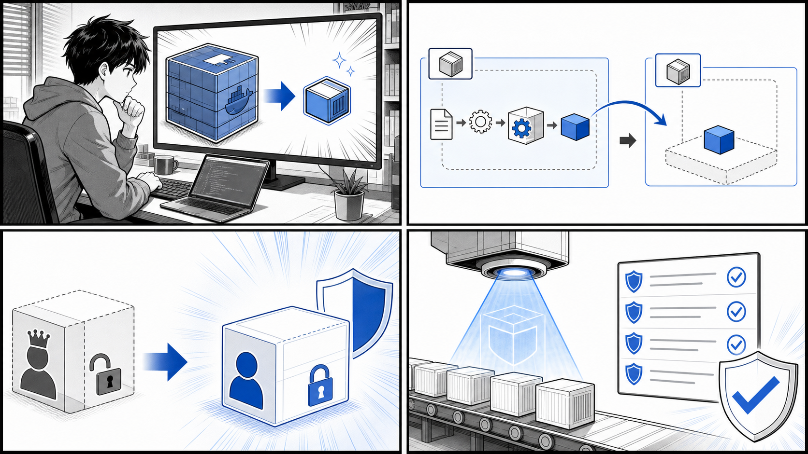
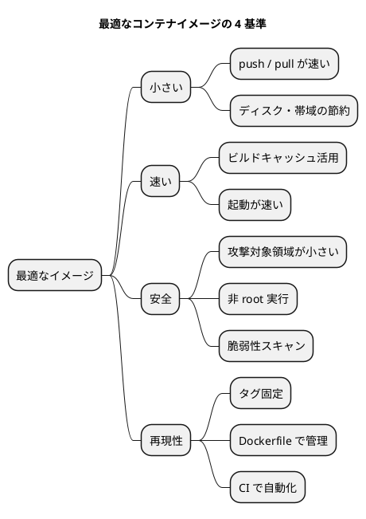
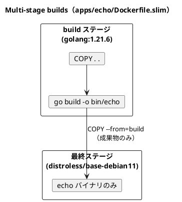
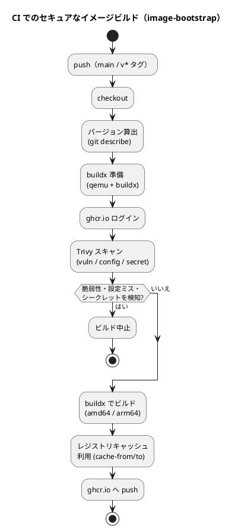

# 第 10 章 最適なコンテナイメージ作成と運用



*小さなベース、Multi-stage build、非 root 実行、脆弱性スキャンで安全で扱いやすいイメージを作ります。*

## はじめに

前章までで、コンテナ化したアプリケーションを Kubernetes 上で動かし、パッケージングして配布するところまでを学びました。アプリケーションが「動く」ようになったら、次に向き合うべきは「どう運用するか」です。

開発の初期段階では、とにかく動くコンテナイメージを素早く作ることが優先されます。しかし、そのイメージを本番環境で長期間運用しはじめると、別の側面が重要になってきます。イメージが大きすぎてデプロイに時間がかかる、古いライブラリに脆弱性が見つかる、root 権限で動いていてセキュリティ上のリスクがある、といった問題です。

この章では、開発時の「とりあえず動く」イメージを、運用に耐える「最適な」イメージへと洗練させていく過程を学びます。題材には、Go 製の小さな Web サーバである `echo` と `image-bootstrap` の 2 つのサンプルリポジトリ、そして書籍旧版のサンプルコード（`gihyo-docker-kuberbetes/ch10`）を使います。実際の Dockerfile を段階的に引用しながら、軽量化・セキュア化・CI による自動化を見ていきます。

### 目次

1. [運用に最適なコンテナイメージとは](#101-運用に最適なコンテナイメージとは)
2. [軽量なベースイメージ](#102-軽量なベースイメージ)
3. [軽量なコンテナイメージを作る](#103-軽量なコンテナイメージを作る)
4. [Multi-stage builds](#104-multi-stage-builds)
5. [BuildKit](#105-buildkit)
6. [セキュアなコンテナイメージの利用と作成](#106-セキュアなコンテナイメージの利用と作成)
7. [CI ツールでコンテナイメージをビルドする](#107-ci-ツールでコンテナイメージをビルドする)

---

## 10.1 運用に最適なコンテナイメージとは

「最適なコンテナイメージ」とは何でしょうか。コンテナの世界では、漠然と「良いイメージ」を語るのではなく、評価できる基準を持つことが大切です。本章では、最適なイメージを次の 4 つの基準で捉えます。

### 小さい（サイズ）

イメージが小さいほど、レジストリへの push、レジストリからの pull、ノードへの展開がすべて速くなります。Kubernetes のように多数のノードへ同じイメージを配布する環境では、サイズの差がデプロイ全体の所要時間に直結します。ディスクやネットワーク帯域の節約にもなります。

### 速い（ビルド・起動）

ビルドが速いと開発のフィードバックループが短くなります。レイヤキャッシュを活かし、変わらない部分を再ビルドしない工夫が効きます。また、余計なプロセスやシェルを含まない小さなイメージは起動も速く、スケールアウト時の応答性を高めます。

### 安全（セキュリティ）

イメージに含まれるパッケージが少ないほど、攻撃対象領域（アタックサーフェス）は小さくなります。シェルやパッケージマネージャを含まないイメージは、侵入されても攻撃者が次の手を打ちにくくなります。さらに、root ではなく非 root ユーザで実行する、脆弱性スキャンで既知の CVE を検知する、といった対策が求められます。

### 再現性（リプロデューシビリティ）

「いつビルドしても同じ結果になる」ことは運用上きわめて重要です。ベースイメージのタグを `latest` ではなく固定する、ビルド手順をコード（Dockerfile）として管理する、CI で自動ビルドして人手のばらつきを排除する、といった取り組みが再現性を支えます。

これらの基準は、本連載で繰り返し参照している「よいソフトウェアとは変更を楽に安全にできて役に立つソフトウェアである」という考え方とも一致します。小さく安全で再現性のあるイメージは、変更を楽に安全に届けるための土台です。



以降の節では、この 4 基準を 1 つずつ具体的な手法に落とし込んでいきます。

---

## 10.2 軽量なベースイメージ

イメージのサイズを決める最大の要因は、ベースイメージの選択です。同じアプリケーションでも、ベースに何を選ぶかでサイズは大きく変わります。

### 汎用 OS イメージは大きい

旧版サンプル `gihyo-docker-kuberbetes/ch10/ch10_1_1/Dockerfile` は、汎用的な Ubuntu をベースに各種ツールをインストールする例です。

```dockerfile
FROM ubuntu:16.04

RUN apt -y update
RUN apt -y install net-tools \
     iproute2 \
     inetutils-ping \
     iproute2 \
     tcpdump \
     mycli \
     redis-tools
```

このようなイメージはデバッグ用途には便利ですが、フルセットの OS をベースにしているため数百 MB に達します。アプリケーション本体だけを動かしたい運用用イメージには大きすぎます。

### 軽量ベースイメージの選択肢

運用向けには、より小さなベースイメージを選びます。代表的な選択肢を整理します。

| ベース | 特徴 | シェル / パッケージマネージャ | 主な用途 |
|--------|------|------------------------------|----------|
| `alpine` | musl libc ベースで数 MB | あり（`apk`） | 汎用・軽量 |
| `*-slim`（debian-slim 等） | 通常版から不要物を削った版 | あり（`apt`） | glibc が必要なとき |
| `distroless` | OS パッケージを含まず実行に必要な最小限のみ | なし | 静的バイナリの実行 |
| `scratch` | 完全な空 | なし | 完全静的バイナリ |

### Alpine Linux

`alpine` は数 MB と非常に小さく、`apk` パッケージマネージャを備えています。旧版サンプル `gihyo-docker-kuberbetes/ch10/ch10_2_1/Dockerfile` は Alpine 上に `jq` を導入する例です。

```dockerfile
FROM alpine:3.7

RUN apk add --no-cache --virtual=build-deps wget && \
    wget https://github.com/stedolan/jq/releases/download/jq-1.5/jq-linux64 && \
    mv jq-linux64 /usr/local/bin/jq && \
    chmod +x /usr/local/bin/jq && \
    apk del build-deps

ENTRYPOINT ["/usr/local/bin/jq", "-C"]
CMD [""]
```

ここでのポイントは、ダウンロードにだけ必要な `wget` を `--virtual=build-deps` という仮想パッケージグループとしてまとめ、用が済んだら `apk del build-deps` で削除している点です。これにより、ビルドにのみ必要なツールを最終イメージに残しません。`--no-cache` は `apk` のキャッシュを残さないオプションで、これもサイズ削減に効きます。

### distroless

`distroless` は Google が提供するベースイメージ群で、アプリケーションの実行に必要な共有ライブラリと CA 証明書などだけを含み、シェルもパッケージマネージャも含みません。Go のような静的にコンパイルできる言語と相性がよく、本章後半で `echo` と `image-bootstrap` の最終イメージに採用します。シェルがないため、侵入されても攻撃者ができることが極端に限られます。

ベースイメージの選択は、「実行に本当に必要なものは何か」を問い直す作業でもあります。デバッグツールが欲しくなるのは分かりますが、運用イメージにはそれを含めず、必要なら別のデバッグ用イメージ（後述）を使い分けるのが定石です。

---

## 10.3 軽量なコンテナイメージを作る

ベースイメージを軽くしたら、次は Dockerfile の書き方そのものでサイズとビルド時間を削っていきます。Docker イメージはレイヤの積み重ねでできており、各命令（`RUN` `COPY` など）が 1 レイヤを生みます。レイヤをどう構成するかがサイズに直結します。

### RUN をまとめてレイヤを減らす

10.2 で引用した `ch10_2_1/Dockerfile` をもう一度見てください。`wget` のインストール・ダウンロード・配置・不要パッケージの削除を、`&&` でつないで 1 つの `RUN` にまとめています。

```dockerfile
RUN apk add --no-cache --virtual=build-deps wget && \
    wget https://github.com/stedolan/jq/releases/download/jq-1.5/jq-linux64 && \
    mv jq-linux64 /usr/local/bin/jq && \
    chmod +x /usr/local/bin/jq && \
    apk del build-deps
```

これを別々の `RUN` に分けてしまうと問題が起きます。Docker のレイヤは追記方式なので、あるレイヤで作ったファイルを後のレイヤで削除しても、前のレイヤにはファイルが残ったままになり、イメージサイズは減りません。`apk del build-deps` を `apk add` と同じ `RUN` 内で実行しているのは、この性質を踏まえてのことです。一連の「導入してから片付ける」処理は 1 つの `RUN` にまとめるのが鉄則です。

逆に、`ch10_1_1/Dockerfile` のように `RUN apt -y update` と `RUN apt -y install ...` を分けると、`apt` のインデックスキャッシュが中間レイヤに残りやすく、サイズ面でも不利になります。

### 不要ファイルを削除する

`apk` の `--no-cache`、`apt` での `rm -rf /var/lib/apt/lists/*` のように、パッケージマネージャが残すキャッシュやインデックスは明示的に削除します。ビルドにのみ必要なツール（コンパイラ、`wget` など）も、最終イメージには残さないようにします。これらをすべて同一 `RUN` 内で完結させるのがポイントです。

### .dockerignore でビルドコンテキストを絞る

`docker build` は、カレントディレクトリ（ビルドコンテキスト）一式を Docker デーモンへ送ります。`.git` やローカルのビルド成果物、ログなどが含まれていると、転送に時間がかかるうえ、`COPY . .` で不要なファイルをイメージに取り込んでしまう恐れがあります。

`.dockerignore` ファイルを用意して、コンテキストから除外する対象を指定します。次は典型的な例です。

```bash
# .dockerignore の例
.git
*.md
bin/
node_modules/
*.log
```

これにより、ビルドが速くなり、機密情報や巨大ファイルの混入も防げます。`image-bootstrap` リポジトリにも `.gitignore` が用意されており、ビルド成果物などをバージョン管理から外す方針が取られています。同様の発想で `.dockerignore` を整えるとよいでしょう。

### レイヤキャッシュを活かす

Docker は各レイヤをキャッシュし、命令と入力が変わらなければ再利用します。変更頻度の低いものを Dockerfile の上の方に、変更頻度の高いもの（アプリのソースなど）を下の方に置くと、キャッシュが効きやすくなります。たとえば依存関係の定義ファイルを先に `COPY` して依存だけ先に解決し、その後でソース全体を `COPY` する、という順序が定番です。

### COPY したスクリプトを使う例

`ch10_2_2/Dockerfile` は `ch10_2_1` を発展させ、ローカルのシェルスクリプトをイメージに取り込んでエントリポイントにする例です。

```dockerfile
FROM alpine:3.7

RUN apk add --no-cache --virtual=build-deps wget && \
    wget https://github.com/stedolan/jq/releases/download/jq-1.5/jq-linux64 && \
    mv jq-linux64 /usr/local/bin/jq && \
    chmod +x /usr/local/bin/jq && \
    apk del build-deps

COPY show-attr.sh /usr/local/bin/

ENTRYPOINT ["sh", "/usr/local/bin/show-attr.sh"]
CMD [""]
```

取り込まれる `show-attr.sh`（`gihyo-docker-kuberbetes/ch10/ch10_2_2/show-attr.sh`）は、引数で渡された属性名を JSON から `jq` で取り出す小さなスクリプトです。

```bash
#!/bin/bash

ATTR=$1
if [ "$ATTR" = "" ]; then
  echo "required attribute name argument" 1>&2
  exit 1
fi

echo '{
  "id": 100,
  "username": "gihyo",
  "comment": "I like Alpine Linux"
}' | jq -r ".$ATTR"
```

アプリケーション本体（ここでは `jq` とスクリプト）だけを最小のベースに載せる、という構成が見て取れます。とはいえ、Alpine にはまだシェルが含まれています。アプリがシェルすら必要としないなら、次節の Multi-stage builds と distroless でさらに削ぎ落とせます。

---

## 10.4 Multi-stage builds

ここまでの工夫を一気に進めるのが Multi-stage builds（マルチステージビルド）です。1 つの Dockerfile の中に複数の `FROM`（ステージ）を書き、ビルド用ステージで成果物を作り、その成果物だけを最終ステージへコピーします。ビルドに必要なコンパイラや依存物は最終イメージに一切残りません。

### ビルドツールを含んだ素朴なイメージ

まず、`echo` リポジトリの素朴版 `apps/echo/Dockerfile` を見ます。

```dockerfile
FROM golang:1.21.6

LABEL org.opencontainers.image.source=https://github.com/gihyodocker/echo

WORKDIR /go/src/github.com/gihyodocker/echo
COPY main.go .
RUN go mod init

CMD ["go", "run", "main.go"]
```

これは `golang:1.21.6` をそのまま実行イメージにしています。`go run` でソースからその場でビルドして起動するため、最終イメージに Go ツールチェーン一式（コンパイラ、標準ライブラリのソースなど）が丸ごと含まれます。`golang` の公式イメージは数百 MB 規模で、実行に不要なものばかりです。手軽ですが運用には重すぎます。

### Multi-stage で成果物だけを残す

これを最適化したのが `apps/echo/Dockerfile.slim` です。

```dockerfile
FROM --platform=$TARGETPLATFORM golang:1.21.6 AS build
ARG TARGETARCH

WORKDIR /go/src/github.com/gihyodocker/echo
COPY . .

RUN GOARCH=${TARGETARCH} CGO_ENABLED=0 go build -o bin/echo main.go

FROM gcr.io/distroless/base-debian11:latest
LABEL org.opencontainers.image.source=https://github.com/gihyodocker/echo

COPY --from=build /go/src/github.com/gihyodocker/echo/bin/echo /usr/local/bin/

CMD ["echo"]
```

この Dockerfile は 2 つのステージに分かれています。

1. **build ステージ**（`FROM golang:1.21.6 AS build`）: Go のツールチェーンを使って `go build` を実行し、実行可能バイナリ `bin/echo` を生成します。`CGO_ENABLED=0` を指定して C 依存を切り、静的にリンクされた単一バイナリを作るのがポイントです。これにより、distroless のような最小ベースでも動かせます。
2. **最終ステージ**（`FROM gcr.io/distroless/base-debian11:latest`）: distroless ベースに、`COPY --from=build` で build ステージのバイナリ `echo` だけを取り込みます。Go ツールチェーンもソースも入りません。

### サイズ差を理解する

両者の違いは、最終イメージに何が入るかです。

| Dockerfile | ベース | 最終イメージに含まれるもの | 傾向 |
|------------|--------|---------------------------|------|
| `apps/echo/Dockerfile` | `golang:1.21.6` | Go ツールチェーン + ソース + `go run` | 非常に大きい（数百 MB 規模） |
| `apps/echo/Dockerfile.slim` | `distroless/base-debian11` | 静的バイナリ `echo` のみ | 非常に小さい |

> 注: 正確なサイズは Go のバージョンや環境で変わるため、実際の値は `docker images` で確認してください。一般に、Go ツールチェーンを含むイメージは数百 MB に達するのに対し、distroless にバイナリだけを載せたイメージは桁違いに小さくなります。



Multi-stage builds は、「ビルドに必要なもの」と「実行に必要なもの」を分離する、シンプルで強力な発想です。10.1 で挙げた「小さい」「速い」「安全」の 3 基準を一度に満たせます。

---

## 10.5 BuildKit

Multi-stage builds をはじめとする近代的なビルド機能を支えているのが BuildKit です。BuildKit は Docker の次世代ビルドエンジンで、並列ビルド、効率的なキャッシュ、マルチプラットフォームビルドなどに対応します。

### BuildKit を有効にする

環境変数 `DOCKER_BUILDKIT=1` を付けると、従来の `docker build` でも BuildKit が使われます。

```bash
DOCKER_BUILDKIT=1 docker build -t echo:slim -f Dockerfile.slim .
```

より高機能なフロントエンドが `docker buildx` です。マルチプラットフォームビルドやキャッシュのインポート／エクスポートを扱えます。

```bash
# buildx 用のビルダーを用意して有効化（例）
docker buildx create --use

# マルチプラットフォーム向けにビルドして push（例）
docker buildx build \
  --platform linux/amd64,linux/arm64 \
  -f Dockerfile.slim \
  -t ghcr.io/gihyodocker/echo:slim \
  --push .
```

### マルチプラットフォームビルド

`apps/echo/Dockerfile.slim` と `apps/image-bootstrap/Dockerfile` には、マルチプラットフォーム対応のための仕掛けが入っています。再掲します。

```dockerfile
FROM --platform=$TARGETPLATFORM golang:1.21.6 AS build
ARG TARGETARCH

WORKDIR /go/src/github.com/gihyodocker/echo
COPY . .

RUN GOARCH=${TARGETARCH} CGO_ENABLED=0 go build -o bin/echo main.go
```

ここで使われている `$TARGETPLATFORM` や `$TARGETARCH` は、BuildKit がビルド時に自動で渡してくれる変数です。

- `$TARGETPLATFORM`: ビルド対象のプラットフォーム（例: `linux/amd64`、`linux/arm64`）
- `$TARGETARCH`: 対象アーキテクチャ（例: `amd64`、`arm64`）

`GOARCH=${TARGETARCH}` を指定することで、Go のクロスコンパイル機能を使い、対象アーキテクチャ向けのバイナリを生成しています。これにより、1 度の `buildx` 実行で amd64 と arm64 の両方のイメージを作れます。Intel/AMD のサーバと Apple Silicon や ARM サーバが混在する現代では、この対応がほぼ必須になっています。

`apps/image-bootstrap/Dockerfile` の build ステージでは `--platform=$BUILDPLATFORM` を使っています。これは「ビルドを実行しているマシンのネイティブプラットフォーム」を指し、ビルドホスト上でクロスコンパイルする（エミュレーションを避けて高速化する）狙いがあります。`$BUILDPLATFORM` でビルドし、`GOARCH` で出力先アーキテクチャを切り替えるのが、Go におけるマルチプラットフォームビルドの定石です。

### キャッシュの活用

BuildKit はレイヤキャッシュをレジストリにエクスポート／インポートできます。CI のように毎回まっさらな環境でビルドする場合でも、前回のキャッシュを取り込んでビルドを高速化できます。実例は 10.7 の CI で見ます。

また、`RUN` 命令にキャッシュマウントを指定すると、パッケージのダウンロードキャッシュやコンパイルキャッシュをレイヤに残さずに再利用できます。これも BuildKit ならではの機能です。

```dockerfile
# キャッシュマウントの例（Go モジュールのダウンロードキャッシュを再利用）
RUN --mount=type=cache,target=/go/pkg/mod \
    GOARCH=${TARGETARCH} CGO_ENABLED=0 go build -o bin/echo main.go
```

> 注: 上記はキャッシュマウントの一般的な書き方の例です。サンプルリポジトリの Dockerfile では使われていませんが、ビルド時間が問題になる場合の選択肢として覚えておくと役立ちます。

---

## 10.6 セキュアなコンテナイメージの利用と作成

イメージを小さくすると、攻撃対象領域が減るという意味でセキュリティ面でも有利になります。しかし、それだけでは不十分です。この節では、非 root 実行と脆弱性スキャンという 2 つの柱を、`image-bootstrap` リポジトリのサンプルで具体的に見ます。

### 非 root ユーザで実行する（最小権限の原則）

コンテナはデフォルトで root として実行されます。万が一コンテナが乗っ取られた場合、root だとホストへの影響範囲が広がりかねません。最小権限の原則に従い、アプリは必要最小限の権限を持つ非 root ユーザで動かすべきです。

`apps/image-bootstrap/Dockerfile` は、distroless の nonroot バリアントと `USER` 指定を組み合わせて、非 root 実行を実現しています。

```dockerfile
FROM --platform=$BUILDPLATFORM golang:1.21.6 AS build
ARG TARGETARCH

WORKDIR /go/src/github.com/gihyodocker/image-bootstrap
COPY . .

RUN GOARCH=${TARGETARCH} go build -o bin/server main.go

FROM gcr.io/distroless/base-debian11:nonroot
LABEL org.opencontainers.image.source=https://github.com/gihyodocker/image-bootstrap

COPY --from=build --chown=nonroot:nonroot /go/src/github.com/gihyodocker/image-bootstrap/bin/server /usr/local/bin/

USER nonroot

CMD ["server"]
```

セキュリティ上の要点は 3 つです。

1. **`distroless/base-debian11:nonroot`**: distroless の `nonroot` タグは、あらかじめ `nonroot` ユーザが用意されたバリアントです。シェルもパッケージマネージャも含まないため、侵入されても攻撃者が打てる手は限られます。
2. **`COPY --chown=nonroot:nonroot`**: build ステージから成果物をコピーする際に、所有者を `nonroot` ユーザに設定します。これにより、`nonroot` ユーザがバイナリを実行できるようになります。
3. **`USER nonroot`**: 以降のプロセスを `nonroot` ユーザとして実行するよう宣言します。コンテナ起動時の `server` プロセスは root ではなく `nonroot` で動きます。

なお、このサンプルが動かす `apps/image-bootstrap/main.go` は、ポート 8080 で待ち受ける小さな HTTP サーバです。1024 番未満の特権ポートを使わないため、非 root ユーザでも問題なく待ち受けできます。非 root 実行を前提にするなら、こうした設計（特権ポートを避ける）も合わせて意識します。

### 脆弱性管理（Trivy によるスキャン）

イメージに含まれるパッケージには、後から脆弱性（CVE）が見つかることがあります。そこで、イメージやソースを定期的にスキャンして既知の脆弱性を検知する仕組みが必要です。`image-bootstrap` では Trivy を使っています。

Trivy の設定ファイル `apps/image-bootstrap/trivy.yaml` は次の通りです。

```yaml
scan:
  scanners:
    - vuln
    - config
    - secret
```

3 種類のスキャナを有効にしています。

- **`vuln`**: OS パッケージや言語ライブラリの既知の脆弱性（CVE）を検出します。
- **`config`**: Dockerfile や Kubernetes マニフェストなどの設定ミス（IaC の誤り）を検出します。たとえば root 実行のままになっていないか、といったチェックです。
- **`secret`**: ソースやイメージにハードコードされた認証情報やトークン（シークレット）の混入を検出します。

この 1 つの設定で、「脆弱なライブラリ」「危険な設定」「秘密情報の漏洩」という 3 つの観点を一度にカバーできます。スキャンは CI に組み込んで自動化するのが理想で、その実例は次節で見ます。

### セキュアなイメージの考え方

セキュアなイメージ作りは、特別な魔法ではなく、地道な原則の積み重ねです。

- 含めるものを最小限にする（distroless / 軽量ベース）
- 最小権限で動かす（非 root、特権ポートを避ける）
- 既知の脆弱性を継続的に監視する（Trivy 等のスキャンを自動化）
- ベースイメージを定期的に更新し、タグは固定して再現性を保つ

これらは 10.1 の「安全」「再現性」の基準を具体化したものです。一度設定して終わりではなく、CI に組み込んで継続的に回すことが肝心です。

---

## 10.7 CI ツールでコンテナイメージをビルドする

イメージの軽量化・セキュア化を手作業で毎回行うのは現実的ではありません。Dockerfile に書いた工夫を確実に・再現性をもって適用するには、CI（継続的インテグレーション）でビルドを自動化します。ここでは GitHub Actions を使い、`echo` と `image-bootstrap` の 2 つのワークフローを見ます。

### echo: 複数バリアントを buildx でビルドして push する

`apps/echo/.github/workflows/push-image.yml` は、main ブランチへの push と `v*` タグの付与をトリガに、複数のイメージバリアントをビルドして GitHub Container Registry（ghcr.io）へ push します。

```yaml
name: Push the container image

on:
  push:
    branches:
      - main 
    tags:
      - 'v*'

env:
  CONTAINER_REGISTRY: ghcr.io

jobs:
  push_image:
    runs-on: ubuntu-latest
    permissions:
      contents: read
      packages: write
    steps:
      - uses: actions/checkout@v4
        with:
          fetch-depth: 0
      - name: Calculate the version
        run: echo "IMAGE_VERSION=$(git describe --tags --always)" >> $GITHUB_ENV
      - uses: docker/setup-qemu-action@v3
      - uses: docker/setup-buildx-action@v3
      - uses: docker/login-action@v3
        with:
          registry: ghcr.io
          username: ${{ github.actor }}
          password: ${{ secrets.GITHUB_TOKEN }}
      - name: Build and push plain image
        uses: docker/build-push-action@v5
        with:
          context: .
          push: true
          platforms: linux/amd64,linux/arm64
          tags: ${{ env.CONTAINER_REGISTRY }}/${{ github.repository }}:${{ env.IMAGE_VERSION }}
      - name: Build and push slim image 
        uses: docker/build-push-action@v5
        with:
          context: .
          file: Dockerfile.slim
          push: true 
          platforms: linux/amd64,linux/arm64
          tags: ${{ env.CONTAINER_REGISTRY }}/${{ github.repository }}:${{ env.IMAGE_VERSION }}-slim
      - name: Build and push debug image 
        uses: docker/build-push-action@v5
        with:
          context: .
          file: Dockerfile.debug
          push: true 
          platforms: linux/amd64,linux/arm64
          tags: ${{ env.CONTAINER_REGISTRY }}/${{ github.repository }}:${{ env.IMAGE_VERSION }}-debug
```

このワークフローの流れを追ってみます。

1. **トリガと権限**: `on.push` で main ブランチと `v*` タグを対象にし、`permissions` で `packages: write`（レジストリへの書き込み）を最小限だけ許可します。権限も最小権限の原則に従います。
2. **バージョン算出**: `git describe --tags --always` で Git のタグやコミットからバージョン文字列を作り、`IMAGE_VERSION` に格納します。これをイメージタグに使うことで、どのコミットから作られたイメージかが追跡でき、再現性が高まります。
3. **buildx の準備**: `setup-qemu-action` でエミュレーションを、`setup-buildx-action` で BuildKit ベースのビルダーを用意します。これでマルチプラットフォームビルドが可能になります。
4. **レジストリへのログイン**: `login-action` で `GITHUB_TOKEN` を使い ghcr.io にログインします。
5. **3 種のイメージをビルド・push**: `docker/build-push-action` を 3 回呼び、`platforms: linux/amd64,linux/arm64` で 2 アーキテクチャ分を一度に作ります。

     - plain（`Dockerfile`）: タグ `:バージョン`
     - slim（`Dockerfile.slim`）: タグ `:バージョン-slim`
     - debug（`Dockerfile.debug`）: タグ `:バージョン-debug`

slim が運用用の最小イメージ、debug は distroless の `debug` バリアント（シェルを含む）を使った調査用イメージで、用途に応じて使い分けられるようになっています。10.2 で「デバッグツールは別イメージに分ける」と述べた方針が、ここで実装されています。

### image-bootstrap: ビルド前に Trivy スキャンとキャッシュを組み込む

`apps/image-bootstrap/.github/workflows/push-image.yml` は、`echo` のワークフローに「脆弱性スキャン」と「ビルドキャッシュ」を加えた、よりセキュアで効率的な構成です。

```yaml
name: Push the container image

on:
  push:
    branches:
      - main 
    tags:
      - 'v*'

env:
  CONTAINER_REGISTRY: ghcr.io

jobs:
  push_image:
    runs-on: ubuntu-latest
    permissions:
      contents: read
      packages: write
    steps:
      - uses: actions/checkout@v4
        with:
          fetch-depth: 0
      - name: Calculate the version
        run: echo "IMAGE_VERSION=$(git describe --tags --always)" >> $GITHUB_ENV
      - uses: docker/setup-qemu-action@v3
      - uses: docker/setup-buildx-action@v3
      - uses: docker/login-action@v3
        with:
          registry: ghcr.io
          username: ${{ github.actor }}
          password: ${{ secrets.GITHUB_TOKEN }}
      - name: Run Trivy vulnerability scanner in fs mode
        uses: aquasecurity/trivy-action@0.16.0
        with:
          scan-type: 'fs'
          scan-ref: '.'
          trivy-config: trivy.yaml
      - name: Build and push plain image
        uses: docker/build-push-action@v5
        with:
          context: .
          push: true 
          platforms: linux/amd64,linux/arm64
          tags: ${{ env.CONTAINER_REGISTRY }}/${{ github.repository }}:${{ env.IMAGE_VERSION }}
          cache-to: type=registry,ref=${{ env.CONTAINER_REGISTRY }}/${{ github.repository }}:cache,mode=max
          cache-from: type=registry,ref=${{ env.CONTAINER_REGISTRY }}/${{ github.repository }}:cache
```

`echo` のワークフローとの違いは 2 点です。

1. **Trivy スキャンをビルド前に実行**: `aquasecurity/trivy-action` を `scan-type: 'fs'`（ファイルシステムモード）で実行し、`trivy-config: trivy.yaml` で 10.6 の設定（`vuln` / `config` / `secret`）を読み込みます。ビルドより前にスキャンを置くことで、脆弱性や設定ミス、シークレットの混入を検知した段階で、危険なイメージを push する前に止められます。
2. **レジストリキャッシュの活用**: `cache-to` と `cache-from` で、ビルドキャッシュを ghcr.io の `:cache` タグにエクスポート／インポートします。`mode=max` は中間レイヤも含めてキャッシュする設定です。CI 実行ごとに環境がまっさらでも、前回のキャッシュを取り込んでビルドを高速化できます。10.5 で触れた BuildKit のキャッシュ機能を、CI で実用化した形です。



### CI が支える 4 基準

この 2 つのワークフローは、10.1 で挙げた最適なイメージの 4 基準をすべて自動で満たします。

- **小さい**: Multi-stage builds + distroless の Dockerfile をそのままビルド
- **速い**: buildx の並列ビルドとレジストリキャッシュ
- **安全**: Trivy スキャン、最小権限の `permissions`、非 root イメージ
- **再現性**: `git describe` 由来のバージョンタグ、コードとして管理されたワークフロー

人手を介さずこれらを毎回確実に適用できることが、CI 自動化の最大の価値です。

---

## まとめ

この章では、開発時の「とりあえず動く」コンテナイメージを、運用に耐える「最適な」イメージへ磨き上げる手法を、実際の Dockerfile と CI ワークフローを通して学びました。

- **10.1** 最適なイメージの 4 基準（小さい・速い・安全・再現性）を定義しました。漠然と良し悪しを語るのではなく、評価できる軸を持つことが出発点です。
- **10.2 / 10.3** ベースイメージの選択（Ubuntu → Alpine → distroless）と、`RUN` のまとめ・不要ファイル削除・`.dockerignore`・レイヤキャッシュという軽量化の基本を、`gihyo-docker-kuberbetes/ch10` の Dockerfile で段階的に確認しました。
- **10.4** Multi-stage builds により、`apps/echo/Dockerfile`（Go ツールチェーン込み）から `apps/echo/Dockerfile.slim`（distroless に静的バイナリのみ）へと、ビルド環境と実行環境を分離してサイズを大幅に削減しました。
- **10.5** BuildKit と `docker buildx`、`$TARGETPLATFORM` / `$TARGETARCH` を使ったマルチプラットフォームビルドとキャッシュ活用を見ました。
- **10.6** `apps/image-bootstrap/Dockerfile` の distroless nonroot・`USER nonroot`・`--chown` による非 root 実行と、`trivy.yaml` による脆弱性／設定／シークレットスキャンで、最小権限と脆弱性管理を実現しました。
- **10.7** GitHub Actions で buildx ビルド → ghcr.io への push を自動化し、Trivy スキャンとレジストリキャッシュを組み込むことで、4 基準を毎回確実に満たす仕組みを構築しました。

最適なイメージ作りは、一度設定して終わりではありません。ベースイメージの更新、新たに見つかる脆弱性への対応、ビルドの改善を、CI を通じて継続的に回し続けることが、「変更を楽に安全にできて役に立つソフトウェア」を運用し続ける鍵になります。

次章では、こうして作った最適なイメージを実際の環境へ届ける、継続的デリバリ（CD）の世界へ進みます。

---

- 前の章: [第 9 章 コンテナの運用](09-container-operations.md)
- 次の章: [第 11 章 コンテナにおける継続的デリバリー](11-continuous-delivery.md)
