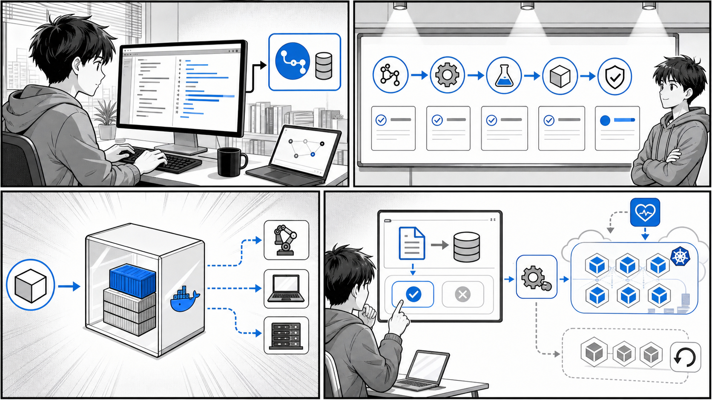

# 第 11 章 コンテナにおける継続的デリバリー



*コード変更からテスト、ビルド、イメージ公開、クラスタへの反映までを自動化します。*

## はじめに

前章では CI（継続的インテグレーション）について学び、コードの変更をきっかけにテストとイメージのビルド・push を自動化する仕組みを構築しました。しかし、イメージがレジストリに push されただけでは、ユーザーに価値が届いたことにはなりません。ビルドされたイメージを Kubernetes クラスタへ確実にデプロイし、はじめてソフトウェアは「役に立つ」状態になります。

この章では、CI に続く工程である CD（継続的デリバリー）を扱います。特に、コンテナと Kubernetes の世界で標準的なアプローチとなった GitOps と、それを実現する代表的なツールである Flux、Argo CD、PipeCD を取り上げます。それぞれのツールが実際にどのようなマニフェストや設定ファイルで動くのかを、公開されているサンプルリポジトリの実コードを引用しながら確認していきます。

最後に、CI から CD、さらに進行的デリバリー（カナリアリリースと自動分析、自動ロールバック）までをつなげ、ソフトウェアデリバリーを完全に自動化する全体像をまとめます。

「変更を楽に安全にできて役に立つソフトウェア」を継続的に届けるための土台が、この章のテーマです。

### 目次

1. [継続的デリバリーとは](#111-継続的デリバリーとは)
2. [Flux](#112-flux)
3. [Argo CD](#113-argo-cd)
4. [PipeCD](#114-pipecd)
5. [ソフトウェアデリバリーの完全自動化](#115-ソフトウェアデリバリーの完全自動化)

---

## 11.1 継続的デリバリーとは

### CI と CD の違い

まず、CI と CD の役割を整理します。両者は連続した工程ですが、責務が明確に異なります。

- CI（Continuous Integration / 継続的インテグレーション）

  開発者が頻繁にコードを統合し、その都度テストとビルドを自動で実行する活動です。コンテナの文脈では「テストを通し、Docker イメージをビルドしてレジストリに push する」ところまでが CI の責務になります。CI のゴールは「いつでもデプロイ可能な成果物（イメージ）」を作り続けることです。

- CD（Continuous Delivery / 継続的デリバリー）

  CI が生んだ成果物を、実際に動作する環境へ確実に届ける活動です。コンテナの文脈では「レジストリのイメージを Kubernetes クラスタにデプロイし、望ましい状態を維持する」ところが CD の責務になります。CD のゴールは「成果物をいつでも安全にリリースできる状態」を保つことです。

CI と CD の境界を図にすると次のようになります。

```text
[開発者] --push--> [Git リポジトリ]
                         |
                   (CI: テスト/ビルド/push)
                         v
                 [コンテナレジストリ]  <- ここまでが CI
                         |
                   (CD: デプロイ/同期)
                         v
                 [Kubernetes クラスタ] <- ここからが CD
```

CI については第 10 章で扱いました。この章では、レジストリにイメージが置かれた後の CD に焦点を当てます。

### GitOps という考え方

Kubernetes のデプロイにおいて、近年の標準的なアプローチとなったのが GitOps です。GitOps の中心にあるのは次の 2 つの原則です。

1. Git を信頼できる唯一の情報源（Single Source of Truth）とする

   クラスタにあるべき状態（Deployment、Service、ConfigMap など）を、すべて宣言的なマニフェストとして Git リポジトリで管理します。「本番環境がどうあるべきか」を知りたければ Git を見れば良い、という状態を作ります。

2. 宣言的マニフェストをクラスタへ自動同期する

   Git に書かれた「あるべき状態」と、クラスタの「現在の状態」をツールが常に比較し、差分があれば自動的に同期して一致させます。

この考え方の利点は、本書全体を貫く「変更を楽に安全にできる」という価値に直結します。デプロイは `git push`（あるいは Pull Request のマージ）という、開発者が日常的に行う操作に統一されます。誰がいつ何を変更したかは Git の履歴に残り、問題があれば `git revert` で過去の状態に戻せます。手作業の `kubectl apply` に頼らないため、操作ミスや環境ごとの設定のばらつきも減ります。

### push 型と pull 型

CD の同期方式には、大きく分けて push 型と pull 型があります。

- push 型

  CI/CD パイプライン（GitHub Actions など）の側から、クラスタに対して `kubectl apply` などで変更を「押し込む」方式です。仕組みが理解しやすい反面、パイプライン側にクラスタへの認証情報（kubeconfig など）を持たせる必要があり、クラスタの外から強い権限でアクセスできてしまう点に注意が必要です。

- pull 型

  クラスタ内に常駐するエージェントが、Git リポジトリを定期的に監視し、変更を検知すると自身でクラスタへ反映する方式です。クラスタの外部に認証情報を渡す必要がなく、エージェントがクラスタ内部から動作するためセキュリティ面で有利です。GitOps を掲げるツールの多くは、この pull 型を採用しています。

```text
push 型:  [パイプライン] --kubectl apply--> [クラスタ]
pull 型:  [クラスタ内エージェント] --watch/pull--> [Git リポジトリ]
```

これから紹介する Flux と Argo CD は pull 型の GitOps ツールです。PipeCD も Git を起点とし、クラスタ内の `piped` というエージェントが同期を担うため、pull 型の性質を持ちます。

---

## 11.2 Flux

### Flux の仕組み

Flux は CNCF（Cloud Native Computing Foundation）の卒業プロジェクトで、pull 型 GitOps を実現するツールです。Flux はモノリシックな単一のコンポーネントではなく、役割ごとに分かれた複数のコントローラ（GitOps Toolkit と呼ばれます）の集合として構成されています。代表的なものは次の 2 つです。

- source-controller

  Git リポジトリや Helm リポジトリ、OCI レジストリなどの「ソース」を監視し、指定したリビジョンのマニフェストを取得して、クラスタ内のほかのコントローラから参照できるようにします。

- kustomize-controller

  source-controller が取得したマニフェスト（Kustomize で管理されたものを含む）を、実際にクラスタへ適用します。Git 上の状態とクラスタの状態を継続的に突き合わせ、差分があれば同期します。

動作の流れは次のようになります。

```text
[Git リポジトリ] --watch--> [source-controller] --取得--> [kustomize-controller] --apply--> [クラスタ]
```

開発者が Git にマニフェストの変更を push すると、source-controller がそれを検知し、kustomize-controller がクラスタへ反映します。クラスタ側で誰かが手動で設定を書き換えても、Flux が Git の状態へ引き戻す（ドリフトの是正）ため、Git が常に正となります。

### 配信対象となる Kustomize マニフェストの例

Flux が配信する対象は、宣言的に書かれた Kubernetes マニフェストです。本書のサンプルリポジトリ `echo-bootstrap`（出典: `apps/cd/echo-bootstrap/`）には、Kustomize で束ねられたマニフェスト群が含まれています。これは GitOps で配信するアプリケーションの典型例として参考になります。

`apps/cd/echo-bootstrap/kustomization.yaml` は、複数のマニフェストを 1 つのアプリケーションとしてまとめています。

```yaml
apiVersion: kustomize.config.k8s.io/v1beta1
kind: Kustomization
namespace: gitops-echo
resources:
- namespace.yaml
- deployment.yaml
- ingress.yaml
- service.yaml
commonLabels:
  app.kubernetes.io/name: echo
```

実際に配信される Deployment は `apps/cd/echo-bootstrap/deployment.yaml` に定義されています（抜粋）。

```yaml
apiVersion: apps/v1
kind: Deployment
metadata:
  name: echo
  labels:
    app.kubernetes.io/name: echo
spec:
  replicas: 1
  selector:
    matchLabels:
      app.kubernetes.io/name: echo
  template:
    metadata:
      labels:
        app.kubernetes.io/name: echo
    spec:
      containers:
      - name: nginx
        image: ghcr.io/gihyodocker/simple-nginx-proxy:v0.1.0
        # ...（環境変数の定義は省略）
      - name: echo
        image: ghcr.io/gihyodocker/echo:v0.1.0-slim
```

このように、`gitops-echo` という名前空間に `echo` という Deployment を配置することが Git 上で宣言されています。Flux はこの Git 上の宣言をクラスタの「あるべき状態」とみなして同期します。

### Flux にこのマニフェストを配信させる設定例

ここからは一般的な例です（`echo-bootstrap` リポジトリには含まれていない、Flux 側の設定の書き方を示します）。Flux にこの `echo-bootstrap` を監視させるには、`GitRepository` と `Kustomization` という 2 つのカスタムリソース（CRD）を Flux 自身に与えます。次は一般的に正しい記述の例です。

```yaml
# 例: Git リポジトリを監視対象として登録する（GitRepository CRD）
apiVersion: source.toolkit.fluxcd.io/v1
kind: GitRepository
metadata:
  name: echo-bootstrap
  namespace: flux-system
spec:
  interval: 1m            # 1 分ごとにリポジトリをチェックする
  url: https://github.com/example/echo-bootstrap
  ref:
    branch: main          # 監視するブランチ（リビジョン）
---
# 例: 取得したマニフェストをクラスタへ同期する（Kustomization CRD）
apiVersion: kustomize.toolkit.fluxcd.io/v1
kind: Kustomization
metadata:
  name: echo
  namespace: flux-system
spec:
  interval: 5m            # 5 分ごとにクラスタとの差分を是正する
  sourceRef:
    kind: GitRepository
    name: echo-bootstrap
  path: "./"              # kustomization.yaml の場所
  prune: true             # Git から削除されたリソースはクラスタからも削除する
```

`GitRepository` が「どこを見るか（リポジトリとリビジョン）」を、`Kustomization` が「取得したもののどのパスを、どう同期するか」を定義します。`prune: true` を指定すると、Git から消したリソースはクラスタからも削除されるため、Git の状態とクラスタの状態が厳密に一致します。これが GitOps における「Git を唯一の情報源とする」の具体的な姿です。

---

## 11.3 Argo CD

### Argo CD と Application

Argo CD も pull 型 GitOps を実現する CNCF プロジェクトです。Flux との大きな違いは、Web UI を備え、アプリケーションの同期状態（Synced / OutOfSync）や健全性（Healthy など）を視覚的に確認できる点にあります。

Argo CD では、同期対象を `Application` というカスタムリソースで表現します。`Application` には「どの Git リポジトリの、どのパスの、どのリビジョンを、どの名前空間に同期するか」を記述します。本節では、Argo CD のデモ用に公開されているサンプル集 `argocd-example-apps`（出典: `apps/cd/argocd-example-apps/`）を引用しながら解説します。

`Application` の記述は一般的に次のような形になります（一般例。`argocd-example-apps` のアプリを同期対象とした場合）。

```yaml
# 例: guestbook を同期対象とする Application
apiVersion: argoproj.io/v1alpha1
kind: Application
metadata:
  name: guestbook
  namespace: argocd
spec:
  project: default
  source:
    repoURL: https://github.com/argoproj/argocd-example-apps.git
    targetRevision: HEAD     # 同期対象のリビジョン
    path: guestbook          # 同期対象の Git パス
  destination:
    server: https://kubernetes.default.svc
    namespace: default
  syncPolicy:
    automated:               # Git の変更を自動で同期する
      prune: true
      selfHeal: true
```

`source.path` と `source.targetRevision` が、まさに「Git のどこを正とするか」を指定する部分です。`syncPolicy.automated` を設定すると、Git の変更を検知して自動同期し、クラスタ側のドリフトも自動是正します。

### さまざまなマニフェスト形式

`argocd-example-apps` の README（出典: `apps/cd/argocd-example-apps/README.md`）には、同じ guestbook アプリをさまざまな形式で表現したサンプルが並んでいます。Argo CD は、プレーンな YAML、Kustomize、Helm のいずれの形式でもそのまま同期できます。

#### プレーン YAML 形式（guestbook）

`apps/cd/argocd-example-apps/guestbook/guestbook-ui-deployment.yaml` は、テンプレート機構を使わない素の Kubernetes マニフェストです。

```yaml
apiVersion: apps/v1
kind: Deployment
metadata:
  name: guestbook-ui
spec:
  replicas: 1
  revisionHistoryLimit: 3
  selector:
    matchLabels:
      app: guestbook-ui
  template:
    metadata:
      labels:
        app: guestbook-ui
    spec:
      containers:
      - image: gcr.io/heptio-images/ks-guestbook-demo:0.2
        name: guestbook-ui
        ports:
        - containerPort: 80
```

#### Kustomize 形式（kustomize-guestbook）

`apps/cd/argocd-example-apps/kustomize-guestbook/kustomization.yaml` は、Kustomize で複数のリソースを束ね、`namePrefix` で名前にプレフィックスを付けています。

```yaml
namePrefix: kustomize-

resources:
- guestbook-ui-deployment.yaml
- guestbook-ui-svc.yaml
apiVersion: kustomize.config.k8s.io/v1beta1
kind: Kustomization
```

Argo CD はパスに `kustomization.yaml` があれば、自動的に Kustomize としてビルドしてから同期します。

#### Helm 形式（helm-guestbook）

`apps/cd/argocd-example-apps/helm-guestbook/templates/deployment.yaml` は、Helm のテンプレート構文で値を差し込む形式です（抜粋）。

```yaml
apiVersion: apps/v1
kind: Deployment
metadata:
  name: {{ template "helm-guestbook.fullname" . }}
spec:
  replicas: {{ .Values.replicaCount }}
  revisionHistoryLimit: 3
  template:
    spec:
      containers:
        - name: {{ .Chart.Name }}
          image: "{{ .Values.image.repository }}:{{ .Values.image.tag }}"
          imagePullPolicy: {{ .Values.image.pullPolicy }}
```

対応する値は `apps/cd/argocd-example-apps/helm-guestbook/values.yaml` で定義されています（抜粋）。

```yaml
replicaCount: 1

image:
  repository: gcr.io/heptio-images/ks-guestbook-demo
  tag: 0.1
  pullPolicy: IfNotPresent
```

Argo CD はパスに `Chart.yaml` があれば Helm チャートとして認識し、テンプレートを展開してから同期します。このように、Argo CD はアプリケーションの記述形式を問わず、統一的に「Git を正としてクラスタへ同期する」という GitOps の流儀を適用できます。

### sync-waves とリソースの適用順序

複数のリソースをデプロイするとき、適用の順序が重要になる場合があります。たとえば「データベースのスキーマを更新してから、新しいアプリケーションを起動したい」というケースです。Argo CD はこの順序制御を sync-waves と hook で実現します。

`apps/cd/argocd-example-apps/sync-waves/manifests.yaml`（出典: `apps/cd/argocd-example-apps/sync-waves/`）から、適用順序を制御している箇所を抜粋します。

```yaml
# PreSync フック: 本体の同期に先立って実行される（例: SQL スキーマの更新）
apiVersion: batch/v1
kind: Job
metadata:
  generateName: upgrade-sql-schema
  annotations:
    argocd.argoproj.io/hook: PreSync
spec:
  template:
    spec:
      containers:
        - name: upgrade-sql-schema
          image: alpine:latest
          command: ["sleep", "5"]
      restartPolicy: Never
---
# sync-wave で適用順序を指定する（数値が小さいものから順に適用される）
apiVersion: apps/v1
kind: ReplicaSet
metadata:
  name: frontend
  annotations:
    argocd.argoproj.io/sync-wave: "2"
spec:
  # ...（省略）
```

ポイントは 2 つのアノテーションです。

- `argocd.argoproj.io/hook` は、同期のライフサイクル上のどの段階で実行するかを指定します。`PreSync` は本体の同期前、`PostSync` は同期後に実行されます。スキーマ移行のような「アプリより先に終えておきたい処理」は `PreSync` フックに置きます。
- `argocd.argoproj.io/sync-wave` は、リソースを適用する波（wave）を数値で指定します。値が小さい波から順に適用され、各波が健全になってから次の波へ進みます。上記の例では `frontend` に `"2"` が指定されており、より小さい波のリソースが整ってから適用されます。

同様に `apps/cd/argocd-example-apps/pre-post-sync/pre-sync-job.yaml`（出典: `apps/cd/argocd-example-apps/pre-post-sync/`）にも PreSync フックの例があります。

```yaml
apiVersion: batch/v1
kind: Job
metadata:
  name: before
  annotations:
    argocd.argoproj.io/hook: PreSync
    argocd.argoproj.io/hook-delete-policy: HookSucceeded
spec:
  template:
    spec:
      containers:
      - name: sleep
        image: alpine:latest
        command: ["sleep", "10"]
      restartPolicy: Never
  backoffLimit: 0
```

`hook-delete-policy: HookSucceeded` は、フックが成功したらその Job を削除する指定です。一度きりの処理が完了後にクラスタに残らないようにする、後始末のための設定です。

### blue-green デプロイの例

Argo CD のサンプルには、Argo Rollouts と組み合わせた blue-green デプロイの例も含まれています。`apps/cd/argocd-example-apps/blue-green/templates/rollout.yaml`（出典: `apps/cd/argocd-example-apps/blue-green/`）では、標準の `Deployment` の代わりに Argo Rollouts が提供する `Rollout` リソースを使っています（抜粋）。

```yaml
apiVersion: argoproj.io/v1alpha1
kind: Rollout
metadata:
  name: {{ template "helm-guestbook.fullname" . }}
spec:
  replicas: {{ .Values.replicaCount }}
  revisionHistoryLimit: 3
  strategy:
    blueGreen:
      activeService: {{ template "helm-guestbook.fullname" . }}
      previewService: {{ template "helm-guestbook.fullname" . }}-preview
  template:
    spec:
      containers:
        - name: {{ .Chart.Name }}
          image: "{{ .Values.image.repository }}:{{ .Values.image.tag }}"
```

`strategy.blueGreen` がポイントです。

- `activeService` は、現在ユーザーのトラフィックを受けている本番（active / blue）のサービスです。
- `previewService` は、新バージョンを先行して立ち上げ、本番トラフィックを流す前に検証するための待機（preview / green）のサービスです。

新バージョンはまず preview 側で起動し、確認のうえで active を新バージョンへ切り替えます。問題があれば切り替えを止め、即座に旧バージョンへ戻せます。これにより、ダウンタイムを最小化しつつ安全にリリースできます。GitOps（Argo CD による Git からの同期）と、進行的デリバリー（Argo Rollouts による blue-green）が組み合わさっている点が、この例の見どころです。

---

## 11.4 PipeCD

### PipeCD とパイプライン定義

PipeCD は、Kubernetes だけでなく Terraform、Cloud Run、AWS Lambda、Amazon ECS など複数のプラットフォームへのデプロイを、統一的なパイプラインで扱える CD ツールです。クラスタ内に常駐するエージェント `piped` が Git を監視し、定義されたパイプラインに沿ってデプロイを進めます。

PipeCD では、アプリケーションごとに `app.pipecd.yaml` というファイルを置き、デプロイのパイプラインを宣言します。本節では公開サンプル集 `pipecd-examples`（出典: `pipecd-examples/README.md`）を引用します。

### パイプラインを使わないシンプルなデプロイ

`pipecd-examples/kubernetes/simple/app.pipecd.yaml`（出典: `pipecd-examples/kubernetes/simple/`）は、パイプラインを定義しない最小構成です。

```yaml
apiVersion: pipecd.dev/v1beta1
kind: KubernetesApp
spec:
  name: simple
  labels:
    env: example
    team: product
  input:
    manifests:
      - deployment.yaml
      - service.yaml
    kubectlVersion: 1.18.5
  description: |
    This app demonstrates how to deploy a Kubernetes application with Quick Sync strategy.
```

`pipeline` を指定していないため、PipeCD は Quick Sync という方式で動作します。これは新バージョンをロールアウトし、すべてのトラフィックを一度に新バージョンへ切り替えるシンプルなデプロイです。

### カナリアデプロイのステージ

`pipecd-examples/kubernetes/canary/app.pipecd.yaml`（出典: `pipecd-examples/kubernetes/canary/`）では、`pipeline.stages` にステージを並べてカナリアリリースを定義しています。

```yaml
apiVersion: pipecd.dev/v1beta1
kind: KubernetesApp
spec:
  name: canary
  pipeline:
    stages:
      # CANARY 変種をデプロイする。レプリカ数は PRIMARY の 10%。
      - name: K8S_CANARY_ROLLOUT
        with:
          replicas: 10%
      # 次のステージへ進む前に 10 秒待つ。
      - name: WAIT
        with:
          duration: 10s
      # PRIMARY 変種を新バージョンへ更新する。
      - name: K8S_PRIMARY_ROLLOUT
      # CANARY 変種のワークロードをすべて破棄する。
      - name: K8S_CANARY_CLEAN
```

カナリアリリースは、新バージョン（CANARY 変種）をまず小さな割合（ここでは 10%）だけ立ち上げ、問題がないことを確かめてから本番（PRIMARY 変種）を一斉に更新する手法です。最後に役目を終えた CANARY を片付けます。各ステージが順番に実行されるため、デプロイの進行を段階的に制御できます。

### ブルーグリーンデプロイのステージ

`pipecd-examples/kubernetes/bluegreen/app.pipecd.yaml`（出典: `pipecd-examples/kubernetes/bluegreen/`）では、トラフィックの切り替えと手動承認を組み合わせています。

```yaml
apiVersion: pipecd.dev/v1beta1
kind: KubernetesApp
spec:
  name: bluegreen
  pipeline:
    stages:
      # CANARY 変種を PRIMARY と同じレプリカ数でデプロイする。
      - name: K8S_CANARY_ROLLOUT
        with:
          replicas: 100%
      # トラフィックをすべて CANARY（新）へ向ける。
      - name: K8S_TRAFFIC_ROUTING
        with:
          canary: 100
      # 手動承認を待つ。
      - name: WAIT_APPROVAL
      # PRIMARY を新バージョンへ更新する。
      - name: K8S_PRIMARY_ROLLOUT
      # トラフィックをすべて PRIMARY へ戻す。
      - name: K8S_TRAFFIC_ROUTING
        with:
          primary: 100
      # CANARY 変種を破棄する。
      - name: K8S_CANARY_CLEAN
```

`K8S_TRAFFIC_ROUTING` でトラフィックの向き先を切り替え、`WAIT_APPROVAL` で人による最終確認を挟んでいます。新旧両系統を同時に動かしておき、トラフィックの切り替えで瞬時に切り戻せるのがブルーグリーンの利点です。

### 分析（analysis）ステージによる自動検証

PipeCD の強力な機能が、ANALYSIS ステージによる自動検証です。`pipecd-examples/kubernetes/analysis-by-metrics/app.pipecd.yaml`（出典: `pipecd-examples/kubernetes/analysis-by-metrics/`）では、カナリアに流したトラフィックのメトリクスを Prometheus で監視し、品質を自動で判定しています。

```yaml
apiVersion: pipecd.dev/v1beta1
kind: KubernetesApp
spec:
  name: analysis-by-metrics
  pipeline:
    stages:
      - name: K8S_CANARY_ROLLOUT
        with:
          replicas: 20%
      - name: ANALYSIS
        with:
          duration: 30m
          metrics:
            - strategy: THRESHOLD
              provider: my-prometheus
              interval: 5m
              expected:
                max: 0.01
              query: |
                sum by (job) (rate(http_requests_total{status=~"5.*", job="analysis"}[5m]))
                /
                sum by (job) (rate(http_requests_total{job="analysis"}[5m]))
      - name: K8S_PRIMARY_ROLLOUT
      - name: K8S_CANARY_CLEAN
```

この設定では、20% のトラフィックを新バージョンに流したうえで、30 分間にわたり 5 分ごとに Prometheus へクエリを投げます。クエリはエラー（HTTP 5xx）の割合を計算しており、`expected.max: 0.01`（1%）を超えると分析は失敗と判定されます。分析に成功すれば `K8S_PRIMARY_ROLLOUT` へ進んで本番を更新し、失敗すればパイプラインは中断されます。

`pipecd-examples` の README には、メトリクスのほかに HTTP リクエストの結果で判定する `analysis-by-http`、ログの内容で判定する `analysis-by-log`、ベースラインと比較する `analysis-with-baseline` といった分析のバリエーションも紹介されています。いずれも「人が目視で確認していた品質チェックを、機械が客観的な指標で自動的に行う」ための仕組みです。これにより、悪いバージョンが本番全体へ広がる前に、自動的にデプロイを止められます。

---

## 11.5 ソフトウェアデリバリーの完全自動化

ここまで見てきた要素を組み合わせると、コードの変更からユーザーへの価値提供までを、人手を介さずに自動化する全体像が描けます。第 10 章で構築した CI と接続して、デリバリーのパイプライン全体を振り返ります。

### 完全自動化の全体像

```text
1. 開発者がアプリのコードを変更し、Git に push
        |
        v
2. CI（第 10 章）: テスト実行 → Docker イメージのビルド → レジストリへ push
        |
        v
3. マニフェスト更新: 新しいイメージタグをマニフェストリポジトリへ反映（Git にコミット）
        |
        v
4. CD（GitOps 自動同期）: Flux / Argo CD がマニフェストの変更を検知し、クラスタへ同期
        |
        v
5. 進行的デリバリー: カナリア投入 → 自動分析（メトリクス検証）
        |
        +-- 分析 OK --> 本番（PRIMARY）を更新して完了
        |
        +-- 分析 NG --> 自動ロールバック（旧バージョンを維持）
```

それぞれの段階を、これまでの内容と対応づけて整理します。

1. CI（イメージのビルドと push）

   第 10 章で扱った CI が担います。コードの変更をきっかけにテストを通し、Docker イメージをビルドしてレジストリへ push します。ここで「デプロイ可能な成果物」が生まれます。

2. マニフェストの更新

   CI の成果物である新しいイメージタグを、GitOps が監視するマニフェストリポジトリに反映します。`echo-bootstrap` のようなマニフェストリポジトリのイメージ指定を、新しいタグへ書き換えてコミットするイメージです。この「Git へのコミット」が、デプロイのトリガーになります。

3. CD（GitOps 自動同期）

   Flux の `source-controller` / `kustomize-controller`、あるいは Argo CD の `Application` が、マニフェストの変更を検知してクラスタへ自動同期します。pull 型なので、クラスタ外に強い権限を渡す必要がありません。Git が唯一の情報源であり続けるため、いつでも `git revert` で過去の状態へ戻せます。

4. 進行的デリバリー（カナリア + 自動分析 + 自動ロールバック）

   Argo Rollouts や PipeCD のパイプラインが、新バージョンをいきなり全面展開するのではなく、カナリアとして一部のトラフィックから始めます。PipeCD の `ANALYSIS` ステージのように、メトリクスを自動で検証し、品質基準を満たせば本番を更新し、満たさなければデプロイを中断して旧バージョンを維持します。これが自動ロールバックです。

このパイプラインの価値は明確です。人手による `kubectl apply` や、目視によるリリース後の監視といった、ミスが起きやすく属人的な作業がなくなります。問題のあるバージョンはユーザー全体に届く前に自動で食い止められ、万一のときは Git の履歴で安全に巻き戻せます。まさに「変更を楽に安全にできて役に立つソフトウェア」を、継続的に届け続けられる状態です。

---

## まとめ

この章では、コンテナにおける継続的デリバリー（CD）を扱いました。

- CI が「デプロイ可能な成果物（イメージ）を作る」工程であるのに対し、CD は「成果物を確実に届ける」工程です。両者は連続しつつも責務が異なります。
- GitOps は、Git を信頼できる唯一の情報源とし、宣言的マニフェストをクラスタへ自動同期する考え方です。同期方式には push 型と pull 型があり、GitOps ツールの多くはセキュリティ面で有利な pull 型を採用します。
- Flux は `source-controller` と `kustomize-controller` が連携し、Git の変更を検知してクラスタへ同期する pull 型ツールです。`echo-bootstrap` のような Kustomize マニフェストを配信対象にできます。
- Argo CD は `Application` リソースで同期対象を定義し、プレーン YAML / Kustomize / Helm のいずれの形式も扱えます。sync-waves と hook でリソースの適用順序を制御でき、Argo Rollouts と組み合わせれば blue-green デプロイも実現できます。
- PipeCD は `app.pipecd.yaml` でパイプラインを宣言し、カナリア・ブルーグリーンの各ステージや、メトリクスによる `ANALYSIS` ステージで品質を自動検証できます。
- これらを組み合わせると、CI（ビルド/push）→ CD（GitOps 自動同期）→ 進行的デリバリー（カナリア + 自動分析 + 自動ロールバック）という、ソフトウェアデリバリーの完全自動化が実現します。

なお、本章で示した `GitRepository` / `Kustomization` / `Application` の各 CRD のうち、サンプルリポジトリに実ファイルとして含まれていたのは `argocd-example-apps`、`pipecd-examples`、`echo-bootstrap` の配信対象マニフェストです。Flux 側および Argo CD の `Application` の設定例は、ツールの一般的な書き方として示した参考例です。実際に利用する際は、各ツールの公式ドキュメントで最新の API バージョンを確認してください。

---

- 前の章: [第 10 章 最適なコンテナイメージ作成と運用](10-optimal-container-image.md)
- 次の章: [第 12 章 コンテナのさまざまな活用方法](12-container-use-cases.md)
