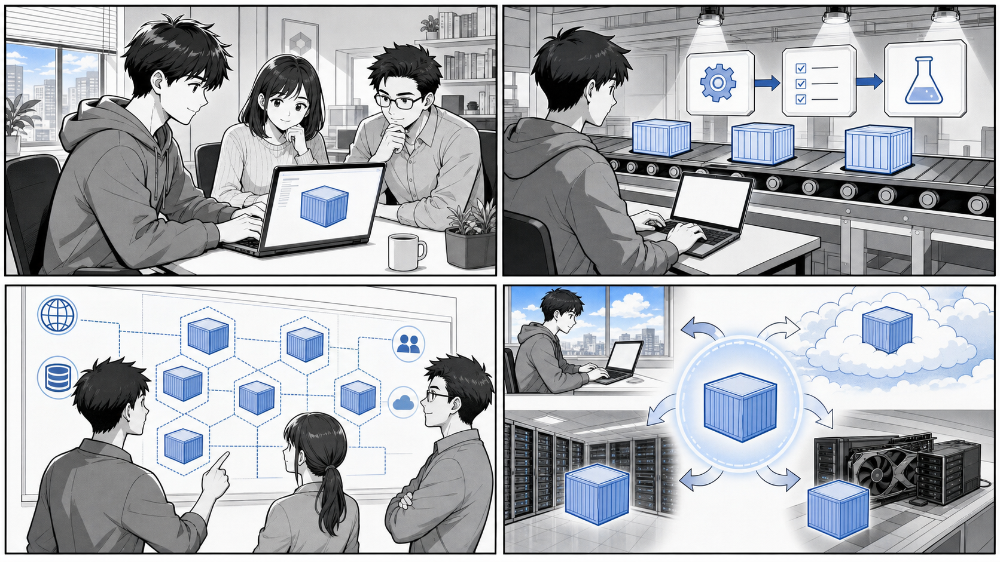

# 第 12 章 コンテナのさまざまな活用方法



*ローカル開発、CI、Production、バッチや AI など、コンテナは環境をまたぐ共通の実行単位になります。*

## はじめに

前章までは、アプリケーションを動かすための基盤としてコンテナや Kubernetes を扱ってきました。しかし、コンテナの活用範囲はアプリケーションの実行環境にとどまりません。

コンテナの本質は「実行環境をコードとして固め、どこでも同じように再現できる」という点にあります。この性質を応用すると、アプリケーションそのものを動かす以外にも、さまざまな場面でコンテナが役立ちます。

この章では、日々の開発・運用で実際に効果が大きい次の 3 つの活用方法を取り上げます。

- チーム開発で開発環境を統一・共有する
- コマンドラインツール（CLI）をコンテナで利用する
- 負荷テストをコンテナで構築・実行する

いずれも「ホストの状態に依存せず、同じ環境を誰でも再現できる」というコンテナの強みを活かした使い方です。本章では、書籍付属のリポジトリ `gihyodocker/container-kit` と、本プロジェクトの設定ファイル、`gihyodocker` の負荷テスト用サンプルを題材に、具体的なコードを引用しながら解説します。

---

## 12.1 チーム開発で開発環境を統一・共有する

### 「自分の環境では動く」問題

チーム開発では、次のような場面に何度も遭遇します。

- ある人の環境では動くが、別の人の環境ではビルドが通らない
- ライブラリやランタイムのバージョンが人によって微妙に違う
- OS（macOS / Windows / Linux）の差異で動作が変わる

これらはすべて「開発環境が人によって異なる」ことに起因します。原因の調査や環境合わせに費やす時間は、本来のアプリケーション開発には何も寄与しません。

コンテナはこの問題を根本から解決します。開発環境を Dockerfile として定義し、チーム全員が同じイメージを使えば、「動くものは全員同じ」を実現できます。OS やインストール済みツールの差異を吸収し、誰の手元でも同一の環境を再現できるのです。

### デバッグ用ツールをまとめたコンテナ

まず、開発・運用で頻繁に使うツール一式をあらかじめ入れたコンテナの例を見てみましょう。`gihyodocker/container-kit` リポジトリには、デバッグ用のコンテナイメージ `ghcr.io/gihyodocker/debug` が含まれています。

出典: `apps/container-kit/containers/debug/Dockerfile`

```dockerfile
FROM ubuntu:23.10

LABEL org.opencontainers.image.source=https://github.com/gihyodocker/container-kit

RUN apt update -y
RUN apt install -y curl wget git zip telnet vim default-mysql-client iputils-ping net-tools dnsutils
```

この Dockerfile は、`ubuntu:23.10` をベースに、調査でよく使うツールをまとめてインストールしているだけのシンプルなものです。それぞれのツールの役割は次のとおりです。

- `curl` / `wget`: HTTP リクエストの送信、ファイルのダウンロード
- `git`: ソースコードの取得
- `zip`: アーカイブの展開・作成
- `telnet`: 任意のホスト・ポートへの疎通確認
- `vim`: ファイルの編集
- `default-mysql-client`: MySQL への接続・クエリ実行
- `iputils-ping`（`ping`）: ホストへの疎通確認
- `net-tools`（`netstat` など）: ネットワーク状態の確認
- `dnsutils`（`dig`、`nslookup`）: 名前解決の確認

このイメージが効果を発揮するのは、Kubernetes クラスタ内のネットワークやサービスを調査したいときです。本番に近い環境では、調査用のツールをアプリケーションコンテナに入れたくありません（イメージが肥大化し、攻撃対象も増えるため）。そこで、デバッグ用コンテナを一時的にクラスタ内へ起動し、内部から疎通や名前解決を確認します。

`README-ja.md`（出典: `apps/container-kit/README-ja.md`）でも、このリポジトリが「Docker/Kubernetes 実践コンテナ開発入門において必要ないくつかのコンテナイメージを含んでいる」と説明されており、`debug` イメージはその代表例です。

たとえば、クラスタ内で名前解決を確認したい場合は、次のように一時的なコンテナを起動します（コマンドは例です）。

```bash
# クラスタ内で一時的に debug コンテナを起動して疎通を確認する例
kubectl run debug --rm -it --image=ghcr.io/gihyodocker/debug -- bash

# 起動したコンテナの中で
dig my-service.default.svc.cluster.local
curl -v http://my-service:8080/
```

このように、ツールを「コンテナとして」共有しておくと、チームの誰もが同じ調査環境をすぐに立ち上げられます。各自が手元にツールを個別インストールする必要はなく、バージョン差異に悩むこともありません。

### VS Code Dev Containers による開発環境の統一

デバッグ用コンテナは「調査ツールの共有」でしたが、開発作業そのものをコンテナの中で行う仕組みもあります。それが VS Code の **Dev Containers** です。

Dev Containers では、開発に必要なランタイム・ツール・拡張機能をコンテナとして定義し、エディタからそのコンテナの中に入って開発します。プロジェクトに `.devcontainer/devcontainer.json` を置いておけば、チームの誰がリポジトリを開いても同じ開発環境が自動的に立ち上がります。

本プロジェクトにも Dev Containers の設定が用意されています。

出典: `.devcontainer/devcontainer.json`

```json
{
	"name": "Case Study Game Dev Container",
	"build": {
		"dockerfile": "../Dockerfile"
	},

	"features": {
		"ghcr.io/devcontainers/features/docker-in-docker:2": {
			"version": "latest",
			"enableNonRootDocker": "true",
			"moby": "true"
		},
		"ghcr.io/devcontainers/features/sshd:1": {
			"version": "latest"
		}
	},

	"customizations" : {
		"jetbrains" : {
			"backend" : "IntelliJ"
		}
	}
}
```

この設定のポイントを順に見ていきましょう。

- `build.dockerfile`: 開発環境のイメージを、プロジェクト直下の `Dockerfile` からビルドするよう指定しています。アプリケーションのビルドに使うものと同じ Dockerfile を起点にすることで、開発環境と実行環境のズレを抑えられます。
- `features`: 開発コンテナに追加機能を組み込む仕組みです。ここでは次の 2 つを有効にしています。
  - `docker-in-docker`: 開発コンテナの中からさらに Docker を利用できるようにします。コンテナの中でコンテナをビルド・実行できるため、開発作業をコンテナ内で完結させられます。
  - `sshd`: SSH デーモンを有効にし、コンテナへ SSH 接続できるようにします。
- `customizations.jetbrains`: JetBrains 系 IDE（IntelliJ）のバックエンドとして利用する設定です。`devcontainer.json` は VS Code 専用ではなく、対応 IDE 間で開発環境定義を共有できます。

### チームで環境を揃える利点

開発環境をコンテナとして定義し共有することには、次のような利点があります。

- **オンボーディングの高速化**: 新しいメンバーは、リポジトリを開いて開発コンテナを起動するだけで、すぐに開発を始められます。ツールの個別インストール手順書は不要になります。
- **環境差異の排除**: ランタイムやツールのバージョンが定義ファイルに固定されるため、「自分の環境では動く」問題が起きにくくなります。
- **環境定義のバージョン管理**: `Dockerfile` や `devcontainer.json` をリポジトリで管理することで、環境の変更履歴が追跡可能になります。「いつ・誰が・なぜ環境を変えたか」がコミット履歴として残ります。
- **ホストを汚さない**: 開発に必要なツールはコンテナの中だけに存在します。ホスト OS を特定プロジェクト専用の状態にしてしまうことがありません。

「変更を楽に安全にできる」というよいソフトウェアの条件は、コードだけでなく開発環境にも当てはまります。環境をコードとして扱うことで、環境そのものも安全に変更・再現できるようになります。

---

## 12.2 コマンドラインツール（CLI）をコンテナで利用する

### ホストを汚さずにツールを使う

開発を進めると、さまざまな CLI ツールが必要になります。言語処理系、リンター、コードジェネレータ、各種クライアントなど、その数は増える一方です。これらをすべてホストに直接インストールすると、次の問題が生じます。

- ツールやそのバージョンがホストに散らかり、何が入っているか把握できなくなる
- プロジェクトごとに必要なバージョンが異なり、競合する
- 別のマシンに移ったとき、同じツール群を再構築する手間がかかる

ここでもコンテナが役立ちます。CLI ツールをコンテナイメージとして用意し、必要なときだけコンテナとして実行すれば、ホストには何もインストールせずに済みます。

基本となるのは次の形のコマンドです。

```bash
docker run --rm -v "$(pwd)":/work -w /work <イメージ名> <コマンド> [引数...]
```

各オプションの意味は次のとおりです。

- `--rm`: コンテナ終了時に自動的に削除します。実行のたびにコンテナが残らず、ホストを汚しません。
- `-v "$(pwd)":/work`: カレントディレクトリをコンテナ内の `/work` にマウントします。これにより、ホスト側のファイルをコンテナ内のツールで処理できます。処理結果もホスト側にそのまま反映されます。
- `-w /work`: コンテナ内の作業ディレクトリを `/work` に設定します。

この「使い捨てコンテナでツールを実行する」パターンを使えば、ツールのバージョン切り替えも、イメージのタグを変えるだけで済みます。ホストにツールをインストールする必要は一切ありません。

### 設定をテンプレート化したツールコンテナ

`container-kit` には、CLI ツールというより「設定込みのツールコンテナ」と呼べる例があります。`simple-nginx-proxy` は、リバースプロキシとして使う Nginx の設定をテンプレート化したコンテナです。

出典: `apps/container-kit/containers/simple-nginx-proxy/Dockerfile`

```dockerfile
FROM nginx:1.25.1

LABEL org.opencontainers.image.source=https://github.com/gihyodocker/container-kit

COPY ./etc/nginx /etc/nginx
RUN rm /etc/nginx/conf.d/default.conf
```

注目したいのは、設定ファイルが直接ではなく「テンプレート」として配置されている点です。公式 Nginx イメージは、`/etc/nginx/templates` 配下に置かれた `*.template` ファイル中の環境変数を、起動時に実際の値へ展開して `/etc/nginx/conf.d` に出力する仕組みを持っています。

出典: `apps/container-kit/containers/simple-nginx-proxy/etc/nginx/templates/upstream.conf.template`

```bash
upstream backend {
    server ${BACKEND_HOST} max_fails=${BACKEND_MAX_FAILS} fail_timeout=${BACKEND_FAIL_TIMEOUT};
}
```

出典: `apps/container-kit/containers/simple-nginx-proxy/etc/nginx/templates/vhost.conf.template`

```bash
server {
    listen ${NGINX_PORT};
    server_name ${SERVER_NAME};

    location / {
        proxy_pass http://backend;
        proxy_set_header Host $host;
        proxy_set_header X-Forwarded-For $remote_addr;
        access_log /dev/stdout main;
        error_log  /dev/stderr;
    }
}
```

`${BACKEND_HOST}` や `${NGINX_PORT}` といったプレースホルダは、起動時に環境変数で差し込まれます。つまり、イメージ自体は変えずに、起動時のパラメータだけでプロキシ先やポートを切り替えられます。

この設計は CLI ツールのコンテナ化と同じ思想に基づいています。「振る舞いをイメージに固め、入力（環境変数やマウント）だけを外から渡す」ことで、ホストの状態に依存しない再利用可能なツールになるのです。たとえば次のように、必要なパラメータを環境変数で渡して起動します（コマンドは例です）。

```bash
docker run --rm \
  -e BACKEND_HOST=app:8080 \
  -e BACKEND_MAX_FAILS=3 \
  -e BACKEND_FAIL_TIMEOUT=10s \
  -e NGINX_PORT=80 \
  -e SERVER_NAME=example.local \
  -p 80:80 \
  ghcr.io/gihyodocker/simple-nginx-proxy
```

### 一定時間だけ動くジョブをコンテナ化する

もう 1 つ、`time-limit-job` という例を見てみましょう。これは「指定した秒数だけ動いて終了する」だけのコンテナで、バッチ処理やジョブをコンテナ化する際の最小サンプルになっています。

出典: `apps/container-kit/containers/time-limit-job/Dockerfile`

```dockerfile
FROM ubuntu:23.10

LABEL org.opencontainers.image.source=https://github.com/gihyodocker/container-kit

ENV EXECUTION_SECONDS 5

COPY task.sh /usr/local/bin/

CMD ["sh", "-c", "task.sh"]
```

実行される `task.sh` は次のとおりです。

出典: `apps/container-kit/containers/time-limit-job/task.sh`

```bash
#!/usr/bin/env bash

if [ -z $EXECUTION_SECONDS ]; then
  echo '"EXECUTION_SECONDS" is not specified.' 1>&2
  exit 1
fi

END_TIME=$((SECONDS+EXECUTION_SECONDS))

while [ $SECONDS -lt $END_TIME ]; do
    echo "Running task..."
    sleep 1
done

echo "Finished this task."
```

このスクリプトは、環境変数 `EXECUTION_SECONDS` で指定された秒数のあいだ「Running task...」を出力し続け、時間が来たら「Finished this task.」を出して終了します。`EXECUTION_SECONDS` が未指定なら、エラーメッセージを標準エラー出力に出して `exit 1` で異常終了します。

シンプルですが、CLI ツール／ジョブをコンテナ化するうえで重要な要素が詰まっています。

- 振る舞いを環境変数（`EXECUTION_SECONDS`）でパラメータ化している
- 必須パラメータが欠けている場合は明示的にエラー終了する
- 処理が終わればコンテナも終了する（常駐させない）

実行時に秒数を変えたいときは、次のように環境変数を上書きするだけです（コマンドは例です）。

```bash
docker run --rm -e EXECUTION_SECONDS=10 ghcr.io/gihyodocker/time-limit-job
```

このパターンは、Kubernetes の Job や CronJob として定期実行するバッチ処理にもそのまま応用できます。ツールやジョブをコンテナとして扱うことで、「どの環境でも、同じ入力に対して同じように動く」実行単位を手に入れられるのです。

---

## 12.3 負荷テスト

### 負荷テストにコンテナが向く理由

アプリケーションを本番に出す前には、想定する負荷に耐えられるかを確認する必要があります。これが負荷テストです。

負荷テストには、次のような難しさがあります。

- 大量のリクエストを発生させるため、テストを行うマシン自体にも環境構築が必要になる
- 負荷を発生させる側（負荷生成）と、負荷を受ける側（テスト対象）の両方を用意する必要がある
- テストのたびに環境をクリーンな状態へ戻したい

コンテナは、こうした要求にうまく合致します。負荷生成ツールをコンテナ化しておけば、どのマシンでも同じツール・同じバージョンで負荷テストを実行できます。さらに、負荷生成側とテスト対象側をまとめてコンテナ構成として定義すれば、テスト環境全体を一括で立ち上げ・破棄できます。

ここでは、Python 製の負荷テストツール **Locust** をコンテナで動かす例を、`gihyodocker` のサンプル（`ch10/ch10_3_1`）を題材に解説します。

### 負荷テストのシナリオを書く

Locust では、ユーザーがどのような操作を行うかを Python のコードで「シナリオ」として記述します。

出典: `gihyo-docker-kuberbetes/ch10/ch10_3_1/senario.py`

```python
from locust import HttpLocust, TaskSet, task

class UserBehavior(TaskSet):
    @task(1)
    def index(self):
        self.client.get("/")

class WebsiteUser(HttpLocust):
    task_set = UserBehavior
    min_wait = 5000
    max_wait = 10000
```

このシナリオの意味は次のとおりです。

- `UserBehavior` は、仮想ユーザーが行う一連のタスクをまとめた `TaskSet` です。`@task(1)` を付けた `index` メソッドが、ルートパス `/` に GET リクエストを送るタスクとして定義されています。
- `WebsiteUser` は仮想ユーザーそのものを表します。`task_set` に先ほどの `UserBehavior` を割り当て、各タスクの実行間隔を `min_wait` = 5000 ミリ秒（5 秒）から `max_wait` = 10000 ミリ秒（10 秒）の範囲でランダムに待つよう設定しています。

つまりこのシナリオは、「各仮想ユーザーが 5〜10 秒間隔でトップページにアクセスし続ける」という負荷を表現しています。シナリオを Python で書けるため、複数ページの遷移やログインを含む、より現実的な負荷パターンへ容易に拡張できます。

### Locust をコンテナイメージにする

次に、この Locust 本体とシナリオをコンテナイメージにまとめます。

出典: `gihyo-docker-kuberbetes/ch10/ch10_3_1/Dockerfile`

```dockerfile
FROM python:3.5-alpine3.4

RUN apk add --no-cache --virtual=build-deps build-base && \
    apk add --no-cache g++ && \
    pip3 install locustio pyzmq && \
    apk del --no-cache build-deps

WORKDIR /locust
COPY senario.py /locust/

ENTRYPOINT [ "/usr/local/bin/locust" ]

EXPOSE 8089 5557 5558
```

この Dockerfile のポイントを見ていきます。

- ベースに軽量な `python:3.5-alpine3.4` を使い、`pip3 install locustio pyzmq` で Locust とその依存ライブラリをインストールしています。`pyzmq` は、Locust を複数プロセスで分散実行する際に使われるメッセージング用のライブラリです。
- ビルド時にだけ必要なツール群を `--virtual=build-deps` でまとめてインストールし、インストール後に `apk del` で削除しています。これにより、最終的なイメージサイズを小さく保っています。
- `COPY senario.py /locust/` で、先ほどのシナリオをイメージに取り込んでいます。
- `ENTRYPOINT` を `locust` にしているため、このコンテナは Locust コマンドとして振る舞います。`EXPOSE 8089` は Locust の Web UI 用、`5557`／`5558` は分散実行時のマスター・スレーブ間通信用のポートです。

シナリオとツールを 1 つのイメージに固めることで、「このイメージを起動すれば、いつでも同じ負荷テストが実行できる」状態を作っています。

### テスト環境全体をコンテナ構成で組み立てる

負荷テストには、負荷を発生させる Locust だけでなく、負荷を受けるテスト対象も必要です。サンプルでは、両者を別々の Compose 定義（Docker Swarm のスタック）として用意し、共有ネットワーク `loadtest` でつないでいます。

まず、負荷を受けるテスト対象です。

出典: `gihyo-docker-kuberbetes/ch10/ch10_3_1/ch10-target.yml`

```yaml
version: "3"
services:
  echo:
    image: gihyodocker/echo:latest 
    deploy:
      replicas: 3
      placement:
        constraints: [node.role != manager]
    networks:
      - loadtest 

networks:
  loadtest:
    external: true
```

テスト対象には `gihyodocker/echo` イメージを使い、`replicas: 3` で 3 つのレプリカを起動しています。`placement.constraints` で `node.role != manager` を指定しているため、テスト対象はマネージャ以外のワーカノードに配置されます。負荷生成側と受け側を別ノードに分けることで、負荷生成の処理がテスト対象の計測結果に影響しにくくなります。

次に、負荷を発生させる Locust 側です。

出典: `gihyo-docker-kuberbetes/ch10/ch10_3_1/ch10-locust.yml`

```yaml
version: "3"
services:
  locust:
    image: registry:5000/ch09/locust:latest
    ports:
      - "80:8089"
    command:
      - "-f"
      - "senario.py"
      - "-H"
      - "http://target_echo:8080"
    deploy:
      mode: global
      placement:
        constraints: [node.role == manager]
    networks:
      - loadtest 

networks:
  loadtest:
    external: true
```

Locust 側の定義のポイントは次のとおりです。

- `image` には、先ほどビルドしてレジストリ（`registry:5000`）に登録した Locust イメージを指定しています。
- `ports` で、ホストの 80 番ポートをコンテナの 8089 番（Locust の Web UI）に割り当てています。ブラウザからホストの 80 番にアクセスすれば、Locust の操作画面が開きます。
- `command` で Locust の起動引数を渡しています。`-f senario.py` で実行するシナリオを指定し、`-H http://target_echo:8080` で負荷をかける対象（テスト対象スタックの `echo` サービス）を指定しています。
- `deploy.mode: global` と `placement.constraints: [node.role == manager]` により、Locust はマネージャノード上に配置されます。

両者の `networks` には、共通の外部ネットワーク `loadtest`（`external: true`）が指定されています。あらかじめ作成しておいたこのネットワークを共有することで、Locust 側からテスト対象の `echo` サービスへ名前解決して到達できるようになります。

### 負荷テストを実行する流れ

ここまでの構成を使った負荷テストの流れは、おおまかに次のようになります（コマンドは例です）。

```bash
# 1. 共有ネットワークを作成する
docker network create --driver overlay --attachable loadtest

# 2. テスト対象スタックをデプロイする
docker stack deploy -c ch10-target.yml target

# 3. Locust スタックをデプロイする
docker stack deploy -c ch10-locust.yml locust

# 4. ブラウザで Locust の Web UI（ホストの 80 番ポート）にアクセスし、
#    同時ユーザー数や増加レートを指定してテストを開始する
```

Web UI からは、同時に動かす仮想ユーザー数や、ユーザーを増やしていくレートを指定して負荷テストを開始できます。テスト中はリクエスト数、応答時間、失敗率などがリアルタイムに表示され、対象システムが負荷にどう反応するかを確認できます。

このように、負荷生成ツール・シナリオ・テスト対象をすべてコンテナとして扱うことで、負荷テスト環境を「コードから一括で構築し、終わったら破棄する」ことが可能になります。テストのたびに手作業で環境を組み立てる必要がなくなり、同じ条件で繰り返しテストを実行できるのです。

---

## まとめ

この章では、アプリケーションの実行環境という枠を超えた、コンテナのさまざまな活用方法を見てきました。

- **開発環境の統一・共有（12.1）**: 開発・調査に使うツールや開発環境そのものをコンテナとして定義することで、「動くものは全員同じ」を実現できます。`container-kit` の `debug` イメージは調査ツールを共有する例であり、本プロジェクトの `.devcontainer/devcontainer.json` は VS Code Dev Containers で開発環境を丸ごと共有する例です。
- **CLI ツールのコンテナ化（12.2）**: `docker run --rm -v "$(pwd)":/work ...` のパターンを使えば、ホストを汚さずにツールを実行できます。`simple-nginx-proxy` はテンプレートと環境変数で設定を外出しした例、`time-limit-job` は環境変数でパラメータ化されたジョブの最小例です。
- **負荷テスト（12.3）**: Locust のシナリオ（`senario.py`）とツールをイメージに固め、負荷生成側（`ch10-locust.yml`）とテスト対象側（`ch10-target.yml`）を共有ネットワークでつなぐことで、負荷テスト環境全体をコードから構築・実行できます。

これらに共通するのは、「実行環境をコードとして固め、どこでも同じように再現する」というコンテナの本質です。この性質は、アプリケーションを動かす場面だけでなく、開発・調査・テストといったソフトウェアづくりのあらゆる工程で「変更を楽に安全にできる」状態を支えてくれます。コンテナを単なる実行基盤としてではなく、開発と運用を貫く共通の道具として活用していきましょう。

---

- 前章: [第 11 章 コンテナにおける継続的デリバリー](11-continuous-delivery.md)
- 次章: [付録 A 開発ツールのセットアップ](appendix-a-dev-tools-setup.md)
