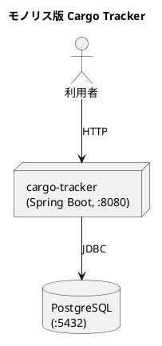

# 第 13 章 モノリスのデプロイ — Docker Compose 対 Kustomize

## はじめに

第 5 部では、実在の業務システム「国際貨物輸送システム（Cargo Tracker）」を題材に、アーキテクチャの違いがコンテナのデプロイ手段の選択にどう影響するかを学びます。同じ貨物追跡というドメインを、モノリス・イベント駆動マイクロサービス・ES/CQRS（Axon）・ES/CQRS（Kafka）という 4 つのアーキテクチャで実装した題材を使い、Docker Compose・Kustomize・Helm を比較します。

この章では最初のケースとして、**モノリス**版（Spring Boot + PostgreSQL の単一アプリケーション）を取り上げ、**Docker Compose** と **Kustomize** の 2 つの手段でデプロイして比較します。

実装は [`apps/case-studies/case-1-monolith/`](https://github.com/k2works/getting-started-docker-kubernetes/tree/main/apps/case-studies/case-1-monolith) にあります。アプリ本体のソース（`cargo-tracker/`）も同梱しているため、リポジトリ単体でビルド・デプロイを再現できます。

---

## 1. アーキテクチャ概要

モノリス版の Cargo Tracker は、貨物追跡の業務（予約・経路設計・荷役・追跡・請求）を 1 つの Spring Boot アプリケーションにまとめた構成です。

- **アプリケーション**: Spring Boot 4 / Java 25。Thymeleaf による画面、Spring Security による認証、Flyway による DB マイグレーション、MyBatis による永続化を持つ
- **データベース**: PostgreSQL 16
- **公開ポート**: 8080（`/actuator/health` でヘルスチェック）



デプロイの観点では「アプリ 1 つ + DB 1 つ」というシンプルな構成です。コンテナの数が少ないため、デプロイ手段による差は小さく見えますが、**単一ホスト向けの Compose とクラスタ向けの Kustomize の考え方の違い**を理解する好例になります。

### アプリイメージのビルド

アプリは multi-stage build で、ビルドステージ（`eclipse-temurin:25-jdk`）で Gradle により `bootJar` を生成し、実行ステージ（`eclipse-temurin:25-jre`）に成果物だけをコピーします。

```bash
docker build -t cargo-tracker:0.0.1 apps/case-studies/case-1-monolith/cargo-tracker
```

---

## 2. Docker Compose による実装

Docker Compose は、複数のコンテナを 1 つの YAML ファイルにまとめて単一ホスト上で起動する手段です。`apps/case-studies/case-1-monolith/compose/compose.yaml` を見てみましょう。

```yaml
services:
  postgres:
    image: postgres:16
    environment:
      POSTGRES_DB: cargo_tracker
      POSTGRES_USER: cargo_tracker
      # パスワードはファイルで渡す（実体は secrets で注入）
      POSTGRES_PASSWORD_FILE: /run/secrets/db_password
    secrets:
      - db_password
    volumes:
      - postgres_data:/var/lib/postgresql/data
    healthcheck:
      test: ["CMD-SHELL", "pg_isready -U cargo_tracker"]
      interval: 10s
      timeout: 5s
      retries: 5

  app:
    build:
      context: ../cargo-tracker
    image: cargo-tracker:0.0.1
    depends_on:
      postgres:
        condition: service_healthy
    environment:
      SPRING_PROFILES_ACTIVE: product
      DB_URL: jdbc:postgresql://postgres:5432/cargo_tracker
      DB_USERNAME: cargo_tracker
    # DB_PASSWORD は secrets のファイルから読み込んで起動する
    command:
      - "sh"
      - "-c"
      - 'export DB_PASSWORD="$$(cat /run/secrets/db_password)" && exec java $${JAVA_OPTS} -jar /app/app.jar'
    secrets:
      - db_password
    ports:
      - "18080:8080"
    healthcheck:
      test: ["CMD-SHELL", "curl -f http://localhost:8080/actuator/health || exit 1"]
      interval: 15s
      timeout: 5s
      retries: 5
      start_period: 60s

secrets:
  db_password:
    file: ./secrets/db_password

volumes:
  postgres_data:
```

ポイントは次のとおりです。

- **サービス間の名前解決**: `app` は `DB_URL` で `postgres` というサービス名を指定するだけで DB に接続できます。Compose が同一ネットワーク内で名前解決します
- **起動順序の制御**: `depends_on` の `condition: service_healthy` により、PostgreSQL が healthy になってからアプリを起動します
- **永続化**: `postgres_data` という named volume で DB データを永続化します
- **設定の注入**: `environment` で Spring の `product` プロファイルと DB 接続情報を渡します
- **機密情報のファイル注入**: パスワードは `environment` に直書きせず、`secrets` でコンテナ内の `/run/secrets/db_password` にマウントします。PostgreSQL は `POSTGRES_PASSWORD_FILE` でファイルを読み、アプリは `command` でファイルを読み出して `DB_PASSWORD` を組み立ててから起動します（第 4 章のタスクアプリと同じ方式）

### 起動と動作確認

secrets の実体ファイルを初回起動前に作成します。

```bash
cd apps/case-studies/case-1-monolith/compose
mkdir -p secrets && printf 'cargo_tracker' > secrets/db_password
docker compose up -d
```

アプリが起動すると、ヘルスチェックと画面アクセスが確認できます。

```bash
curl http://localhost:18080/actuator/health
# {"groups":["liveness","readiness"],"status":"UP"}

curl -s -o /dev/null -w '%{http_code} -> %{redirect_url}\n' http://localhost:18080/
# 302 -> http://localhost:18080/login   （Spring Security による認証リダイレクト）
```

Flyway により DB マイグレーションが自動適用され、`cargo` や `tracking_record` などの業務テーブルが作成されます。

---

## 3. Kustomize による実装

Kustomize は、Kubernetes のマニフェストをリソース種別ごとのファイルに分割し、`kustomization.yaml` で束ねる手段です。`apps/case-studies/case-1-monolith/k8s/kustomize/` は次の構成です。

```
k8s/kustomize/
├── kustomization.yaml   # 束ねる定義 + イメージタグ管理
├── namespace.yaml       # cargo-monolith namespace
├── secret.yaml          # DB 認証情報
├── postgres.yaml        # PVC + Deployment + Service
├── app.yaml             # Deployment + Service
└── ingress.yaml         # Ingress
```

`kustomization.yaml` がエントリポイントです。

```yaml
apiVersion: kustomize.config.k8s.io/v1beta1
kind: Kustomization

namespace: cargo-monolith

resources:
  - namespace.yaml
  - secret.yaml
  - postgres.yaml
  - app.yaml
  - ingress.yaml

images:
  - name: cargo-tracker
    newTag: 0.0.1
```

Compose との対応を見ると、考え方の違いが分かります。

- **Compose のファイル `secrets`（DB 認証）→ Kubernetes の `Secret`**: Compose では `secrets` でパスワードをファイル注入していましたが、Kubernetes では `secret.yaml` に DB 認証情報を定義し、アプリの `Deployment` から `secretKeyRef` で参照します
- **Compose の named volume → `PersistentVolumeClaim`**: `postgres.yaml` で PVC を宣言し、PostgreSQL の Pod にマウントします
- **Compose の `ports` 公開 → `Service` + `Ingress`**: クラスタ内通信は `Service`、外部公開は `Ingress` で行います
- **Compose の `healthcheck` → `readinessProbe` / `livenessProbe`**: アプリの `Deployment` で `/actuator/health` を監視します

アプリの `Deployment`（`app.yaml`）では、`product` プロファイルと DB 接続情報を環境変数で渡し、ヘルスチェックをプローブとして定義しています。

```yaml
          env:
            - name: SPRING_PROFILES_ACTIVE
              value: product
            - name: DB_URL
              value: jdbc:postgresql://postgres:5432/cargo_tracker
            - name: DB_USERNAME
              valueFrom:
                secretKeyRef:
                  name: db-credentials
                  key: POSTGRES_USER
            - name: DB_PASSWORD
              valueFrom:
                secretKeyRef:
                  name: db-credentials
                  key: POSTGRES_PASSWORD
          ports:
            - name: http
              containerPort: 8080
          readinessProbe:
            httpGet:
              path: /actuator/health
              port: http
            initialDelaySeconds: 30
            periodSeconds: 10
            failureThreshold: 12
```

`DB_HOST` 相当はクラスタ内の `Service` 名 `postgres` で解決されます。Compose と同様、サービス名による名前解決が効く点は共通です。

### デプロイと動作確認

```bash
kubectl apply -k apps/case-studies/case-1-monolith/k8s/kustomize
kubectl -n cargo-monolith get pods
# NAME                            READY   STATUS    RESTARTS   AGE
# cargo-tracker-xxxxxxxxx-xxxxx   1/1     Running   2          78s
# postgres-xxxxxxxxxx-xxxxx       1/1     Running   0          78s

kubectl -n cargo-monolith port-forward svc/cargo-tracker 18081:80
curl http://localhost:18081/actuator/health
# {"groups":["liveness","readiness"],"status":"UP"}
```

> 補足: アプリ起動が DB 準備より早いと初回プローブで再起動（`RESTARTS`）が発生することがありますが、`readinessProbe` の `failureThreshold` の範囲で復帰し、最終的に `1/1 Running` になります。

`kubectl kustomize apps/case-studies/case-1-monolith/k8s/kustomize` を実行すると、適用前に生成されるマニフェストを確認できます。

---

## 4. 環境差分の扱い

実運用ではローカル・ステージング・本番で設定が変わります。両手段の差分管理の考え方は次のとおりです。

- **Docker Compose**: ベースの `compose.yaml` に対し、`compose.override.yaml` や `-f` による複数ファイル合成、`.env` ファイルでの変数差し替えで対応します。第 2 部で見た echo の検証でも、ポートだけを差し替えるオーバーライドを使いました
- **Kustomize**: `base/` に共通定義を置き、`overlays/<env>/` で `patches` や `images`・`replicas` を上書きします。本ケースは単一構成のため base のみですが、第 8 章で見た taskapp のように overlay を追加すれば環境ごとの差分を宣言的に管理できます

どちらも「共通部分 + 差分」という構造は同じですが、Kustomize は Kubernetes リソースのフィールド単位でパッチを当てられる点が強力です。

---

## 5. ロギング基盤（EFK + DaemonSet）

[第 9 章](09-container-operations.md) で原則として学んだ **EFK（Elasticsearch + Fluentd + Kibana）+ DaemonSet** のログ集約パターンを、本ケースにも実装として組み込んでいます。各 Pod は標準出力にログを出すだけで、ノード単位で常駐する Fluentd がそれを収集し、Elasticsearch に蓄積、Kibana で検索・可視化します。

`k8s/kustomize/logging/` に次の 4 ファイルを置き、`kustomization.yaml` の `resources` に追加しています。

```
logging/
├── elasticsearch.yaml      # ConfigMap + PVC + Service + Deployment（単一ノード）
├── fluentd-daemonset.yaml  # ServiceAccount + ClusterRole/Binding + DaemonSet
├── kibana.yaml             # Deployment + Service（NodePort 30051）
└── kibana-setup-job.yaml   # index pattern を自動作成する Job
```

### Fluentd を DaemonSet で常駐させる

第 9 章のとおり、Fluentd は各ノードの `/var/log/containers` を `hostPath` で読み取り、ノード上の全 Pod のログをまとめて収集します。ここで本実装固有の要点が **ログ形式のパース**です。近年の Kubernetes（kind / Docker Desktop など）は containerd を使い、ログが CRI 形式（`<time> stdout F <message>`）で書かれます。Fluentd 既定の JSON パーサのままだと一致せず警告が出続けるため、環境変数で CRI 用のパーサを指定します。

```yaml
          env:
            - name: FLUENT_ELASTICSEARCH_HOST
              value: "elasticsearch"
            # containerd の CRI ログ形式に合わせる（既定の json だと不一致になる）
            - name: FLUENT_CONTAINER_TAIL_PARSER_TYPE
              value: "/^(?<time>.+) (?<stream>stdout|stderr) (?<logtag>[FP]) (?<log>.*)$/"
```

DaemonSet は Kubernetes API から Pod のメタデータを付与するため、`ServiceAccount` と読み取り専用の `ClusterRole`（`pods`・`namespaces` への get/list/watch）を与えています。ClusterRole はクラスタスコープのため、ケース間で名前が衝突しないよう `fluentd-cargo-monolith` のように namespace で修飾しています。

### Elasticsearch の運用上の勘所

ログは蓄積されるデータなので `PersistentVolumeClaim` で永続化します。学習用の単一ノード構成（`discovery.type=single-node`）ですが、2 点の実運用上の注意があります。

- **メモリ**: JVM heap（`-Xms512m -Xmx512m`）に加え、Lucene の mmap やダイレクトバッファなどのオフヒープが必要です。コンテナのメモリ上限を heap と同程度にすると OOMKilled になるため、`limits.memory` は heap の 3〜4 倍（2Gi）を確保します。
- **更新戦略**: 単一インスタンスが RWO の PVC を握るため、`strategy: Recreate` を指定します。既定の RollingUpdate だと旧 Pod の終了前に新 Pod が起動し、同じデータディレクトリを奪い合って `failed to obtain node locks` で起動に失敗します。

```yaml
spec:
  replicas: 1
  strategy:
    type: Recreate          # RWO PVC のため旧 Pod を終了してから新 Pod を起動
```

### Kibana を「開いたらすぐ使える」状態にする

Kibana は通常、初回に手動で index pattern を作成する必要があります。これを `kibana-setup` という `Job` で自動化し、Kibana の起動を待って index pattern `logstash-*` を作成、既定ビューを Discover に設定します。デプロイ後にブラウザを開けば、設定なしでログ検索を始められます。

```bash
# ロギング基盤はアプリと同時にデプロイされる（kubectl apply -k k8s/kustomize）
kubectl -n cargo-monolith get pods -l app.kubernetes.io/component=logging

# 収集状況の確認（logstash-* にログが蓄積される）
kubectl -n cargo-monolith exec deploy/elasticsearch -- curl -s 'http://localhost:9200/logstash-*/_count'

# Kibana を開く（kind では NodePort が localhost に出ないため port-forward が確実）
kubectl -n cargo-monolith port-forward svc/kibana 18081:5601   # → http://localhost:18081/
```

第 9 章で原則として学んだ EFK + DaemonSet を、各ケースの構成に組み込むことで、デプロイした瞬間からアプリ・インフラ双方のログを一元的に観測できます。

---

## 6. 比較考察

モノリス（アプリ 1 + DB 1）という小さな構成では、両手段の差は次のように整理できます。

| 観点 | Docker Compose | Kustomize |
|------|----------------|-----------|
| 対象 | 単一ホスト | Kubernetes クラスタ |
| ファイル数 | 1 ファイル | リソース種別ごとに分割（6 ファイル） |
| 記述量 | 少ない | 多い（種別ごとに apiVersion/kind/metadata） |
| 機密情報 | ファイルベース `secrets` | `Secret` |
| 永続化 | named volume | PVC |
| 公開 | ポート公開 | Service + Ingress |
| スケール・自己修復 | 限定的 | Deployment が標準で提供 |
| 学習コスト | 低い | 中（Kubernetes の概念が前提） |
| 適性 | ローカル開発・小規模 | 本番・スケール・可用性が必要な環境 |

モノリスのように構成要素が少ない場合、**ローカル開発や検証では Docker Compose の簡潔さが際立ち**ます。1 ファイルで全体を把握でき、`docker compose up` だけで起動します。

一方、**本番でスケールや自己修復、ローリングアップデートが必要になると Kubernetes（Kustomize）の価値が出てき**ます。記述量は増えますが、それは Service・Ingress・Probe・PVC といった本番運用に必要な関心事を明示的に宣言しているためです。

重要なのは、モノリスではこの差が「好みと運用要件の問題」にとどまる点です。次章以降のマイクロサービスでは構成要素が一気に増え、デプロイ手段の選択がより本質的な意味を持つようになります。

---

## まとめ

- モノリス版 Cargo Tracker（Spring Boot + PostgreSQL）を Docker Compose と Kustomize の両方でデプロイし、いずれも `/actuator/health` が UP になることを確認しました
- Compose の `environment`・named volume・`ports`・`healthcheck` は、Kubernetes ではそれぞれ `Secret`・PVC・`Service`/`Ingress`・`Probe` に対応します
- 構成要素が少ないモノリスでは、Compose の簡潔さと Kustomize の運用機能のトレードオフは緩やかです
- 第 9 章の EFK + DaemonSet を本ケースに組み込み、Fluentd（DaemonSet）→ Elasticsearch → Kibana のログ集約を `k8s/kustomize/logging/` で宣言しました（CRI ログ対応・ES の Recreate 戦略・index pattern の自動作成が実装上の勘所）
- 次章では、構成要素が大幅に増えるイベント駆動マイクロサービス（case-2）を題材に、Kustomize と Helm を比較します

---

- 次の章: [第 14 章 イベント駆動マイクロサービスのデプロイ — Kustomize 対 Helm](14-case-event-driven-kustomize-vs-helm.md)
- シリーズ目次: [Docker/Kubernetes 実践コンテナ解説](index.md)
