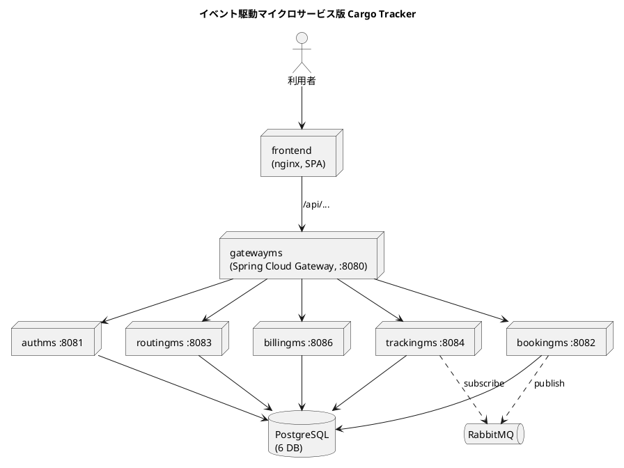

# 第 14 章 イベント駆動マイクロサービスのデプロイ — Kustomize 対 Helm

## はじめに

前章では構成要素の少ないモノリスを題材に、Docker Compose と Kustomize を比較しました。この章では、同じ国際貨物輸送システム（Cargo Tracker）を**イベント駆動マイクロサービス**として実装した版（case-2）を取り上げます。構成要素が一気に増えるため、デプロイ手段の選択がより本質的な意味を持ちます。

ここでの比較軸は **Kustomize 対 Helm** です。多数の似た構造を持つマイクロサービスを、どちらがどのように扱うかを実装と動作検証を通じて確認します。

実装は [`apps/case-studies/case-2-event-driven/`](https://github.com/k2works/getting-started-docker-kubernetes/tree/main/apps/case-studies/case-2-event-driven) にあります。バックエンド（Gradle マルチプロジェクト）とフロントエンドのソースを同梱しており、リポジトリ単体でビルド・デプロイを再現できます。

---

## 1. アーキテクチャ概要

イベント駆動版は、貨物追跡の業務をドメインごとのマイクロサービスに分割し、API ゲートウェイで束ね、サービス間の連携を RabbitMQ のイベントで行う構成です。



構成要素は次のとおりです。

- **gatewayms**（8080）: `/api/v1/auth/**` → authms、`/api/booking/**` → bookingms などのパスベースルーティング
- **6 つのマイクロサービス**: authms(8081)・bookingms(8082)・routingms(8083)・trackingms(8084)・handlingms(8085)・billingms(8086)
- **frontend**: SPA を配信し `/api/` を gateway へプロキシ
- **PostgreSQL**: 1 インスタンスに 6 データベース（`auth_db`・`booking_db` …）
- **RabbitMQ**: bookingms・trackingms 間のイベント連携

モノリスが「アプリ 1 + DB 1」だったのに対し、こちらは **アプリ 8 + インフラ 2（PostgreSQL・RabbitMQ）= 10 個のワークロード**になります。

### イメージのビルド

バックエンドは Gradle マルチプロジェクトです。一度のビルドで全サービスの jar を生成し、各サービスをイメージ化します。

```bash
cd apps/case-studies/case-2-event-driven/backend
./gradlew bootJar -x test
for s in gatewayms authms bookingms routingms trackingms handlingms billingms; do
  docker build -t "cargo2-$s:0.0.1" "$s"
done
cd ../frontend && docker build -t cargo2-frontend:0.0.1 .
```

---

## 2. Kustomize による実装

Kustomize では、リソースを種別・コンポーネントごとのファイルに分割します。`apps/case-studies/case-2-event-driven/k8s/kustomize/base/` の構成は次のとおりです。

```
base/
├── kustomization.yaml      # 束ねる定義 + configMapGenerator + images
├── namespace.yaml
├── secret.yaml             # DB 認証
├── init-databases.sql      # 6 DB 作成（ConfigMap 化）
├── postgres.yaml
├── rabbitmq.yaml
├── authms.yaml             # ┐
├── bookingms.yaml          # │ サービスごとに Deployment + Service を記述
├── routingms.yaml          # │
├── trackingms.yaml         # │
├── handlingms.yaml         # │
├── billingms.yaml          # ┘
├── gatewayms.yaml
├── frontend.yaml
└── ingress.yaml
```

注目すべきは、**6 つのバックエンドサービスがほぼ同じ構造の Deployment + Service を持つ**点です。違いは名前・ポート・接続先データベース・RabbitMQ の要否だけですが、Kustomize ではそれぞれを個別のファイルとして書き下します。例として `bookingms.yaml` の要点は次のとおりです。

```yaml
          env:
            - name: SPRING_PROFILES_ACTIVE
              value: local-prod
            - name: DB_URL
              value: jdbc:postgresql://postgres:5432/booking_db
            - name: DB_USERNAME
              valueFrom:
                secretKeyRef: { name: db-credentials, key: DB_USERNAME }
            - name: DB_PASSWORD
              valueFrom:
                secretKeyRef: { name: db-credentials, key: DB_PASSWORD }
            - name: RABBITMQ_HOST
              value: rabbitmq
```

`kustomization.yaml` では、6 DB の初期化 SQL を `configMapGenerator` で ConfigMap 化し、イメージタグを `images` で集中管理します。

```yaml
configMapGenerator:
  - name: postgres-init
    files:
      - init-databases.sql=init-databases.sql

images:
  - name: cargo2-authms
    newTag: 0.0.1
  # ... 8 イメージ分
```

### デプロイと動作確認

```bash
kubectl apply -k apps/case-studies/case-2-event-driven/k8s/kustomize/base
```

10 個の Pod がすべて `1/1 Running` になります（DB 起動待ちで一部 Pod に再起動が入りますが、`readinessProbe` の範囲で復帰します）。

```bash
kubectl -n cargo-event get pods
# authms / billingms / bookingms / frontend / gatewayms / handlingms /
# postgres / rabbitmq / routingms / trackingms  — すべて 1/1 Running
```

ゲートウェイ経由の疎通を確認します。

```bash
kubectl -n cargo-event port-forward svc/gatewayms 18090:8080
curl http://localhost:18090/actuator/health
# {"groups":["liveness","readiness"],"status":"UP"}

curl -s -o /dev/null -w '%{http_code}\n' http://localhost:18090/api/v1/auth/
# 401   ← ゲートウェイが authms に到達し、認証が要求された（疎通成功）
```

`/api/...` が各サービスで `401`（認証要求）を返すことは、ゲートウェイがバックエンドへ正しくルーティングできている証拠です（バックエンド停止なら 502/503 になります）。フロントエンドも `HTTP 200` で SPA を配信します。

---

## 3. Helm による実装

Helm は Go テンプレートでマニフェストを生成します。`apps/case-studies/case-2-event-driven/helm/cargo-event/` の構成は次のとおりです。

```
helm/cargo-event/
├── Chart.yaml
├── values.yaml             # 設定値（サービス一覧・認証・ポート）
└── templates/
    ├── infra.yaml          # secret + postgres-init + postgres + rabbitmq
    ├── microservices.yaml  # 6 サービスをループで生成
    ├── gateway.yaml
    ├── frontend.yaml
    └── ingress.yaml
```

最大の違いは、Kustomize で 6 ファイルに分かれていたバックエンドサービスが、**`values.yaml` のリスト + テンプレートのループ 1 つ**に集約される点です。

`values.yaml`：

```yaml
services:
  - name: authms
    port: 8081
    database: auth_db
    rabbit: false
  - name: bookingms
    port: 8082
    database: booking_db
    rabbit: true
  # ... routingms / trackingms / handlingms / billingms
```

`templates/microservices.yaml`（抜粋）：

```yaml
{{- range .Values.services }}
apiVersion: apps/v1
kind: Deployment
metadata:
  name: {{ .name }}
spec:
  template:
    spec:
      containers:
        - name: {{ .name }}
          image: cargo2-{{ .name }}:{{ $.Values.imageTag }}
          env:
            - name: DB_URL
              value: jdbc:postgresql://postgres:5432/{{ .database }}
            {{- if .rabbit }}
            - name: RABBITMQ_HOST
              value: rabbitmq
            {{- end }}
          ports:
            - { name: http, containerPort: {{ .port }} }
---
# ... Service も同じループ内で生成
{{- end }}
```

サービスを 1 つ増やすときは、Kustomize では新しいファイルを追加して `resources` と `images` に登録しますが、Helm では `values.yaml` のリストに 1 エントリ追加するだけで済みます。RabbitMQ の要否のような条件分岐も `{{- if .rabbit }}` で表現できます。

### 検証とデプロイ

```bash
helm lint apps/case-studies/case-2-event-driven/helm/cargo-event
# 1 chart(s) linted, 0 chart(s) failed

helm template cargo-event apps/case-studies/case-2-event-driven/helm/cargo-event | grep -c '^kind:'
# 24   （Kustomize の 25 から Namespace を除いた数。Helm は --create-namespace で名前空間を作る）

helm install cargo-event apps/case-studies/case-2-event-driven/helm/cargo-event \
  --namespace cargo-event --create-namespace
```

Helm 版も同様に 10 Pod が `1/1 Running` になり、ゲートウェイ経由の疎通（health UP、`/api/...` が 401）を確認できました。Helm はさらに**リリース管理**を提供します。

```bash
helm history cargo-event -n cargo-event
# REVISION  STATUS    CHART              DESCRIPTION
# 1         deployed  cargo-event-0.1.0  Install complete

helm uninstall cargo-event -n cargo-event
```

`helm upgrade` でリビジョンが増え、`helm rollback` で以前のリビジョンに戻せます。Kustomize（`kubectl apply`）にはこの世代管理がありません。

---

## 4. ロギング基盤（EFK + DaemonSet）

[第 9 章](09-container-operations.md) の **EFK（Elasticsearch + Fluentd + Kibana）+ DaemonSet** によるログ集約パターンを、本ケースにも実装として組み込んでいます（[第 13 章](13-case-monolith-compose-vs-kustomize.md) と同じ構成）。各 Pod は標準出力にログを出すだけで、各ノードに常駐する Fluentd がノード上の全 Pod のログを収集し、Elasticsearch に蓄積、Kibana で可視化します。

`k8s/kustomize/base/logging/` に 4 ファイルを置き、`kustomization.yaml` の `resources` に追加しています。

```
logging/
├── elasticsearch.yaml      # ConfigMap + PVC + Service + Deployment（単一ノード）
├── fluentd-daemonset.yaml  # ServiceAccount + ClusterRole/Binding + DaemonSet
├── kibana.yaml             # Deployment + Service（NodePort 30052）
└── kibana-setup-job.yaml   # index pattern logstash-* を自動作成する Job
```

実装上の勘所は第 13 章と共通です。

- **Fluentd**: `hostPath` で `/var/log/containers` を読み取る。containerd の CRI ログ形式に合わせて `FLUENT_CONTAINER_TAIL_PARSER_TYPE` を指定（既定の json だと不一致）。ClusterRole はケース間で衝突しないよう `fluentd-cargo-event` に修飾
- **Elasticsearch**: RWO PVC のため `strategy: Recreate`、heap の 3〜4 倍（2Gi）のメモリ上限で OOM を回避
- **Kibana**: `kibana-setup` Job が index pattern と既定ビュー（Discover）を自動設定し、開いたらすぐ使える

マイクロサービス構成では、Fluentd を 1 つの DaemonSet として常駐させるだけで、authms・bookingms・routingms… といった多数のサービスや RabbitMQ・PostgreSQL のログを、横断的に 1 か所（Kibana）で追えるのが利点です。

```bash
# アプリと同時にデプロイされる（kubectl apply -k k8s/kustomize/base）
kubectl -n cargo-event get pods -l app.kubernetes.io/component=logging
kubectl -n cargo-event exec deploy/elasticsearch -- curl -s 'http://localhost:9200/logstash-*/_count'
# Kibana を開く（kind では NodePort が localhost に出ないため port-forward が確実）
kubectl -n cargo-event port-forward svc/kibana 18081:5601   # → http://localhost:18081/
```

---

## 5. 比較考察

イベント駆動マイクロサービス（8 アプリ + 2 インフラ）という構成で、両手段の差は前章のモノリスより明確になります。

| 観点 | Kustomize | Helm |
|------|-----------|------|
| 似た構造の扱い | サービスごとにファイルを書き下す（6 ファイル） | `values` のリスト + ループで 1 定義に集約 |
| サービス追加 | ファイル追加 + `resources`/`images` 登録 | `values.yaml` に 1 エントリ追加 |
| 条件分岐 | パッチ／別ファイルで表現 | `{{- if }}` で表現 |
| パラメータ化 | overlay でフィールド上書き | `values.yaml` + `--set` |
| 配布 | Git リポジトリ | チャートのパッケージ配布 |
| リリース管理 | なし | リビジョン履歴・`rollback` |
| 学習コスト | 低〜中（YAML + パッチの理解） | 中（テンプレート言語の理解） |
| 透明性 | 生 YAML に近く読みやすい | テンプレートは `helm template` で展開して確認 |

**Kustomize の強み**は、生の YAML に近く「何がデプロイされるか」が直感的に分かる点です。少数のサービスや、環境差分が主に「値の上書き」で済む場合に向きます。

**Helm の強み**は、**似た構造の繰り返しをテンプレート化して重複を排除**できる点と、**リリース管理（バージョン・ロールバック）**です。マイクロサービスのように同型のコンポーネントが多数あり、チャートとして配布・バージョン管理したい場合に効果を発揮します。

本ケースでは、6 つの同型サービスをテンプレートのループ 1 つにまとめられた点が Helm の価値を最もよく示しています。一方、Kustomize の冗長さは「明示的で読みやすい」という長所の裏返しでもあり、どちらが優れているかは構成の規模とチームの運用方針によります。

---

## まとめ

- イベント駆動マイクロサービス版 Cargo Tracker（8 アプリ + PostgreSQL + RabbitMQ）を Kustomize と Helm の両方でデプロイし、いずれも 10 Pod が `1/1 Running` になり、ゲートウェイ経由の疎通を確認しました
- Kustomize は同型サービスを個別ファイルで明示的に書き下し、Helm は `values` のリスト + テンプレートのループで重複を排除します
- Helm はリリース管理（リビジョン・ロールバック）を提供し、Kustomize は生 YAML に近い透明性を提供します
- 第 9 章の EFK + DaemonSet を本ケースにも組み込み、Fluentd（DaemonSet）が多数のサービスのログを横断的に収集して Kibana で観測できるようにしました
- 次章では、同じドメインを ES/CQRS（Axon）で実装した case-3 を題材に、引き続き Kustomize と Helm を比較します

---

- 前の章: [第 13 章 モノリスのデプロイ — Docker Compose 対 Kustomize](13-case-monolith-compose-vs-kustomize.md)
- 次の章: [第 15 章 ES/CQRS マイクロサービス（Axon）のデプロイ — Kustomize 対 Helm](15-case-escqrs-axon-kustomize-vs-helm.md)
- シリーズ目次: [Docker/Kubernetes 実践コンテナ解説](index.md)
