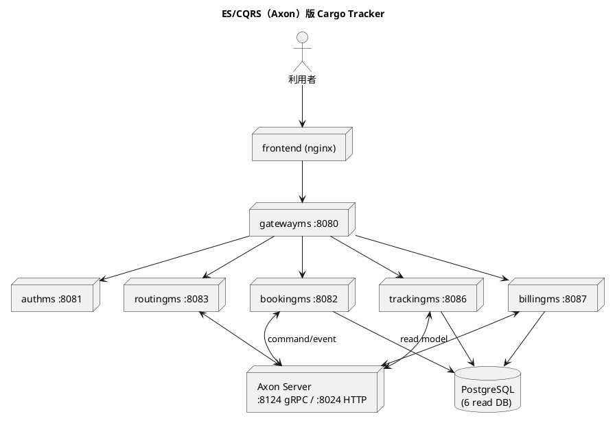

# 第 15 章 ES/CQRS マイクロサービス（Axon）のデプロイ — Kustomize 対 Helm

## はじめに

前章では、イベント連携を RabbitMQ で行うイベント駆動マイクロサービス（case-2）を Kustomize と Helm で比較しました。この章では、同じ国際貨物輸送システム（Cargo Tracker）を **Axon Framework によるイベントソーシング / CQRS（ES/CQRS）** で実装した版（case-3）を取り上げます。

比較軸は引き続き **Kustomize 対 Helm** です。case-2 との最大の違いは、サービス間連携の基盤が **Axon Server**（イベントストア兼コマンド/イベントルーター）になる点です。この「特別な単発インフラ」が加わることで、両手段の書き分けがどう変わるかを確認します。

実装は [`apps/case-studies/case-3-escqrs-axon/`](https://github.com/k2works/getting-started-docker-kubernetes/tree/main/apps/case-studies/case-3-escqrs-axon) にあります。

---

## 1. アーキテクチャ概要

ES/CQRS では、状態変更を「イベント」として記録（イベントソーシング）し、書き込み（Command）と読み取り（Query）のモデルを分離（CQRS）します。Axon Framework はこのパターンを実装するためのフレームワークで、**Axon Server** がイベントストアとメッセージルーティングを担います。



構成要素は次のとおりです。

- **gatewayms**（8080）: API ゲートウェイ
- **authms**（8081）: 認証（JWT 発行）。DB のみで Axon は使わない
- **bookingms**(8082)・**routingms**(8083)・**handlingms**(8085)・**trackingms**(8086)・**billingms**(8087): ES/CQRS サービス。Axon Server を利用
- **Axon Server**（8124 gRPC / 8024 HTTP）: イベントストア・ルーティング（standalone + DCB モード）
- **PostgreSQL**: 1 インスタンスに 6 つの **read DB**（CQRS の Read 側射影）
- **frontend**: SPA

case-2 の RabbitMQ が「メッセージブローカー」だったのに対し、Axon Server は「イベントストア + ルーター」という、より中心的でステートフルな役割を持ちます。

### イメージのビルド

case-3 の各サービス Dockerfile はマルチステージ（コンテナ内で Gradle ビルド）で自己完結しています。

```bash
cd apps/case-studies/case-3-escqrs-axon/backend
for s in gatewayms authms bookingms routingms trackingms handlingms billingms; do
  docker build -t "cargo3-$s:0.0.1" -f "$s/Dockerfile" .
done
cd ../frontend && docker build -t cargo3-frontend:0.0.1 .
```

---

## 2. Kustomize による実装

`apps/case-studies/case-3-escqrs-axon/k8s/kustomize/base/` の構成です。

```
base/
├── kustomization.yaml
├── namespace.yaml
├── secret.yaml             # DB 認証 + JWT_SECRET
├── init-databases.sh       # POSTGRES_MULTIPLE_DATABASES 用初期化（ConfigMap 化）
├── postgres.yaml           # 6 read DB を初期化する PostgreSQL
├── axonserver.yaml         # ★ Axon Server（standalone + DCB）
├── authms.yaml             # DB + JWT
├── bookingms.yaml          # ┐
├── routingms.yaml          # │ Axon サービス（DB + AXON_AXONSERVER_SERVERS）
├── handlingms.yaml         # │
├── trackingms.yaml         # │
├── billingms.yaml          # ┘
├── gatewayms.yaml
├── frontend.yaml
└── ingress.yaml
```

case-2 との違いは 2 点です。

**(1) Axon Server という単発インフラ**。`axonserver.yaml` に、standalone + DCB モードを有効化する環境変数を持つ Deployment と、gRPC(8124)/HTTP(8024) を公開する Service を定義します。

```yaml
          image: axoniq/axonserver:2026.0.0
          env:
            - name: AXONIQ_AXONSERVER_STANDALONE
              value: "true"
            - name: AXONIQ_AXONSERVER_STANDALONE_DCB
              value: "true"
          ports:
            - { name: http, containerPort: 8024 }
            - { name: grpc, containerPort: 8124 }
```

**(2) Axon を使うサービスだけ接続先を渡す**。Axon サービス（5 つ）には `AXON_AXONSERVER_SERVERS=axonserver:8124` を追加しますが、authms には付けません。Kustomize ではこの差を、サービスごとのファイルに env を「書く / 書かない」で表現します。

```yaml
# bookingms.yaml（Axon あり）
            - name: AXON_AXONSERVER_SERVERS
              value: axonserver:8124
# authms.yaml（Axon なし、代わりに JWT）
            - name: JWT_SECRET
              valueFrom: { secretKeyRef: { name: app-secrets, key: JWT_SECRET } }
```

PostgreSQL の複数 DB は、`POSTGRES_MULTIPLE_DATABASES` 環境変数と初期化スクリプト（`init-databases.sh` を ConfigMap 化して `/docker-entrypoint-initdb.d` にマウント）で作成します。

### デプロイと動作確認

```bash
kubectl apply -k apps/case-studies/case-3-escqrs-axon/k8s/kustomize/base
```

postgres + axonserver + 6 サービス + gateway + frontend の **10 Pod** がすべて `1/1 Running` になります。Axon サービスは Axon Server の起動を待つため、起動初期に再起動が入りますが、`readinessProbe` の範囲で復帰します。

```bash
# Axon Server の HTTP ヘルス
kubectl -n cargo-axon port-forward svc/axonserver 18024:8024
curl -s -o /dev/null -w '%{http_code}\n' http://localhost:18024/actuator/health   # 200

# ゲートウェイ経由の疎通
kubectl -n cargo-axon port-forward svc/gatewayms 18093:8080
curl http://localhost:18093/actuator/health                       # {"status":"UP"}
curl -s -o /dev/null -w '%{http_code}\n' http://localhost:18093/api/v1/bookings/   # 401（bookingms に到達）
```

`/api/v1/...` が `401`（認証要求）や `404`（パス未定義）を返すことは、ゲートウェイが各 ES/CQRS サービスに到達できている証拠です。

---

## 3. Helm による実装

`apps/case-studies/case-3-escqrs-axon/helm/cargo-axon/` の構成です。

```
helm/cargo-axon/
├── Chart.yaml
├── values.yaml
├── init-databases.sh
└── templates/
    ├── infra.yaml          # secret + postgres-init + postgres + axonserver
    ├── microservices.yaml  # 6 サービスをループ生成（axon/jwt を条件分岐）
    ├── gateway.yaml
    ├── frontend.yaml
    └── ingress.yaml
```

case-2 と同様、6 サービスを `values.yaml` のリスト + テンプレートのループに集約します。さらに **Axon の要否・JWT の要否をフラグで条件分岐**できる点が、この構成での Helm の強みを示します。

`values.yaml`：

```yaml
services:
  - name: authms
    port: 8081
    database: auth_db
    axon: false
    jwt: true
  - name: bookingms
    port: 8082
    database: booking_read_db
    axon: true
    jwt: false
  # ... routing / handling / tracking / billing（すべて axon: true）
```

`templates/microservices.yaml`（抜粋）：

```yaml
{{- range .Values.services }}
          env:
            - name: SPRING_DATASOURCE_URL
              value: jdbc:postgresql://postgres:5432/{{ .database }}
            {{- if .axon }}
            - name: AXON_AXONSERVER_SERVERS
              value: axonserver:8124
            {{- end }}
            {{- if .jwt }}
            - name: JWT_SECRET
              valueFrom: { secretKeyRef: { name: app-secrets, key: JWT_SECRET } }
            {{- end }}
{{- end }}
```

Kustomize では「Axon あり / なし」「JWT あり / なし」をファイルごとに手で書き分けていましたが、Helm では `axon: true/false`・`jwt: true/false` というデータと `{{- if }}` の条件分岐で表現できます。**サービスの性質をデータとして宣言し、テンプレートが構造を生成する**わけです。

Axon Server のような単発インフラは、`infra.yaml` に固定で記述します（ループ化しても 1 個なので利点が薄いため）。ここは Kustomize の `axonserver.yaml` とほぼ同じ記述になります。

### 検証とデプロイ

```bash
helm lint apps/case-studies/case-3-escqrs-axon/helm/cargo-axon
# 1 chart(s) linted, 0 chart(s) failed

helm install cargo-axon apps/case-studies/case-3-escqrs-axon/helm/cargo-axon \
  --namespace cargo-axon --create-namespace
```

Helm 版も 10 Pod が `1/1 Running` になり、Axon Server のヘルス・ゲートウェイ経由の疎通（health UP、`/api/v1/...` が 401）を確認できました。

---

## 4. ロギング基盤（EFK + DaemonSet）

[第 9 章](09-container-operations.md) の **EFK（Elasticsearch + Fluentd + Kibana）+ DaemonSet** によるログ集約パターンを、本ケースにも実装として組み込んでいます（[第 13 章](13-case-monolith-compose-vs-kustomize.md) と同じ構成）。各 Pod は標準出力にログを出すだけで、各ノードに常駐する Fluentd がノード上の全 Pod のログを収集し、Elasticsearch に蓄積、Kibana で可視化します。

`k8s/kustomize/base/logging/` に 4 ファイルを置き、`kustomization.yaml` の `resources` に追加しています。

```
logging/
├── elasticsearch.yaml      # ConfigMap + PVC + Service + Deployment（単一ノード）
├── fluentd-daemonset.yaml  # ServiceAccount + ClusterRole/Binding + DaemonSet
├── kibana.yaml             # Deployment + Service（NodePort 30053）
└── kibana-setup-job.yaml   # index pattern logstash-* を自動作成する Job
```

実装上の勘所は第 13 章と共通です。

- **Fluentd**: `hostPath` で `/var/log/containers` を読み取る。containerd の CRI ログ形式に合わせて `FLUENT_CONTAINER_TAIL_PARSER_TYPE` を指定（既定の json だと不一致）。ClusterRole はケース間で衝突しないよう `fluentd-cargo-axon` に修飾
- **Elasticsearch**: RWO PVC のため `strategy: Recreate`、heap の 3〜4 倍（2Gi）のメモリ上限で OOM を回避
- **Kibana**: `kibana-setup` Job が index pattern と既定ビュー（Discover）を自動設定し、開いたらすぐ使える

ES/CQRS 構成では、Axon Server を含む各サービスのアプリログ（Fluentd → Kibana）と、イベントストアそのものの状態（Axon Server ダッシュボード）を併用すると、コマンド・イベントの流れを多面的に追えます。

```bash
# アプリと同時にデプロイされる（kubectl apply -k k8s/kustomize/base）
kubectl -n cargo-axon get pods -l app.kubernetes.io/component=logging
kubectl -n cargo-axon exec deploy/elasticsearch -- curl -s 'http://localhost:9200/logstash-*/_count'
# Kibana を開く（kind では NodePort が localhost に出ないため port-forward が確実）
kubectl -n cargo-axon port-forward svc/kibana 18081:5601   # → http://localhost:18081/
```

---

## 5. 比較考察

ES/CQRS（Axon）という構成で、Kustomize と Helm の差は次のように整理できます。

| 観点 | Kustomize | Helm |
|------|-----------|------|
| 同型サービスの繰り返し | サービスごとにファイル（6 ファイル） | `values` のリスト + ループ |
| サービスの性質差（Axon/JWT） | ファイルに env を書く / 書かない | `axon`/`jwt` フラグ + `{{- if }}` |
| 単発インフラ（Axon Server） | 専用ファイル | テンプレートに固定記述（ループの利点は薄い） |
| 複数 DB 初期化 | `configMapGenerator` でスクリプトを ConfigMap 化 | `.Files.Get` でスクリプトを取り込み |
| リリース管理 | なし | リビジョン・ロールバック |

この章の要点は、**「繰り返し」と「単発」の混在をどう扱うか**です。

- **繰り返し（6 つの ES/CQRS サービス）**: Helm のループ + フラグ条件分岐が明確に有利です。サービスごとの差（Axon/JWT の要否）をデータで表現でき、新しいサービスの追加も `values` への 1 エントリで済みます。
- **単発インフラ（Axon Server・PostgreSQL）**: ループの恩恵がないため、Kustomize と Helm で記述量はほぼ同じです。Helm でも `infra.yaml` に素直に書きます。

つまり、**システムに同型コンポーネントが多いほど Helm のテンプレート化が効き、単発リソースが多いほど両者の差は縮まります**。Axon のような ES/CQRS では「Axon を使うサービス群」という同型の繰り返しが生じやすく、Helm のフラグによる条件分岐が読みやすさと保守性に寄与します。

一方、Axon Server の設定（standalone・DCB など）のような**繊細で固有の設定は、生 YAML に近い Kustomize のほうが意図を追いやすい**という見方もできます。

---

## まとめ

- ES/CQRS（Axon）版 Cargo Tracker（Axon Server + 6 サービス + PostgreSQL〔6 read DB〕+ gateway + frontend）を Kustomize と Helm の両方でデプロイし、いずれも 10 Pod が `1/1 Running`、Axon Server ヘルス 200、ゲートウェイ経由の疎通を確認しました
- 同型サービスの「性質の差」（Axon/JWT の要否）を、Kustomize はファイルの書き分けで、Helm は `values` のフラグ + `{{- if }}` で表現します
- 単発インフラ（Axon Server）は、どちらの手段でも記述量はほぼ同じです
- 第 9 章の EFK + DaemonSet を本ケースにも組み込み、Axon Server を含む各サービスのログを Fluentd（DaemonSet）→ Kibana で一元的に観測できるようにしました
- 次章では、同じ ES/CQRS を Kafka で実装した case-4 を題材に、引き続き Kustomize と Helm を比較します

---

- 前の章: [第 14 章 イベント駆動マイクロサービスのデプロイ — Kustomize 対 Helm](14-case-event-driven-kustomize-vs-helm.md)
- 次の章: [第 16 章 ES/CQRS マイクロサービス（Kafka）のデプロイ — Kustomize 対 Helm](16-case-escqrs-kafka-kustomize-vs-helm.md)
- シリーズ目次: [Docker/Kubernetes 実践コンテナ解説](index.md)
