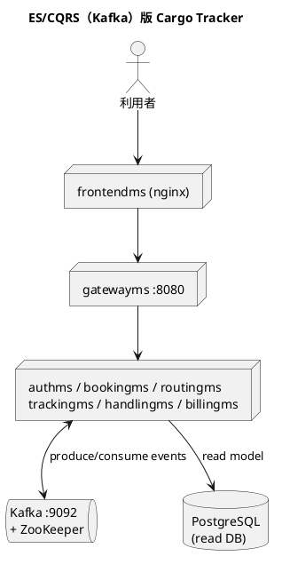

# 第 16 章 ES/CQRS マイクロサービス（Kafka）のデプロイ — Kustomize 対 Helm

## はじめに

前章では ES/CQRS を Axon Framework（専用イベントストア Axon Server）で実装した case-3 を比較しました。この章では、同じ ES/CQRS を **Kafka をイベントバックボーン**として実装した版（case-4）を取り上げます。比較軸は引き続き **Kustomize 対 Helm** です。

case-4 は、これまでの章で手づくりしてきたものより**実運用に近い完成度のデプロイ資産**を持っています。Kustomize には `base` と `overlays/`（local・prod）の階層があり、Helm には `_helpers.tpl` による命名・ラベルの共通化があります。本章では、この成熟した両構成を比較します。

実装は [`apps/case-studies/case-4-escqrs-kafka/`](https://github.com/k2works/getting-started-docker-kubernetes/tree/main/apps/case-studies/case-4-escqrs-kafka) にあります。

---

## 1. アーキテクチャ概要

case-3（Axon）が専用のイベントストアを使うのに対し、case-4 は汎用の **Kafka + ZooKeeper** をイベントストリーミング基盤に使います。



構成要素は次のとおりです。

- **gatewayms**（8080）: API ゲートウェイ（`/api/auth/**`・`/api/v1/bookings/**` などをルーティング）
- **6 マイクロサービス**: authms(8081)・bookingms(8082)・routingms(8083)・trackingms(8084)・handlingms(8085)・billingms
- **frontendms**: SPA（nginx）
- **Kafka**（9092 / 内部 29092）+ **ZooKeeper**: イベントストリーミング
- **PostgreSQL**: CQRS の read モデル DB

Kafka・ZooKeeper・PostgreSQL は **StatefulSet**、各サービス・frontendms は **Deployment** としてデプロイされます。

### イメージのビルド

各サービス・frontend はマルチステージ Dockerfile（Java 21）で自己完結しています。

```bash
cd apps/case-studies/case-4-escqrs-kafka
for s in gatewayms authms bookingms routingms trackingms handlingms billingms; do
  docker build -t "cargo-tracker/$s:latest" -f "backend/$s/Dockerfile" backend
done
docker build -t cargo-tracker/frontendms:latest frontend
```

---

## 2. Kustomize による実装（base + overlays）

これまでの章では `base` のみでしたが、case-4 は **overlay** を備えます。

```
k8s/
├── base/
│   ├── kustomization.yaml   # 全リソース + images（イメージタグ集中管理）
│   ├── namespace.yaml / configmap.yaml / secret.yaml
│   ├── zookeeper.yaml / kafka.yaml / postgresql.yaml   # StatefulSet
│   ├── authms.yaml … billingms.yaml / gatewayms.yaml / frontendms.yaml
│   └── ingress.yaml
└── overlays/
    ├── local/kustomization.yaml   # ローカル検証用
    └── prod/kustomization.yaml    # 本番用
```

`base` が共通定義、`overlays/<env>` が環境ごとの差分です。ローカル用 overlay は、`base` を参照しつつ gatewayms の Service を NodePort に**パッチ**します。

```yaml
# overlays/local/kustomization.yaml
resources:
  - ../../base
patches:
  - target:
      kind: Service
      name: gatewayms
    patch: |-
      - op: replace
        path: /spec/type
        value: NodePort
      - op: add
        path: /spec/ports/0/nodePort
        value: 30080
```

これが第 13 章で触れた「base + overlay」の実例です。環境差分を**パッチとして宣言**し、base には一切手を加えません。本番用 overlay では、レプリカ数やリソース、Ingress ホストなどを別途上書きします。

`base/kustomization.yaml` の `images` でイメージタグを集中管理する点は、これまでの章と同じです。

### デプロイと動作確認

overlay を指定して適用します。

```bash
kubectl apply -k apps/case-studies/case-4-escqrs-kafka/k8s/overlays/local
```

Kafka・ZooKeeper・PostgreSQL（StatefulSet）+ 6 サービス + gateway + frontendms の **11 ワークロード**がすべて `1/1 Running` になります。Kafka の起動を待つため、サービスに起動初期の再起動が入りますが復帰します。

ゲートウェイ経由の疎通を、正しいルートパスで確認します。

```bash
kubectl -n cargo-tracker port-forward svc/gatewayms 18096:8080
curl http://localhost:18096/actuator/health
# {"status":"UP","groups":["liveness","readiness"]}

curl -s -o /dev/null -w '%{http_code}\n' http://localhost:18096/api/v1/bookings   # 200
curl -s -o /dev/null -w '%{http_code}\n' http://localhost:18096/api/v1/voyages    # 200
curl -s -o /dev/null -w '%{http_code}\n' http://localhost:18096/api/v1/tracking   # 200
curl -s -o /dev/null -w '%{http_code}\n' -X POST http://localhost:18096/api/auth/login  # 400（authms 到達）
curl -s -o /dev/null -w '%{http_code}\n' http://localhost:18096/nope               # 404（ルートなし）
```

read 系エンドポイントが **200** を返すことは、Kafka 経由でイベントが配信され CQRS の read モデルが構築され、ゲートウェイ→サービス→DB が一貫して動作している証拠です。

---

## 3. Helm による実装（_helpers.tpl + microservices ループ）

`helm/cargo-tracker/` の構成です。

```
helm/cargo-tracker/
├── Chart.yaml
├── values.yaml
└── templates/
    ├── _helpers.tpl       # 命名・共通ラベルのヘルパー
    ├── config.yaml        # ConfigMap + Secret
    ├── infra.yaml         # zookeeper / kafka / postgresql（StatefulSet）
    ├── microservices.yaml # サービスをループ生成
    ├── frontend.yaml
    └── ingress.yaml
```

これまでの章の Helm チャートと同様、サービスは `values.yaml` のリスト + ループで生成します。case-4 の `values.yaml` は、サービスごとの差（ポート・DB・JWT・追加 Secret 環境変数）をデータで表現します。

```yaml
microservices:
  - name: authms
    port: 8081
    db: auth_db
    jwt: true
  - name: bookingms
    port: 8082
    db: booking_read_db
  - name: trackingms
    port: 8084
    db: tracking_read_db
    extraSecretEnv:
      - name: TRACKING_PUBLIC_TOKEN_SECRET
        # ...
```

case-4 の Helm が前章までと違うのは、**`_helpers.tpl` による命名・ラベルの共通化**を導入している点です。Helm の慣習に沿ったチャート名・フルネーム・共通ラベルのテンプレート関数を定義し、各リソースから `{{ include "..." . }}` で呼び出します。これにより、リリース名やチャート名を含む一貫した命名・ラベル付けが自動化されます。

`config.yaml` では、非機密設定を ConfigMap（`cargo-config`）に、機密値を Secret（`cargo-secret`）に展開し、`values.yaml` の `config.*` / `secret.*` から注入します。本番では `-f values-prod.yaml` や `--set` で機密値を上書きする運用が前提です（`NOTES.txt` でも警告されます）。

### 検証とデプロイ

```bash
helm lint apps/case-studies/case-4-escqrs-kafka/helm/cargo-tracker
# 1 chart(s) linted, 0 chart(s) failed

helm install cargo apps/case-studies/case-4-escqrs-kafka/helm/cargo-tracker \
  --namespace cargo-tracker --create-namespace
```

Helm 版も 11 ワークロードが `1/1 Running` になり、ゲートウェイ経由の read エンドポイントが `200` を返すことを確認しました。

---

## 4. ロギング基盤（EFK + DaemonSet）

[第 9 章](09-container-operations.md) の **EFK（Elasticsearch + Fluentd + Kibana）+ DaemonSet** によるログ集約パターンを、本ケースにも実装として組み込んでいます（[第 13 章](13-case-monolith-compose-vs-kustomize.md) と同じ構成）。各 Pod は標準出力にログを出すだけで、各ノードに常駐する Fluentd がノード上の全 Pod のログを収集し、Elasticsearch に蓄積、Kibana で可視化します。

base に `logging/` の 4 ファイルを置き、`k8s/base/kustomization.yaml` の `resources` に追加しています（local/prod 両 overlay に含まれます）。

```
logging/
├── elasticsearch.yaml      # ConfigMap + PVC + Service + Deployment（単一ノード）
├── fluentd-daemonset.yaml  # ServiceAccount + ClusterRole/Binding + DaemonSet
├── kibana.yaml             # Deployment + Service（NodePort 30054）
└── kibana-setup-job.yaml   # index pattern logstash-* を自動作成する Job
```

実装上の勘所は第 13 章と共通です。

- **Fluentd**: `hostPath` で `/var/log/containers` を読み取る。containerd の CRI ログ形式に合わせて `FLUENT_CONTAINER_TAIL_PARSER_TYPE` を指定（既定の json だと不一致）。ClusterRole はケース間で衝突しないよう `fluentd-cargo-tracker` に修飾
- **Elasticsearch**: RWO PVC のため `strategy: Recreate`、heap の 3〜4 倍（2Gi）のメモリ上限で OOM を回避
- **Kibana**: `kibana-setup` Job が index pattern と既定ビュー（Discover）を自動設定し、開いたらすぐ使える

Kafka をイベントバックボーンとする本ケースでは、各サービスのアプリログ（Fluentd → Kibana）と、トピックを流れるメッセージそのもの（Kafka UI）を併用すると、イベント駆動の挙動を多面的に観測できます。base に置いているため `overlays/local`・`overlays/prod` のどちらでもロギング基盤が含まれます。

```bash
# アプリと同時にデプロイされる（kubectl apply -k k8s/overlays/local）
kubectl -n cargo-tracker get pods -l app.kubernetes.io/component=logging
kubectl -n cargo-tracker exec deploy/elasticsearch -- curl -s 'http://localhost:9200/logstash-*/_count'
# Kibana を開く（kind では NodePort が localhost に出ないため port-forward が確実）
kubectl -n cargo-tracker port-forward svc/kibana 18081:5601   # → http://localhost:18081/
```

---

## 5. 比較考察

case-4 は、Kustomize・Helm の両方が「実運用を意識した成熟度」に達しています。ここまでの章の知見と合わせて、両手段の到達点を整理します。

| 観点 | Kustomize（base + overlays） | Helm（_helpers + values） |
|------|------------------------------|---------------------------|
| 環境差分 | overlay の `patches` で base を上書き | `values-<env>.yaml` / `--set` |
| 同型サービス | base にファイル（重複あり） | `values` のリスト + ループ |
| 命名・ラベル共通化 | `commonLabels` 等 | `_helpers.tpl` の include |
| 機密・設定 | `secret.yaml` / `configmap.yaml` | `config.yaml`（values 駆動） |
| ステートフル基盤（Kafka 等） | base に StatefulSet を記述 | テンプレートに固定記述 |
| リリース管理 | なし | リビジョン・ロールバック |

**環境差分の扱い**では、両者の思想の違いが明確です。Kustomize は「base を変えずに overlay でパッチを重ねる」宣言的な差分管理、Helm は「1 つのテンプレートを values で変化させる」パラメータ駆動です。本番・ローカルで構成が大きく変わる場合は overlay の見通しが良く、値だけが変わる場合は values が簡潔です。

**同型サービスの繰り返し**では、これまでの章と同じく Helm のループが有利です。一方、Kustomize は overlay により**環境ごとの差分管理**で独自の強みを持ちます。

case-4 のように成熟したプロジェクトでは、**「Kustomize か Helm か」は二者択一ではなく、両方を用意して状況に応じて使い分ける**ことも珍しくありません（実際 case-4 は両方を保守しています）。GitOps で環境別に宣言的管理したいなら Kustomize の overlay、チャートとして配布・バージョン管理したいなら Helm、という使い分けが現実的です。

---

## まとめ

- Kafka ES/CQRS 版 Cargo Tracker（Kafka + ZooKeeper + PostgreSQL〔StatefulSet〕+ 6 サービス + gateway + frontendms）を Kustomize（overlays/local）と Helm の両方でデプロイし、11 ワークロードが `1/1 Running`、ゲートウェイ経由の read エンドポイントが `200` を返すことを確認しました
- Kustomize は base + overlay で環境差分を宣言的に管理し、Helm は `_helpers.tpl` + values でテンプレートを成熟させます
- 成熟したプロジェクトでは両手段を併用し、GitOps（overlay）と配布（チャート）で使い分けることも現実的です
- 第 9 章の EFK + DaemonSet を base に組み込み、local/prod 両 overlay で各サービスのログを Fluentd（DaemonSet）→ Kibana で観測できるようにしました
- 次章では、第 13〜16 章の 4 ケースを横断し、アーキテクチャとデプロイ手段の関係を総括します

---

- 前の章: [第 15 章 ES/CQRS マイクロサービス（Axon）のデプロイ — Kustomize 対 Helm](15-case-escqrs-axon-kustomize-vs-helm.md)
- 次の章: [第 17 章 ケーススタディ実装比較まとめ](17-case-comparison-summary.md)
- シリーズ目次: [Docker/Kubernetes 実践コンテナ解説](index.md)
