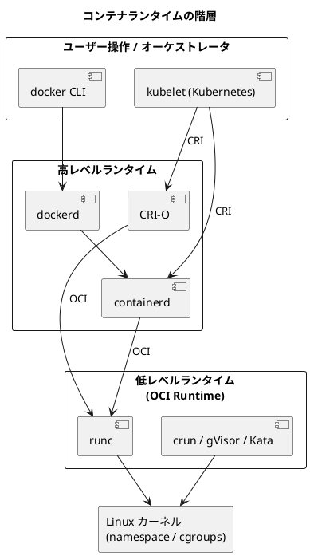

# 付録 C コンテナ開発・運用の Tips

## はじめに

本編では、コンテナの基礎から複数コンテナ構成、Kubernetes、継続的デリバリーまでを段階的に学んできました。実際の開発・運用の現場では、本編で扱いきれなかった細かな知識やコツが、生産性とトラブル対応力を大きく左右します。

この付録では、日々のコンテナ開発・運用を支える実践的な Tips を 5 つの観点から整理します。

1. **コンテナランタイム** — Docker / containerd / CRI-O や OCI、Kubernetes の CRI といった「コンテナを実際に動かす仕組み」の全体像
2. **Kubernetes の Tips** — `kubectl` の便利な使い方とトラブルシュート
3. **コンテナ開発・デプロイの Tips** — `.dockerignore`、レイヤキャッシュ、タグ運用などの実践テクニック
4. **生成 AI 活用** — Claude などの生成 AI をコンテナ開発に組み込む方法と注意点
5. **apk** — Alpine Linux のパッケージマネージャによる軽量イメージ作成

いずれも、本シリーズのサンプルリポジトリ（`container-kit`、`image-bootstrap`、`gihyo-docker-kuberbetes`）の実コードを引用しながら、実際に手を動かして確認できる形で解説します。

### 目次

1. [C.1 コンテナランタイム](#c1-コンテナランタイム)
2. [C.2 Kubernetes の Tips](#c2-kubernetes-の-tips)
3. [C.3 コンテナ開発・デプロイの Tips](#c3-コンテナ開発デプロイの-tips)
4. [C.4 生成 AI 技術を活用したコンテナ開発の効率化](#c4-生成-ai-技術を活用したコンテナ開発の効率化)
5. [C.5 Alpine Linux のパッケージマネージャ apk](#c5-alpine-linux-のパッケージマネージャ-apk)

---

## C.1 コンテナランタイム

「`docker run` でコンテナが起動する」とき、その裏側では複数のソフトウェアが層をなして連携しています。普段は意識しなくても動きますが、Kubernetes の運用やトラブルシュートでは、この層構造を理解しているかどうかが大きな差になります。

### ランタイムの階層構造

コンテナランタイムは、大きく「高レベルランタイム」と「低レベルランタイム」に分かれます。



- **低レベルランタイム（OCI ランタイム）**：実際に Linux カーネルの namespace や cgroups を操作してコンテナプロセスを生成・起動する最下層の実装です。デファクトスタンダードは **runc** です。OCI（Open Container Initiative）が定めた「ランタイム仕様（runtime-spec）」に準拠していれば、runc 以外にも `crun`、サンドボックス型の `gVisor`、軽量 VM 型の `Kata Containers` などを差し替えられます。
- **高レベルランタイム**：イメージの取得（pull）、展開、コンテナのライフサイクル管理、ネットワーク設定などを担います。**containerd** と **CRI-O** が代表的です。Docker のデーモン（dockerd）も内部で containerd を利用しています。

### OCI（Open Container Initiative）

OCI は、コンテナの相互運用性を保つための業界標準を策定する団体です。主に次の 2 つの仕様を定めています。

- **イメージ仕様（image-spec）**：コンテナイメージのフォーマット
- **ランタイム仕様（runtime-spec）**：コンテナの実行方法

`image-bootstrap` リポジトリの Dockerfile（`apps/image-bootstrap/Dockerfile`）にある `LABEL org.opencontainers.image.source` は、まさにこの OCI イメージ仕様で定義された標準ラベルです。

```dockerfile
FROM gcr.io/distroless/base-debian11:nonroot
LABEL org.opencontainers.image.source=https://github.com/gihyodocker/image-bootstrap
```

`org.opencontainers.image.source` を付与しておくと、GitHub Container Registry などのレジストリ側でイメージとソースリポジトリが自動的に関連づけられます。OCI 標準に従うことで、ツールやレジストリをまたいだ相互運用が可能になります。

### Kubernetes と CRI（Container Runtime Interface）

Kubernetes 自身はコンテナを直接動かしません。各ノードで動く **kubelet** が、**CRI（Container Runtime Interface）** という gRPC のインターフェースを通じて高レベルランタイムに指示を出します。

- **CRI** は「kubelet とコンテナランタイムの間の共通プロトコル」です。CRI を実装したランタイムであれば、Kubernetes はどれでも利用できます。
- 代表的な CRI 実装が **containerd** と **CRI-O** です。

かつて Kubernetes は Docker を直接サポートしていましたが、Docker は CRI を直接実装していなかったため、`dockershim` という変換層を介していました。この `dockershim` は Kubernetes v1.24 で削除されました。ただし、これは「Docker で作ったイメージが動かなくなる」という意味ではありません。Docker が作るイメージは OCI イメージ仕様に準拠しているため、containerd や CRI-O でそのまま動作します。変わったのは「ノード上でコンテナを動かす高レベルランタイム」だけです。

### 使っているランタイムを確認する

クラスタの各ノードがどのランタイムを使っているかは、次のコマンドで確認できます（出力は例です）。

```bash
kubectl get nodes -o wide
# CONTAINER-RUNTIME 列に containerd://1.7.x や cri-o://1.28.x のように表示される
```

この情報は、ノードレベルのトラブルシュートやセキュリティ評価の出発点になります。

---

## C.2 Kubernetes の Tips

Kubernetes の運用は、`kubectl` をいかに使いこなすかにかかっています。ここでは、現場で頻繁に使う `kubectl` のテクニックと、トラブルシュートの定石を整理します。

### 出力フォーマットを使いこなす

`kubectl get` の `-o` オプションで、目的に応じた形式の出力が得られます。

```bash
# マニフェストを YAML で丸ごと取得（既存リソースを雛形にするときに便利）
kubectl get deployment web -o yaml

# JSONPath で特定のフィールドだけ抜き出す（例: Pod の IP 一覧）
kubectl get pods -o jsonpath='{.items[*].status.podIP}'

# カスタムカラムで一覧表示
kubectl get pods -o custom-columns=NAME:.metadata.name,STATUS:.status.phase
```

`-o yaml` は、稼働中のリソース定義をそのままファイルに保存し、Git 管理されたマニフェストへ反映する出発点として重宝します。`-o jsonpath` は、スクリプトに組み込んで特定の値だけをプログラム的に取り出すときに役立ちます。

### コンテナに入る・通信する・ファイルをやり取りする

```bash
# 稼働中の Pod でコマンドを実行（シェルに入る）
kubectl exec -it web-xxxxx -- /bin/sh

# Pod のポートをローカルに転送（Service を経由せずに直接アクセス）
kubectl port-forward pod/web-xxxxx 8080:80

# Pod とローカルの間でファイルをコピー
kubectl cp web-xxxxx:/var/log/app.log ./app.log
```

`port-forward` は、Ingress や LoadBalancer を設定しなくても、開発中のサービスへ手元のブラウザや `curl` からアクセスできるため、動作確認に欠かせません。

### コンテキストと名前空間の切り替え

複数のクラスタや名前空間を扱うようになると、操作対象を間違える事故が起こりがちです。`kubectx` と `kubens` を導入すると切り替えが安全かつ高速になります。

```bash
# クラスタ（コンテキスト）の切り替え
kubectx                 # 一覧表示・対話選択
kubectx my-prod-cluster # 指定して切り替え

# 名前空間の切り替え
kubens                  # 一覧表示・対話選択
kubens task-app         # 以降の kubectl のデフォルト名前空間を変更
```

標準の `kubectl config use-context` や `kubectl config set-context --current --namespace=...` でも同じことができますが、`kubectx` / `kubens` の方が短く、現在の対象を視覚的に確認しやすいのが利点です。

### デバッグ用 Pod を使う

本番イメージは軽量化のため `curl` や `dig` などのツールを含まないことがほとんどです（C.3、C.5 参照）。そこで、クラスタ内のネットワークや DNS を調査するために、ツール一式を詰めた「デバッグ用コンテナ」を一時的に起動するテクニックが有効です。

本シリーズの `container-kit` リポジトリには、まさにこの用途のためのデバッグ用イメージが用意されています。`apps/container-kit/containers/debug/Dockerfile` は次の内容です。

```dockerfile
FROM ubuntu:23.10

LABEL org.opencontainers.image.source=https://github.com/gihyodocker/container-kit

RUN apt update -y
RUN apt install -y curl wget git zip telnet vim default-mysql-client iputils-ping net-tools dnsutils
```

`curl`、`telnet`、`ping`（iputils-ping）、`net-tools`、`dnsutils`、MySQL クライアントなど、調査に必要なツールがまとめて入っています。このイメージ（`ghcr.io/gihyodocker/debug`）をクラスタ内で起動すれば、対話的にネットワーク調査ができます。

```bash
# デバッグ用 Pod を起動してシェルに入る（終了時に自動削除）
kubectl run debug --rm -it --image=ghcr.io/gihyodocker/debug -- /bin/bash

# Pod 内から、Service の名前解決や疎通を確認する（例）
# nslookup mysql
# curl -v http://web/healthz
# mysql -h mysql -u root -p
```

`container-kit` には、このほかにもリバースプロキシ用の `simple-nginx-proxy` や、検証用ジョブの `time-limit-job` といった補助コンテナが含まれています（出典: `apps/container-kit/README-ja.md`）。

### トラブルシュートの定石

Pod が起動しない、すぐ落ちる、といったときの調査手順を順番に示します。

```bash
# 1. リソースの状態と直近のイベントを確認する（最初に見るべき情報）
kubectl describe pod web-xxxxx

# 2. クラスタ全体のイベントを時系列で確認する
kubectl get events --sort-by=.lastTimestamp

# 3. コンテナのログを確認する
kubectl logs web-xxxxx

# 4. クラッシュして再起動した場合、直前のコンテナのログを見る
kubectl logs web-xxxxx --previous
```

ポイントは次の通りです。

- `kubectl describe` の末尾に表示される **Events** は、イメージ取得失敗（`ErrImagePull`）、スケジューリング不可、ヘルスチェック失敗など、原因の手がかりが集約されています。まずここを見るのが鉄則です。
- コンテナが起動直後にクラッシュを繰り返す（`CrashLoopBackOff`）場合、現在のコンテナのログは空のことが多いため、`--previous` で「落ちた直前のコンテナ」のログを確認します。これがクラッシュ原因を突き止める最重要コマンドです。

---

## C.3 コンテナ開発・デプロイの Tips

ここでは、イメージのビルドからデプロイまでの間で効いてくる、実践的な小技を整理します。これらはいずれも「変更を楽に安全にできる」状態を保つための工夫です。

### .dockerignore でビルドコンテキストを絞る

`docker build` は、まずカレントディレクトリ一式（ビルドコンテキスト）を Docker デーモンへ送ります。`.git` ディレクトリや `node_modules`、ログファイルなどが含まれていると、ビルドが遅くなるだけでなく、不要なファイルがイメージに混入する原因にもなります。

`.dockerignore` で除外対象を指定しておきましょう（例）。

```text
.git
node_modules
*.log
tmp/
.env
```

特に `.env` のような機密情報を含むファイルは、誤ってイメージに取り込まないよう必ず除外します。

### レイヤキャッシュを意識した命令順序

Dockerfile の各命令は「レイヤ」を生成し、Docker は変更がなければキャッシュを再利用します。キャッシュを最大限活かすコツは、**変更頻度の低い命令を先に、高い命令を後に書く**ことです。

```dockerfile
# 良い例: 依存定義を先にコピーして依存解決し、ソースは後でコピーする
COPY package.json package-lock.json ./
RUN npm ci
COPY . .
```

このように書くと、ソースコードを変更しても `package.json` が変わらない限り `npm ci` のレイヤがキャッシュされ、ビルドが大幅に高速化します。逆に最初に `COPY . .` してしまうと、ソースを 1 行直すだけで依存解決からやり直しになります。

### latest を避けて不変タグを使う

イメージのタグに `latest` を使うのは、運用上の事故のもとです。`latest` は「最新を指す可変な別名」であり、いつの間にか中身が変わってしまうため、次の問題を招きます。

- どのバージョンが本番で動いているか特定できない
- 環境ごとに異なるイメージが動いてしまい、再現性が失われる
- ロールバック先が分からなくなる

代わりに、Git のコミットハッシュやセマンティックバージョンなど、**一度割り当てたら中身が変わらない不変タグ**を使います。

```bash
# 推奨: 内容と一対一に対応する不変なタグ
docker build -t myapp:1.4.2 .
docker build -t myapp:$(git rev-parse --short HEAD) .

# 非推奨: 中身が変わりうる可変タグ
docker build -t myapp:latest .
```

### ヘルスチェックを設定する

コンテナが「プロセスは生きているが、アプリとしては正常に応答できない」状態を検知するために、ヘルスチェックを設定します。

Dockerfile では `HEALTHCHECK`、Kubernetes では `livenessProbe`（生存確認）と `readinessProbe`（リクエスト受付可否）を使います。

```yaml
# Kubernetes の Probe（例）
readinessProbe:
  httpGet:
    path: /healthz
    port: 8080
  initialDelaySeconds: 5
  periodSeconds: 10
livenessProbe:
  httpGet:
    path: /healthz
    port: 8080
  periodSeconds: 15
```

`readinessProbe` が失敗している Pod には Service からトラフィックが流れなくなり、`livenessProbe` が失敗し続ける Pod は再起動されます。両者を使い分けることで、無停止デプロイや自動復旧が機能します。

### リソース制限（requests / limits）を設定する

Pod ごとに CPU・メモリの `requests`（最低保証量）と `limits`（上限）を設定しておくと、特定の Pod がノードのリソースを食い潰して他に影響を与える事態を防げます。

```yaml
resources:
  requests:
    cpu: "100m"
    memory: "128Mi"
  limits:
    cpu: "500m"
    memory: "256Mi"
```

`requests` はスケジューリングの判断材料となり、`limits` を超えるとメモリの場合は OOMKill、CPU の場合はスロットリングされます。適切な値は実測に基づいて調整します。

### 非 root ユーザーで実行する

コンテナ内のプロセスを root のまま動かすと、万一の侵害時の被害が大きくなります。本シリーズの `image-bootstrap` では、distroless の非 root イメージを使い、`USER` を明示しています（`apps/image-bootstrap/Dockerfile`）。

```dockerfile
FROM gcr.io/distroless/base-debian11:nonroot

COPY --from=build --chown=nonroot:nonroot /go/src/github.com/gihyodocker/image-bootstrap/bin/server /usr/local/bin/

USER nonroot

CMD ["server"]
```

ビルド成果物のみを含む distroless イメージに、非 root ユーザーで実行する構成を組み合わせることで、攻撃対象領域を最小化しています。

### イメージの脆弱性スキャン

ビルドしたイメージに既知の脆弱性が含まれていないかは、CI に脆弱性スキャンを組み込んで継続的にチェックします。`image-bootstrap` では Trivy を使っており、`apps/image-bootstrap/trivy.yaml` で複数のスキャナを有効化しています。

```yaml
scan:
  scanners:
    - vuln
    - config
    - secret
```

- `vuln`：OS パッケージやライブラリの既知脆弱性
- `config`：Dockerfile や IaC の設定ミス
- `secret`：イメージ内に埋め込まれた機密情報（API キーなど）

ビルドのたびにこのスキャンを走らせることで、危険なイメージのデプロイを未然に防げます。

---

## C.4 生成 AI 技術を活用したコンテナ開発の効率化

近年、Claude をはじめとする生成 AI は、コンテナ開発・運用のさまざまな場面で強力なアシスタントになります。ここでは、具体的な活用シーンと、安全に使うための注意点を整理します。

### 活用シーン

#### Dockerfile・マニフェスト・CI 設定の生成とレビュー

「Go アプリ用の Multi-stage build な Dockerfile を、distroless ベースで非 root 実行にして」といった要件を伝えると、雛形を素早く生成できます。既存の Dockerfile を貼り付けて「レイヤキャッシュとイメージサイズの観点で改善点を指摘して」と頼めば、レビュアーとしても機能します。

Kubernetes マニフェストや GitHub Actions のワークフロー、Helm チャートのように、定型的だが記述量が多くミスしやすいファイルは、生成 AI が特に得意とする領域です。

#### エラーログの解析

`CrashLoopBackOff` の原因が分からないとき、`kubectl describe` や `kubectl logs --previous`（C.2 参照）の出力を貼り付けて「このログから考えられる原因と切り分け手順を教えて」と尋ねると、調査の方向性を素早く絞り込めます。長く読みづらいスタックトレースの要約にも有効です。

#### コマンド補完・ワンライナー作成

「特定の名前空間で、Running でない Pod だけを `jsonpath` で抽出する `kubectl` コマンドを書いて」のように、うろ覚えのオプションや複雑な `jsonpath` 式の組み立てを任せられます。

### 注意点

生成 AI は強力ですが、出力をそのまま信じてはいけません。本シリーズの「クリティカルシンキング」の考え方、すなわち「信じるにたる根拠がないかぎり信じるな」という姿勢が、ここでも重要になります。

- **生成物は必ず検証する**：生成された Dockerfile やマニフェストは、存在しないオプションや古い書き方（例: 削除済みの API バージョン、`dockershim` 前提の記述）を含むことがあります。手元で `docker build` や `kubectl apply --dry-run=server` を実行し、実際に動くこと・意図通りであることを確認してから採用します。
- **機密情報を渡さない**：API キー、パスワード、`.env` の中身、本番の接続情報、社外秘のソースコードなどを、そのままプロンプトに貼り付けてはいけません。ログを共有する際は、トークンや IP アドレスなどをマスクしてから渡します。利用するサービスのデータ取り扱いポリシーも事前に確認します。
- **設計判断は人間が行う**：「どのアーキテクチャを採用するか」「どこまでセキュリティを担保するか」といった責任を伴う判断は、生成 AI に丸投げせず、提案を一案として参考にしつつ最終決定は人間が下します。
- **再現性のある形に落とす**：生成 AI とのやり取りで得た成果物は、必ず Git 管理されたファイルや ADR（アーキテクチャ決定記録）に残し、「なぜそうしたか」を含めてチームで共有します。

生成 AI は「考える代わり」ではなく「考えを加速する道具」です。最終的な品質と安全に責任を持つのは、あくまで開発者自身です。

---

## C.5 Alpine Linux のパッケージマネージャ apk

軽量なコンテナイメージを作るうえで、ベースイメージに **Alpine Linux** を選ぶ場面は多くあります。ここでは、Alpine が軽量な理由と、そのパッケージマネージャ **apk** の使い方を、実際の Dockerfile を引用しながら解説します。

### Alpine Linux が軽量な理由

一般的な Linux ディストリビューション（Ubuntu や Debian）のベースイメージが数百 MB あるのに対し、Alpine のベースイメージはわずか数 MB です。この差は主に次の 2 つの選択によります。

- **musl libc**：標準 C ライブラリに、一般的な glibc ではなく軽量な **musl libc** を採用しています。
- **BusyBox**：`ls` や `cat` などの基本コマンド群を、個別のバイナリではなく **BusyBox** という単一の多機能バイナリで提供しています。

この徹底した軽量化により、イメージサイズの削減、pull の高速化、攻撃対象領域の縮小といったメリットが得られます。

### apk の基本コマンド

apk（Alpine Package Keeper）は Alpine の公式パッケージマネージャです。

```bash
# パッケージインデックスを更新する
apk update

# パッケージをインストールする
apk add curl

# パッケージを削除する
apk del curl
```

### apk add --no-cache でキャッシュを残さない

コンテナイメージでは、`apk add` の際に `--no-cache` を付けるのが定石です。これは「パッケージインデックスのキャッシュをローカルに残さない」オプションで、`apk update` を別途実行する必要もなくなり、イメージサイズを抑えられます。

`gihyo-docker-kuberbetes` の `ch09/ch09_3_2/Dockerfile` は、このシンプルな使い方の例です。

```dockerfile
FROM alpine:3.7

RUN apk add --no-cache wget
```

`--no-cache` を使わずに `apk update && apk add` とすると、`/var/cache/apk` にインデックスが残り、その分イメージが肥大化します。

### --virtual でビルド依存をまとめて削除する

「ビルド時にだけ必要だが、実行時には不要」なツール（コンパイラやダウンロード用の `wget` など）をイメージに残すと、無駄に大きく、かつ攻撃対象も増えます。これを解決するのが `--virtual` を使った**仮想パッケージ**のテクニックです。

`--virtual=<名前>` でインストールしたパッケージ群に仮想的な名前を付けておき、ビルドが終わったら `apk del <名前>` でまとめて削除します。

`gihyo-docker-kuberbetes` の `ch10/ch10_2_1/Dockerfile` が、この典型的なパターンです。`jq` のバイナリをダウンロードして配置したあと、ダウンロードに使った `wget` を削除しています。

```dockerfile
FROM alpine:3.7

RUN apk add --no-cache --virtual=build-deps wget && \
    wget https://github.com/stedolan/jq/releases/download/jq-1.5/jq-linux64 && \
    mv jq-linux64 /usr/local/bin/jq && \
    chmod +x /usr/local/bin/jq && \
    apk del build-deps

ENTRYPOINT ["/usr/local/bin/jq", "-C"]
CMD [""]
```

ここでのポイントは 2 つあります。

1. `wget` を `build-deps` という仮想パッケージ名でインストールしている
2. 一連の処理を **1 つの `RUN` 命令**（`&&` で連結）にまとめ、最後に `apk del build-deps` している

なぜ 1 つの `RUN` にまとめるかというと、Dockerfile では `RUN` ごとにレイヤが作られるためです。インストールと削除を別の `RUN` に分けると、削除前の状態（`wget` が入った状態）が下のレイヤとして残ってしまい、イメージサイズが減りません。同じ `RUN` の中でインストールと削除を完結させることで、`wget` を含まない最終レイヤだけが残ります。

### ビルド依存と実行時依存を区別する

実行時にも必要なパッケージは削除してはいけません。`--virtual` でまとめるのは「ビルド時だけ必要なもの」に限ります。

`gihyo-docker-kuberbetes` の `ch09/ch09_3_1/Dockerfile` は、この区別を明確にコメントで示した良い例です。

```dockerfile
FROM alpine:3.7

WORKDIR /
ENV GOPATH /go

# ① ビルド時だけ必要なライブラリ・ツールのインストール
RUN apk add --no-cache --virtual=build-deps go git gcc g++

# ② 実行時にも必要なライブラリ・ツールのインストール
RUN apk add --no-cache ca-certificates

# ③ todoapiをビルドし、実行ファイルをつくる
COPY . /go/src/github.com/gihyodocker/todoapi
RUN go get github.com/go-sql-driver/mysql
RUN go get gopkg.in/gorp.v1
RUN cd /go/src/github.com/gihyodocker/todoapi && go build -o bin/todoapi cmd/main.go
RUN cd /go/src/github.com/gihyodocker/todoapi && cp bin/todoapi /usr/local/bin/

# ④ ビルド時だけ必要なライブラリ・ツールのアンインストール
RUN apk del --no-cache build-deps

CMD ["todoapi"]
```

ここでは、コンパイラ群（`go git gcc g++`）を `build-deps` としてまとめて最後に削除する一方、実行時に TLS 通信で必要な `ca-certificates` は別途インストールして残しています。

なお、この例ではビルドとアンインストールが複数の `RUN` に分かれているため、`build-deps` を含む中間レイヤは残ります。イメージを最小化するなら、前述のように一連の処理を 1 つの `RUN` にまとめるか、第 10 章で扱った **Multi-stage builds** を使い、ビルド専用ステージと実行専用ステージを完全に分離するアプローチがより効果的です。`--virtual` パターンは「シングルステージのまま手軽にビルド依存を削りたい」場合に有効な手法と位置づけられます。

### apk の Tips まとめ

| やりたいこと | コマンド |
|---|---|
| キャッシュを残さずインストール | `apk add --no-cache <pkg>` |
| ビルド依存をまとめてインストール | `apk add --no-cache --virtual=build-deps <pkg...>` |
| ビルド依存をまとめて削除 | `apk del build-deps` |
| 効果を出すコツ | インストール〜削除を 1 つの `RUN` にまとめる |

---

## まとめ

この付録では、コンテナ開発・運用を支える実践的な Tips を 5 つの観点から解説しました。

- **C.1 コンテナランタイム**：Docker / containerd / CRI-O、OCI ランタイム（runc）、Kubernetes の CRI という層構造を理解することで、ランタイムの差し替えやノードレベルのトラブルシュートに対応できます。`dockershim` 削除後も、OCI 準拠のイメージはそのまま動きます。
- **C.2 Kubernetes の Tips**：`-o yaml`／`jsonpath`、`exec`／`port-forward`／`cp`、`kubectx`／`kubens` を使いこなし、`container-kit` のデバッグ用 Pod と `describe`／`events`／`logs --previous` を組み合わせれば、調査の速度と精度が上がります。
- **C.3 コンテナ開発・デプロイの Tips**：`.dockerignore`、レイヤキャッシュ、不変タグ、ヘルスチェック、リソース制限、非 root 実行、脆弱性スキャンといった工夫が、再現性と安全性を支えます。
- **C.4 生成 AI 活用**：Dockerfile やマニフェスト生成、ログ解析、コマンド補完で開発を加速できます。ただし生成物は必ず検証し、機密情報を渡さず、設計判断は人間が担うことが原則です。
- **C.5 apk**：Alpine は musl libc と BusyBox により軽量です。`apk add --no-cache` と `--virtual` パターンを 1 つの `RUN` にまとめることで、ビルド依存を残さない小さなイメージを作れます。

いずれの Tips も、本シリーズが一貫して目指す「変更を楽に安全にできて役に立つソフトウェア」を、コンテナという実行基盤の上で実現するための具体的な手段です。日々の開発・運用の中で少しずつ取り入れていきましょう。

---

## 関連リンク

- [付録 B さまざまなコンテナオーケストレーション環境](appendix-b-orchestration-environments.md)
- [第 10 章 最適なコンテナイメージ作成と運用](10-optimal-container-image.md)
- [目次](index.md)
