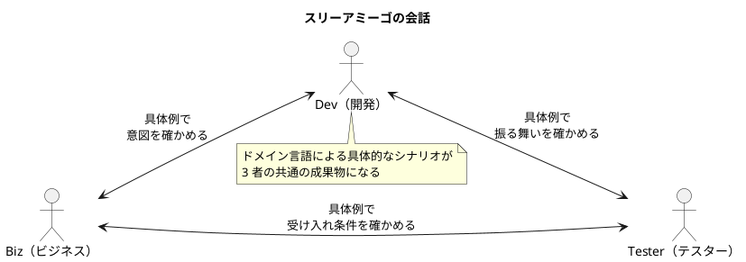
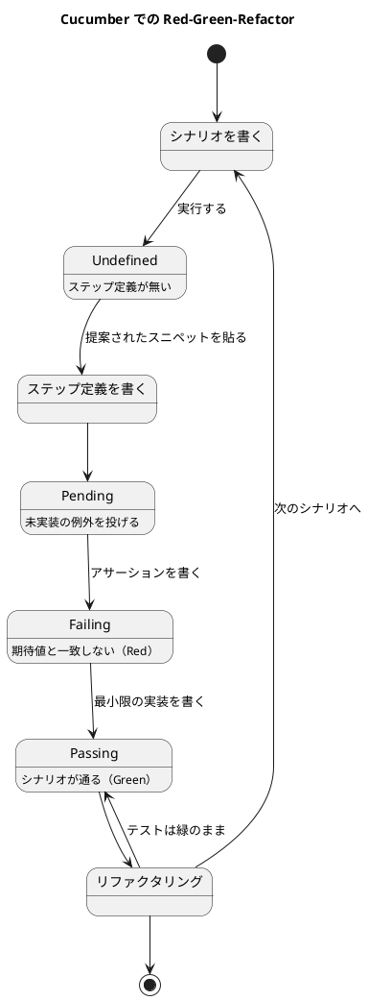

# BDD導入ガイド

BDDは追加の作業ではなく、正しく開発するということそのものである。ビジネス言語で書かれたシナリオが、そのままテストになり、常にコードと同期した「生きたドキュメント」になる。

## BDDは「会話」がすべて

BDDをテスト技法だと思っているなら、その認識は忘れるべきである。**BDDは知識を効率的に共有するための手法**であり、ツールがなくても実践できる。何よりもまず、BDDは「スリーアミーゴ（Biz / Dev / Tester）」と呼ばれる3つの役割（またはそれ以上）の間で深い会話を促す。

この会話では、ビジネスドメインの言葉を使った具体的なシナリオを用いることで、認識のズレや曖昧さを早期に発見できる。



## 自動化を伴うBDDは「生きたドキュメント」そのもの

会話だけでも十分価値があるが、自動化の手間をかけることでさらに恩恵が得られる。CucumberやSpecFlowのようなツールを使う場合でも、スリーアミーゴの間でドメイン言語を使い続け、具体例（シナリオ）を重視する点は変わらない。シナリオはツール上でテストになると同時に、生きたドキュメントにもなる。

### 冗長性と整合性の照合

BDDのシナリオはアプリケーションの振る舞いを記述するが、ソースコード自体もその振る舞いを記述している。つまり**シナリオとコードは互いに冗長**な関係にある。

- 良い面：ドメイン言語で書かれたシナリオは、コードを読めないビジネス側の人にも理解できる。
- 悪い面：シナリオとコードが別々に進化すると、①どちらを信頼すべきか分からなくなる、②両者が同期しているかどうか分からなくなる、という2つの問題が生じる。

そこで必要になるのが**整合性を照合する仕組み（reconciliation mechanism）**である。CucumberやSpecFlowはこの役割を果たし、シナリオとコードという冗長な知識のバランスを取る「天秤」のように働く。

ツールはシナリオのGiven/Whenから値を抽出してテスト対象コードのパラメータとして渡し、Thenの値を使って結果をアサーションする。これにより、シナリオとコードが自動テストという形で常に検証され続ける。

## フィーチャーファイルの構造

Cucumber/SpecFlowでシナリオをテスト化する際に作成するのが**フィーチャーファイル（feature file）**。プレーンテキストでソースコードと同様にバージョン管理される。

### 意図を示すナラティブ

フィーチャーファイルの冒頭には、そのファイル内の全シナリオの意図を示すナラティブを書く。「In order to（〜するために）… As a（〜として）… I want（〜したい）…」という形式が一般的。「In order to」から書き始めることで、最も重要な「得たい価値」に焦点を当てられる。

```
Feature: Fuel Card Transactions anomalies
In order to detect potential fuel card abnormal behavior by drivers
As a fleet manager
I want to automatically detect anomalies in all fuel card transactions
```

日本語 Gherkin で書くと次のようになります。

```
# language: ja
機能: 燃料カード取引の異常検知
  ドライバーによる燃料カードの不正な使われ方を検知するために
  車両管理者として
  すべての燃料カード取引の異常を自動的に検知したい
```

### シナリオ（Given/When/Then）

ファイルの残りには、対応する機能に関連するシナリオを列挙する。各シナリオはタイトルを持ち、「Given...When...Then...」のパターンにほぼ従う。

```
Scenario: Fuel transaction with more fuel than the vehicle tank can hold
Given that the tank size of the vehicle 23 is 48L
When a transaction is reported for 52L on the fuel card
    associated with vehicle 23
Then an anomaly "The fuel transaction of 52L exceeds the tank
    size of 48L" is reported
```

日本語 Gherkin では次のようになります。

```
# language: ja
シナリオ: 車両のタンク容量を超える給油取引
  前提 車両 23 のタンク容量が 48L である
  もし 車両 23 に紐づく燃料カードで
       52L の取引が報告される
  ならば 「52L の給油取引がタンク容量 48L を超えています」
         という異常が報告される
```

1つのフィーチャーファイルには通常3〜15個のシナリオがあり、ハッピーパスやその亜種、重要なケースを記述する。他にもアウトライン形式や、共通の前提を切り出すバックグラウンドシナリオといった書き方がある（詳細: [docs.cucumber.io/gherkin/reference](https://docs.cucumber.io/gherkin/reference/)）。

## 仕様の詳細（Specification Details）

シナリオだけで十分な場合も多いが、会計や金融のような知識密度の高いビジネスドメインでは、抽象的なルールや計算式も必要になる。こうした追加知識は、Wordファイルや社内Wikiに置くのではなく、**意図（ナラティブ）とシナリオ一覧の間に直接埋め込む**のがよい。

```
Feature: Fuel Card Transactions anomalies
In order to detect potential fuel card abnormal behavior by drivers
As a fleet manager
I want to automatically detect anomalies in all fuel card transactions

Description:
The monitoring detects the following anomalies:
* Fuel leakage: whenever capacity > 1 + tolerance,
  where capacity = transaction fuel quantity / vehicle tank size
* Transaction too far from the vehicle: whenever distance to
  vehicle > threshold, where distance to vehicle = geo-distance (vehicle
  coordinates, gas station coordinates),
  and where the vehicle coordinates are provided by the GPS
  Tracking by (vehicle, timestamp),
  and where the gas station coordinates are provided by
  geocoding its post address.

Scenario: Fuel transaction with no anomaly
When a transaction is reported on the fuel card
... /// more scenarios here
```

日本語 Gherkin では次のようになります。

```
# language: ja
機能: 燃料カード取引の異常検知
  ドライバーによる燃料カードの不正な使われ方を検知するために
  車両管理者として
  すべての燃料カード取引の異常を自動的に検知したい

  説明:
  この監視では次の異常を検知します。
  * 燃料の漏出: 充填率 > 1 + 許容値 となる場合。
    ここで充填率 = 取引の給油量 / 車両のタンク容量
  * 車両から離れすぎた取引: 車両までの距離 > 閾値 となる場合。
    ここで車両までの距離 = 地理的距離（車両の座標、給油所の座標）
    であり、車両の座標は GPS トラッキングから（車両、時刻）で取得し、
    給油所の座標は所在地住所のジオコーディングで取得する。

  シナリオ: 異常のない給油取引
    もし 燃料カードで取引が報告される
    ... /// ここにシナリオを続ける
```

この「仕様詳細」欄はツールからは単なるコメント（自由記述）として無視されるが、シナリオのすぐ近くに置くことで、シナリオを変更する際に一緒に更新される可能性が高まる（「見えないものは忘れられる」の逆）。ただし更新が保証されるわけではない。

## フィーチャーファイルのタグ

各シナリオには**タグ**を付けられる。タグはドキュメンテーションの一種であり、次のような目的で使われる。

@wip @sprint-23 @bob @team-red @acceptance-criteria @happy-path @nominal @variant @negative @exception @core @fixedincome @interests

- **プロジェクト管理の知識**：`@wip`（作業中）、担当者名やスプリント名など。作業完了後に削除される一時的なタグ。
- **重要度**：`@acceptance-criteria`（受け入れ基準）、`@happy-path`、`@nominal`、`@variant`、`@negative`、`@exception`、`@core` など。
- **ビジネスドメインのカテゴリ・概念**：`@fixedincome`、`@interests` など、シナリオが属する業務領域を示す。

タグ自体も文書化すべきで、同じ場所にあるテキストファイルで全タグと説明を一覧化するとよい。

### フィーチャーファイルの整理方法

フィーチャーファイルが増えたらフォルダで整理する。フォルダ構成自体が知識を伝える手段になる。書籍『Specification by Example』（Gojko Adzic）は3つの整理方法を挙げている。

1. **機能領域ごと**（例: Accounting / Reporting Rules / Discounts / Special Offers）— 業務ドメインが重要な場合に推奨
2. **UIのナビゲーション経路に沿って**（UIを文書化する場合）
3. **業務プロセスに沿って**（エンドツーエンドのトレーサビリティが必要な場合）

## インタラクティブな生きたドキュメントとしてのシナリオ

シナリオは生きたドキュメントの基礎となるが、さらに一歩進めると、ビルドごとに生成される**インタラクティブなWebサイト**にもなる。SpecFlow向けの **Pickles** はその一例で、フォルダ構成をチャプターとして表示するナビゲーションと、タグ・キーワードによる検索機能を備えた1ページサイトを生成する。

この検索エンジンにより、タグの2つ目の効果が発揮される：**タグはシナリオの検索を効率的かつ正確にする**。

### 紙のドキュメントが必要な場合

コンプライアンス要件などにより紙の文書（「BPD: Boring Paper Document」）が必要な場合もある。著者の同僚 Arnauld Loyer（@aloyer）が開発した **Tzatziki** というツールは、フィーチャーファイルから美しいPDFを書き出す。さらにMarkdownファイルや画像も取り込み、各機能領域チャプターの冒頭に説明を追加できる。

BDDは生きたドキュメントの好例である。それは「やるべき仕事」に追加される作業ではなく、正しく仕事をすることそのものの一部である。整合性を照合するツールのおかげで常に同期しており、フィーチャーファイルだけで足りない場合は、生成されたWebサイトがドキュメントを有用・インタラクティブ・検索可能・整理された状態にする方法を示してくれる。

## フィーチャーファイルの完全な例

金融ドメインを題材にした架空だが現実的な例。1つのアウトラインシナリオと対応するデータテーブルを含む。

```
Feature: Calculate compound interests on a principal
In order to manage the company money
As a finance officer
I want to calculate the compound interests on a principal on
my account

Description:
Compound interest is when the bank pays interest on both the
principal (the original amount of money) and the interest an
account has already earned.

To calculate compound interest use the formula below.

In the formula, A represents the final amount in the account
after t years compounded 'n' times at interest rate 'r' with
starting amount 'p'.

A = P*(1+(r/n))^n*t

Scenario: Bi-annual compound interests over one year
Given a principal of USD 1000
And interests are compounded bi-annually at a rate of 5%
And the calculation period lasts exactly 1 year
When the calculation period lasts exactly 1 year
Then the amount of money in the account is USD 1053.63

Scenario: Quarterly compound interests over one year
//... outline scenario

Examples:
| convention  | rate | time | amount    | remarks        |
|-------------|------|------|-----------|----------------|
| LINEAR      | 0.05 | 2    | 0.100000  | (1+rt)-1       |
| COMPOUND    | 0.05 | 2    | 0.102500  | (1+r)^t-1      |
| DISCOUNT    | 0.05 | 2    | -0.100000 | (1-rt)-1       |
| CONTINUOUS  | 0.05 | 2    | 0.105171  | (e^rt)-1 (rare)|
| NONE        | 0.05 | 2    | 0         | 0              |
```

ツールの支援があれば、すべてのビジネスシナリオは自動テストであると同時に生きたドキュメントになる。シナリオとコードの橋渡しは、**ステップ（step）**という仕組みで行う。各ステップは正規表現でマッチし、シナリオ中のテキストからパラメータを抽出して本番コードを呼び出す。

```
"When I buy a book at an ex-VAT price of EUR <exVATPrice>"

// 対応するグルーコード
Book(number exVATPrice)
Service = LookupOrderService();
Service.sendOrder(exVATPrice);
```

日本語のステップでも同じ仕組みです。ただしパラメータの位置が変わるため、
ステップ定義の正規表現は日本語の文面に合わせて書き直します。

```
"もし 税抜価格 EUR <exVATPrice> の本を購入する"

// 対応するグルーコード
Book(number exVATPrice)
Service = LookupOrderService();
Service.sendOrder(exVATPrice);
```

## 日本語 Gherkin で書く

Gherkin は多言語のキーワードをサポートしており、フィーチャーファイルの先頭に `# language: ja` と書くと日本語のキーワードが使えます。BDD の価値は会話そのものにあるので、シナリオはビジネス側が普段読み書きする言語で書くのが原則です。日本語で業務を語るチームなら、シナリオも日本語で書きます。

| 英語 | 日本語 |
| :--- | :--- |
| Feature | 機能 |
| Background | 背景 |
| Rule | ルール |
| Scenario | シナリオ |
| Scenario Outline | シナリオテンプレート（シナリオアウトライン） |
| Examples | 例 |
| Given | 前提 |
| When | もし |
| Then | ならば |
| And | かつ |
| But | しかし |

前掲の複利計算の例を日本語 Gherkin で書くと次のようになります。英語版と 1 対 1 で読み比べられます。

```
# language: ja
機能: 元本に対する複利の計算
  会社の資金を管理するために
  財務担当者として
  口座の元本に対する複利を計算したい

  説明:
  複利とは、元本（もともとの金額）と、口座がすでに獲得した利息の
  両方に対して銀行が利息を支払うことをいいます。

  複利は次の式で計算します。年利 r、年 n 回の複利、元本 P、期間 t 年
  のとき、t 年後の口座残高 A は次のとおりです。

  A = P*(1+(r/n))^n*t

  背景:
    前提 口座の通貨は USD である

  シナリオ: 1 年間の半年複利
    前提 元本が USD 1000 である
    かつ 年利 5% で半年ごとに複利計算される
    かつ 計算期間がちょうど 1 年である
    もし 利息を計算する
    ならば 口座の残高は USD 1053.63 である

  シナリオテンプレート: 利息計算方式ごとの利息額
    前提 年利が <利率> である
    かつ 計算期間が <期間> 年である
    もし 利息計算方式 <方式> で利息を計算する
    ならば 利息額は <利息額> である

    例:
      | 方式     | 利率 | 期間 | 利息額    | 備考            |
      | 単利     | 0.05 | 2    | 0.100000  | (1+rt)-1        |
      | 複利     | 0.05 | 2    | 0.102500  | (1+r)^t-1       |
      | 割引     | 0.05 | 2    | -0.100000 | (1-rt)-1        |
      | 連続複利 | 0.05 | 2    | 0.105171  | (e^rt)-1（まれ）|
      | なし     | 0.05 | 2    | 0         | 0               |
```

日本語で書く場合の注意点は 3 つあります。

- ステップ定義（グルーコード）側の正規表現も、日本語のステップ文字列にマッチするように書きます。パラメータの抽出位置が英語とは異なるため、英語のステップ定義をそのまま流用できません
- 1 つのプロジェクト内で英語と日本語のフィーチャーファイルを混在させません。検索性が落ち、用語の揺れが生まれます
- シナリオで使う用語は、後述の用語集（グロッサリー）と表記を揃えます。「顧客」と「お客様」のような揺れは、そのままドメイン理解の揺れになります

## BDDが「生きたドキュメント」の典型例である理由

BDDは正確なドキュメントが常にコードと同期する状態を実現できることを示した。生きたドキュメントの中核原則は、すべてすでにBDDに備わっている。

01

#### 協働的（Collaborative）

BDDの主要な手段は「対話」であり、スリーアミーゴ（またはそれ以上）の各役割が必ず参加する。

02

#### 低コスト（Low-effort）

具体例をめぐる会話は、何を作るかの合意形成に有用で、少しの追加作業で自動テストと生きたドキュメントの両方になる — 1つの活動で複数の恩恵。

03

#### 信頼できる（Reliable）

整合性照合の仕組みのおかげで信頼できる。振る舞いがテキストシナリオと実装コードの両方に記述されるため、CucumberやSpecFlowのようなツールがシナリオとコードの同期を保証（または、ズレを検知）する。これは知識の重複がある場合に必ず必要になる。

### 会話がもたらす洞察（Insightful）

会話はフィードバックを提供する。シナリオが長すぎたり不自然だったりする場合、それは暗黙の概念が欠けているサインであり、より短くシンプルなシナリオを示唆してくれる。

### 対象読者（Targeted audience）

すべての作業はビジネス要件を議論する際、技術者以外も含む読者を対象としているため、明確で非技術的な言葉遣いに重点を置く。

### 知識の沈殿（Idea sedimentation）

会話だけで十分なことも多く、すべてを書き留める必要はない。アーカイブや自動化のために書き留めるべきなのは、最も重要なシナリオ（キーシナリオ）だけでよい。

### プレーンテキストの文書（Plain-text documents）

変化するものをソースコードと一緒にバージョン管理するには、プレーンテキストが非常に便利である。

### アクセス可能な公開スナップショット（Accessible published snapshot）

誰もがソースコードにアクセスしてシナリオを読めるわけではない。PickleやTzatzikiのようなツールは、ある時点でのシナリオ全体のスナップショットを、インタラクティブなWebサイトや印刷可能なPDF文書としてエクスポートすることで解決する。

## ドキュメントを最大限活かすために（さらに一歩先へ）

フィーチャーファイルは、豊かなドメイン知識を効率よく集める良い場所である。BDDを支援するほとんどのツールは Gherkin 構文という固定フォーマットを理解する。

```
Feature: Name of the feature

In order to... As a... I want...

Scenario: name of the first scenario
Given...
When...
Then...

Scenario: name of the second scenario
...
```

日本語 Gherkin での骨子は次のとおりです。

```
# language: ja
機能: 機能の名前

  〜するために... 〜として... 〜したい...

  シナリオ: 1 つ目のシナリオの名前
    前提 ...
    もし ...
    ならば ...

  シナリオ: 2 つ目のシナリオの名前
    ...
```

金融や保険のようなリッチなドメインを扱うチームは、冒頭の意図と末尾の具体シナリオだけでは足りないと気づき、中間領域に追加の説明を書き込むようになった。これはツールからは無視されるが、Pickles のようなツールはこの「説明エリア」でMarkdown記法をサポートするよう対応した。

### 例：投資の現在価値

```
Feature: Investment Present Value

In order to calculate the breakeven point of the investment
opportunity
As an investment manager
I want to calculate the present value of future cash amounts

Description
===========
We need to find the present value *PV* of the given future cash
amount *FV*. The formula for that can be expressed as:

- Using the negative exponent notation:
    PV = FV * (1 + i)^(-n)
- Or in the equivalent form:
    PV = FV * (1 / (1 + i)^n)

Example
-------
For example, n = 2, i = 8%

    FV = $100
          |
PV? ------|----------> t (years)
 0        1          2

Scenario: Present Value of a single cash amount
Given a future cash amount of 100$ in 2 years
And an interest rate of 8%
When we calculate its present value
Then its present value is $85.73
```

日本語 Gherkin では次のようになります。説明エリアも日本語で書けます。

```
# language: ja
機能: 投資の現在価値

  投資機会の損益分岐点を計算するために
  投資マネージャーとして
  将来のキャッシュ金額の現在価値を計算したい

  説明
  ====
  将来のキャッシュ金額 *FV* に対する現在価値 *PV* を求めます。
  計算式は次のように表せます。

  - 負の指数表記を使う場合:
      PV = FV * (1 + i)^(-n)
  - 同等の別表記:
      PV = FV * (1 / (1 + i)^n)

  例
  --
  たとえば n = 2、i = 8% のとき

      FV = $100
            |
  PV? ------|----------> t（年）
   0        1          2

  シナリオ: 単一のキャッシュ金額の現在価値
    前提 2 年後に受け取る将来キャッシュ金額が 100$ である
    かつ 利率が 8% である
    もし その現在価値を計算する
    ならば 現在価値は $85.73 である
```

ベストプラクティス

頻繁には変わらない知識は「説明エリア」に、変わりやすい部分は具体的なシナリオの中に置くのがよい戦略である。説明が使う数値はあくまで「サンプル」であり、ある時点の業務プロセスの設定値そのものではないと明示するのも一つの方法。ただし、説明エリアの内容はシナリオと違って本当の意味では「生きて」いない — シナリオを変更すれば近くの説明も更新したくなるはずだが、それが保証されるわけではない。

PickleやRelish、Tzatzikiのようなツールは、フィーチャーファイルの隣に置かれたMarkdown記法の説明やプレーンなMarkdownファイルを理解できるようになっており、金融業界の規制当局が求めるような、一貫したドメインドキュメントの取りまとめを容易にする。

## プロパティベーステストとBDD

要件はしばしば「プロパティ（性質）」として自然に表現できる。例：「すべての支払・受取金額の合計は常にゼロでなければならない」「誰も同時に売り手であり買い手でありジャッジであることはできない」。BDDやTDDでは、こうした一般的な性質を具体的な例に落とし込む必要があるが、それは問題やコードを段階的に構築する助けになる。

一般的な性質の値を追跡するには、通常フィーチャーファイル内のプレーンテキストコメントとして記述する。しかし、まさにこの「性質をランダム生成サンプルに対して検証する」技術こそが**プロパティベーステスト**であり、Haskellの **QuickCheck** が代表的なフレームワーク（他の言語にも同様のツールが存在）。

```
Scenario: The sum of all cash amounts exchanged must be zero
for derivatives

Given any derivative financial instrument
And a random date during its lifetime
When we generate the related cash flows on this date for the
payer and\
the receiver
Then the sum of the cash flows of the payer and the receiver
is\
exactly zero
```

日本語 Gherkin では次のようになります。

```
# language: ja
シナリオ: デリバティブでは授受されるすべての金額の合計がゼロである

  前提 任意のデリバティブ金融商品がある
  かつ その存続期間中の任意の日付がある
  もし その日付における支払側と受取側のキャッシュフローを生成する
  ならば 支払側と受取側のキャッシュフローの合計は
         ちょうどゼロである
```

「given ANY shopping cart...」のような表現は、通常のシナリオでは避けるべき「コードの臭い」だが、プロパティベーステストを補完するプロパティ指向のシナリオでは問題ない。

## 用語集（グロッサリー）の作成

理想的な用語集はコードから直接抽出される「生きた」ものだが、多くの場合それは不可能で手動作成が必要になる。フィーチャーファイルと同じ場所にMarkdownファイルとして用語集を手作業で作成すれば、他のフィーチャーファイルと一緒に生きたドキュメントサイトに含めることができる。空のダミーのフィーチャーファイルとして作成することも可能。

## 非機能的な知識へのリンク

すべての知識を同じ場所に記述すべきではない。UI固有・レガシー固有の知識をドメイン知識と混在させたくない。そうした関連知識が重要な場合は別の場所に保存し、リンクで関係性を表現し見つけやすくする。3つのリンク方法がある。

- **URLへの直接リンク** — リンク切れのリスクあり\
  `https://en.wikipedia.org/wiki/Present_value`
- **リンクレジストリ経由** — リンク切れを差し替えやすい\
  `go/search?q=present+value`
- **ブックマーク検索** — 関連コンテンツを含む場所へのリンク\
  `https://en.wikipedia.org/w/index.php?search=present+value`

非機能的な知識へのリンクは、関連コンテンツへの堅牢な接続方法を提供するが、その分、読者自身が最も関連性の高い結果を選ぶ手間が発生する。

## Cucumber の実装ガイド

ここまでは Gherkin の書き方を扱ってきました。ここからは、フィーチャーファイルを実際に動く自動テストにするための実装手順を扱います。出典は [Cucumber 公式のインストールガイド](https://cucumber.io/docs/installation/) と [10 Minute Tutorial](https://cucumber.io/docs/guides/10-minute-tutorial/) です。

### 処理系を選ぶ

Cucumber は 30 以上の言語・プラットフォームに実装があります。メンテナンス状況で 3 つに分かれているので、新規採用では公式（Official）か準公式（Semi-official）から選びます。

| 区分 | 処理系 | 言語 |
| :--- | :--- | :--- |
| 公式 | Cucumber-JS | JavaScript / TypeScript |
| 公式 | Cucumber-JVM | Java / Kotlin |
| 公式 | Cucumber-Ruby | Ruby |
| 公式 | Cucumber-Scala | Scala |
| 公式 | Cucumber.cpp | C++ |
| 準公式 | Behave、Pytest-BDD | Python |
| 準公式 | Behat | PHP |
| 準公式 | Reqnroll | .NET（C# / F# / VB） |
| 準公式 | gocuke | Go |
| 準公式 | Test::BDD::Cucumber | Perl |

.NET の SpecFlow は開発が終了しており、後継は Reqnroll です。非公式（Cucumber-Rust、GoBDD など）や未メンテナンス（Cucumber-Groovy、Godog など）の処理系は、採用前に最終更新日を確認します。

### インストール

処理系ごとのインストールは次のとおりです。バージョンは執筆時点のものなので、採用時に最新を確認してください。

```
# JavaScript / TypeScript（Cucumber-JS）
npm install --save-dev @cucumber/cucumber

# Ruby（Cucumber-Ruby）
gem install cucumber

# Python（Behave / Pytest-BDD）
pip install behave
pip install pytest-bdd

# .NET（Reqnroll）
dotnet add package Reqnroll.NUnit
```

Java の場合は Maven のアーキタイプからプロジェクトを生成できます。

```
mvn archetype:generate \
  "-DarchetypeGroupId=io.cucumber" \
  "-DarchetypeArtifactId=cucumber-archetype" \
  "-DarchetypeVersion=8.0.1" \
  "-DgroupId=hellocucumber" \
  "-DartifactId=hellocucumber" \
  "-Dpackage=hellocucumber" \
  "-Dversion=1.0.0-SNAPSHOT" \
  "-DinteractiveMode=false"
```

Cucumber-JS で特に注意すべき落とし穴が 2 つあります。

- **グローバルインストールしない** — Cucumber-JS は実行中に状態を保持するため、プロジェクトの依存として入れます。グローバルに入れると「You're calling functions (e.g. 'Given') on an instance of Cucumber that isn't running.」というエラーになります
- **依存ツリーに複数バージョンを混在させない** — `npm why @cucumber/cucumber` で重複を確認します。共有ライブラリが Cucumber に依存している場合は peer dependency にします。パッケージ名も旧 `cucumber` ではなく `@cucumber/cucumber` を使います

### ディレクトリ構成

フィーチャーファイルとステップ定義は、処理系が決めた場所に置きます。

```
# Cucumber-JS
features/
├── is_it_friday_yet.feature
└── step_definitions/
    └── stepdefs.js

# Cucumber-JVM（Maven）
src/test/resources/hellocucumber/
└── is_it_friday_yet.feature
src/test/java/hellocucumber/
└── StepDefinitions.java
```

フィーチャーファイルが増えたら、前述の「フィーチャーファイルの整理方法」に従って機能領域ごとにフォルダを切ります。

### 最小の例

公式チュートリアルの「金曜日かどうか」を日本語 Gherkin で書くと次のようになります。

```
# language: ja
機能: もう金曜日？
  みんな、いつ金曜日になるのかを知りたい

  シナリオテンプレート: 今日は金曜日である、またはそうでない
    前提 今日は "<曜日>" である
    もし 金曜日かどうか尋ねる
    ならば "<答え>" と返ってくる

    例:
      | 曜日     | 答え |
      | 金曜日   | TGIF |
      | 日曜日   | まだ |
      | それ以外 | まだ |
```

ステップ定義は、シナリオの文面にマッチする関数として書きます。Cucumber-JS の場合は次のとおりです。

```
const assert = require('assert');
const { Given, When, Then } = require('@cucumber/cucumber');

function isItFriday(today) {
  return today === '金曜日' ? 'TGIF' : 'まだ';
}

Given('今日は {string} である', function (today) {
  this.today = today;
});

When('金曜日かどうか尋ねる', function () {
  this.actualAnswer = isItFriday(this.today);
});

Then('{string} と返ってくる', function (expectedAnswer) {
  assert.strictEqual(this.actualAnswer, expectedAnswer);
});
```

Cucumber-JVM（Java）では、アノテーションでステップを宣言します。

```
package hellocucumber;

import io.cucumber.java.en.Given;
import io.cucumber.java.en.When;
import io.cucumber.java.en.Then;
import static org.assertj.core.api.Assertions.assertThat;

class IsItFriday {
    static String isItFriday(String today) {
        return "金曜日".equals(today) ? "TGIF" : "まだ";
    }
}

public class StepDefinitions {
    private String today;
    private String actualAnswer;

    @Given("今日は {string} である")
    public void today_is(String today) {
        this.today = today;
    }

    @When("金曜日かどうか尋ねる")
    public void i_ask_whether_it_s_friday_yet() {
        actualAnswer = IsItFriday.isItFriday(today);
    }

    @Then("{string} と返ってくる")
    public void i_should_be_told(String expectedAnswer) {
        assertThat(actualAnswer).isEqualTo(expectedAnswer);
    }
}
```

日本語のフィーチャーファイルを使う場合でも、ステップ定義側のアノテーション（`@Given` など）は英語のままで構いません。キーワードの言語（`前提` / `もし` / `ならば`）は `# language: ja` で解決され、アノテーションにはキーワードを除いたステップ本文がマッチします。

### 実行する

```
# Cucumber-JS
npx cucumber-js

# Cucumber-JVM（Maven）
mvn test

# Cucumber-Ruby
cucumber

# Behave
behave
```

### Red-Green-Refactor で進める

Cucumber の実行結果は、そのまま TDD のサイクルになります。



1. **Undefined** — シナリオだけがある状態。Cucumber は未定義ステップを報告し、貼り付け可能なステップ定義のスニペットを提案します
2. **Pending** — スニペットを貼った状態。ステップは未実装例外を投げます
3. **Failing（Red）** — アサーションを書くと、実装がないため落ちます
4. **Passing（Green）** — 最小限の実装で通します。最初はハードコードで構いません
5. **Refactor** — 実装をプロダクションコードへ移し、重複を取り除きます。ステップ定義は薄く保ち、業務ロジックを持ち込みません

この流れは AI-DLC の Bolt におけるステップ計画と対応します。シナリオが受入条件、Cucumber の実行結果が承認ゲートでの検証材料になります。

### 生きたドキュメントとして公開する

フィーチャーファイルを Web サイトや PDF として公開すると、前述の「インタラクティブな生きたドキュメント」になります。

| ツール | 出力 | 対象 |
| :--- | :--- | :--- |
| Pickles | 検索可能な HTML サイト | Reqnroll / SpecFlow、Cucumber 全般 |
| Relish | ホスティング型の HTML サイト | Cucumber 全般 |
| Tzatziki | PDF | Cucumber 全般 |
| Cucumber Reports | 実行結果レポート | Cucumber 全般 |

公開はビルドの一部として自動化します。手作業で生成する運用にすると、すぐに更新されなくなり「生きた」状態を失います。

## まとめ

BDDは生きたドキュメントの典型例である。まず何よりチームメンバー間の頻繁な会話に頼り、それでいてビジネス側にも開発者側にもアクセス可能な形で、プロジェクト中に集めた知識を保存する。コードとシナリオという冗長な知識を生むにもかかわらず、付随するツールがすべてを同期させ続ける。BDDが扱うのはソフトウェアのビジネス上の振る舞いだけだが、以降の章ではこの考え方をソフトウェア開発に関する他の活動、さらにはソフトウェア開発の外にまで拡張していく。

出典: *Living Documentation*（Cyrille Martraire 著）第2章「Behavior-Driven Development as an Example of Living Specifications」（p.56–70）の要約
