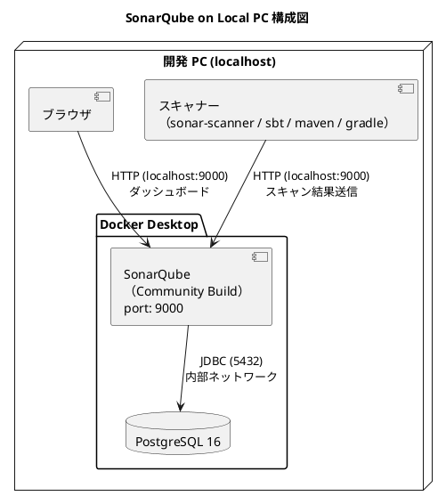

# SonarQube ローカル開発環境セットアップ手順書

## 概要

ローカル開発 PC 上に SonarQube（Community Build）を Docker ベースで構築し、プロジェクトの静的コード解析環境を提供するための手順を説明します。

SonarQube は PostgreSQL をバックエンドデータベースとして使用し、Docker Compose で管理します。

| コンポーネント | コンテナ名 | ポート | イメージ |
| :--- | :--- | :--- | :--- |
| SonarQube | sonarqube | 9000 | `sonarqube:community` |
| PostgreSQL | sonarqube-db | — (内部) | `postgres:16-alpine` |



## 前提条件

| 項目 | 要件 |
| :--- | :--- |
| OS | macOS / Windows / Linux |
| RAM | 最低 4GB（推奨 6GB 以上を Docker Desktop に割り当て） |
| ストレージ | 10GB 以上の空き容量 |
| Docker Desktop | インストール済み（Docker Compose 同梱） |

### Docker Desktop のリソース設定（推奨）

Docker Desktop > **Settings** > **Resources** で以下を設定します。

| 項目 | 最小 | 推奨 |
| :--- | :--- | :--- |
| Memory | 4GB | 6GB 以上 |
| CPUs | 2 | 4 |
| Disk | 20GB | 40GB |

### クロスプラットフォーム対応

| 機能 | macOS | Windows | Linux |
| :--- | :--- | :--- | :--- |
| ブラウザを開く | `open` | `start` | `xdg-open` |
| null デバイス | `/dev/null` | `NUL` | `/dev/null` |
| Docker Compose | `docker compose` | `docker compose` | `docker compose` |

---

## セットアップ手順

### 1. カーネルパラメータの設定

SonarQube 内部の Elasticsearch が `vm.max_map_count` の引き上げを要求します。

#### macOS

Docker Desktop for Mac は Linux VM 上で動作します。通常は Docker Desktop が適切な値を設定しますが、不足している場合は以下で引き上げます。

```bash
# 現在値を確認
docker run --rm --privileged alpine sysctl vm.max_map_count

# 524288 未満の場合は引き上げ（Docker Desktop 再起動まで有効）
docker run --rm --privileged alpine sysctl -w vm.max_map_count=524288
```

> **注意**: Docker Desktop を再起動すると値がリセットされます。SonarQube 起動前に毎回確認してください。

#### Windows（WSL2）

```powershell
# PowerShell（管理者）で WSL2 の設定を変更
wsl -d docker-desktop sysctl -w vm.max_map_count=524288
```

永続化するには `%USERPROFILE%\.wslconfig` に以下を追加します。

```ini
[wsl2]
kernelCommandLine = "sysctl.vm.max_map_count=524288"
```

#### Linux

```bash
# 一時的な設定（即時反映）
sudo sysctl -w vm.max_map_count=524288

# 永続化
echo "vm.max_map_count=524288" | sudo tee -a /etc/sysctl.d/99-sonarqube.conf
sudo sysctl --system
```

---

### 2. プロジェクト設定（任意）

プロジェクトルートに `sonarqube.config.json` を作成し、スキャン対象プロジェクトを定義します。設定ファイルがない場合、環境変数 `SONAR_PROJECT_KEY` の値（デフォルト: `my-project`）で単一プロジェクトとして動作します。

```json
{
  "projects": [
    {
      "name": "backend",
      "label": "Backend",
      "projectKey": "my-backend",
      "scanType": "sonar-scanner",
      "srcDir": "apps/backend"
    },
    {
      "name": "frontend",
      "label": "Frontend",
      "projectKey": "my-frontend",
      "scanType": "sonar-scanner",
      "srcDir": "apps/frontend"
    }
  ]
}
```

#### scanType 一覧

| scanType | 説明 | 用途 |
| :--- | :--- | :--- |
| `sonar-scanner` | `npx sonarqube-scanner` で実行 | TypeScript / JavaScript / 汎用 |
| `sbt` | `sbt sonarScan` で実行 | Scala（sbt-sonar プラグイン） |
| `maven` | `mvn sonar:sonar` で実行 | Java / Kotlin（Maven） |
| `gradle` | `gradle sonar` で実行 | Java / Kotlin（Gradle） |

---

### 3. ディレクトリの作成

プロジェクトルートの `ops/docker/sonarqube-local/` に Docker Compose ファイルを配置します。データは Docker の名前付きボリュームで管理します。

```bash
mkdir -p ops/docker/sonarqube-local
```

#### ディレクトリ構造

```text
ops/docker/sonarqube-local/
└── docker-compose.yml       # Docker Compose 設定

Docker ボリューム（自動作成）:
  sonarqube_data              # SonarQube データ
  sonarqube_logs              # SonarQube ログ
  sonarqube_extensions        # SonarQube プラグイン
  sonarqube_postgresql        # PostgreSQL データ
```

---

### 4. Docker Compose の配置

`ops/docker/sonarqube-local/docker-compose.yml` を以下の内容で作成します。`npx gulp sonar-local:setup` を使用する場合は自動生成されます。

```yaml
services:
  sonarqube:
    image: sonarqube:community
    container_name: sonarqube
    restart: unless-stopped
    depends_on:
      sonarqube-db:
        condition: service_healthy
    ports:
      - "9000:9000"
    environment:
      # --- DB 接続 ---
      SONAR_JDBC_URL: jdbc:postgresql://sonarqube-db:5432/sonarqube
      SONAR_JDBC_USERNAME: sonarqube
      SONAR_JDBC_PASSWORD: sonarqube_password  # 変更推奨
      # --- JVM メモリ (ローカル環境向け) ---
      SONAR_CE_JAVAOPTS: "-Xmx512m -Xms512m"
      SONAR_WEB_JAVAOPTS: "-Xmx256m -Xms256m"
      SONAR_SEARCH_JAVAOPTS: "-Xmx512m -Xms512m"
    volumes:
      - sonarqube_data:/opt/sonarqube/data
      - sonarqube_logs:/opt/sonarqube/logs
      - sonarqube_extensions:/opt/sonarqube/extensions
    networks:
      - sonarqube-net
    healthcheck:
      test: ["CMD-SHELL", "curl -f http://localhost:9000/api/system/status || exit 1"]
      interval: 30s
      timeout: 10s
      retries: 5
      start_period: 300s

  sonarqube-db:
    image: postgres:16-alpine
    container_name: sonarqube-db
    restart: unless-stopped
    environment:
      POSTGRES_DB: sonarqube
      POSTGRES_USER: sonarqube
      POSTGRES_PASSWORD: sonarqube_password  # 上と同じに変更
    volumes:
      - sonarqube_postgresql:/var/lib/postgresql/data
    networks:
      - sonarqube-net
    healthcheck:
      test: ["CMD-SHELL", "pg_isready -U sonarqube"]
      interval: 10s
      timeout: 5s
      retries: 5

networks:
  sonarqube-net:
    driver: bridge

volumes:
  sonarqube_data:
  sonarqube_logs:
  sonarqube_extensions:
  sonarqube_postgresql:
```

> **重要**: `SONAR_JDBC_PASSWORD` と `POSTGRES_PASSWORD` は同じ値に変更してください。

#### JVM メモリ設定の目安

| Docker 割り当て RAM | WEB | CE | SEARCH |
| :--- | :--- | :--- | :--- |
| 4GB | `-Xmx256m -Xms256m` | `-Xmx512m -Xms512m` | `-Xmx512m -Xms512m` |
| 6GB | `-Xmx512m -Xms512m` | `-Xmx1g -Xms1g` | `-Xmx512m -Xms512m` |
| 8GB 以上 | `-Xmx512m -Xms512m` | `-Xmx1g -Xms1g` | `-Xmx1g -Xms1g` |

> **重要**: ES 8.x は初期ヒープサイズ（`-Xms`）と最大ヒープサイズ（`-Xmx`）が一致している必要があります。不一致の場合、bootstrap check failure（exit code 78）で起動に失敗します。

---

### 5. コンテナの起動

```bash
cd ops/docker/sonarqube-local

# コンテナを起動
docker compose up -d

# 起動状態を確認
docker compose ps

# ヘルスチェック待ち（初回は数分かかる）
docker compose logs -f sonarqube
```

---

### 6. 初期設定

#### 6.1 ログイン

ブラウザで `http://localhost:9000` にアクセスします。

| 項目 | 初期値 |
| :--- | :--- |
| ユーザー ID | `admin` |
| パスワード | `admin` |

初回ログイン時にパスワード変更を求められるので、新しいパスワードを設定します。

#### 6.2 トークンの生成

プロジェクトスキャンに使用する認証トークンを生成します。

1. 右上の **A**（admin アイコン）> **My Account** をクリック
2. **Security** タブを選択
3. **Tokens** セクションの **Generate** 欄にトークン名（例: `local-dev`）を入力
4. **Generate** をクリック
5. 表示されたトークンをコピーしてプロジェクトルートの `.env` に設定

```bash
# .env に追加
SONAR_HOST_URL=http://localhost:9000
SONAR_TOKEN=<YOUR_TOKEN>
```

> **重要**: トークンは一度しか表示されません。紛失した場合は再発行が必要です。

#### 6.3 日本語プラグインのインストール（任意）

1. **Administration** > **Marketplace** を開く
2. 「Japanese」で検索
3. **Install** をクリック
4. SonarQube を再起動

---

## プロジェクトのスキャン

### 事前準備: プロジェクト作成と権限付与

1. SonarQube でプロジェクトを作成してください。Project Key が `sonarqube.config.json` の `projectKey` と一致しているか確認してください。
2. 次のどちらかで権限を付与してください。
   - 付与方法 A: 管理者でログイン > Administration > Security > Users で対象ユーザーに `Execute Analysis` を付与
   - 付与方法 B: プロジェクト画面 > Project Settings > Permissions で `Execute Analysis` を付与

### スキャンツール別の設定

#### sonar-scanner（TypeScript / JavaScript / 汎用）

```bash
cd <project-dir>
npm install --save-dev sonarqube-scanner
```

`sonar-project.properties` を作成します。

```properties
sonar.projectKey=<YOUR_PROJECT_KEY>
sonar.projectName=<YOUR_PROJECT_NAME>
sonar.sources=src
sonar.tests=src
sonar.test.inclusions=**/*.test.ts,**/*.test.tsx,**/*.spec.ts,**/*.spec.tsx
sonar.exclusions=**/node_modules/**,**/generated/**,**/dist/**
sonar.typescript.lcov.reportPaths=coverage/lcov.info
sonar.sourceEncoding=UTF-8
```

```bash
# テスト実行（カバレッジデータ生成）
npm run test:coverage

# SonarQube スキャン
npx sonarqube-scanner \
  -Dsonar.host.url=http://localhost:9000 \
  -Dsonar.token=<YOUR_TOKEN>
```

#### sbt（Scala）

`project/plugins.sbt` に SonarScanner プラグインを追加します。

```scala
addSbtPlugin("com.sonar-scala" % "sbt-sonar" % "2.3.0")
```

`build.sbt` に SonarQube 設定を追加します。

```scala
sonarProperties := Map(
  "sonar.projectKey"    -> "<YOUR_PROJECT_KEY>",
  "sonar.projectName"   -> "<YOUR_PROJECT_NAME>",
  "sonar.sources"       -> "src/main/scala",
  "sonar.tests"         -> "src/test/scala",
  "sonar.sourceEncoding" -> "UTF-8",
  "sonar.scala.coverage.reportPaths" ->
    "target/scala-3.6.2/scoverage-report/scoverage.xml"
)
```

```bash
# テスト実行（カバレッジデータ生成）
sbt coverage test coverageReport

# SonarQube スキャン
sbt sonarScan \
  -Dsonar.host.url=http://localhost:9000 \
  -Dsonar.token=<YOUR_TOKEN>
```

#### Maven（Java / Kotlin）

```bash
mvn sonar:sonar \
  -Dsonar.projectKey=<YOUR_PROJECT_KEY> \
  -Dsonar.host.url=http://localhost:9000 \
  -Dsonar.token=<YOUR_TOKEN>
```

#### Gradle（Java / Kotlin）

`build.gradle` にプラグインを追加します。

```groovy
plugins {
  id "org.sonarqube" version "5.1.0.4882"
}
```

```bash
gradle sonar \
  -Dsonar.projectKey=<YOUR_PROJECT_KEY> \
  -Dsonar.host.url=http://localhost:9000 \
  -Dsonar.token=<YOUR_TOKEN>
```

---

## 典型的な利用フロー

### Gulp タスクを使用する場合

```bash
# 1. プロジェクト設定（任意）
# sonarqube.config.json を作成

# 2. SonarQube セットアップ
npx gulp sonar-local:setup

# 3. ブラウザで初期設定・トークン生成（初回のみ）
# http://localhost:9000

# 4. .env に SONAR_TOKEN を追加

# 5. スキャン実行
npx gulp sonar-local:scan

# 6. 結果確認
npx gulp sonar-local:issues
```

### 手動で実行する場合

```bash
# 1. SonarQube コンテナ起動
cd ops/docker/sonarqube-local
docker compose up -d

# 2. ブラウザで初期設定・トークン生成（初回のみ）
# http://localhost:9000

# 3. スキャン実行（プロジェクトのスキャンツールに応じて実行）

# 4. 結果を確認
# http://localhost:9000
```

---

## API による診断情報の取得

```bash
# サーバー状態
curl -u <TOKEN>: http://localhost:9000/api/system/status

# プロジェクト一覧
curl -u <TOKEN>: "http://localhost:9000/api/projects/search"

# 課題一覧（重大度フィルタ付き）
curl -u <TOKEN>: "http://localhost:9000/api/issues/search?\
componentKeys=<PROJECT_KEY>&\
types=BUG,VULNERABILITY,CODE_SMELL&\
severities=BLOCKER,CRITICAL,MAJOR"

# メトリクス
curl -u <TOKEN>: "http://localhost:9000/api/measures/component?\
component=<PROJECT_KEY>&\
metricKeys=bugs,vulnerabilities,code_smells,coverage,duplicated_lines_density,ncloc"

# 品質ゲート
curl -u <TOKEN>: "http://localhost:9000/api/qualitygates/project_status?\
projectKey=<PROJECT_KEY>"
```

---

## Docker 管理コマンド

```bash
# プロジェクトディレクトリに移動
cd ops/docker/sonarqube-local

# コンテナの状態確認
docker compose ps

# コンテナの起動
docker compose up -d

# コンテナの停止
docker compose down

# コンテナの再起動
docker compose restart

# ログの確認（リアルタイム）
docker compose logs -f sonarqube

# ログの確認（直近 100 行）
docker compose logs --tail=100 sonarqube

# コンテナに接続
docker exec -it sonarqube bash
```

---

## バックアップ

### データベースのダンプ

```bash
docker exec sonarqube-db \
  pg_dump -U sonarqube sonarqube > backup.sql
```

### データの完全リセット

ローカル環境では再構築が容易なため、データを完全にリセットすることもできます。

```bash
cd ops/docker/sonarqube-local

# コンテナとボリュームを削除
docker compose down -v

# 再起動（初期状態から）
docker compose up -d
```

---

## トラブルシューティング

### SonarQube が起動しない

```bash
# ログを確認
docker logs sonarqube

# vm.max_map_count を確認（Docker Desktop 内部）
docker run --rm --privileged alpine sysctl vm.max_map_count
```

### Elasticsearch exit code 78: ヒープサイズ不一致

```text
bootstrap check failure [1] of [1]: initial heap size [268435456] not equal to maximum heap size [536870912]
```

ES 8.x は `-Xms` と `-Xmx` が一致していることを要求します。`docker-compose.yml` の `SONAR_SEARCH_JAVAOPTS` で `-Xms` と `-Xmx` を同じ値に設定してください。

```yaml
# NG: Xms != Xmx
SONAR_SEARCH_JAVAOPTS: "-Xmx512m -Xms256m"

# OK: Xms == Xmx
SONAR_SEARCH_JAVAOPTS: "-Xmx512m -Xms512m"
```

> **注意**: `SONAR_CE_JAVAOPTS` と `SONAR_WEB_JAVAOPTS` も同様に `-Xms` と `-Xmx` を一致させてください。

### Elasticsearch exit code 78: vm.max_map_count 不足

```bash
# Docker Desktop 内部の値を確認
docker run --rm --privileged alpine sysctl vm.max_map_count

# 524288 未満の場合は引き上げ
docker run --rm --privileged alpine sysctl -w vm.max_map_count=524288
```

### メモリ不足

Docker Desktop のリソース割り当てを増やすか、`docker-compose.yml` の JVM 設定を調整してください（セクション 4 の JVM メモリ設定の目安を参照）。

### ポート競合

9000 番ポートが他サービスで使用中の場合、`docker-compose.yml` のポートマッピングを変更します:

```yaml
ports:
  - "9100:9000"  # 外部ポートを変更
```

> **ヒント**: ポートを変更した場合は `.env` の `SONAR_HOST_URL` も合わせて変更してください。

### コンテナが起動しない

| 症状 | 原因 | 対処 |
| :--- | :--- | :--- |
| ES exit code 78（ヒープ不一致） | `-Xms` と `-Xmx` が不一致 | JVM オプションで `-Xms` と `-Xmx` を同じ値に設定 |
| ES exit code 78（vm.max_map_count） | `vm.max_map_count` 不足 | `docker run --rm --privileged alpine sysctl -w vm.max_map_count=524288` |
| DB 接続エラー | パスワード不一致 | `SONAR_JDBC_PASSWORD` と `POSTGRES_PASSWORD` が一致しているか確認 |
| OOM / メモリ不足 | Docker のメモリ割り当て不足 | Docker Desktop のリソース設定でメモリを増やす |
| ヘルスチェック失敗 | 起動に時間がかかる | `start_period` を延長（デフォルト 300s） |
| ディスク容量不足 | Docker のディスク容量不足 | Docker Desktop のディスク割り当てを増やす、または `docker system prune` で不要イメージを削除 |

### Windows 固有の問題

#### WSL2 のカーネルパラメータがリセットされる

`%USERPROFILE%\.wslconfig` に永続設定を記述してください（セクション 1 参照）。

### Docker Desktop のディスク容量を解放

```bash
# 未使用のイメージ・ボリューム・ネットワークを削除
docker system prune -a

# 未使用ボリュームのみ削除（SonarQube が停止中の場合は注意）
docker volume prune
```

---

## ポート一覧

| サービス | ポート | 備考 |
| :--- | :--- | :--- |
| SonarQube | 9000 | Web UI・API |
| PostgreSQL | 5432（内部） | SonarQube 専用・外部非公開 |

---

## 接続情報まとめ

| 用途 | 接続先 |
| :--- | :--- |
| SonarQube ダッシュボード | `http://localhost:9000` |
| SonarQube API | `http://localhost:9000/api` |

---

## セキュリティチェックリスト

- [ ] `admin` の初期パスワードを変更した
- [ ] PostgreSQL のパスワードをデフォルトから変更した
- [ ] 分析トークンを `.env` に記載し `.gitignore` で除外されている
- [ ] トークンの有効期限を把握している
