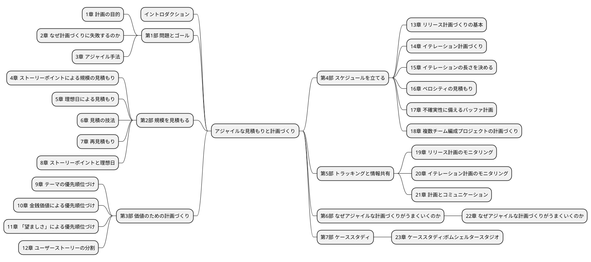
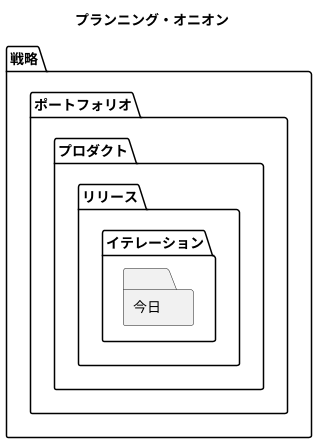
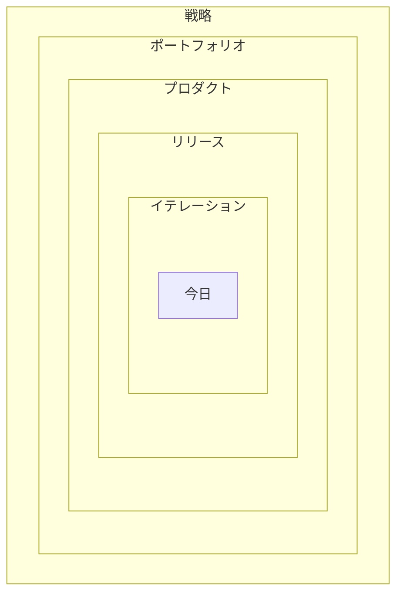
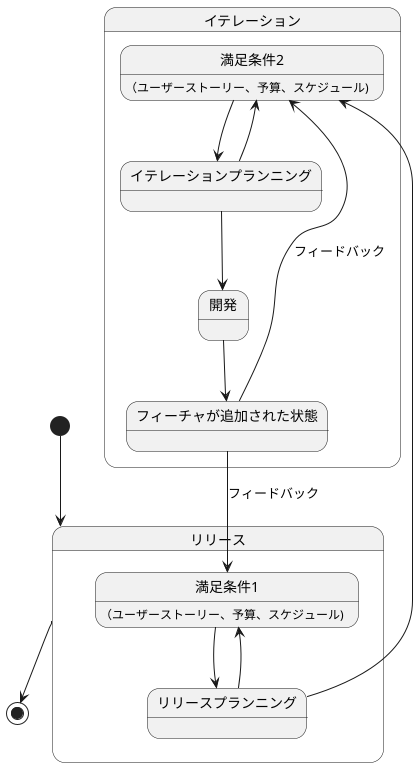
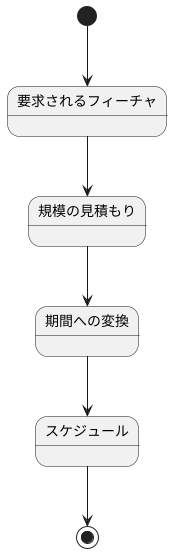
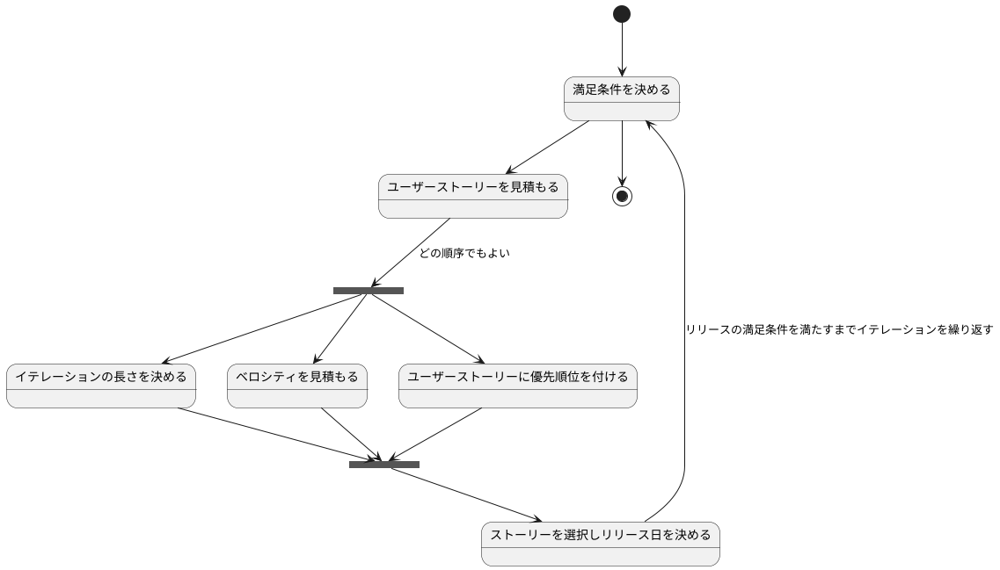
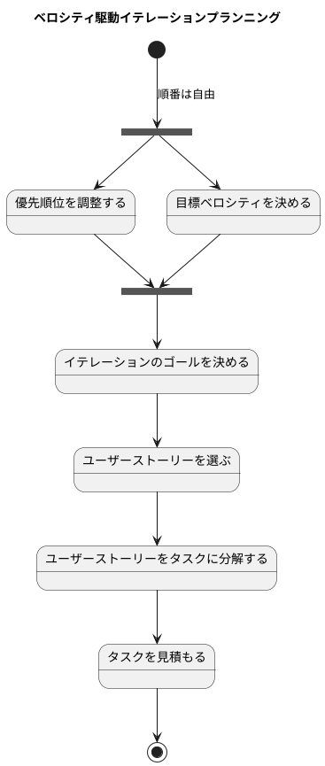
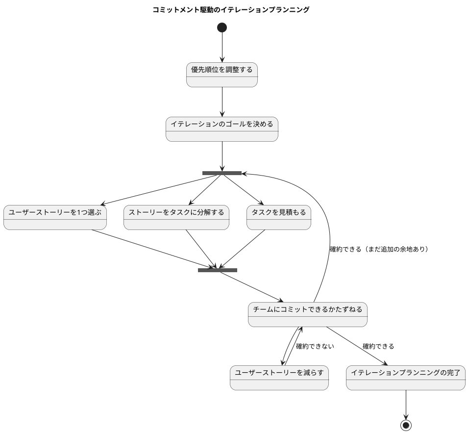
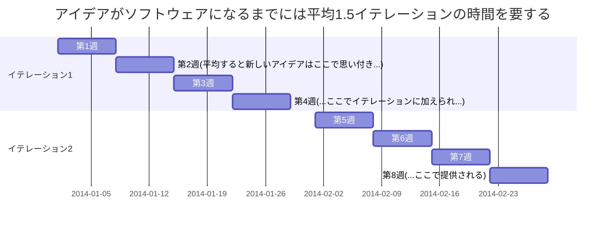
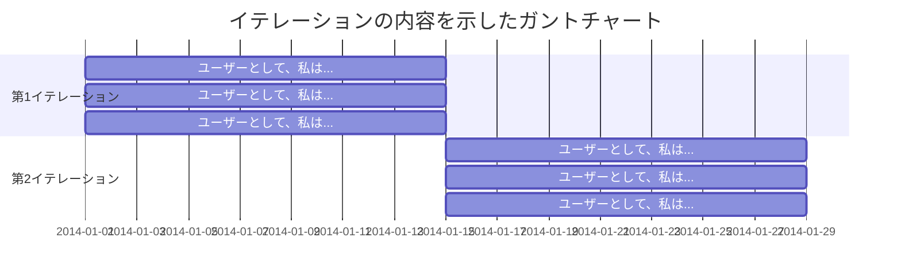

# アジャイルな見積もりと計画づくり



## イントロダクション

> 計画づくりとは「なにをいつまでに作ればいいのか？」という質問に答える作業だと私は考えている p023

## 第1部 問題とゴール

### 1章 計画の目的

> リリースとはすなわち、ソフトウェアが開発チームの手を離れて、顧客あるいはユーザーの手にわたることだ。 p028

> フィーチャはユーザーにとってのソフトウェアの価値を表現したものであり、ユーザーに直接価値を提供するものだということだ。 
> フィーチャとはユーザーにとっての価値なので、フィーチャには性能目標やセキュリティといったいわゆる非機能要件も含まれる。 p029

> ソフトウェアを使う側の視点から記述している、という点が重要である。 p029

> 見積もりと計画があってはじめて、意思決定が下せる。 p031

> プロジェクトの計画づくりでの意思決定は、ほとんどがトレードオフの判断だ。 p031

> 計画は、プロジェクトへの期待を共有する基盤として使うものだ。 p032

> よい計画とは、ステークホルダーが信頼できる計画だ。信頼できるとは、その計画を基にして意思決定ができるという意味である。 p033

> 計画とはドキュメントや図表であり、ある時点のスナップショットを記録したものだ。そこに記録されているものは、不確かな未来にプロジェクトで起きるだろうと予測したひとつの姿にすぎない。
> いっぽう、プランニング、すなわち計画づくりは「活動」である。アジャイルな計画づくりで重視するのは、計画よりも、計画をつくる過程そのものだ。 p033

> アジャイルな計画づくりを定義すると次のようになる。
> - 計画よりも計画づくりを重視する
> - 変化を促進する
> - 計画そのものは容易に変更できる
> - プロジェクト全体にわたって繰り返される
> 
> p 034

まとめ

見積も計画づくりも極めて重要なのだが、難しく、そして誤りやすい。見積や計画づくりが難しいからといって避けて通ることは許されない。
プロジェクトの初期段階では不正確な見積しかできないが、プロジェクトが進むにつれてより正確に見積もれるようになる。こうして見積りが徐々に調整されていく様子を示しているのが、不確実性コーンである。
計画づくりの目的は、プロダクトの開発においてもっとも重要な質問、すなわち「なにをつくるべきか？」という問いに答えることだ。この質問への回答には、フィーチャ、リソース、スケジュールが盛り込まれる。
この回答に説得力をもたせるのが計画づくりである。そのような計画づくりはリスクと不確実性を低減させ、信頼のおける意思決定を導き、信頼関係を確立し、情報を伝達する。

よい計画とは、プロダクトとプロジェクトについての意思決定をおこなう根拠として信頼できるものである。アジャイルな計画づくりで大切なのはでき上った計画よりも、計画を立てるという活動そのものだ。
アジャイルな計画づくりは変化を促進する。アジャイルな計画づくりでは、立てた計画を容易に変更できる。アジャイルな計画づくりはプロジェクトのはじめから終わりまで何度も繰り返される。

### 2章 なぜ計画づくりに失敗するのか

> 顧客にとっての価値の単位はフィーチャだ。計画づくりでは、作業ではなくフィーチャを単位にすべきなのである。 p037

> 従来型の計画づくりがうまくいかない次の理由は、マルチタスク化である。 p040

> 不確実性に対処していく最善の方法は、繰り返すことだ。 p043

まとめ

2章では、従来型の計画づくりに内在するいくつもの問題を見てきた。数多くのプロジェクトが失敗してしまうのも、全く不思議ではない。作業を基準にした計画はフィーチャを軽視することにつながるが、フィーチャこそが顧客にとっての価値なのだ。
作業を基準にした計画が問題を引き起こしてしまい、スケジュールを守れなくなることが多い。良かれと思って、プロジェクトのメンバーはマルチタスク化によって状況を打開しようとするが、マルチタスク化に潜むコストのせいで、結果的にプロジェクトはさらに遅延することになる。
そしてプロジェクトがスケジュールを超過しそうになると、提供予定だったフィーチャが削除される。ところが、フィーチャを開発する順番は開発側の都合だけで決めているので、ユーザーにとって価値の高いフィーチャが削除されてしまうこともある。

ユーザーが最終的に何を求めるのかには不確実性があり、はっきりとわからない。この事実を無視すると、プロジェクトとしては期日を守れたとしても、ユーザーにとって本当に重要なフィーチャを反映させられないからだ。というもの、計画を立てた後で明らかになった重要なフィーチャを反映させられないからだ。
また、プロダクトを開発する方法にも不確実性があることを無視すると、プロジェクトの計画から必要な作業が漏れてしまう。その結果、プロジェクトが遅れたり、土壇場になってフィーチャを削除することになったり、許容できない品質の低下が起きたりする。

多くの組織が見積とコミットメントを混同している。チームは見積を出したら、それをコミットメントするよう強いられてしまうのだ。

### 3章 アジャイル手法

アジャイルマニフェスト

- プロセスやツールよりも、人と人との交流を
- 包括的なドキュメントよりも、動作するソフトウェアを
- 契約上の交渉よりも、顧客との協調を
- 計画に従うことよりも、変化に適応することを

プロジェクトへのアジャイルなアプローチ

- 1つのチームとして働く
- 短いイテレーションで作業する
- イテレーションごとに成果をあげる
- ビジネス上の優先度を重視する
- 検査と適応

> アジャイルなプロジェクトマネージャはマネジメントよりも、リーダーシップを重視する。 p048

> イテレーションの長さよりも重要なことがある。それは、1回のイテレーションが終わるまでに、チームはイテレーション開始時点では明確には定義できていない要求を、少なくとも1つはコーディングしてテストをおこない、リリース可能なソフトウェアとして統合することだ。 p049

> ユーザーストーリーは、ソフトウェア要求を表現するための軽量な手法である。ユーザーストーリーは、システムについてユーザーまたは顧客の視点からフィーチャの概要を記述したものだ。
> ユーザーストーリーには形式が定められておらず、標準的な記法もない。とはいえ、次のような形式でストーリーを考えてみると便利である。「＜ユーザーの種類＞として、＜機能や性能＞がほしい。それは＜ビジネス価値＞のためだ」という形のテンプレートに従うと、
> たとえば次のようなストーリーを書ける。「本の購入者として、ＩＳＢＮで本を検索したい。それは探している本をすばやく見つけるためだ」 p050

> プロジェクトとは、新たな機能と知識とを迅速かつ安定して生み出し続ける活動ととらえるべきなのだ。新しい機能はプロダクトそのものとして提供され、新しい知識はプロダクトをベストなものにするために使われる。 p051

> プロジェクトで生み出される知識は、プロダクトに関するものもあれば、プロジェクトに関するものもあるだろう。プロダクトについて新しい知識（プロダクトナレッジ）が得られると、プロダクトがどうあるべきかをより深く考えられる。プロジェクトについての新しい知識（プロジェクトナレッジ）とは、チームや採用している技術、リスクに関する情報のことだ。 p052

> 最終成果がどのようなものになるかを、事前に知ることができないと認めれば、計画づくりを、長期的な目標に到達するための適切なゴール設定と、その見直しのプロセスだと位置づけられる。 p052





満足条件がリリースとイテレーションの計画づくりを駆動する



まとめ

アジャイルチームはチームとして一丸となって仕事をするが、チームの一人一人には役割がある。プロダクトオーナーとは、プロダクトのビジョンを提供し、チームが開発するフィーチャの優先順位付けに責任を持つ役割である。
顧客とは、プロジェクトへ資金を提供したり、完成したソフトウェアを購入する役割のことである。アジャイルプロジェクトには他にも、ユーザー、開発者、マネージャといった役割がある。

アジャイルチームは、短くタイムボックス化されたイテレーションで作業する。各イテレーションの終わりには、稼働するプロダクトを提供する。イテレーションで開発するフィーチャはビジネスの観点から選択する。
これにより、もっとも重要なフィーチャから順番に開発する。ユーザーストーリーはユーザーの要求を記述する手法で、アジャイルチームでよく使われている。アジャイルチームは、計画が立てたそばから実体と乖離し始めるものだと承知している。
これに適応するために、アジャイルチームでは計画を頻繁に見直す。

プロジェクトというものは、迅速かつ一定して、新たな機能と知識とを生み出し続ける活動だと考えるべきである。単に定められた手順を実行するだけではないのだ。プロジェクトから生み出される知識には2種類ある。それはプロダクトナレッジとプロジェクトナレッジである。
計画を洗練し、組織にとっての価値を最大にするためには、どちらの知識もの重要である。

アジャイルチームは3つのレベルで計画づくりをする。それは、リリースプランニング、イテレーションプランニング、「今日」のプランニングの3つだ。リリース計画はリリース全体についての計画であり、3か月から6か月という期間がよく使われる。イテレーション計画は1イテレーション分の計画で、2週間から4週間である。
「今日」のプラントは、日々のスタンドアップミーティングでメンバーがその日になにをするか決めた1日単位の計画のことである。

プロダクトオーナーの満足条件を理解することなしに、リリースプランニングとイテレーションプランニングはできない。リリースプランニングでは、リリースでどうやってすべての満足条件をを満たすかをチーム全員で決定する。ここでの満足条件には、スコープ、スケジュール、リソースも含まれる。
すべての満足条件を満たすためには、プロダクトオーナーは一部の満足条件を緩めなければならないこともある。同様のプロセスをイテレーションプランニングでも繰り返す。イテレーションプランニングでの満足条件は、実現すべきフィーチャと、フィーチャが期待通りに実装されたことを確認する概要レベルのテストして表現される。

## 第2部 規模を見積もる

### 4章 ストーリーポイントによる規模の見積もり



> ポイントの数値そのものはあまり重要ではない。重要なのは、他の作業との相対値だ。 p061

> アジャイルな見積と計画づくりの信条、「規模を見積もり、期間を導出する」ことだ。 p064

まとめ

ストーリーポイントは、ユーザーストーリーの相対的な大きさを測る単位である。見積が10ポイントのユーザーストーリーは、5ポイントのユーザーストーリーの2倍くらい大きいか、複雑か、リスクがあることを示す。同様に、10ポイントのストーリは20ポイントのストーリーの半分の大きさか、複雑さか、リスクだということだ。
ここで重要なのはストーリーに割り当てたポイントを比べた時の比率なのだ。

ベロシティはチームが1回のイテレーションでどれだけ進めるか、すなわち速度を示す。イテレーションを終えるたびに、チームがそのイテレーションでこなしたストーリーのストリーポイントを合計して、ベロシティを算出する。

ストーリーポイントは作業の規模だけで見積もったものである。プロジェクトの期間は見積もるのではなく、ストーリーポイントの合計をチームのベロシティで割ることで導出される。

### 5章 理想日による見積もり

まとめ

理想時間と現実時間は異なる。アメフトの理想時間は60分(15分のクォータが4回)である。しかし、理想時間で60分の試合が実際に終了するまでには現実時間で3時間以上かかる。理想時間と現実時間とが異なるのは、試合中には当然のように割り込みが発生するからだ。

ユーザーストリーの開発にかかる時間は、現実日で見積もるよりも理想日で見積もる方が簡単である。現実日による見積りでは、ストーリーの完了までに起こりうる、あらゆる割り込みを考慮しなくてはならない。理想日による見積なら、ストーリーに必要な時間だけを検討すればよい。
つまり、理想日は規模の見積なのだ。ただし、ストーリーポイントほどには厳格に規模だけを考慮したものではない。

理想日による見積では、1つのユーザーストーリーの見積は1つの値にするのが望ましい。あるユーザーストーリーの見積を、プログラマの4理想日、テスターの2理想日、プロダクトオーナーの3理想日と表現することは避けるべきだ。それよりも、合計した数字を使って「このストーリーには9理想日かかる」と表現した方がよい。

### 6章 見積の技法

> 10倍以内ならうまく見積もれるというのならば、見積り対象をその範囲に収まるようにしたい。 p074

> 必要かどうかまだわからないフィーチャ（投資してしまう前にコストの見積だけはしておきたい）や、近い将来にには開発予定のないフィーチャは、もっと大きな単位で見積もるユーザーストーリーを書きたいことも多い。こうした大きなユーザーストーリーをエピック（epic=叙事詩、大長編）と呼ぶ。
> 
> また、関連するユーザーストーリーをまとめて（紙のカードに書いているならペーパークリップでたばねればいい）、1つのものとして見積やリリースプランニングで使いたいことがある。こうしてひとまとめにしたユーザーストーリーはテーマと呼ぶ。エピックは単体でもサイズが大きいので、エピックがそのままテーマになることも多い。 p076

> 「タスクを担当する人々こそが、見積りをおこなうべき人物としてもっとも適任である」 p082

まとめ

時間と労力を費やして見積を出したからといって、必ずしも見積が正確になるとは限らない。見積に費やすべき労力は、見積の目的に応じて決めなくてはならない。見積は実際の作業担当者が行うことが最適だとよく知られている。しかし、アジャイルチームでは誰が実際に作業を担当するのかが事前にはわからない。よって、見積はチームの協調的な作業とすべきだ。

見積には事前に定義されたスケールを使って行うべきだ。近い将来に必要とされるフィーチャは信頼性の高い見積が必要になるので、非線形のスケールを使って細かい単位で見積もるべきだ。このときのスケールは、1から始まって10を超えない範囲の非線形の値にするのがよい。たとえば「1,2,3,4,8」や「1,2,4,8」といった数列を採用する。
相対的に大きなフィーチャがあっても、今後の数イテレーションの間には実装しない見込みであれば、見積の値は大きいままにしておいてよい。この場合は、たとえば「13,20,40,100」といったサイズを見積の単位とする。「ゼロ(0)」を含めるチームもいる。

見積を出すための技法には、専門家の意見、対比、分割といった技法もある。これらの技法を組み合わせた、楽しくて効果的な見積り手法がプランニングポーカーだ。プランニングポーカーでは、参加する見積担当者に、見積に使用できるポイントが記入された一そろいのカードを配る。
フィーチャについて話し合った後、見積の担当者は手元のカードから自分の見積をあらわすポイントのカードを選ぶ。見積り担当者のカードは一斉にオープンする。参加者全員が合意できる見積りポイントに達するまで、見積り担当者間での話し合いと、カードの選択を繰り返す。

### 7章 再見積もり

> 私のベロシティ算出の方法は、オール・オア・ナッシングの考え方に基づいている。この立場では、ストーリーが完了していれば（すなわちコーディングとテストが完了し、プロダクトオーナーによる受け入れが済んでいる）、ストーリーのポイントを全て加算し、ストーリーの一部でも残っていれば、加算するポイントはゼロだ。 p090

> 再見積もりが必要かどうかについてあまり思い悩まないこと。1つ2つのストーリーについて、見積を間違えていると感じたら、全体として見積が正しいと言えるように、できるだけ少数のストーリーだけを再見積もりすること。そして再見積もりを、今後のユーザースーリーの見積の学習として活用すること。 p091

まとめ

ストーリーポイントや理想日がフィーチャの規模の見積だと理解していれば、再見積もりのタイミングもわかりやすい。再見積もりすべき時とは、ストーリーの相対サイズについての考え方が変わったときだ。進捗が想定どおりでないという理由だけで再見積もりしてはならない。ベロシティを補正装置として使うことで、見積の不正確さは解決されていく。

イテレーションの終了時点で途中までしか完了できなかったストーリーは、ベロシティの算出に加えないことを私は勧める。私の好みは、ストーリーの全ポイントをベロシティに加える（ストーリーの実装とテストが完了して、プロダクトオーナーが受け入れた場合）か、さもなければ達成ポイントはゼロとみなし、ベロシティに加えないというものだ。
とはいえ、部分的に完了させたストーリーのポイントを加えたい場合もある。よくある対処法は、ストーリーのうちでイテレーション中に完了させた部門をポイントして見積もってベロシティに加算し、残った部分は別のストーリーとして書き直すというものだ。このとき、完了分のストーリーポイントと残作業分のストーリーポイント合計は、元々のストーリーのポイントと一致しなくてよい。

### 8章 ストーリーポイントと理想日

> アジャイルなチームが成功する理由の1つは、チームが個々のメンバーの専門分野を超えて職能横断的に機能していることだ。 p092

> ストーリーポイントの説明をするということは、同時にプロジェクトで採用する見積と計画づくりの概念と手法を説明することでもあるのだ。不確実性コーン、少しづつ計画を正確にしていくこと、ベロシティの継続的な測定が計画の信頼性を高めることといった考え方を伝える絶好の機会なのだ。 p096

まとめ

見積りをするにあたって、チームはストーリーポイントと理想日のどちらを採用してもよい。それぞれに利点がある。

ストーリーポイントとにはチームの職能横断的な働きを促進する利点がある。また、ストーリーポイントは純粋な規模の見積なので、チームが対象とする技術や業務分野に詳しくなっても再見積もりの必要がない。
多くの場合、理想日よりもストーリーポイントのほうが早く見積もれる。そして、ストーリーポイントは理想日と違って、チームメンバー間で比較できる。理想日による見積では、あるメンバーが4理想日と見積もったストーリーを、たのメンバーは1理想日と見積もることもありうる。この2人の見積りはそれぞれに正しいのだが、唯一の見積り値として合意する基準がない。

理想日の利点は、チームの部外者に説明しやすいということと、最初に導入するのが簡単ということである。

私はストーリーポイントのほうが好みだ。ストーリーポイントで見積もる利点には、採用の根拠になるだけの説得力がある。チームが純粋な規模の見積りに苦労しているなら、私なら、まず理想日による見積りで初めて、そのうちストリーポイントに切り替えていく。このときの私のやり方は、見積りの際に「このストーリーには何理想日かかるか？」ではなく「このストーリーは、さっき見積もったストーリーに比べえてどのくらいの大きさか？」といった質問をすることだ。
変化は徐々に起こるので、多くのチームは気づかない。チームが気づく頃には、理想日ではなくストリーポイントで考えるようになっているのだ。

## 第3部 価値のための計画づくり

### 9章 テーマの優先順位づけ

> 優先順位に従う責任はチーム全体で共有するが、優先順位を付けるのはプロダクトオーナーの役割だ。残念ながら、1つのストーリーのようなフィーチャの小さい単位に対して、その価値を見積もるのは難しい。この問題を回避するために、個別のストーリーやフィーチャを1つにまとめて「テーマ」とする。ストーリーやテーマを相互に比較しながら優先順位づけして、リリース計画をつくる。 p100

> 組織はどれだけ収益を上げられるのか、あるいは費用を節約できるだろうか？プロダクトオーナーが「ビジネス価値にもとづいて優先順位を付ける」と言うときは、この点だけを意味していることがほとんどだ。 p101

> プロダクト知識（プロダクトナレッジ）とは、何を開発するかについての知識だ。
> いっぽうプロジェクトに関する知識（プロジェクトナレッジ）は、どうやって開発するかに関する知識だ。 p103

まとめ

すべてのことをやれるだけの時間があることは稀なので、優先順位づけをして、どこから手を付けるのかを決めねばならない。優先順位づけにあたっては、重要なことが4つある。

- 金銭価値
- 必要となるコスト（おそらくはサポート等も含む）
- 得られる知識の量とその意義
- 低減できるリスト

4つの要素を検討する際には、まず価値とコストの面から暫定的な優先順位づけをおこなう。それから他の要素を加味して、それぞれのテーマの優先順位を調整する。

### 10章 金銭価値による優先順位付け

> プロジェクトの収益源はさまざまだ。便宜的に4つのカテゴリに分類しよう。新しい収益、増加する収益、業務の効率化の4つである。 p113

> 新規顧客から得た収益と、既存顧客から新たに得た収益を区別すると、便利なことが多い。 p113

> 維持できる収益(Retained Revenue)とは、プロダクトやテーマを開発しなかったら企業が失うであろう収益のことである。 p114

まとめ

テーマを財務的に分析することは優先順位づけに役立つ、ほとんどの組織において最終的な評価とはどれだけの金額を得たり節約できるかで決まるためだ。利益と業務改善の効果を予想するのは、2年間先まであれば大抵は十分である。もし必要であれば、もっと先まで予想してもかまわない。

テーマから得られる収益をモデル化する場合には、4つに分類するとよい。新しい顧客から得られる利益、既存の顧客が追加で購入したり新たにサービスを利用することで得られる利益、既存の顧客が競合プロダクトに乗り換えなかったことで維持できる利益、業務の効率化による利益だ。

今日稼いだり使ったりしたお金には、将来に稼いだり使ったりするよりも高い価値がある。現在の金額と未来の金額を比較するためには、現在の金額を割り引く。現在価値とは、銀行に代表される比較的安全な投資によって、将来のある時点での金額を得るために現在必要となる投資額のことだ。

キャッシュフローを評価するのに役立つ指標が4つある。正味現在価値、内部利益率（または投資収益率）、回収期間、割引回収機関だ。それぞれのテーマについてこれらの値を算出すれば、テーマ間の比較ができるので、プロダクトオーナーとチームとが協力して賢明な意思決定ができる。

### 11章 「望ましさ」による優先順位づけに

まとめ

ここで一歩退いて、なんのために優先順位をつけているのかを思い出そう。9章ではフィーチャに優先順位づけをする際に重要な4つの要素を検討した。

- 金銭価値
- 必要となるコスト(おそらくはサポート等も含む)
- 得られる知識の量とその意義
- 低減できるリスク

10章では、フィーチャの優先順位づけにあたっては学習リスク軽減とを考慮して全体的に評価することの重要性を説明した。

11章では、フィーチャの望ましさに優先順位を付けるための手法を2つ紹介した。狩野モデルと、相対的重み付手法である。

狩野の分析では、フィーチャは3つのカテゴリに分類できる。当たり前のフィーチャ、線形のフィーチャ、魅力的なフィーチャである。見込みユーザーに対してアンケートをとることで、フィーチャは分類できる。アンケートでは各フィーチャについて2つの質問を用意する。
それは「このフィーチャがあったらどう思うか」と「このフィーチャがなかったらどう思うか」である。相対的重み付けでは、あるフィーチャについての利点、フィーチャがないことの悪影響、開発するためのコストの3つをもとに、フィーチャの優先度をあらわす数値を算出する。

### 12章 ユーザースーリーの分割

> 操作に沿った分割でよくあるには、いわゆるCRUD操作を境界として分割することだ。 p140

> 大きなストーリーを3つのストーリーに分割するのは本当によくあるパターンなので、ガイドラインにできる。 
> 大きなストーリーはCRUD操作に沿って分割すること。 p141

> ストーリーをタスクに分割しないようにするには、ハントとトーマスの教えに従おう。システムを「曳光弾」でてらすのだ。 p143

まとめ

ストーリーが1回のイテレーションに収まらないのであれば、分割すればよい。そもそも1回のイテレーションでは完了できない場合だけでなく、計画しているイテレーションには組み入れる余地がない場合にも、分割を検討する。また、1つの大きなストーリーを見積もるよりも、
分割して見積もったほうが正確な見積になる。より正確な見積が必要な場合にもストーリー分割は有効である。

ストーリーの分割にはさまざまな手法がある。扱うデータに沿って分割することもできるし、ストーリーを実現するための操作に沿って分割することもできる。いわゆるCRUD(作成、読み出し、更新、削除)に沿った分割するというのはよく行われているし、横断的な機能を個別のストーリーとして括りだすこともできる。
横断的な機能とは、セキュリティ、ロギング、エラーハンドリングなどだ。また、最初はパフォーマンス目標を考慮せず、イテレーション内ではストーリーの機能要求を実現させることでストーリーを小さくすることもできる。パフォーマンス目標はそれ自体を個別のストーリーとして、後のイテレーションで実現するのだ。
また、ストーリーには複数の要求が含まれていることも多い。これらの優先度が異なる場合には、それぞれを別のストーリーへと分割できる。

それから、ストーリーをフィーチャの実装に必要な開発タスクへと分解してはならない。機能を必要なタスクへと分解するのは誰にとっても馴染みのあるやり方なので、ついストーリーもタスクに分解してしまいそうになる。大きなストーリーに、そのストーリーをリリースするのには直接関係ないが関連する変更を追加する誘惑を断つこと。大きなストーリーをさらに大きくしてしまっては意味がない。

最後に、複数のユーザーストーリーを1つにまとめたほうが適切な場合もあることに注意。これは、バグ修正のようにひとつひとつはストーリーとしては小さすぎる場合に有効である。

## 第4部 スケジュールを立てる
### 13章 リリース計画づくりの基本

> リリースプランニングはイテレーションよりも長い期間にわたる。非常に抽象度がたかいリリース計画を立てる作業である。 p148

> リリース計画の役割は、いつどれだけの成果が出せるかを判断することだ。 p149



> 金銭面での目標を達成できそうかどうか判定するための指標として、スケジュール、スコープ、リソースの三種の神器が採用されている。 p150

> プロジェクトというものは時間が足りていないにもかかわらず、欲しいフィーチャは多すぎるのだ。 p151

まとめ

リリース計画は抽象度の高い計画であり、1回のイテレーションよりも長い期間を対象とする。ほとんどのチームで、リリースは3か月から6か月の周期で繰り返される。ソフトウェアの種類によっては、リリース周期がもっと長くなることもあれば、短くなることもある。
状況が極めて単純であれば、リリースプランニングも簡単だ。想定されるベロシティを予定しているイテレーションイテレーションの数と掛けて、その結果を超えない範囲でユーザーストーリーを選択すればよい。

リリースプランニングの段階では、個々のイテレーションで何をするかまで詳細に決める必要はない。実際、そこまでの詳細が必要になることはめったにない。ほとんどのプロジェクトでは、最初の数イテレーションにストーリーを割り振っておけば十分である。
残ったストーリーのイテレーションのへの割り振りは、イテレーション計画を立てる際におこなえばよい。

リリースプランニングには繰り返し実施される、イテレーティブなプロセスである。まずはプロダクトオーナーの満足条件を求める。この条件には通常、目標とするスケジュール、スコープ、リソースが含まれている。立てた計画がプロダクトオーナーの満足条件を満たせなかった場合は、
計画が条件を満たせるようになるまで、繰り返しながら条件の基準を調整する。たとえばフィーチャを削らないのであればリリースを少し遅らせるとか、チームの人数を増やしてみる、といったようにだ。

立てたリリース計画を壁に飾ったままにしてはならない。各イテレーションの開始時点で計画を見直して、必要に応じて更新すること。

### 14章 イテレーション計画づくり

> イテレーションプランニングの成果物は、タスクをまとめた単純な1枚のスプレッドシートや、手書きのカードの束で構わない。ただし、それぞれのタスクがどのストーリーに結びついているのかがわかるようにしておくこと。 p159

> イテレーションプランニングで何をするのかを解説する前に、何をしないのかを明確にしておこう。 p161

> イテレーションプランニングでタスクに担当者を割り当てても得るものは何もないのに、大事なものが失われる。 p161

> リリース計画ではユーザーストーリーをストリーポイントか理想日で見積もる。イテレーション計画ではタスクを理想時間で見積もる。 p162

|リリース計画| イテレーション計画       |        |
|---|-----------------|--------|
|計画の「水平線」| 3-6か月           | 1-4週間先 |
|構成要素| ユーザーストーリー       |タスク|
|見積単位| ストーリーポイントまたは理想日 |理想時間|



> 計画には、ユーザーストーリーをプロダクトに統合して動作させるために必要なすべてのタスクを含めるべきだ。 p167

> スパイクとはイテレーション計画に含めるタスクの一種で、何らかの知見を得たり、疑問を解消することを目的に取り組む作業のことだ。 p170

> ベロシティ駆動が「昨日の天気」を元にストーリーポイントや理想日を見積もるのに対して、コミットメント駆動ではチームは実装対象とするストーリーを1つずつ加えていって、これ以上は完成を確約できないとなったところでイテレーションの内容を確定させる。 p173



> ベロシティ駆動とコミットメント駆動はどちらも実際に使える手法であるけれえども、私の好みはコミットメント駆動だ。 p177

まとめ

リリース計画とは異なり、イテレーション計画は1回のイテレーションでの具体的な作業を扱う。リリース計画が3か月から6か月の期間を対象とするのに対し、イテレーション計画は1回のイテレーションだけを対象とする。リリース計画で扱う比較的大きなユーザーストーリーを、
イテレーション計画ではタスクに分解する。ストーリーを分解したタスクは完了までにかかる理想時間を単位として見積もる。

イテレーションプランニングの進め方は大きく分けて2つある。ベロシティ駆動とコミットメント駆動だ。どちらのやり方も手順の多くは共通しているので、できあがったイテレーション計画が似たようなものになることもよくある。


### 15章 イテレーションの長さを決める

> 私の大まかな目安は、プロジェクト期間中にこうしたチャンスを少なくとも4,5回は用意することだ。つまりプロジェクト期間が4か月以上なら1回のイテレーションの長さを4週間や1ヶ月にしても構わない。
> しかしリリースまでの期間がもっと短いなら、それに合わせてイテレーションの長さも短くするほうがプロジェクトのためになる。 p182

> イテレーションで達成するフィーチャをいったんコミットしたならば、そのゴールを変えないことが重要だ。 p183

> 重要な検討ポイントは、よいアイデアが実際に動作するソフトウェアとして結実するまでにかかる時間だ。 p183



> 切迫感を出すにはチームが一定のプレッシャーを感じ続けられるようにイテレーションの長さを決めればいい。ただし、チームに強いプレッシャーを与え続けてはいけない（「今日中に納品しろ!」のような）。 p185

> いろいろな長さのイテレーションを試してきた結果、私の好みの長さは2週間で1イテレーションだ。1週間（あるいはそれ以下）の短いイテレーションでは忙しすぎて気疲れする。 p185

> 4週間のイテレーションは、短いイテレーションに比べると、創造的なソリューションを追及する時間的余裕がある。経験豊富なアジャイルチームという前提で、しかもプロジェクトに実験と探求が必要な段階なら、4週間のイテレーションを使いこなせるかもしれない。 p186

まとめ

ほとんどのアジャイルチームでは2週間から4週間のイテレーションを採用している。いつでもどこでも、どんなチームにも適用できるイテレーションの長さというものは存在しない。
イテレーションの長さは、それぞれのチームが自分たちの状況を踏まえて、自分たちに最適な長さを選ばねばならない。そのために考慮すべき要素は以下の通りである。

- リリースまでの時間
- 不確定要素の高さ
- フィードバックの得やすさ
- 優先順位が安定している期間
- 外部からのフィードバックの必要性
- イテレーションのオーバーヘッド
- 切迫感を感じ始めるまでの時間

### 16章 ベロシティの見積もり

> ベロシティの見積に過去の実績値を使う前に、以下の質問に答えてみること。 p192
> - 技術は同じか?
> - 業務分野は同じか?
> - チームは同じか?
> - プロダクトオーナーは同じか?
> - ツールは同じか?
> - 作業環境は同じか?
> - 見積もった人は同じか?

> プロジェクトにフルタイムで参加した場合に、そのメンバーがプロジェクトの作業に費やせる時間は1日あたり4時間から6時間だ。 p196

まとめ

ベロシティを見積もるには3つの方法がある。1つ目は、過去の実績値があれば、それを平均して使うというもの。ただし、この方法を使うにあたっては、チームやプロジェクトの性質、採用している技術などに大きな変化がないことを確認しなければならない。
2つ目は、実際にイテレーションを実施するというものだ。これが最善の選択肢である。3つ目は、ベロシティを予想するというものだ。予想するためには、代表的なストーリーをいくつか選んでタスクに分解し、イテレーションの作業可能時間内に収まるかを調べる。
この方法はイテレーションプランニングによく似ている。いずれの方法を採用するにせよ、ベロシティの見積には幅を持たせる。見積の幅には見積の不確実性を反映させること。見積りに持たせる幅をどれぐらいにするかを決めるには不確実性コーンが役に立つ。

### 17章 不確実性に備えるバッファ計画

> スケジュールバッファはプロジェクトの安全を保つための余裕であり、個別マージンを取り除いた見積り合計に加えるものである。 p212

まとめ

プロジェクトというものは非常にたくさんの不確実性を抱えている。しかし、この不確実性をきちんと反映したスケジュールが作成されることは稀である。不確実性が大きすぎる場合や、問題が起きた場合の影響が深刻な場合には、プロジェクト期間を見積もるのに工夫が必要になる。
実際の開始よりもかなり前の時点でプロジェクト計画を立てねばならない場合や、スコープがほぼ固定で厳格な納期が設定されている場合、プロジェクトをアウトソースする場合、要求がごく表面的にしか分かっていない場合、納期を守れなかったときの（財務上、あるいはその他の）影響が甚大である場合などがそうだ。

バッファの持たせ方でよく使われる方法は、フィーチャバッファとスケジュールバッファの2つである。フィーチャバッファは、プロダクトに対する要求が優先順位づけされていて、そのすべてが必ず提供されるわけではないと合意できている場合に用意するバッファである。たとえば、アジャイルプロセスの1つであるDSDMでは、提供されるフィーチャの30%はオプションとみなすことを提案している。
この30%がプロジェクトのフィーチャバッファである。時間が足りなくなったときには、フィーチャバッファにあるフィーチャを削ることでスケジュールを守るのだ。

一方スケジュールバッファは、スケジュールに適用するバッファである。スケジュールバッファはユーザーストーリーそれぞれの50%見積りと90%見積から導き出される。
各ユーザーストーリーについて50%見積りと90%見積りの差の平方を求め、その値の合計の平方根を算出することで、適切なスケジュールバッファを見積もれる。

プロジェクトを機能面での不確実性から守るにはフィーチャバッファを用意し、スケジュール面での不確実性からまもるにはスケジュールバッファを用意することだ。フィーチャバッファとスケジュールバッファを組み合わせて使うこともできる。
むしろ、バッファは組み合わせるほうが望ましい。そのほうが、それぞれのバッファを小さくできるからだ。

### 18章 複数チーム編成プロジェクトの計画づくり

> 理想的な表現をすれば、アジャイルチームとは、要求が曖昧な段階からイテレーションを開始し、イテレーションが終了するまでに、曖昧な要求をテスト済みの動作するソフトウェアへと変換するものだ。 p217

まとめ

アジャイルプロジェクトは、大規模なプロジェクトに対しては、1つのチームを大きくするのではなく、複数の少人数チームを編成することが多い。1つのプロジェクトに複数のチームが関わっていると、互いの作業を連携させる必要が出てくる。この章では1つのプロジェクトに複数のチームが関わっている場合に役立つ4つのテクニックを紹介した。

1つ目は、チームで共有できる見積基準の確立だ。そのためにはまず、すべてのチームが同じ見積もり単位を採用すること。見積単位はストーリーポイントか理想日のどちらかだ。それから、見積基準についての認識を合わせるために、いくつかのストーリーを見積もって、その結果に合意できるようにしておくこと。

2つ目は、複数のチームが同じプロジェクトで作業する場合には、ユーザーストーリーは早い段階で詳細化しておくことだ。これについては、ストーリーに対するプロダクトオーナーの満足条件を明確にするのが最も効果的だ。プロダクトオーナーの満足条件を把握できれば、ストーリーがきちんと期待通りに実装できていることを、実際に動かして確認できる。

3つ目は複数チームによるプロジェクトでは、リリース計画に「移動する先読み範囲」を取り入れると効果的だ。計画における「移動する先読み範囲」とは、今後予定されているイテレーションのいくつか（通常2つか3つ）までの先を見越して計画を立てるということだ。これがあると、近いうちに各チーム間でどういった連携が必要になるかを、情報交換しながら調整できる。
最後となる4つ目は、チーム間の依存関係が多くて非常に複雑なプロジェクトでは、合流バッファを計画に組み入れると役に立つというものだ。合流バッファは、あるチームの作業の遅れが他のチームの作業開始に影響が及ばないように、プロジェクトに用意する時間的な余裕である。

以上の4つのテクニックは、一般的には紹介した順にプロジェクトに導入するのがよいが、必ずしも順番通りである必要はない。

## 第5部 トラッキングと情報共有

> 計画づくりでは、経過うに対する進捗を把握すること、情報を共有すること、そしてそから得られれた知識にもとづいて計画を見直すことが重要なのだ。 p225

### 19章 リリース計画のモニタリング

> 「完了」しているとは、コードが単にきちんと掛けているだけでない。リファクタリング済みで、レポジトリにチェックインされた状態のきれいなコードになっているということだ。 p228

> 未完成の作業は、仕掛り作業として開発プロセスの流れの途中に積みあがっていくことになる。仕掛り作業が増えれば増えるほど、新しい要求が思い浮かんでから動作するソフトウェアのフィーチャとして開発するまでの所要時間は長くなっていく。
> これは、やがてはチーム全体のスループットを低下させてしまうのだ。また、仕掛り作業が多くなってくると、開発しているものに対するフィードバックを得るタイミングが遅くなってしまう。ということは、フォードバック結果から学ぶタイミングも遅くなるということだ。 p229

まとめ

ベロシティはチームが1回のイテレーションで完了させた仕事を測定したものだ。ベロシティの算出は、オール・オア・ナッシングだ。すなわち、イテレーション終了時点でストーリーが完了していれば、見積ポイント分すべてをベロシティに加算する。ストーリーに一部でも完了していないところがあれば、その見積数字は一切ベロシティに加算してはならない。
リリースバーンダウンチャートは、各イテレーションの開始時点で、プロジェクト全体としてストーリーポイント（もたは理想日）がどれだけ残っているのかを把握するためのものだ。チームの残作業のバーンダウンが終始一貫して安定していることはない。見積は不正確だったり、途中で変わることがあるし、そもそもリリースのスコープ自体が変化するからだ。
イテレーションの途中でバーンダウンチャートがバーンアップすることもある。ある程度は作業を完了指せていたとしても、未着手のストーリーのなかに過少見積りのストーリーがあることに気づくかもしれない。また、プロジェクトのスコープが広がった場合もプロジェクトはバーンアップする。リリースバーンダウンチャートを解釈するうえでのポイントは、チームの総合的な進み具合（正味進捗）が表現されているということだ。
正味進捗とは、実際に完了させた作業量から、リリースに向けて増加した作業量を引いたものである。

リリースバーンダウンチャートには、スタンダードな折れ線グラフ版の他にも、（場合によっては）より便利な棒グラフ版がある。棒グラフ版はでは、縦棒の下端を伸び縮みさせることで、スコープの増減をあらわす。こうすることで、棒グラフ版のバーンダウンチャートは折れ線グラフ版よりも表現力を増すが、使うに当たっては注意が必要になる。組織によっては、スコープの変動を縦棒の上端（チームの進捗）に反映すべきか、それとも下端（スコープの増減）に反映すべきかでもめることがあるからだ。

パーキングロットチャートも、プロジェクト全体に対するチームの状況を概観するのに役立つ。このチャートでは1枚の紙で、実装予定のテーマ単位ごとに進捗状況を表現できる。

### 20章 イテレーション計画のモニタリング

> タスクボードはチームに2つの便利な仕組みを提供することを目的としている。1つは作業を整理する方法。もう1つは残作業を一目で把握する方法だ。 p238

> 個人のベロシティをトラッキングしてはならない。個人のベロシティをトラッキングするのは、プロジェクト全体の成功を妨げることになる。 p243

> ユーザーストーリーは、ユーザーインファーフェースデザイナ、プログラマ、データベースエンジニア、テスト担当者のそれぞれが協力することなしには実現できないように書くのである。 p244

まとめ

タスクボードは、チームの作業を整理し、可視化する。タスクボードにはホワイトボードやコルクボードを使うことが多いが、壁の片隅でも構わない。タスクボードの列にはそれぞれラベルをつけておき、作業の進行に応じて、対応するタスクカードないしはタスクかんばんをチームメンバー自信が順番に右側の列へと動かしていく。

イテレーションバーンダウンチャートはリリースバーンダウンチャートとよく似ているが、現在のイテレーションの作業をトラッキングするのに使う点が異なる。イテレーションバーンダウンチャートは、縦軸に残作業の合計時間を、横軸にイテレーションの何日目かを取る折れ線グラフである。

タスクの所要時間の見積と実績の比較はしないほうがよい。大抵の場合、予実を追跡することによるリスクと手間が利点を上回ってしまうからだ。

個人単位でベロシティを測定したりトラッキングしてはならない。

### 21章 計画とコミュニケーション

> ガントチャートは悪名高いが、その原因はプロジェクトのタスクの予定とスケジューリング、そして調整するのに使われてきたためだ。ガントチャートに抵抗を感じる人は多いが、イテレーションにフィーチャを割り当てた機能を一覧するうえではとても役立つツールである。 p247



- 第1の特徴
    - フィーチャレベルまでしか示しておらず、それより下のタスクレベルは表示していないことだ。
    - ここで示したものはプロジェクトのフィーチャ分割構成(featrue breakdown structure)であり、作業分割構成ではない(work breakdown structure: WBS)ではない。
    - プロダクトに価値を与えるのはあくまでフィーチャの完成であって、タスクの完了ではない。だからガントチャートにはフィーチャを載せるべきだ。
- 第2の特徴
    - それぞれのフィーチャ線が、割り当てられているイテレーション全体の期間にわたって引いてあることだ。
    - なぜなら、フィーチャはイテレーションの途中で完成したとしても、イテレーション終了までは組織に見せることができない。ならば、ガントチャートにもそれを反映すべきだ。
- 第3の特徴
    - リソース割り当てを一切書いていないことだ。すべてのフィーチャを提供することに責任を持っているのはチーム全体だ。
    - もちろん、複数のチームでの分担を1枚のガントチャートにしたいなら、各フィーチャには担当するチームがいるはずなので、リソースの列を用意して、フィーチャにチームを割り当てて、チーム名を記載するのは問題ない。

> 私は過去イテレーションの3つの値に注目することにしている。
> 1. 直近のイテレーションのベロシティ
> 2. 全イテレーションの平均ベロシティ
> 3. ワースト3イテレーションの平均ベロシティ p250

| 説明           | ベロシティ | イテレーション数 | 合計ポイント |
|--------------|-------|----------|--------|
| ワースト3平均      | 14    | 5        | 70     |
| 過去8イテレーション平均 | 17    | 5        | 85     |
| 直近           | 19    | 5        | 95     |


イテレーション完了報告書

```markdown
# プロジェクト概要

## 日程

- イテレーション開始日
- イテレーション終了日
- 作業日数

## 要員

|名前|予定作業日数|実績作業日数|
|---|---|---|
|A|5|5|

## 指標

### ナイトリービルド結果

|日付|結果|
|---|---|
|9月1日(月) |Build failed|

### イテレーションバーンダウン

/```mermaid
xychart-beta
    title "リリースバーンダウンチャート"
    x-axis ["イテレーション1", "イテレーション2", "イテレーション3", "イテレーション4", "イテレーション5", "イテレーション6"]
    y-axis "残ストーリーポイント" 0 --> 120
    line [100, 82, 65, 48, 30, 0]
    line [100, 85, 72, 60, 42, 10]
/```

### ベロシティ

/```mermaid
xychart-beta
    title "イテレーション別ベロシティ"
    x-axis ["イテレーション1", "イテレーション2", "イテレーション3", "イテレーション4", "イテレーション5", "イテレーション6", "イテレーション7", "イテレーション8"]
    y-axis "完了したストーリーポイント" 0 --> 25
    bar [15, 18, 14, 16, 19, 17, 20, 21]
    line [17.5, 17.5, 17.5, 17.5, 17.5, 17.5, 17.5, 17.5]
    line [20.5, 20.5, 20.5, 20.5, 20.5, 20.5, 20.5, 20.5]
/```

## 実施内容と評価

|ストーリー|結果|予定ポイント|ベロシティ加算ポイント|
|---|---|---|---|
|ユーザーとして、私は...|完了|5|5|
|ユーザーとして、私は...|完了|3|3|
|ユーザーとして、私は...|完了|8|8|
|合計| |16|16|

### イテレーションレビュー

|アクションアイテム|担当|
|---|---|
|ユーザーとして、私は...のレビュー|A|

```

まとめ

見積と計画にまつわるコミュニケーションは、正直で頻繁な、双方向のコミュニケーションでありたい。実は、ガントチャートは計画を伝えるのに役立つツールである。しかし、フィーチャより細かく分解したタスクレベルに使うべきではないし、ガントチャート上でフィーチャより細かく分解したタスクレベルには使うべきではないし、ガントチャート上でフィーチャを割り当てる期間の長さは実装予定のイテレーション全体の期間にすべきだ。

バーンダウンチャートは最も重要な進捗報告ツールだが、バーンダウンチャート以外にも、過去のイテレーションのベロシティをまとめたグラフを用意することが多い。今後のチームのベロシティを予測する場合は、ベロシティを1つの値であらわすのでなく、幅を持たせた方がよい。
そのためにはベロシティを3つ用意するとよい。すなわち、直近のイテレーション、過去8イテレーションの平均、過去8イテレーションのワースト3の平均、の3つだ。これらの値は、それぞれに対応する状況を表している。つまり、最近の状況、「長期的」平均、起こりうる最悪の事態の3つである。

プロジェクトによっては「イテレーション終了報告」があること便利だ。イテレーション終了報告書があれば、最新情報を報告できる。また、後から過去のイテレーションの記録として参照するために保存しておくこともできる。

## 第6部 なぜアジャイルな計画づくりがうまくいくのか
### 22章 なぜアジャイルな計画づくりがうまくいくのか

まとめ

アジャイルな計画づくりの目的とは、プロダクト開発全体への問いに対する最適な回答すを見つけ出すことである。
どんなフィーチャを、どれだけのリソースを投入して、いつまでにつくりあげるのか。
プロジェクトはこの問いの最適解へ、イテレーションを繰り返しながら近づいていく。アジャイルな見積と計画づくりは、プロジェクトの最適解を見つけられるからこそ成功するのだ。
そのために、異なるレベルで計画を立て、頻繁に見直す。タスクではなくストーリーを小さくし、仕掛かり作業がイテレーションをまたがないようにする。進捗はチーム全体をトラッキングし、個人の進捗は計測しない。
不確実性を受け入れ、計画を反映させる。すべてはプロダクト開発全体への問いに答えるためなのだ。
