# アーキテクチャ設計ガイド

## 概要

本ガイドは、システム開発におけるアーキテクチャ設計の指針を提供します。バックエンドでは業務領域の特性とデータ構造の複雑さに基づいたアーキテクチャパターンの選択を、フロントエンドでは現代的なWebアプリケーション開発のベストプラクティスを定義します。

## アーキテクチャ設計の原則

### 基本方針

- **モノレポ構成**: 単一リポジトリでフロントエンド・バックエンドを統合管理
- **関心事の分離**: 明確な責務分離によるメンテナンス性向上
- **依存関係の方向性**: 外側から内側（ドメイン）への単方向依存
- **テストしやすい設計**: 各層が独立してテスト可能な構造

## 全体構成

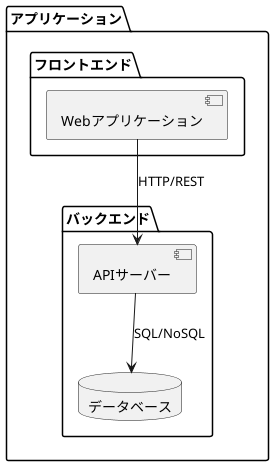

### コンポーネント責務

#### フロントエンド
- **UI/UX**: ユーザーインターフェース・ユーザー体験
- **状態管理**: アプリケーション状態とサーバー状態の管理
- **API連携**: バックエンドとのデータ通信
- **レンダリング**: 効率的な画面描画とユーザーインタラクション

#### バックエンド
- **ビジネスロジック**: 業務ルール・制約の実装
- **データ永続化**: データの保存・取得・更新・削除
- **セキュリティ**: 認証・認可・データ保護
- **外部システム連携**: API・メッセージング・ファイル処理

# バックエンドアーキテクチャ

## バックエンドアーキテクチャパターン選択フロー

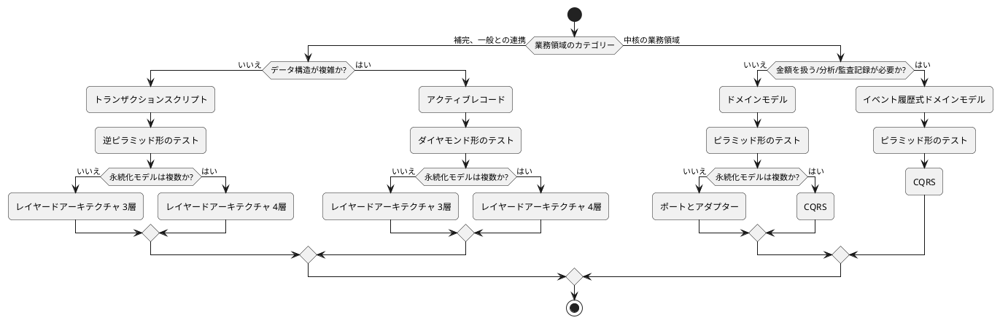

### 判断基準

#### 業務領域カテゴリー

| カテゴリー | 特徴 | 例 |
|-----------|------|-----|
| **中核の業務領域** | 組織の競争優位性を決定する領域 | 商品管理、顧客管理、受注処理 |
| **補完、一般との連携** | 中核を支援する補助的な領域 | レポート出力、バッチ処理、外部連携 |

#### データ構造の複雑さ

| 複雑さ | 判定基準 |
|--------|----------|
| **複雑** | エンティティ間の関係が多く、ビジネスルールが複雑 |
| **シンプル** | 単純なCRUD操作が中心、関係性が少ない |

#### 特殊要件

- **金額を扱う**: 会計・決済・金融関連の処理
- **分析**: 大量データの集計・分析処理
- **監査記録が必要**: コンプライアンス・規制対応

## アーキテクチャパターン詳細

### 1. トランザクションスクリプトパターン

#### 適用場面
- **業務領域**: 補完・一般との連携
- **データ構造**: シンプル
- **システム規模**: 小規模

#### 特徴
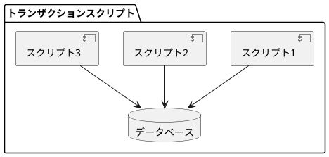

**メリット**:
- 実装が直感的でわかりやすい
- 開発速度が早い
- 小規模チームでも扱いやすい

**デメリット**:
- コードの重複が発生しやすい
- 大規模化すると保守が困難
- ビジネスロジックが散在する

#### 実装指針

```java
// 例：会議室予約処理
public class ReservationService {
    public void makeReservation(ReservationRequest request) {
        // 1. バリデーション
        validateRequest(request);
        
        // 2. 重複チェック
        checkConflicts(request);
        
        // 3. 予約作成
        createReservation(request);
        
        // 4. 通知送信
        sendNotification(request);
    }
}
```

### 2. アクティブレコードパターン

#### 適用場面
- **業務領域**: 補完・一般との連携
- **データ構造**: 複雑
- **システム規模**: 中規模

#### 特徴
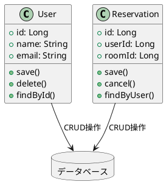

**メリット**:
- オブジェクトとデータベースの対応が明確
- ORMとの相性が良い
- 理解しやすい構造

**デメリット**:
- データアクセスとビジネスロジックが密結合
- テストが困難
- ドメインロジックが薄くなる傾向

#### 実装指針

```java
// 例：予約エンティティ
@Entity
public class Reservation {
    @Id
    private Long id;
    private Long userId;
    private Long roomId;
    private LocalDateTime startTime;
    private LocalDateTime endTime;
    
    // ビジネスロジックを含む
    public void cancel() {
        if (canCancel()) {
            this.status = CANCELLED;
            this.save();
        }
    }
    
    public boolean canCancel() {
        return startTime.isAfter(LocalDateTime.now().plusHours(2));
    }
}
```

### 3. ドメインモデルパターン

#### 適用場面
- **業務領域**: 中核の業務領域
- **特殊要件**: 金額を扱わない、監査記録不要
- **システム規模**: 中規模〜大規模

#### 特徴
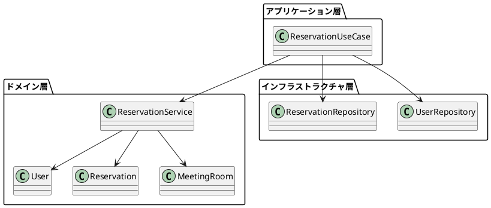

**メリット**:
- リッチなドメインモデル
- ビジネスロジックの集約
- 高い保守性・拡張性
- テスト容易性

**デメリット**:
- 初期の学習コストが高い
- 設計の複雑さ
- 開発速度が遅い場合がある

#### 実装指針

```java
// ドメインモデル例
public class Reservation {
    private ReservationId id;
    private UserId userId;
    private MeetingRoomId roomId;
    private TimeSlot timeSlot;
    private ReservationStatus status;
    
    // ファクトリーメソッド
    public static Reservation create(UserId userId, MeetingRoomId roomId, TimeSlot timeSlot) {
        validateTimeSlot(timeSlot);
        return new Reservation(ReservationId.generate(), userId, roomId, timeSlot, CONFIRMED);
    }
    
    // ビジネスロジック
    public void cancel(CancellationPolicy policy) {
        if (!policy.canCancel(this.timeSlot)) {
            throw new CancellationNotAllowedException();
        }
        this.status = CANCELLED;
    }
}
```

### 4. イベント履歴式ドメインモデルパターン

#### 適用場面
- **業務領域**: 中核の業務領域
- **特殊要件**: 金額を扱う、分析・監査記録が必要
- **システム規模**: 大規模

#### 特徴
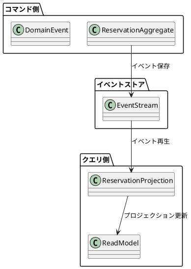

**メリット**:
- 完全な監査証跡
- 時系列分析が可能
- 高いスケーラビリティ
- 複雑なクエリに対応

**デメリット**:
- 実装の複雑さ
- 高い学習コスト
- 結果整合性の考慮が必要

#### 実装指針

```java
// イベント例
public class ReservationCreatedEvent extends DomainEvent {
    private final ReservationId reservationId;
    private final UserId userId;
    private final MeetingRoomId roomId;
    private final TimeSlot timeSlot;
    private final LocalDateTime occurredAt;
}

// 集約例
public class ReservationAggregate {
    private ReservationId id;
    private List<DomainEvent> changes = new ArrayList<>();
    
    public void create(UserId userId, MeetingRoomId roomId, TimeSlot timeSlot) {
        var event = new ReservationCreatedEvent(id, userId, roomId, timeSlot, LocalDateTime.now());
        apply(event);
    }
    
    private void apply(DomainEvent event) {
        changes.add(event);
        // 状態更新ロジック
    }
}
```

## アーキテクチャスタイル詳細

### 1. レイヤードアーキテクチャ（3層）

#### 適用場面
- **永続化モデル**: 単一
- **システム特性**: 標準的なエンタープライズアプリケーション

#### 構造
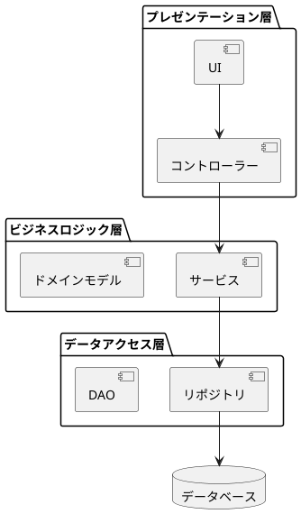

#### 実装指針

```java
// プレゼンテーション層
@RestController
public class ReservationController {
    private final ReservationService service;
    
    @PostMapping("/reservations")
    public ResponseEntity<Reservation> create(@RequestBody CreateReservationRequest request) {
        var reservation = service.createReservation(request);
        return ResponseEntity.ok(reservation);
    }
}

// ビジネスロジック層
@Service
public class ReservationService {
    private final ReservationRepository repository;
    
    public Reservation createReservation(CreateReservationRequest request) {
        // ビジネスロジック実行
        var reservation = new Reservation(request);
        return repository.save(reservation);
    }
}

// データアクセス層
@Repository
public interface ReservationRepository extends JpaRepository<Reservation, Long> {
    List<Reservation> findByUserId(Long userId);
}
```

### 2. レイヤードアーキテクチャ（4層）

#### 適用場面
- **永続化モデル**: 複数
- **システム特性**: 大規模エンタープライズアプリケーション

#### 構造
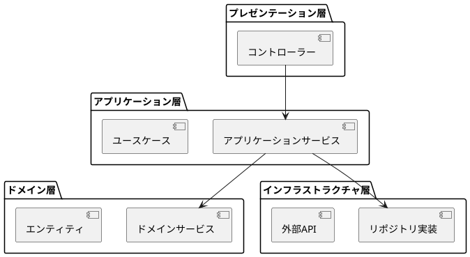

#### レイヤー責務

| レイヤー | 責務 |
|----------|------|
| **プレゼンテーション** | HTTP要求/応答、入力検証、認証 |
| **アプリケーション** | ユースケース制御、トランザクション境界 |
| **ドメイン** | ビジネスルール、不変条件、ドメインサービス |
| **インフラストラクチャ** | 外部システム連携、永続化、技術的関心事 |

### 3. ポートとアダプターアーキテクチャ（ヘキサゴナル）

#### 適用場面
- **ドメインモデル**: あり
- **永続化モデル**: 単一
- **システム特性**: マイクロサービス、高いテスト容易性が要求される

#### 構造
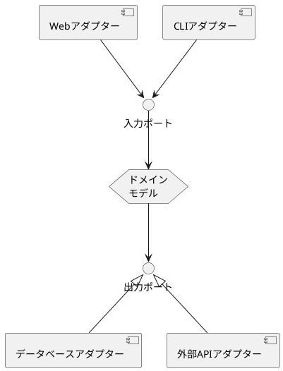

#### 実装指針

```java
// 入力ポート（ユースケース）
public interface CreateReservationUseCase {
    ReservationId execute(CreateReservationCommand command);
}

// 出力ポート（リポジトリインターフェース）
public interface ReservationRepository {
    void save(Reservation reservation);
    Optional<Reservation> findById(ReservationId id);
}

// ドメインサービス（実装）
@Service
public class ReservationService implements CreateReservationUseCase {
    private final ReservationRepository repository;
    
    @Override
    public ReservationId execute(CreateReservationCommand command) {
        var reservation = Reservation.create(command);
        repository.save(reservation);
        return reservation.getId();
    }
}

// アダプター（インフラストラクチャ）
@Repository
public class JpaReservationRepository implements ReservationRepository {
    private final SpringDataReservationRepository jpaRepository;
    
    @Override
    public void save(Reservation reservation) {
        var entity = toEntity(reservation);
        jpaRepository.save(entity);
    }
}
```

### 4. CQRSアーキテクチャ

#### 適用場面
- **永続化モデル**: 複数
- **特殊要件**: イベント履歴式、高スケーラビリティ
- **システム特性**: 複雑なクエリ要件、読み書き分離

#### 構造
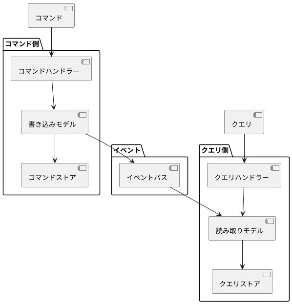

#### 実装指針

```java
// コマンド側
@CommandHandler
public class CreateReservationHandler {
    private final ReservationWriteRepository writeRepository;
    private final EventBus eventBus;
    
    public void handle(CreateReservationCommand command) {
        var reservation = new ReservationAggregate(command);
        writeRepository.save(reservation);
        
        var events = reservation.getUncommittedEvents();
        eventBus.publishAll(events);
    }
}

// クエリ側
@QueryHandler
public class ReservationQueryHandler {
    private final ReservationReadRepository readRepository;
    
    public List<ReservationView> handle(FindReservationsByUserQuery query) {
        return readRepository.findByUserId(query.getUserId());
    }
}

// イベントハンドラー（プロジェクション更新）
@EventHandler
public class ReservationProjectionHandler {
    private final ReservationReadRepository readRepository;
    
    public void on(ReservationCreatedEvent event) {
        var view = new ReservationView(event);
        readRepository.save(view);
    }
}
```

## テスト戦略とアーキテクチャの関係

### ピラミッド形テスト（ドメインモデル・イベント履歴式）

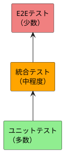

**特徴**:
- ユニットテスト中心（80%）
- ドメインロジックの徹底検証
- 高品質なビジネスルール実装

### ダイヤモンド形テスト（アクティブレコード）

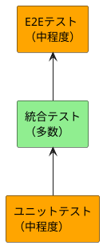

**特徴**:
- 統合テスト中心（60%）
- データアクセスロジックの重点検証
- ORMとの連携確認

### 逆ピラミッド形テスト（トランザクションスクリプト）

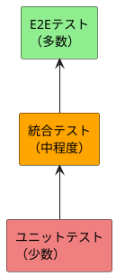

**特徴**:
- E2Eテスト中心（70%）
- エンドツーエンドの動作確認
- シナリオベースの検証

## アーキテクチャ評価基準

### 品質属性評価マトリックス

| 品質属性 | トランザクション<br>スクリプト | アクティブ<br>レコード | ドメイン<br>モデル | イベント履歴式<br>ドメインモデル |
|----------|:---:|:---:|:---:|:---:|
| **開発速度** | ⭐⭐⭐⭐⭐ | ⭐⭐⭐⭐ | ⭐⭐ | ⭐ |
| **保守性** | ⭐⭐ | ⭐⭐⭐ | ⭐⭐⭐⭐⭐ | ⭐⭐⭐⭐ |
| **テスト容易性** | ⭐⭐ | ⭐⭐ | ⭐⭐⭐⭐⭐ | ⭐⭐⭐⭐ |
| **スケーラビリティ** | ⭐⭐ | ⭐⭐⭐ | ⭐⭐⭐⭐ | ⭐⭐⭐⭐⭐ |
| **複雑さ対応** | ⭐ | ⭐⭐ | ⭐⭐⭐⭐⭐ | ⭐⭐⭐⭐⭐ |
| **監査要件** | ⭐ | ⭐⭐ | ⭐⭐⭐ | ⭐⭐⭐⭐⭐ |

### アーキテクチャスタイル評価マトリックス

| 品質属性 | レイヤード<br>3層 | レイヤード<br>4層 | ポートと<br>アダプター | CQRS |
|----------|:---:|:---:|:---:|:---:|
| **学習容易性** | ⭐⭐⭐⭐⭐ | ⭐⭐⭐⭐ | ⭐⭐⭐ | ⭐⭐ |
| **テスト容易性** | ⭐⭐⭐ | ⭐⭐⭐⭐ | ⭐⭐⭐⭐⭐ | ⭐⭐⭐⭐ |
| **関心事分離** | ⭐⭐⭐ | ⭐⭐⭐⭐ | ⭐⭐⭐⭐⭐ | ⭐⭐⭐⭐⭐ |
| **パフォーマンス** | ⭐⭐⭐ | ⭐⭐⭐ | ⭐⭐⭐ | ⭐⭐⭐⭐⭐ |
| **スケーラビリティ** | ⭐⭐ | ⭐⭐⭐ | ⭐⭐⭐⭐ | ⭐⭐⭐⭐⭐ |
| **進化性** | ⭐⭐ | ⭐⭐⭐ | ⭐⭐⭐⭐⭐ | ⭐⭐⭐⭐ |

## 実装ベストプラクティス

### 1. 依存関係管理

```java
// ✅ 良い例：インターフェースに依存
public class ReservationService {
    private final ReservationRepository repository; // インターフェース
    private final NotificationService notificationService; // インターフェース
}

// ❌ 悪い例：具象クラスに依存
public class ReservationService {
    private final JpaReservationRepository repository; // 具象クラス
    private final EmailService emailService; // 具象クラス
}
```

### 2. レイヤー分離

```java
// ✅ 良い例：適切なレイヤー分離
@RestController
public class ReservationController {
    @PostMapping("/reservations")
    public ResponseEntity<ReservationResponse> create(@RequestBody CreateReservationRequest request) {
        // プレゼンテーション層の責務のみ
        var command = toCommand(request);
        var result = useCase.execute(command);
        return ResponseEntity.ok(toResponse(result));
    }
}

// ❌ 悪い例：レイヤー違反
@RestController
public class ReservationController {
    @PostMapping("/reservations")
    public ResponseEntity<ReservationResponse> create(@RequestBody CreateReservationRequest request) {
        // ビジネスロジックをコントローラーに記述（レイヤー違反）
        if (request.getStartTime().isBefore(LocalDateTime.now().plusHours(2))) {
            throw new ValidationException("2時間前までの予約が必要です");
        }
        // ...
    }
}
```

### 3. エラーハンドリング

```java
// ✅ 良い例：適切なエラー伝播
public class ReservationService {
    public ReservationId createReservation(CreateReservationCommand command) {
        try {
            var reservation = Reservation.create(command);
            repository.save(reservation);
            return reservation.getId();
        } catch (DomainException e) {
            // ドメイン例外は適切にハンドリング
            throw new ReservationException("予約作成に失敗しました", e);
        }
    }
}

// ❌ 悪い例：例外の隠蔽
public class ReservationService {
    public ReservationId createReservation(CreateReservationCommand command) {
        try {
            var reservation = Reservation.create(command);
            repository.save(reservation);
            return reservation.getId();
        } catch (Exception e) {
            // すべての例外を隠蔽（問題の特定が困難）
            return null;
        }
    }
}
```

# フロントエンドアーキテクチャ

## フロントエンドアーキテクチャ決定フロー

### 主要アーキテクチャ決定ポイント

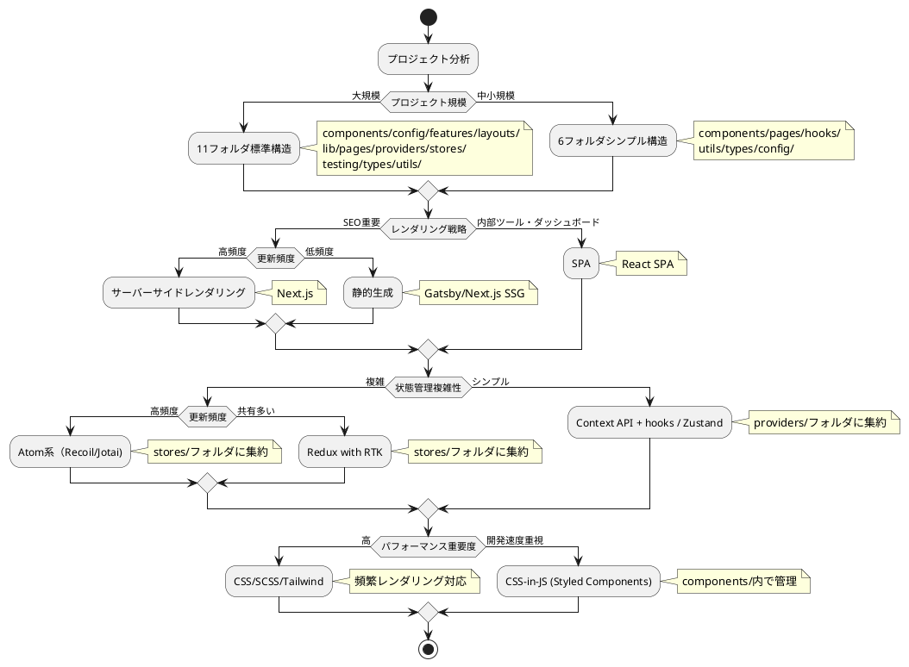

## フロントエンド設計原則

### 良いアーキテクチャ決定

#### 1. **プロジェクト構造**

##### 標準的なフロントエンドプロジェクト構造
```
src/
├── components/       # (1) 共通UIコンポーネント
│   ├── ui/          # 基本UIパーツ（Button, Input, Modal等）
│   └── layout/      # レイアウトコンポーネント
├── config/          # (2) アプリケーション設定
│   ├── constants.ts # 定数定義
│   ├── env.ts       # 環境変数管理
│   └── api.ts       # API設定
├── features/        # (3) フィーチャー単位のコンポーネント
│   ├── auth/        # 認証機能
│   ├── reservation/ # 予約機能
│   └── meeting-room/# 会議室管理機能
├── layouts/         # (4) アプリケーションレイアウト
│   ├── AppLayout.tsx
│   ├── AuthLayout.tsx
│   └── DashboardLayout.tsx
├── lib/             # (5) 外部ライブラリ設定・ユーティリティ
│   ├── auth.ts      # 認証ライブラリ設定
│   ├── api-client.ts# API クライアント
│   └── utils.ts     # ヘルパー関数
├── pages/           # (6) ページコンポーネント（ルーティング）
│   ├── LoginPage.tsx
│   ├── DashboardPage.tsx
│   └── ReservationPage.tsx
├── providers/       # (7) Context Provider
│   ├── AuthProvider.tsx
│   ├── ThemeProvider.tsx
│   └── AppProviders.tsx
├── stores/          # (8) 状態管理
│   ├── authStore.ts
│   ├── uiStore.ts
│   └── index.ts
├── testing/         # (9) テスト用ユーティリティ
│   ├── setup.ts     # テスト環境設定
│   ├── mocks/       # モックデータ
│   └── utils.ts     # テストヘルパー
├── types/           # (10) TypeScript型定義
│   ├── api.ts       # API型定義
│   ├── auth.ts      # 認証関連型
│   └── common.ts    # 共通型定義
└── utils/           # (11) 汎用ユーティリティ関数
    ├── format.ts    # フォーマット関数
    ├── validation.ts# バリデーション
    └── date.ts      # 日付操作
```

##### プロジェクト規模による使い分け

**小規模プロジェクト (シンプル構造)**:
```
src/
├── components/      # UI コンポーネント
├── pages/           # ページコンポーネント  
├── hooks/           # カスタムフック
├── utils/           # ユーティリティ
├── types/           # 型定義
└── config/          # 設定
```

**大規模プロジェクト (フル構造)**:
上記の標準11フォルダ構成を使用

#### 2. **コンポーネント設計**
- **小さなコンポーネント**: 単一責任の原則に従った分割
- **関心事の分離**: UI・ロジック・状態管理の明確な分離
- **再利用性**: 汎用コンポーネントの適切な抽象化

#### 3. **状態管理戦略**

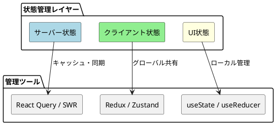

#### 4. **レンダリング戦略**

| 戦略 | 適用場面 | 特徴 | 例 |
|------|----------|------|-----|
| **SPA** | ダッシュボード・管理画面 | 高いインタラクティビティ | React |
| **SSR** | SEO重要・高更新頻度 | 初期表示高速・SEO対応 | Next.js |
| **SSG** | SEO重要・低更新頻度 | 最高のパフォーマンス | Gatsby |

### 悪いアーキテクチャ決定

#### ❌ **避けるべき設計**

1. **フラットなプロジェクト構造**
```
src/
├── LoginPage.tsx     # 管理困難
├── Button.tsx        # コンポーネント分類なし
├── UserService.ts    # ロジック散在
├── constants.ts      # 設定管理なし  
├── utils.ts          # 目的不明
├── types.ts          # 型定義混在
└── ...               # 数十個のファイル（役割不明）
```

2. **不適切な責務分散**
```
src/
├── components/       # 全コンポーネント混在
│   ├── LoginPage.tsx # ページなのにcomponents内
│   ├── Button.tsx    # UIコンポーネント
│   ├── AuthProvider.tsx # Providerなのにcomponents内
│   └── authStore.ts  # ストアなのにcomponents内
└── utils/            # 何でも入れる場所
    ├── api.ts        # API設定
    ├── constants.ts  # 定数
    ├── types.ts      # 型定義
    └── validation.ts # バリデーション
```

2. **巨大で密結合なコンポーネント**
```tsx
// ❌ 悪い例
function MegaComponent() {
  // 500行以上のコンポーネント
  // 複数の責務を持つ
  // テストが困難
}
```

3. **不適切な状態管理**
```tsx
// ❌ 悪い例：すべてをグローバル状態に
const globalState = {
  user: {},
  reservations: [],
  modalOpen: false,     // UI状態もグローバル化
  buttonColor: 'blue'   // 一時的な状態もグローバル化
}
```

4. **セキュリティの軽視**
```tsx
// ❌ 悪い例：入力値のサニタイジング不備
function UserInput({ input }) {
  return <div dangerouslySetInnerHTML={{__html: input}} />
}
```

## フロントエンド実装パターン

### 1. **コンポーネント設計パターン**

#### Container/Presentational パターン

```
// ファイル配置例
src/
├── features/reservation/
│   ├── components/
│   │   ├── ReservationContainer.tsx    # Container
│   │   └── ReservationList.tsx         # Presentational  
│   ├── hooks/
│   │   └── useReservations.ts          # Custom Hook
│   └── types/
│       └── reservation.ts              # 型定義
```

```tsx
// ✅ Container: ロジック担当 (features/reservation/components/ReservationContainer.tsx)
import { useReservations } from '../hooks/useReservations';
import { ReservationList } from './ReservationList';

export function ReservationContainer() {
  const { reservations, loading, createReservation } = useReservations();
  const handleCreate = useCallback((data) => {
    createReservation(data);
  }, [createReservation]);
  
  return (
    <ReservationList
      reservations={reservations}
      loading={loading}
      onCreate={handleCreate}
    />
  );
}

// ✅ Presentational: UI担当 (features/reservation/components/ReservationList.tsx)
import { LoadingSpinner } from '@/components/ui/LoadingSpinner';
import { CreateButton } from '@/components/ui/CreateButton';
import type { Reservation } from '../types/reservation';

interface Props {
  reservations: Reservation[];
  loading: boolean;
  onCreate: (data: CreateReservationData) => void;
}

export function ReservationList({ reservations, loading, onCreate }: Props) {
  if (loading) return <LoadingSpinner />;
  
  return (
    <div>
      {reservations.map(reservation => 
        <ReservationItem key={reservation.id} data={reservation} />
      )}
      <CreateButton onClick={onCreate} />
    </div>
  );
}
```

#### Custom Hooks パターン
```tsx
// ✅ ビジネスロジックの分離
function useReservation() {
  const [reservations, setReservations] = useState([]);
  const [loading, setLoading] = useState(false);
  
  const createReservation = useCallback(async (data) => {
    setLoading(true);
    try {
      const result = await api.createReservation(data);
      setReservations(prev => [...prev, result]);
    } catch (error) {
      handleError(error);
    } finally {
      setLoading(false);
    }
  }, []);
  
  return { reservations, loading, createReservation };
}
```

### 2. **状態管理パターン**

#### Context + Reducer パターン
```tsx
// ✅ 状態とアクションの型安全な管理
interface AppState {
  user: User | null;
  theme: 'light' | 'dark';
}

type AppAction = 
  | { type: 'SET_USER'; payload: User }
  | { type: 'SET_THEME'; payload: 'light' | 'dark' };

function appReducer(state: AppState, action: AppAction): AppState {
  switch (action.type) {
    case 'SET_USER':
      return { ...state, user: action.payload };
    case 'SET_THEME':
      return { ...state, theme: action.payload };
    default:
      return state;
  }
}

const AppContext = createContext<{
  state: AppState;
  dispatch: Dispatch<AppAction>;
} | null>(null);
```

### 3. **パフォーマンス最適化パターン**

#### 遅延読み込み
```tsx
// ✅ コード分割
const ReservationPage = lazy(() => import('./pages/ReservationPage'));
const UserManagementPage = lazy(() => import('./pages/UserManagementPage'));

function App() {
  return (
    <Router>
      <Suspense fallback={<LoadingSpinner />}>
        <Routes>
          <Route path="/reservations" element={<ReservationPage />} />
          <Route path="/users" element={<UserManagementPage />} />
        </Routes>
      </Suspense>
    </Router>
  );
}
```

#### メモ化
```tsx
// ✅ 適切なメモ化
const ExpensiveList = memo(function ExpensiveList({ items, filter }) {
  const filteredItems = useMemo(
    () => items.filter(item => item.type === filter),
    [items, filter]
  );
  
  return (
    <ul>
      {filteredItems.map(item => 
        <ExpensiveListItem key={item.id} item={item} />
      )}
    </ul>
  );
});
```

## フロントエンド品質保証

### 1. **TypeScript活用**

```tsx
// ✅ 型安全なAPI呼び出し
interface CreateReservationRequest {
  roomId: string;
  startTime: string;
  endTime: string;
  purpose: string;
}

interface ReservationResponse {
  id: string;
  status: 'confirmed' | 'pending' | 'cancelled';
  createdAt: string;
}

async function createReservation(
  request: CreateReservationRequest
): Promise<ReservationResponse> {
  const response = await fetch('/api/reservations', {
    method: 'POST',
    headers: { 'Content-Type': 'application/json' },
    body: JSON.stringify(request)
  });
  
  if (!response.ok) {
    throw new Error('予約作成に失敗しました');
  }
  
  return response.json();
}
```

### 2. **テスト戦略**

#### ユニットテスト
```tsx
// ✅ Custom Hooksのテスト
import { renderHook, act } from '@testing-library/react';
import { useReservation } from './useReservation';

test('should create reservation successfully', async () => {
  const { result } = renderHook(() => useReservation());
  
  await act(async () => {
    await result.current.createReservation({
      roomId: '1',
      startTime: '2024-01-01T10:00:00Z',
      endTime: '2024-01-01T11:00:00Z',
      purpose: 'ミーティング'
    });
  });
  
  expect(result.current.reservations).toHaveLength(1);
});
```

#### 統合テスト
```tsx
// ✅ コンポーネント統合テスト
import { render, screen, fireEvent, waitFor } from '@testing-library/react';
import { ReservationForm } from './ReservationForm';

test('should submit reservation form', async () => {
  const mockOnSubmit = jest.fn();
  
  render(<ReservationForm onSubmit={mockOnSubmit} />);
  
  fireEvent.change(screen.getByLabelText('会議室'), { 
    target: { value: '会議室A' } 
  });
  fireEvent.click(screen.getByText('予約する'));
  
  await waitFor(() => {
    expect(mockOnSubmit).toHaveBeenCalledWith(
      expect.objectContaining({
        roomName: '会議室A'
      })
    );
  });
});
```

## フロントエンド移行戦略

### 段階的移行アプローチ

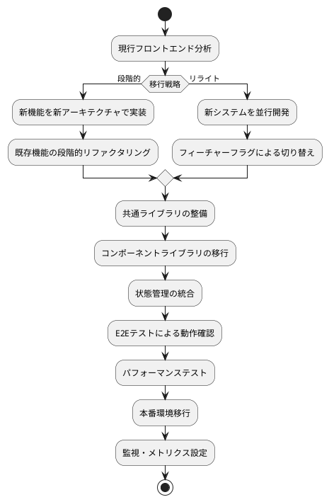

## アーキテクチャ移行戦略

### 段階的移行アプローチ

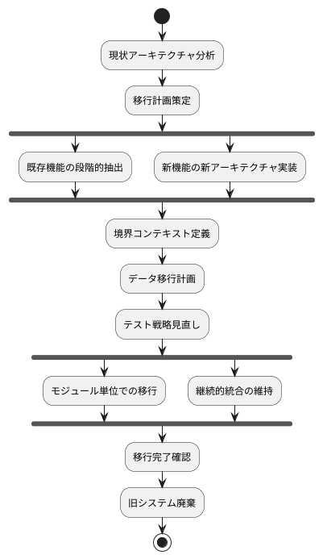

### 移行時の注意点

#### バックエンド移行
1. **段階的移行**: ビッグバン移行は避け、モジュール単位で実施
2. **後方互換性**: 既存のAPIやインターフェースの維持
3. **データ整合性**: 移行期間中のデータ同期戦略
4. **テストカバレッジ**: 移行前後でのテスト品質維持
5. **パフォーマンス監視**: 移行による性能劣化の早期検知

#### フロントエンド移行
1. **フィーチャーフラグ**: 新旧機能の段階的切り替え
2. **コンポーネント移行**: デザインシステムの統一
3. **状態管理移行**: データフローの一貫性維持
4. **バンドルサイズ監視**: パフォーマンス劣化防止
5. **ブラウザ互換性**: サポート対象ブラウザでの動作確認

## まとめ

### バックエンドアーキテクチャ選択の指針

1. **業務ドメインの理解**: 中核業務と補完業務の明確な識別
2. **データ複雑性の評価**: エンティティ関係とビジネスルールの複雑さ
3. **非機能要件の考慮**: パフォーマンス、スケーラビリティ、監査要件
4. **チーム能力の評価**: 技術的習熟度と学習意欲
5. **長期戦略の整合**: 将来的な拡張性と保守性の確保

### フロントエンドアーキテクチャ選択の指針

1. **プロジェクト規模**: 小規模・中規模・大規模に応じた構造設計
2. **ユーザー体験要件**: SEO・パフォーマンス・インタラクティビティの優先順位
3. **状態管理複雑性**: データフロー・更新頻度・共有範囲の分析
4. **チーム構成**: フロントエンド専任・フルスタック・QAエンジニアの有無
5. **技術的制約**: ブラウザサポート・既存システム・運用環境

### 成功要因

#### バックエンド
- **適切なパターン選択**: 業務特性に応じた最適なアーキテクチャの採用
- **段階的な実装**: 小さく始めて継続的に改善
- **品質の作り込み**: テストファースト・継続的インテグレーション
- **ドメイン駆動設計**: ビジネスルールの適切な表現と分離

#### フロントエンド
- **適切な技術選択**: 要件に応じたライブラリ・フレームワークの選定
- **コンポーネント設計**: 再利用性と保守性を両立した設計
- **状態管理戦略**: スケールに応じた適切な状態管理手法の採用
- **パフォーマンス最適化**: ユーザー体験を重視したパフォーマンス設計

### 統合的成功要因

- **チーム教育**: アーキテクチャ原則の共有と実践
- **継続的改善**: 定期的な設計見直しとリファクタリング
- **品質文化**: 自動テスト・コードレビュー・静的解析の徹底
- **段階的移行**: リスクを最小化した漸進的なアーキテクチャ改善

### 実践ポイント

#### 開発初期
1. **要件に基づく技術選択**: 過度な技術より要件適合性を重視
2. **プロトタイプ開発**: アーキテクチャ妥当性の早期検証
3. **チーム合意形成**: 技術選択の背景と理由の共有

#### 開発中期
1. **継続的リファクタリング**: 設計負債の早期解消
2. **パフォーマンス監視**: 品質メトリクスに基づく改善
3. **テストカバレッジ**: アーキテクチャ変更に対する安全性確保

#### 運用期
1. **監視・メトリクス**: 実装の効果測定と改善指針
2. **技術的負債管理**: 計画的なアーキテクチャ改善
3. **スケーラビリティ対応**: 成長に応じたアーキテクチャ進化

良いアーキテクチャは、システムの長期的成功の基盤となります。本ガイドを参考に、バックエンド・フロントエンドそれぞれの特性を理解し、プロジェクトに最適なアーキテクチャを選択・実装してください。