# 開発ガイド

## 開発ライフサイクル

分析では、アプリケーションの機能や性能、品質、セキュリティ、運用、保守などの要件をまとめる活動を行います。
開発では要件を満たすための設計、実装、テストなどの活動を行います。
運用では、アプリケーションの運用、保守、改善などの活動を行います。
構築では、アプリケーションの環境設定を行います。
配置では、アプリケーションのビルドとデプロイを行います。
これらの活動は相互に影響し合い、連携して行われるため、それぞれの活動において、開発者が守るべき規則やガイドラインをまとめたドキュメントを参照してください。

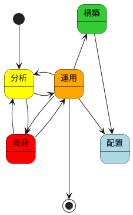

アプリケーション開発は、アジャイル開発手法（XP）に基づいて進めます。

詳細は [エクストリームプログラミング](エクストリームプログラミング) を参照。

## 分析

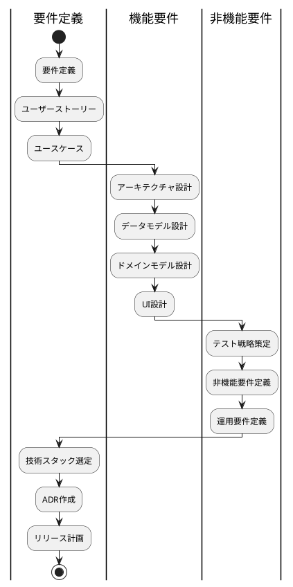

### 要件定義

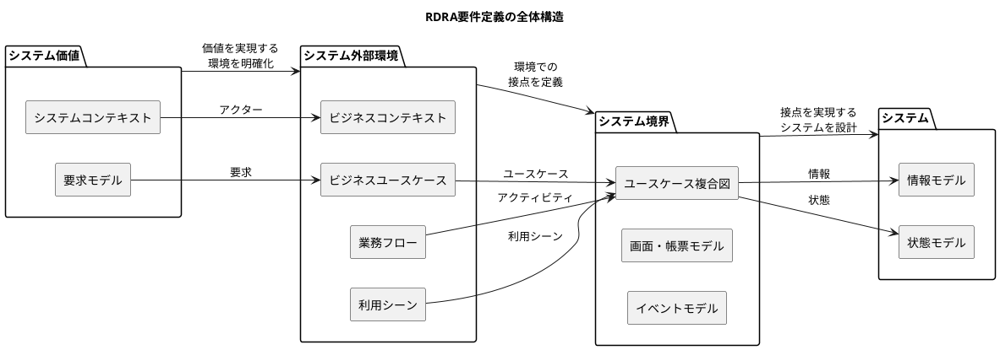

要件定義の詳細は[要件定義ガイド](要件定義ガイド)を参照

### リリース計画

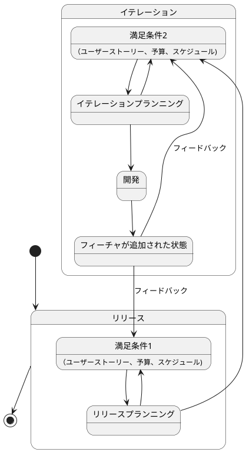

計画づくりの詳細は [アジャイルな見積と計画づくり](アジャイルな見積と計画づくり)	 を参照。

### 機能要件

#### アーキテクチャ設計

モノレポを標準とする。
アプリケーションは、バックエンドとフロントエンドの2つの主要コンポーネントで構成されています。

##### 全体構成

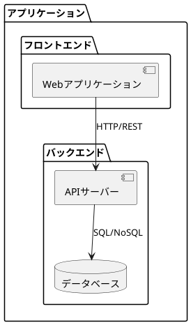

##### パターン

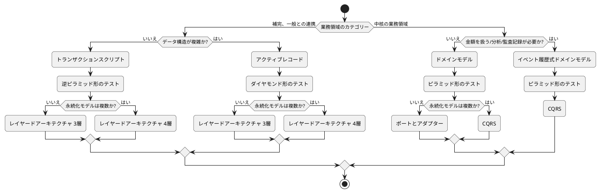

##### アーキテクチャパターン

###### 1. **トランザクションスクリプトパターン**
- **適用場面**: 補完・一般との連携業務で、データ構造が複雑でない場合
- **特徴**:
    - 各機能を独立したスクリプトとして実装
    - 手続き的なプログラミングスタイル
    - シンプルで理解しやすい
    - 小規模なアプリケーションに適している

###### 2. **アクティブレコードパターン**
- **適用場面**: 補完・一般との連携業務で、データ構造が複雑な場合
- **特徴**:
    - データとビジネスロジックが同じクラスに含まれる
    - オブジェクトが自身の永続化処理を担当
    - ORMパターンの典型例
    - 中規模のアプリケーションに適している

###### 3. **ドメインモデルパターン**
- **適用場面**: 中核の業務領域で、金額を扱わない・分析や監査記録が不要な場合
- **特徴**:
    - リッチなドメインモデル
    - ビジネスロジックがオブジェクトに分散
    - 依存関係の逆転を活用
    - 複雑なビジネスロジックに適している

###### 4. **イベント履歴式ドメインモデルパターン**
- **適用場面**: 中核の業務領域で、金額を扱う・分析や監査記録が必要な場合
- **特徴**:
    - すべての状態変更をイベントとして記録
    - 監査証跡の完全性を保証
    - 時系列分析が可能
    - 金融システムなど厳格な要件に適している

##### アーキテクチャスタイル

###### 1. **レイヤードアーキテクチャ（3層）**
- **適用場面**: 永続化モデルが単一の場合
- **特徴**:
    - プレゼンテーション、ビジネスロジック、データアクセスの3層
    - 関心事の分離が明確
    - 保守性と拡張性が高い
    - 標準的なエンタープライズアプリケーションに適している

###### 2. **レイヤードアーキテクチャ（4層）**
- **適用場面**: 永続化モデルが複数の場合
- **特徴**:
    - アプリケーション層を追加した4層構造
    - より細かい責務の分離
    - 複雑なデータ統合に対応
    - 大規模なエンタープライズアプリケーションに適している

###### 3. **ポートとアダプターアーキテクチャ（ヘキサゴナル）**
- **適用場面**: ドメインモデルで永続化モデルが単一の場合
- **特徴**:
    - 外部依存からの完全な分離
    - テスト容易性が高い
    - 技術的な詳細から独立
    - マイクロサービスに適している

###### 4. **CQRSアーキテクチャ**
- **適用場面**: 永続化モデルが複数、またはイベント履歴式の場合
- **特徴**:
    - コマンドとクエリの分離
    - 読み書きのパフォーマンス最適化
    - 複雑なレポート要件に対応
    - 高スケーラビリティを要求されるシステムに適している

#### データモデル設計

[グラス片手にデータベース設計 ～販売管理システム編～](https://www.shoeisha.co.jp/book/detail/9784798105666) 参照

#### ドメインモデル設計

[エリック・エヴァンスのドメイン駆動設計 (IT Architects’Archive ソフトウェア開発の実践)](https://www.amazon.co.jp/%E3%82%A8%E3%83%AA%E3%83%83%E3%82%AF%E3%83%BB%E3%82%A8%E3%83%B4%E3%82%A1%E3%83%B3%E3%82%B9%E3%81%AE%E3%83%89%E3%83%A1%E3%82%A4%E3%83%B3%E9%A7%86%E5%8B%95%E8%A8%AD%E8%A8%88-Architects%E2%80%99Archive-%E3%82%BD%E3%83%95%E3%83%88%E3%82%A6%E3%82%A7%E3%82%A2%E9%96%8B%E7%99%BA%E3%81%AE%E5%AE%9F%E8%B7%B5-%E3%82%A8%E3%83%AA%E3%83%83%E3%82%AF%E3%83%BB%E3%82%A8%E3%83%B4%E3%82%A1%E3%83%B3%E3%82%B9/dp/4798121967) 参照

#### UI設計

[オブジェクト指向 UI デザイン -使いやすいソフトウェアの原理-](https://www.sociomedia.co.jp/10046) 参照

### 非機能要件

#### テスト戦略

1. ユニットテスト
- 個々のコンポーネントのテスト
- ビジネスロジックの検証
- 境界値テスト

2. 統合テスト
- コンポーネント間の連携テスト
- APIの検証
- データフローの確認

3. E2Eテスト
- ユーザーシナリオテスト
- 実環境に近い状態でのテスト
- 性能テスト

##### **ピラミッド形テスト**
- **適用**: ドメインモデル、イベント履歴式
- **構成**: ユニットテスト多数、統合テスト中程度、E2Eテスト少数
- **特徴**: 高品質なビジネスロジックの検証に重点

##### **ダイヤモンド形テスト**
- **適用**: アクティブレコード
- **構成**: ユニットテストと統合テストを重視
- **特徴**: データアクセスロジックの検証に重点

##### **逆ピラミッド形テスト**
- **適用**: トランザクションスクリプト
- **構成**: E2Eテスト多数、統合テスト中程度、ユニットテスト少数
- **特徴**: エンドツーエンドの動作検証に重点

## 開発

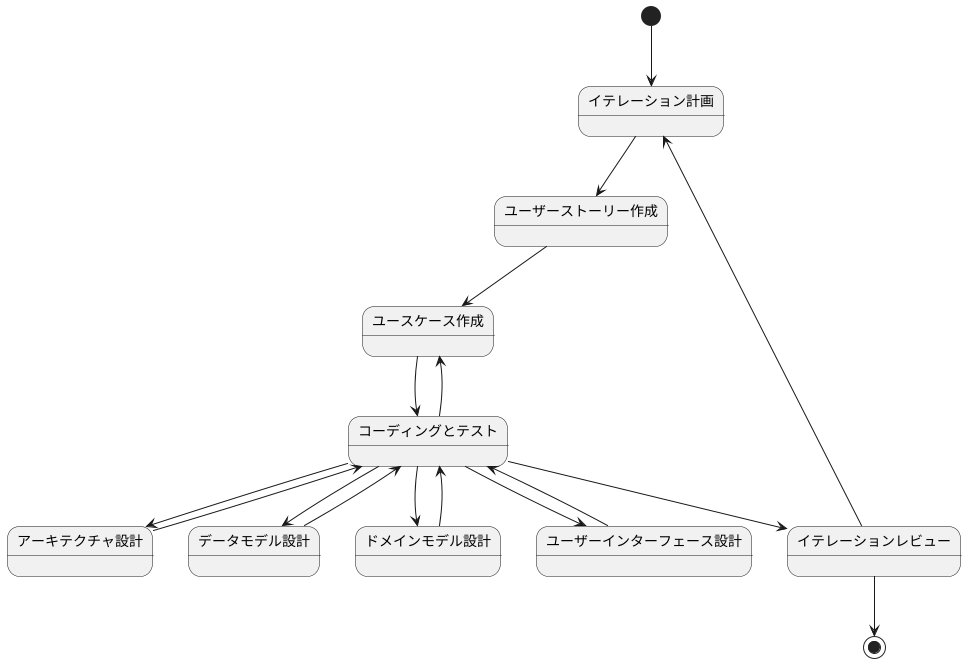

開発は、以下の2つのアプローチを状況に応じて使い分けます：

1. インサイドアウトアプローチ
- データモデルから実装を開始
- ドメイン駆動設計に適合
- テストファーストな開発

2. アウトサイドインアプローチ
- UIから実装を開始
- プロトタイプ駆動開発に適合
- モックを活用した開発

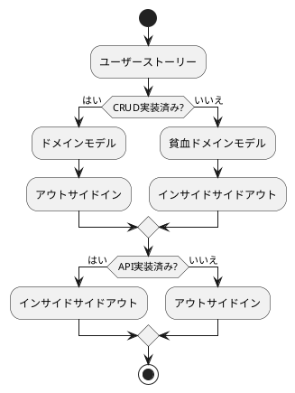
#### インサイドアウト

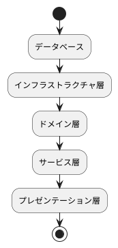

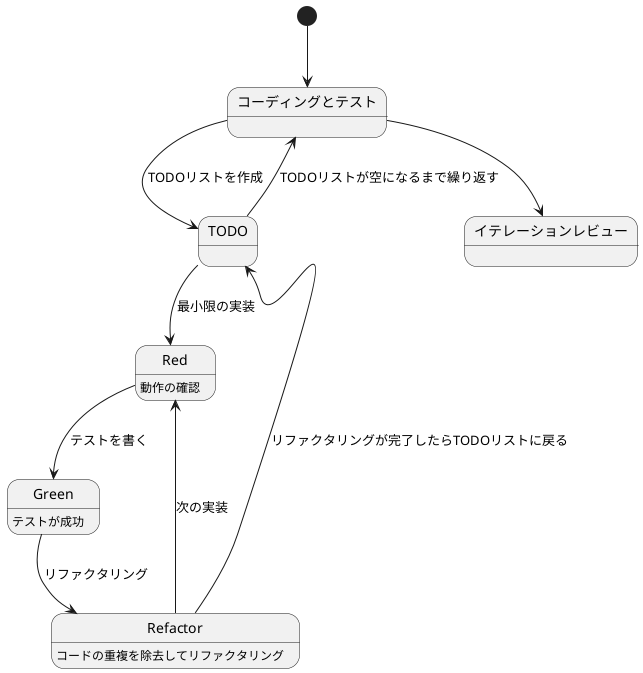

#### アウトサイドイン

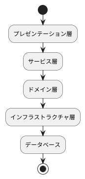

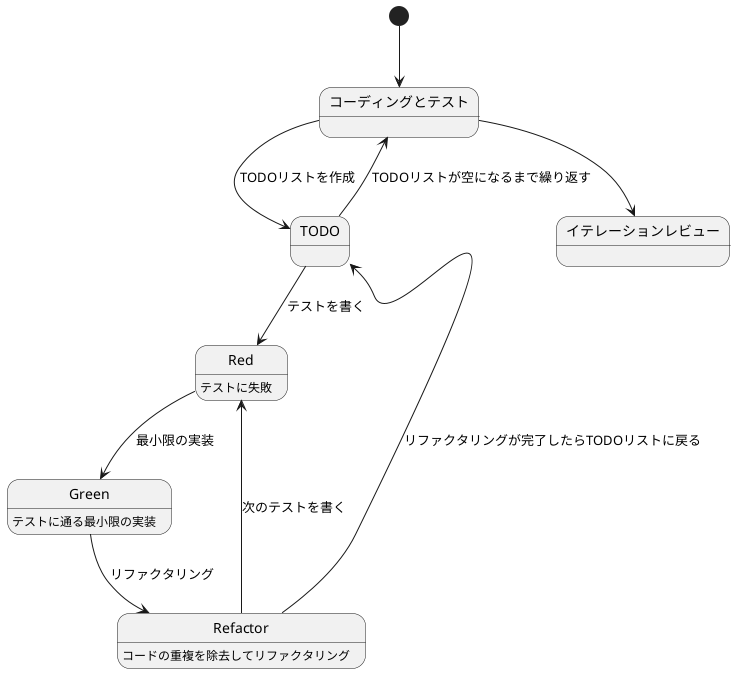

### コーディングとテスト

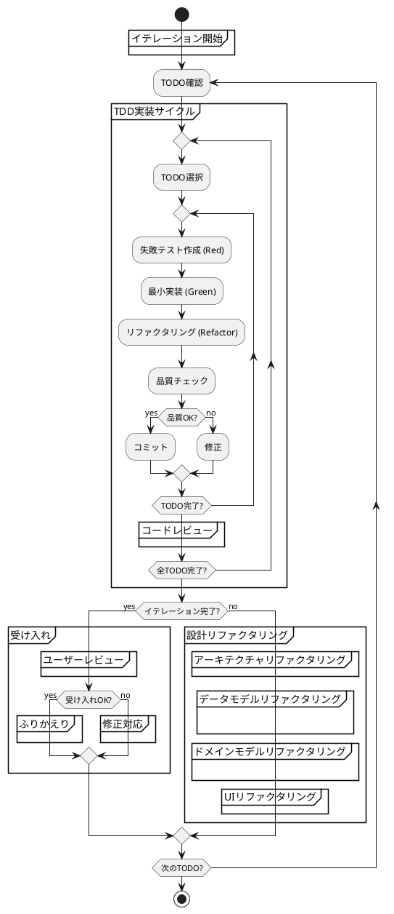
- 必ずイテレーション単位で開発を行う
- 勝手に次のイテレーションに進まない
- コミットは必ずTODO単位で実施する
- コミットの前に必ず品質確認を実施する
- コミットメッセージはAngularのコミットメッセージの書き方を参考にする
    - feat: 新機能の追加
    - fix: バグ修正
    - docs: ドキュメントの変更
    - style: フォーマットやセミコロンの追加など、コードの動作に影響しない変更
    - refactor: リファクタリング（バグ修正や機能追加ではない）
    - test: テストコードの追加や修正
    - chore: ビルドプロセスや補助ツールの変更

## 運用

### 構築・配置

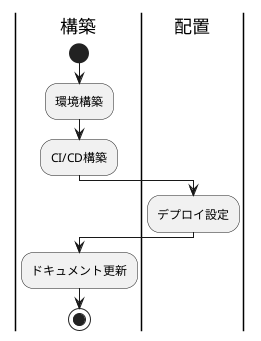
