# 要件定義 - クラウドサービス

## システム価値

### システムコンテキスト

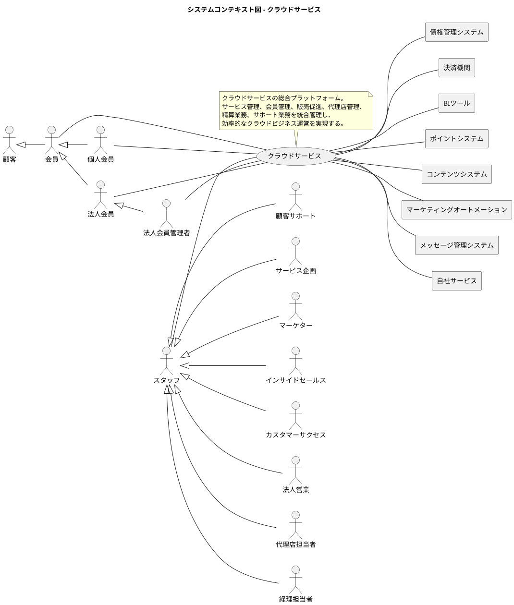

### 要求モデル

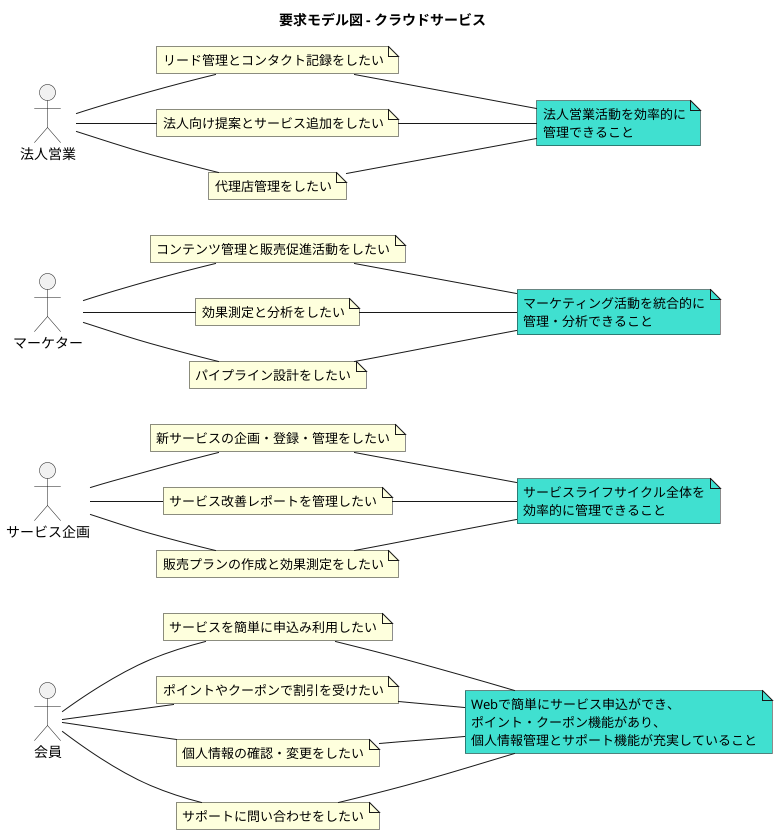

## システム外部環境

### ビジネスコンテキスト

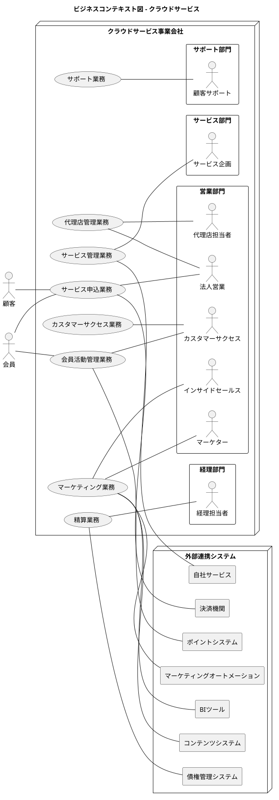

### ビジネスユースケース

#### サービス管理業務

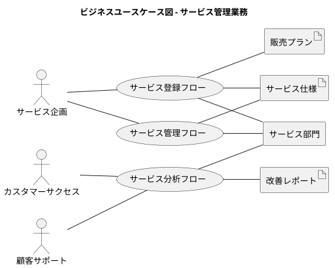

#### マーケティング業務

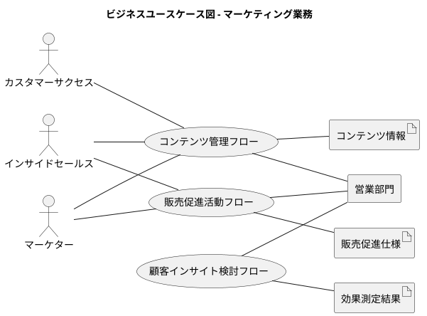

### バリエーション・条件

#### 会員区分

| 会員種別 | 説明 |
|----------|------|
| 個人会員 | 個人でサービスを利用する会員 |
| 法人会員管理者 | 法人会員の管理者権限を持つ会員 |
| 法人会員 | 法人会員の一般利用者 |

#### サービス分類

| サービス種別 | 説明 |
|-------------|------|
| サービス提供 | 直接的なサービスの提供 |
| プラットフォーム | サービス提供の基盤となるプラットフォーム |

#### 申込経路

| 申込経路種別 | 説明 |
|-------------|------|
| 直販 | 自社直接販売 |
| 代理店 | 代理店経由での販売 |

## システム境界

### ユースケース複合図

#### サービス申込業務

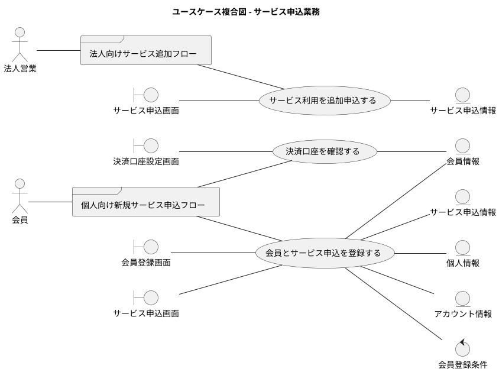

#### 精算業務

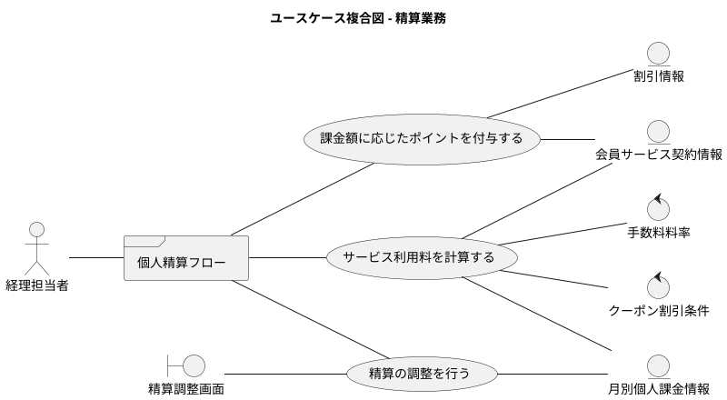

## システム

### 情報モデル

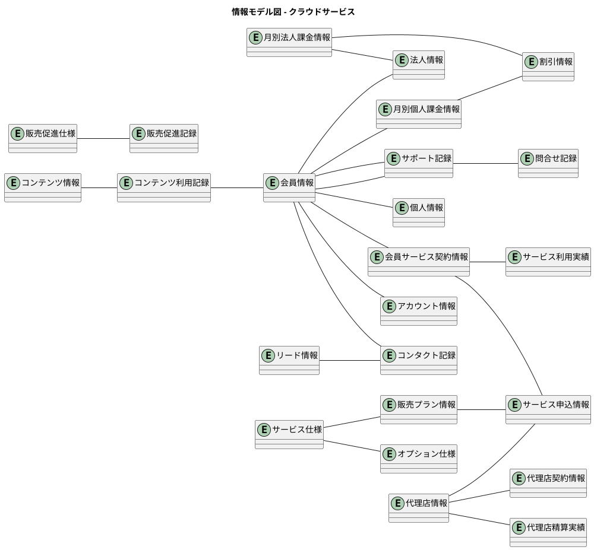

### 状態モデル

#### 会員状態の遷移

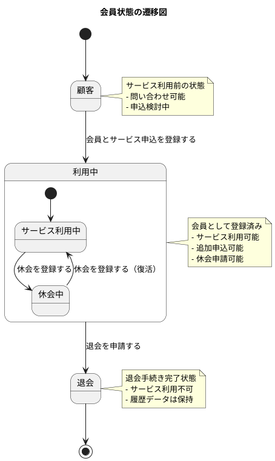

#### サービス状態の遷移

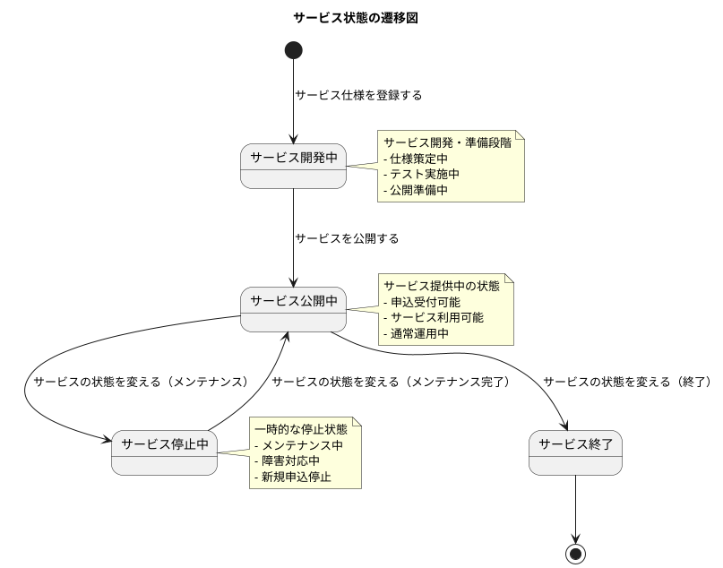

#### 精算状態の遷移

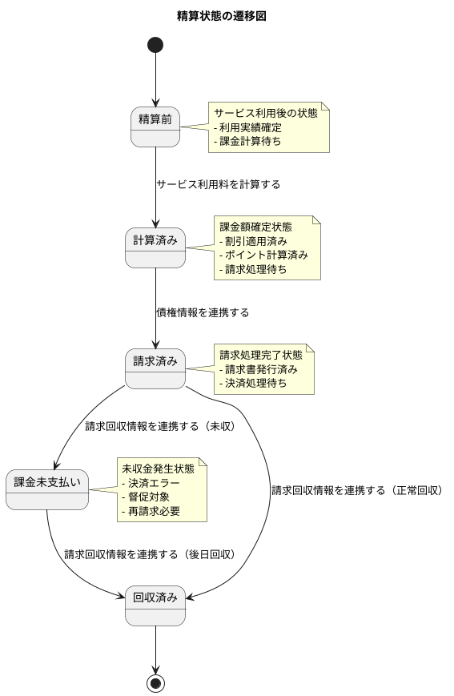